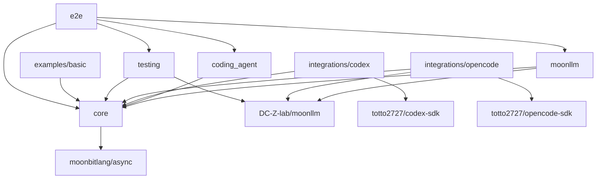
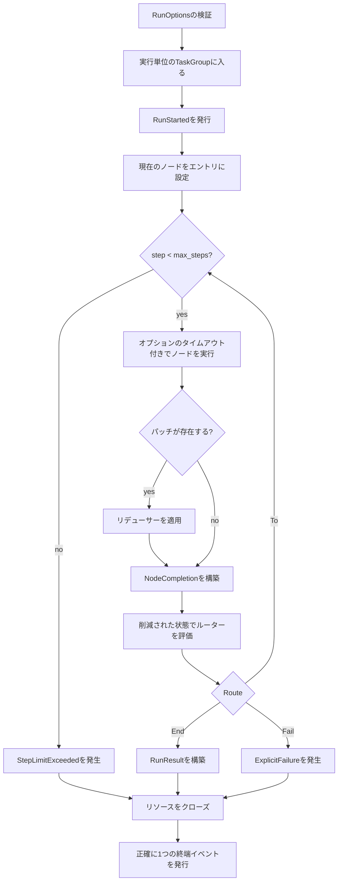

# Moon Agent Graph Runtime 実装記録

## 目的

レビューされたネイティブ非同期MVPは、未サポートの永続化、並列スケジューリング、任意のリソース抽象化を伴わずに実装されています。

実装は早期に契約を凍結し、具体的なSDK依存関係をアダプターパッケージの背後に配置し、実際のローカルプロセスより先に決定論的フェイクを検証しました。

## 提供ベースライン

実装されたベースラインは以下の通りです：

- MoonBitコンパイラ `v0.10.4+2cc641edf`（リポジトリ固定の `moon 0.1.20260713` 経由）
- ネイティブバックエンドのみ
- `moonbitlang/async@0.20.1`
- `moonbitlang/x@0.4.38`
- `DC-Z-lab/moonllm@0.1.0`
- `totto2727/codex-sdk@0.0.0`（本ワークスペースより）
- `totto2727/opencode-sdk@0.0.0`（本ワークスペースより）

グラフモジュール、Codex SDK、OpenCode SDKはすべて `moonbitlang/async@0.20.1` を解決しており、実装されたワークスペース契約内に2つ目の非同期ランタイムバージョンは存在しません。

## モジュール構成

```text
mbt/package/moon-agent-graph/
├── moon.mod
├── README.mbt.md
├── README.md -> README.mbt.md
├── docs/
└── src/
    ├── core/
    ├── moonllm/
    ├── coding_agent/
    ├── integrations/
    │   ├── codex/
    │   └── opencode/
    ├── testing/
    └── e2e/
```

すべてのソースパッケージは1つの `moon.pkg` を持ちます。

モジュールメタデータは以下を使用します：

```text
preferred_target = "native"
supported_targets = "native"
```

## 依存関係の方向



いかなるパッケージも、プロダクションコードからサンプルまたはテストパッケージをインポートしてはいけません。

## ワークストリーム概要

| ID | 成果物 | 依存先 | ステータス |
|---|---|---|---|
| W0 | ツールチェーン、依存関係、コンパイルスパイクベースライン | なし | 完了 |
| W1 | コアID、グラフ定義、ルーター、コンパイル | W0 | 完了 |
| W2 | ノード、リデューサー、イベント、関数ノード | W0 | 完了 |
| W3 | リソースストアとネイティブ非同期ライフサイクル | W0 | 完了 |
| W4 | 逐次グラフランタイム | W1, W2, W3 | 完了 |
| W5 | MoonLLMノード統合 | W2 | 完了 |
| W6 | コーディングエージェント抽象化とノード | W2, W3 | 完了 |
| W7 | Codexアダプター | W6 | 完了 |
| W8 | OpenCodeアダプター | W6 | 完了 |
| W9 | 共有テストキット | W1インターフェース, W2インターフェース, W6インターフェース | 完了 |
| W10 | 決定論的統合ワークフロー | W4, W5, W7, W8, W9 | 完了 |
| W11 | サンプル、APIレビュー、ドキュメント調整 | W10 | 最終調整中 |

## W0：ツールチェーンと契約スパイク

ステータス：完了。

### 成果物

- `moon.mod` と `moon.pkg` を使用した新しいモジュールスケルトン
- ネイティブターゲット宣言
- 1つの共通 `moonbitlang/async` バージョン
- すべての特異な公開API形状に対する最小限のコンパイルスパイク
- 初期パッケージ依存関係グラフ
- 既存のワークスペース検出に必要な場合のみ、リポジトリタスク統合

### コンパイルスパイク

以下の形状を実際のコンパイラで証明する：

- 非同期関数フィールドを含むジェネリック構造体
- 非同期 `pub(open)` トレイトメソッドとトレイトオブジェクト
- ノードとコーディングエージェントのオープンコンテキストを通じて渡される、実行単位の `TaskGroup[Unit]`
- `Eq`、`Hash`、`Debug` を導出する `NodeId`
- エラーを発生させる関数フィールド
- 公開エラーレコードに原因として格納される `Error`
- 公開クエリ境界での `ReadOnlyArray`
- マップに格納されるコーディングエージェントセッショントレイトオブジェクト

### 非同期依存関係ゲート

Codex SDK、OpenCode SDK、グラフモジュールは `moonbitlang/async@0.20.1` に揃えられ、それらのフォーカスされたネイティブテストは共有ランタイム契約を検証します。

### 受理条件

- `moon check --target native` がスケルトンとコンパイルスパイクでパスする
- パッケージ依存関係グラフが非巡回である
- 共通の非同期バージョンが明示されている
- 非推奨の `moon.mod.json`、`moon.pkg.json`、暗黙のトレイトメソッドアタッチメント、古い `suberror` 構文が導入されていない

## W1：グラフモデルとコンパイラ

ステータス：完了。

### 成果物

- 識別子ラッパーとバリデーション
- `Route`
- 宣言された宛先を持つ `Router[S]`
- `GraphDefinition[S, P]`
- `CompiledGraph[S, P]`
- コンパイル検証と到達可能性
- ブラックボックスグラフテスト

### 実装ルール

- ノードごとに1つのルーターを許可する
- サイクルを許可する
- 宣言されていない、または不明な宛先を拒否する
- コンパイル時に定義コレクションをコピーする
- コンパイルされたコレクションはプライベートに保つ
- 並列エッジの順序付けセマンティクスを追加しない

### 受理条件

- 有効な循環グラフがコンパイルされる
- 不明および到達不能な宛先は、具体的な `suberror` 値で失敗する
- コンパイル後のミューテーションはコンパイル済みグラフを変更しない
- ランタイムルックアップにミュータブルな公開エイリアスがない

## W2：ノード、リデューサー、イベント、関数ノード

ステータス：完了。

### 成果物

- `Node[S, P]`
- `NodeContext`
- `NodeOutput[P]`
- アーティファクトとメタデータ
- `Reducer[S, P]`
- `GraphEvent`
- 同期 `EventSink`
- 関数ノードファクトリ
- ユニットテスト

### 実装ルール

- ノードには非同期コールバックフィールドを使用する
- リデューサーとルーターは同期的に保つ
- 非同期操作を実行しないコールバックに `async` を使用しない
- MVPに状態ストアインターフェースを導入しない
- `NodeOutput` 内でライフサイクルイベントを重複させない

### 受理条件

- 関数ノードが正しい状態とコンテキストを受け取る
- 発生したコールバックエラーはランタイムの原因として利用可能である
- イベント順序は決定論的である
- リデューサーの出力がルーターによって観測される状態である

## W3：リソースストアとネイティブ非同期ライフサイクル

ステータス：完了。

### 成果物

- `ResourceScope`
- コーディングエージェントセッションに特化した実行ローカルリソースストア
- 実行スコープとノードスコープの獲得
- 逆順のクローズ
- 一度だけのクローズ動作
- クリーンアップエラーの集約
- キャンセル保護およびタイムアウト制限付きのファイナライズ
- すべての終端パスに対するユニットテスト

### 実装ルール

- 正常に開かれたリソースのみをキャッシュする
- クローズ失敗後もクリーンアップを継続する
- キャンセル保護はクリーンアップの周囲に狭く配置する
- 実行タスクグループ本体が戻る前にリソースをクローズする
- 長時間稼働する子プロセスの唯一のクローズパスとしてタスクグループのdeferを使用しない
- アプリケーションスコープのリソースを追加しない
- 任意の型付きダウンキャスティングを追加しない

### 受理条件

- 実行スコープのセッションは1回の実行内で再利用される
- ノードスコープのセッションは各試行後にクローズされる
- オープンおよびクローズの失敗はその原因を保持する
- キャンセルによってOpenCodeサーバーやCodexサブプロセスが実行中のままになることはない

## W4：逐次グラフランタイム

ステータス：完了。

### 成果物

- `GraphRuntime[S, P]`
- 呼び出しローカル状態
- 実行単位のタスクグループ
- ノード実行ループ
- パッチ削減
- ルーティング
- ステップ制限
- ノードタイムアウト
- 終端イベントの規律
- エラーラッピングとクリーンアップ統合
- ランタイムユニットテスト

### 実行アルゴリズム



### キャンセルルール

- 呼び出し元タスクのキャンセルはキャンセルエラーとなる
- キャンセルが再発生される前にクリーンアップが実行される
- キャッチオールのリトライまたはポーリングループは、`@async.is_being_cancelled()` が真の場合に停止する
- `@async.is_cancellation_error` は観測されたエラーを分類するために使用できるが、キャンセル状態の唯一のテストではない

### 受理条件

- 逐次、分岐、ループ、ステップ制限、タイムアウト、失敗、キャンセルの各テストがパスする
- クリーンアップも失敗した場合でも、プライマリエラーはプライマリのままである
- `RunStarted` の後に正確に1つの終端イベントが続く
- `invoke` が終了する前にすべての子タスクが終了する

## W5：MoonLLMノード

ステータス：完了。

### 成果物

- `LlmNodeSpec[S, P]`
- チャットリクエストビルダーとレスポンスデコーダー境界
- ノードファクトリ
- 決定論的呼び出しフェイク
- ローカルモックOpenAI互換統合テスト

### 実装ルール

- 具体的なMoonLLMクライアントは統合パッケージに保持する
- 狭い非同期呼び出しコールバックを注入する
- MoonLLMの `LLMError` を保持する
- トークン使用量を文書化されたアーティファクトまたはイベントとして保持する
- LLMノードにワークスペース編集セマンティクスを混在させない

### 受理条件

- リクエスト構築の失敗はクライアントをスキップする
- トランスポートおよびデコードの失敗は状態を更新しない
- タイムアウトとキャンセルはリクエストを終了させる
- 実際のMoonLLMクライアントがローカルモックサーバーに対して動作する

## W6：コーディングエージェント抽象化

ステータス：完了。

### 成果物

- 共通のリクエスト、レスポンス、ポリシー、ワークスペース、ステータス型
- 非同期 `CodingAgentSession` トレイト
- `CodingAgent` オープン関数
- コーディングエージェントノードファクトリ
- フェイクセッション実装
- スコープと継続動作のユニットテスト

### 実装ルール

- キャンセルはタスクキャンセルであり、`Cancelled` 成功レスポンスではない
- セッションオープンコンテキストは、構築時に適用される環境とポリシーを所有する
- アダプター固有のオプションは共通契約の外部に残す
- `changed_files` はSDKが変更セットを証明できない場合に空になることがある
- クローズはインターフェースレベルで冪等であり、リソースストアによって1回呼び出される

### 受理条件

- 同じノード実装がフェイクのCodexライクおよびOpenCodeライクなセッションで動作する
- 実行スコープは1つのセッションを再利用する
- ノードスコープは試行ごとにオープンおよびクローズする
- キャンセルは実行中のセッション処理に到達する

## W7：Codexアダプター

ステータス：完了。

### 成果物

- 共通ポリシーから `ThreadOptions` へのマッピング
- 新規および再開スレッドの作成
- リクエスト実行とレスポンスの正規化
- 継続IDの抽出
- タスクキャンセル動作
- 既存のフェイクCodex実行可能アプローチを使用した統合テスト

### 実装ルール

- `Codex::start_thread` と `Codex::resume_thread` を使用する
- 必要とされる観測可能性に応じて `Thread::run` または `Thread::run_streamed` を使用する
- stdout、stderr、コマンド、変更ファイルデータを invent しない
- 実行中の処理がすべて終了した後にのみ、クローズをno-opとして保持する
- `turn.failed` を発生したアダプターエラーとして保持する

### 受理条件

- 新規および再開ターンが動作する
- ワークスペース、サンドボックス、承認、ネットワーク、追加ルートの各設定が正しくマッピングされる
- ターンのキャンセルはそのサブプロセスを終了させる
- 既存のCodex SDKテストはグリーンのままである

## W8：OpenCodeアダプター

ステータス：完了。

### 成果物

- サーバーとセッションの内部状態
- 実行の `TaskGroup[Unit]` を共通オープンコンテキストから消費するオープン関数
- `Server::moonllm_config` からのMoonLLM HTTPクライアント作成
- OpenCodeセッション作成
- セッションメッセージ実行
- レスポンスデコード
- 明示的クローズ
- フェイクOpenCode実行可能ファイルとローカルHTTPサーバーを使用した統合テスト

### 実装ルール

- MoonLLMをOpenCodeエンドポイントの呼び出しに使用されるHTTPクライアントとして扱う
- OpenCodeコーディングリクエストを汎用のMoonLLMチャット補完リクエストにマッピングしない
- 部分的な起動失敗のたびにサーバーをクローズする
- 所有するタスクグループ本体が戻る前にサーバーをクローズする
- サーバーURLはプライベートに保つ
- 1つの開かれたOpenCodeセッションが呼び出し全体で再利用されるべき場合、呼び出し元の `CodingAgentNodeSpec` で実行スコープを選択する

### 受理条件

- 1回の実行で1つのサーバーが起動され、それが再利用される
- 起動失敗、不正な readiness、タイムアウト、セッション失敗、リクエスト失敗、クラッシュ、キャンセルのすべてがクリーンアップされる
- テスト後にサーバープロセス、ポート、一時ログディレクトリが残らない

## W9：テストキット

ステータス：完了。

### 成果物

- スクリプト化されたノードとルーター
- 記録用リデューサーとイベントシンク
- フェイクコーディングエージェントとセッション
- フェイクMoonLLM呼び出しコールバック
- 一意の一時ワークスペースヘルパー
- 境界付き `eventually` ヘルパー
- プロセスおよびポートリークアサーション

### 実装ルール

- フィクスチャのミューテーションは、ミューテックスが必要でない限り、1つの非同期タスクが所有する
- 遅延および失敗スクリプトは境界付きにする
- テストの利便性のためにプロダクション専用の抽象化を追加しない

### 受理条件

- コア、MoonLLM、コーディングエージェントパッケージが外部認証情報なしでテストできる
- すべてのフェイクが、テスト計画に必要な呼び出し、引数、クローズ順序を記録する

## W10：決定論的統合

ステータス：完了。

### 成果物

- 関数のみのグラフ
- MoonLLM計画から関数へのグラフ
- MoonLLM計画からCodexへ、関数テストへのグラフ
- MoonLLM計画からOpenCodeへ、関数テストへのグラフ
- Codex/OpenCode選択グラフ
- リトライループ
- キャンセルワークフロー

### 受理条件

- すべてのワークフローがネイティブバックエンドで実行される
- リトライループは成功または設定された制限によって終了する
- セッション再利用が観測可能である
- 選択されていないアダプターは決して開かれない
- 子プロセスが生存しない

## W11：サンプルとAPIレビュー

ステータス：最終調整中。

### 成果物

- 最小限の実行可能なネイティブサンプル
- 実用的な範囲でチェックされたサンプルを含む `README.mbt.md`
- アーキテクチャ、インターフェース、テスト、制限事項と実装の調整
- 公開API命名レビュー
- エラーレッドアクションレビュー

### 受理条件

- サンプルがリポジトリルートからのコマンドでビルドおよび実行される
- ドキュメントがエクスポートされたシグネチャと一致する
- 将来の機能が実装済みとして説明されていない
- 英語のソースドキュメントと日本語翻訳がペアとして維持されている

## エクスポートされたAPI調整

- `GraphRuntime::invoke` は非同期メソッドであり、`initial_state` を唯一の必須位置引数とし、`options? : RunOptions` をラベル付きオプション引数として持つ
- `RunOptions::RunOptions` は `max_steps`、`node_timeout_ms?`、`cleanup_timeout_ms` を検証する；ランタイムはグローバルな呼び出し状態を保存しない
- `NodeContext` は呼び出しの `TaskGroup[Unit]`、同期 `EventSink`、呼び出しローカルの `RuntimeResourceStore`、およびオプションのデッドラインを保持する
- `CodingAgentSession` は `pub(open)` 非同期トレイトであり、`id`、`execute`、`close` を持つ；`CodingAgent.open` は `CodingAgentOpenContext` を受け取る
- `CodingAgentNodeSpec` は `open_context`、`build_request`、`decode_response` コールバックを公開し、`ResourceScope` を明示的に選択する
- `LlmNodeSpec` は型付けされたMoonLLMリクエストビルダー、狭い非同期呼び出しコールバック、およびレスポンスデコーダーを受け入れる
- `RuntimeResourceStore` は意図的に `CodingAgentSession` に特化している；これは異種リソースコンテナではない
- `codex_agent` と `opencode_agent` はアダプターオプションレコードを公開する一方で、SDK固有のセッションおよびプロセス状態をプライベートに保つ
- 公開コレクションのスナップショットは `ReadOnlyArray` を使用する；所有されたミュータブルな配列とマップは、グラフ定義、ランタイム、リソース、テストフィクスチャに対してプライベートのままである

## 既知のMVP制限

- 実行は逐次であり、ネイティブのみである
- 状態は呼び出しローカルかつインメモリである；チェックポインティング、サスペンド/レジューム、永続状態、プラグ可能な状態ストアは実装されていない
- 並列ノード、アプリケーションスコープのリソース、任意の型付きリソースダウンキャスティング、動的な未宣言ルートは実装されていない
- ノードごとに1つのルーターがサポートされており、すべての可能な `To` 宛先はコンパイル前に宣言されなければならない
- `EventSink` は同期的かつベストエフォートである；シンクの失敗はグラフ実行を失敗させない
- コーディングエージェントの `changed_files` は、基盤となるSDKが信頼性のある変更セットを証明できない場合、空になることがある
- Codexアダプターは現在のSDKによって公開されるデータのみを報告し、stdout、stderr、コマンド、変更ファイルレコードを invent しない
- OpenCodeアダプターは開かれたセッションごとに1つのローカルサーバーを所有し、MoonLLMをHTTPトランスポートとしてのみ使用する；`coding_agent_node` とその `ResourceScope` の選択が、そのセッションが実行全体で再利用されるか、ノード試行ごとに再開されるかを決定する
- クリーンアップは `cleanup_timeout_ms` によって制限される；クリーンアップタイムアウトまたはクローズ失敗はランタイムエラーモデルを通じて報告される

## 完了した実装フェーズ

### フェーズ0：ベースライン

W0は、機能実装前にツールチェーン、依存関係バージョン、APIコンパイルスパイクを確立しました。

### フェーズ1：コア契約

W1、W2、W3のインターフェース部分、W9のインターフェース部分は、ID、ノード出力、ルーター宣言、イベント順序、エラー保持、リソーススコープを凍結しました。

### フェーズ2：ランタイムと抽象統合

W4、W5、W6は、具体的なコーディングエージェントプロセスなしで、フェイクに対する完全なグラフ実行を確立しました。

### フェーズ3：具体的なアダプター

W7とW8は、完全なワークフロー統合の前に決定論的フェイク実行可能ファイルを使用しました。

### フェーズ4：ワークフロー

W10は、決定論的ネイティブワークフローを通じて、すべてのパッケージにわたるライフサイクル動作を調整しました。

### フェーズ5：安定化

W11は、最終的なルート検証、ネイティブサンプル、APIレビュー、ドキュメント調整の段階です。

## 凍結された契約

実装は以下を凍結しました：

1. 正確な非同期依存関係バージョン
2. ジェネリックノードおよびルーターコールバックシグネチャ
3. ルーター宣言ターゲットセマンティクス
4. `NodeOutput[P]`
5. コーディングエージェントのリクエストおよびレスポンスの最小フィールド
6. セッショントレイトメソッド
7. リソーススコープとクローズ順序
8. イベント順序と終端イベントルール
9. ノードタイムアウトと呼び出し元キャンセル
10. プライマリエラーとクリーンアップエラーの保持
11. 実行タスクグループによるOpenCodeサーバーの所有権

## 検証コマンド

リポジトリルートから実行します。

```bash
vp run mbt:fix
vp run mbt:check
vp run mbt:build
vp run mbt:test
```

開発中はフォーカスされたネイティブテストを使用します。

```bash
moon test --target native mbt/package/moon-agent-graph/src/core
moon test --target native mbt/package/moon-agent-graph/src/integrations/codex
moon test --target native mbt/package/moon-agent-graph/src/integrations/opencode
```

最終的な手動ゲートは、少なくとも1つの関数のみのサンプルと1つの決定論的コーディングエージェントワークフローを、そのネイティブ実行可能ファイルの表面を通じてカバーします。

## 実装されたMVP記録

- モジュールはネイティブのみかつ非同期である
- グラフとアダプター全体で1つの共通非同期ランタイムバージョンが使用されている
- 関数、MoonLLM、Codex、OpenCodeの各ノードを登録して実行できる
- 条件付きルートとサイクルが機能する
- ルーターの宛先はコンパイル時に検証される
- 状態はリデューサーを通じてのみ更新される
- 無限ループは `max_steps` で停止する
- ノードタイムアウトと呼び出し元のキャンセルは所有する処理を終了させる
- OpenCodeは実行ごとに1つのサーバーを再利用し、それを明示的にクローズする
- Codexサブプロセスのキャンセルが観測される
- プライマリエラーとクリーンアップエラーは区別可能である
- ユニットテストと決定論的統合テストがパスする
- 子プロセス、ポート、一時ログのリークは残らない
- ネイティブサンプルがビルドおよび実行される
- 公開APIドキュメントが実装と一致する

## 参照

- [MoonBit非同期プログラミング](https://docs.moonbitlang.com/en/latest/language/async-experimental.html)
- [MoonBitエラーハンドリング](https://docs.moonbitlang.com/en/latest/language/error-handling.html)
- [MoonBitメソッドとトレイト](https://docs.moonbitlang.com/en/latest/language/methods.html)
- [MoonBitモジュール設定](https://docs.moonbitlang.com/en/latest/toolchain/moon/module.html)
- [MoonBitパッケージ設定](https://docs.moonbitlang.com/en/latest/toolchain/moon/package.html)
- [moonbitlang/asyncパッケージ](https://mooncakes.io/docs/moonbitlang/async)
- [MoonLLM](https://github.com/DC-Z-lab/moonllm)
- [Codex SDKソース参照](https://github.com/openai/codex/tree/f201c30c52a35f819262865a53df94b6f4ea7a50/sdk/typescript)
- [OpenCode SDKソース参照](https://github.com/anomalyco/opencode/tree/66495a2a22cd0a57efcc4f721e65532f0987b4e8/packages/sdk/js)