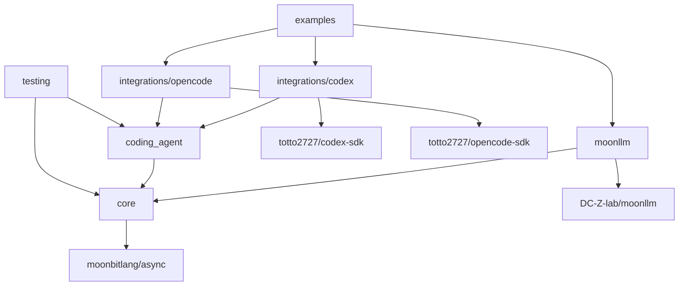
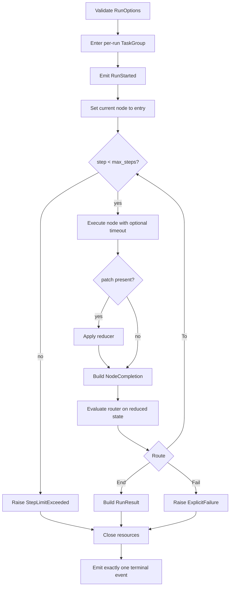

# Moon Agent Graph Runtime Implementation Plan

## Objective

Implement the reviewed native asynchronous MVP without introducing unsupported durability, parallel scheduling, or arbitrary resource abstractions.

The plan freezes contracts early, keeps concrete SDK dependencies behind adapter packages, and integrates through deterministic fakes before real local processes.

## Delivery Baseline

The implementation targets:

- MoonBit compiler `v0.10.4` or the repository-pinned successor.
- Native backend only.
- `moonbitlang/async@0.20.1` as the initial common async baseline.
- `moonbitlang/x@0.4.38` as the initial path-type baseline.
- `DC-Z-lab/moonllm@0.1.0`.
- `totto2727/codex-sdk` from this workspace.
- `totto2727/opencode-sdk` from this workspace.

Before feature implementation, align the Codex SDK's current `moonbitlang/async@0.19.2` dependency with the common baseline or prove that the workspace resolver and public APIs are compatible.

Do not allow the new module to depend on two unreviewed async-runtime versions.

## Module Layout

```text
mbt/package/moon-agent-graph/
├── moon.mod
├── README.mbt.md
├── README.md -> README.mbt.md
├── docs/
└── src/
    ├── core/
    ├── moonllm/
    ├── coding_agent/
    ├── integrations/
    │   ├── codex/
    │   └── opencode/
    ├── testing/
    └── examples/
```

Every source package has one `moon.pkg`.

The module metadata uses:

```text
preferred_target = "native"
supported_targets = "native"
```

## Dependency Direction



No package may import an example or testing package from production code.

## Workstream Summary

| ID | Deliverable | Depends on |
|---|---|---|
| W0 | Toolchain, dependency, and compile-spike baseline | None |
| W1 | Core IDs, graph definition, routers, and compilation | W0 |
| W2 | Node, reducer, events, and function node | W0 |
| W3 | Resource store and native async lifecycle | W0 |
| W4 | Sequential graph runtime | W1, W2, W3 |
| W5 | MoonLLM node integration | W2 |
| W6 | Coding-agent abstraction and node | W2, W3 |
| W7 | Codex adapter | W6 |
| W8 | OpenCode adapter | W6 |
| W9 | Shared test kit | W1 interfaces, W2 interfaces, W6 interfaces |
| W10 | Deterministic integration workflows | W4, W5, W7, W8, W9 |
| W11 | Examples, API review, and documentation reconciliation | W10 |

## W0: Toolchain and Contract Spike

### Deliverables

- New module skeleton using `moon.mod` and `moon.pkg`.
- Native target declarations.
- One common `moonbitlang/async` version.
- A minimal compile spike for every unusual public API shape.
- Initial package dependency graph.
- Repository task integration only if required by existing workspace discovery.

### Compile Spikes

Prove these shapes with the actual compiler:

- Generic structs containing async function fields.
- Async `pub(open) trait` methods and trait objects.
- A per-run `TaskGroup[Unit]` passed through node and coding-agent open context.
- `NodeId` deriving `Eq`, `Hash`, and `Debug`.
- Function fields that raise errors.
- `Error` stored as a cause in a public error record.
- `ReadOnlyArray` at public query boundaries.
- A coding-agent session trait object stored in a map.

### Async Dependency Gate

Inspect the Codex SDK against `moonbitlang/async@0.20.1`.

If a source change is required, keep it in the Codex SDK and validate its existing focused tests before adding the graph module dependency.

### Acceptance

- `moon check --target native` passes for the skeleton and compile spikes.
- The package dependency graph is acyclic.
- The common async version is explicit.
- No deprecated `moon.mod.json`, `moon.pkg.json`, implicit trait-method attachment, or old `suberror` syntax is introduced.

## W1: Graph Model and Compiler

### Deliverables

- Identifier wrappers and validation.
- `Route`.
- `Router[S]` with declared destinations.
- `GraphDefinition[S, P]`.
- `CompiledGraph[S, P]`.
- Compilation validation and reachability.
- Black-box graph tests.

### Implementation Rules

- Permit one router per node.
- Allow cycles.
- Reject undeclared or unknown destinations.
- Copy definition collections during compilation.
- Keep compiled collections private.
- Do not add parallel-edge ordering semantics.

### Acceptance

- Valid cyclic graphs compile.
- Unknown and unreachable destinations fail with concrete `suberror` values.
- Mutation after compilation does not alter the compiled graph.
- Runtime lookup has no mutable public aliases.

## W2: Node, Reducer, Events, and Function Node

### Deliverables

- `Node[S, P]`.
- `NodeContext`.
- `NodeOutput[P]`.
- Artifacts and metadata.
- `Reducer[S, P]`.
- `GraphEvent`.
- Synchronous `EventSink`.
- Function-node factory.
- Unit tests.

### Implementation Rules

- Use async callback fields for nodes.
- Keep reducers and routers synchronous.
- Do not use `async` on callbacks that perform no async operation.
- Do not introduce a state-store interface in the MVP.
- Do not duplicate lifecycle events inside `NodeOutput`.

### Acceptance

- A function node receives the correct state and context.
- Raised callback errors remain available as runtime causes.
- Event order is deterministic.
- Reducer output is the state observed by the router.

## W3: Resource Store and Native Async Lifecycle

### Deliverables

- `ResourceScope`.
- Run-local resource store specialized to coding-agent sessions.
- Run- and node-scoped acquisition.
- Reverse-order close.
- Close-once behavior.
- Cleanup error aggregation.
- Cancellation-protected and timeout-bounded finalization.
- Unit tests for every terminal path.

### Implementation Rules

- Cache only successfully opened resources.
- Continue cleanup after a close failure.
- Keep cancellation protection narrowly around cleanup.
- Close resources before the run task-group body returns.
- Do not use task-group defer as the sole close path for a long-lived child process.
- Do not add application-scoped resources.
- Do not add arbitrary typed downcasting.

### Acceptance

- Run-scoped sessions are reused within one run.
- Node-scoped sessions close after each attempt.
- Open and close failures preserve their causes.
- Cancellation cannot leave an OpenCode server or Codex subprocess running.

## W4: Sequential Graph Runtime

### Deliverables

- `GraphRuntime[S, P]`.
- Invocation-local state.
- Per-run task group.
- Node execution loop.
- Patch reduction.
- Routing.
- Step limit.
- Node timeout.
- Terminal event discipline.
- Error wrapping and cleanup integration.
- Runtime unit tests.

### Execution Algorithm



### Cancellation Rules

- Caller task cancellation remains a cancellation error.
- Cleanup runs before cancellation is re-raised.
- Catch-all retry or polling loops stop when `@async.is_being_cancelled()` is true.
- `@async.is_cancellation_error` may classify an observed error but is not the sole cancellation-state test.

### Acceptance

- Sequential, branch, loop, step-limit, timeout, failure, and cancellation tests pass.
- A primary error remains primary when cleanup also fails.
- Exactly one terminal event follows `RunStarted`.
- Every child task terminates before `invoke` exits.

## W5: MoonLLM Node

### Deliverables

- `LlmNodeSpec[S, P]`.
- Chat request builder and response decoder boundary.
- Node factory.
- Deterministic invoke fake.
- Local mock OpenAI-compatible integration test.

### Implementation Rules

- Keep the concrete MoonLLM client in the integration package.
- Inject a narrow async invoke callback.
- Preserve MoonLLM `LLMError`.
- Preserve token usage in a documented artifact or event.
- Do not mix workspace editing semantics into the LLM node.

### Acceptance

- Request-build failure skips the client.
- Transport and decode failures do not update state.
- Timeout and cancellation terminate the request.
- A real MoonLLM client works against the local mock server.

## W6: Coding-Agent Abstraction

### Deliverables

- Common request, response, policy, workspace, and status types.
- Async `CodingAgentSession` trait.
- `CodingAgent` open function.
- Coding-agent node factory.
- Fake session implementation.
- Unit tests for scope and continuation behavior.

### Implementation Rules

- Cancellation is task cancellation, not a `Cancelled` success response.
- Session-open context owns environment and policies applied at construction time.
- Adapter-specific options remain outside the common contract.
- `changed_files` may be empty when the SDK cannot prove a change set.
- Close is idempotent at the interface and invoked once by the resource store.

### Acceptance

- The same node implementation works with fake Codex-like and OpenCode-like sessions.
- Run scope reuses one session.
- Node scope opens and closes per attempt.
- Cancellation reaches in-flight session work.

## W7: Codex Adapter

### Deliverables

- Common policy to `ThreadOptions` mapping.
- New and resumed thread creation.
- Request execution and response normalization.
- Continuation ID extraction.
- Task-cancellation behavior.
- Integration tests using the existing fake Codex executable approach.

### Implementation Rules

- Use `Codex::start_thread` and `Codex::resume_thread`.
- Use `Thread::run` or `Thread::run_streamed` according to required observability.
- Do not invent stdout, stderr, command, or changed-file data.
- Keep close as a no-op only after all in-flight work has terminated.
- Preserve `turn.failed` as a raised adapter error.

### Acceptance

- New and resumed turns work.
- Workspace, sandbox, approval, network, and additional-root settings map correctly.
- Cancelling a turn terminates its subprocess.
- Existing Codex SDK tests remain green.

## W8: OpenCode Adapter

### Deliverables

- Server and session internal state.
- Open function that consumes the run's `TaskGroup[Unit]` from the common open context.
- MoonLLM HTTP client creation from `Server::moonllm_config`.
- OpenCode session creation.
- Session message execution.
- Response decoding.
- Explicit close.
- Integration tests with a fake OpenCode executable and local HTTP server.

### Implementation Rules

- Treat MoonLLM as the HTTP client used to call OpenCode endpoints.
- Do not map an OpenCode coding request to a generic MoonLLM chat-completion request.
- Close the server on every partial-startup failure.
- Close the server before the owning task-group body returns.
- Keep the server URL private.
- Default to run scope.

### Acceptance

- One run starts one server and reuses it.
- Startup failure, malformed readiness, timeout, session failure, request failure, crash, and cancellation all clean up.
- No server process, port, or temporary log directory remains after the test.

## W9: Test Kit

### Deliverables

- Scripted node and router.
- Recording reducer and event sink.
- Fake coding agent and session.
- Fake MoonLLM invoke callback.
- Unique temporary workspace helper.
- Bounded `eventually` helper.
- Process and port leak assertions.

### Implementation Rules

- Keep fixture mutation owned by one async task unless a mutex is required.
- Make delay and failure scripts bounded.
- Do not add production-only abstractions for test convenience.

### Acceptance

- Core, MoonLLM, and coding-agent packages can test without external credentials.
- Every fake records calls, arguments, and close order needed by the test plan.

## W10: Deterministic Integration

### Deliverables

- Function-only graph.
- MoonLLM plan to function graph.
- MoonLLM plan to Codex to function-test graph.
- MoonLLM plan to OpenCode to function-test graph.
- Codex/OpenCode selection graph.
- Retry loop.
- Cancellation workflow.

### Acceptance

- All workflows run on the native backend.
- Retry loops terminate through success or a configured limit.
- Session reuse is observable.
- Unselected adapters are never opened.
- No child process survives.

## W11: Examples and API Review

### Deliverables

- Minimal runnable native examples.
- `README.mbt.md` with checked examples where practical.
- Reconciliation of implementation with architecture, interfaces, tests, and limitations.
- Public API naming review.
- Error-redaction review.

### Acceptance

- Examples build and run from repository-root commands.
- Documentation matches exported signatures.
- No future feature is described as implemented.
- English source documents and Japanese translations remain paired.

## Recommended Phases

### Phase 0: Baseline

Complete W0.

Do not start broad implementation before the async version and API compile spikes are resolved.

### Phase 1: Core Contracts

Run W1, W2, the interface portion of W3, and the interface portion of W9.

Freeze IDs, node output, router declarations, event order, error preservation, and resource scope.

### Phase 2: Runtime and Abstract Integrations

Run W4, W5, and W6 against fakes.

The exit criterion is a complete graph run without concrete coding-agent processes.

### Phase 3: Concrete Adapters

Run W7 and W8 independently after W6.

Use deterministic fake executables before full workflow integration.

### Phase 4: Workflows

Run W10 and reconcile lifecycle behavior across all packages.

### Phase 5: Stabilization

Run W11, root verification, native manual examples, and documentation reconciliation.

## Contract Freeze Points

Freeze these before parallel implementation:

1. The exact async dependency version.
2. Generic node and router callback signatures.
3. Router declared-target semantics.
4. `NodeOutput[P]`.
5. Coding-agent request and response minimum fields.
6. Session trait methods.
7. Resource scope and close order.
8. Event order and terminal-event rule.
9. Node timeout versus caller cancellation.
10. Primary versus cleanup error preservation.
11. OpenCode server ownership by the run task group.

## Validation Commands

Run from the repository root.

```bash
vp run mbt:fix
vp run mbt:check
vp run mbt:build
vp run mbt:test
```

Use focused native tests during development.

```bash
moon test --target native mbt/package/moon-agent-graph/src/core
moon test --target native mbt/package/moon-agent-graph/src/integrations/codex
moon test --target native mbt/package/moon-agent-graph/src/integrations/opencode
```

The final manual gate runs at least one function-only example and one deterministic coding-agent workflow through its native executable surface.

## Definition of Done

- The module is native-only and async.
- One common async runtime version is used across the graph and adapters.
- Function, MoonLLM, Codex, and OpenCode nodes can be registered and executed.
- Conditional routes and cycles work.
- Router destinations are compile-validated.
- State updates only through the reducer.
- Infinite loops stop at `max_steps`.
- Node timeouts and caller cancellation terminate owned work.
- OpenCode reuses one server per run and closes it explicitly.
- Codex subprocess cancellation is observed.
- Primary and cleanup errors remain distinguishable.
- Unit and deterministic integration tests pass.
- No child process, port, or temporary-log leak remains.
- Native examples build and run.
- Public API documentation matches implementation.

## References

- [MoonBit async programming](https://docs.moonbitlang.com/en/latest/language/async-experimental.html)
- [MoonBit error handling](https://docs.moonbitlang.com/en/latest/language/error-handling.html)
- [MoonBit methods and traits](https://docs.moonbitlang.com/en/latest/language/methods.html)
- [MoonBit module configuration](https://docs.moonbitlang.com/en/latest/toolchain/moon/module.html)
- [MoonBit package configuration](https://docs.moonbitlang.com/en/latest/toolchain/moon/package.html)
- [moonbitlang/async package](https://mooncakes.io/docs/moonbitlang/async)
- [MoonLLM](https://github.com/DC-Z-lab/moonllm)
- [Codex SDK source reference](https://github.com/openai/codex/tree/f201c30c52a35f819262865a53df94b6f4ea7a50/sdk/typescript)
- [OpenCode SDK source reference](https://github.com/anomalyco/opencode/tree/66495a2a22cd0a57efcc4f721e65532f0987b4e8/packages/sdk/js)
