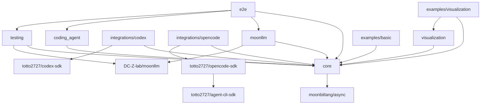
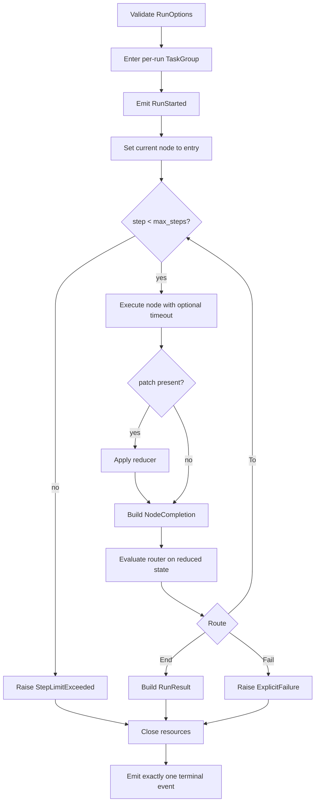

# Moon Agent Graph Runtime Implementation Record

## Objective

The reviewed native asynchronous MVP is implemented without unsupported durability, parallel scheduling, or arbitrary resource abstractions.

The implementation froze contracts early, kept concrete SDK dependencies behind adapter packages, and validated deterministic fakes before real local processes.

## Delivery Baseline

The implemented baseline is:

- MoonBit compiler `v0.10.4+2cc641edf` through the repository-pinned `moon 0.1.20260713`.
- Native backend only.
- `moonbitlang/async@0.20.1`.
- `moonbitlang/x@0.4.38`.
- `DC-Z-lab/moonllm@0.1.0`.
- `totto2727/codex-sdk@0.0.0` from this workspace.
- `totto2727/agent-cli-sdk@0.1.0` from this workspace.
- `totto2727/opencode-sdk@0.1.1` from this workspace.

The graph module, Codex SDK, and OpenCode SDK all resolve `moonbitlang/async@0.20.1`; there is no second async-runtime version in the implemented workspace contract.

## Module Layout

```text
mbt/package/moon-agent-graph/
├── moon.mod
├── README.mbt.md
├── README.md -> README.mbt.md
├── docs/
└── src/
    ├── core/
    ├── moonllm/
    ├── coding_agent/
    ├── integrations/
    │   ├── codex/
    │   └── opencode/
    ├── testing/
    ├── visualization/
    ├── examples/
    │   ├── basic/
    │   └── visualization/
    └── e2e/
```

Every source package has one `moon.pkg`.

The module metadata uses:

```text
preferred_target = "native"
supported_targets = "native"
```

## Dependency Direction



No package may import an example or testing package from production code.

## Workstream Summary

| ID  | Deliverable                                            | Depends on                                  | Status               |
| --- | ------------------------------------------------------ | ------------------------------------------- | -------------------- |
| W0  | Toolchain, dependency, and compile-spike baseline      | None                                        | Complete             |
| W1  | Core IDs, graph definition, routers, and compilation   | W0                                          | Complete             |
| W2  | Node, reducer, events, and function node               | W0                                          | Complete             |
| W3  | Resource store and native async lifecycle              | W0                                          | Complete             |
| W4  | Sequential graph runtime                               | W1, W2, W3                                  | Complete             |
| W5  | MoonLLM node integration                               | W2                                          | Complete             |
| W6  | Coding-agent abstraction and node                      | W2, W3                                      | Complete             |
| W7  | Codex adapter                                          | W6                                          | Complete             |
| W8  | OpenCode adapter                                       | W6                                          | Complete             |
| W9  | Shared test kit                                        | W1 interfaces, W2 interfaces, W6 interfaces | Complete             |
| W10 | Deterministic integration workflows                    | W4, W5, W7, W8, W9                          | Complete             |
| W11 | Examples, API review, and documentation reconciliation | W10                                         | Final reconciliation |

## W0: Toolchain and Contract Spike

Status: Complete.

### Deliverables

- New module skeleton using `moon.mod` and `moon.pkg`.
- Native target declarations.
- One common `moonbitlang/async` version.
- A minimal compile spike for every unusual public API shape.
- Initial package dependency graph.
- Repository task integration only if required by existing workspace discovery.

### Compile Spikes

Prove these shapes with the actual compiler:

- Generic structs containing async function fields.
- Async `pub(open) trait` methods and trait objects.
- A per-run `TaskGroup[Unit]` passed through node and coding-agent open context.
- `NodeId` deriving `Eq`, `Hash`, and `Debug`.
- Function fields that raise errors.
- `Error` stored as a cause in a public error record.
- `ReadOnlyArray` at public query boundaries.
- A coding-agent session trait object stored in a map.

### Async Dependency Gate

The Codex SDK, OpenCode SDK, and graph module were aligned on `moonbitlang/async@0.20.1`, and their focused native tests validate the shared runtime contract.

### Acceptance

- `moon check --target native` passes for the skeleton and compile spikes.
- The package dependency graph is acyclic.
- The common async version is explicit.
- No deprecated `moon.mod.json`, `moon.pkg.json`, implicit trait-method attachment, or old `suberror` syntax is introduced.

## W1: Graph Model and Compiler

Status: Complete.

### Deliverables

- Identifier wrappers and validation.
- `Route`.
- `Router[S]` with declared destinations.
- `GraphDefinition[S, P]`.
- `CompiledGraph[S, P]`.
- Compilation validation and reachability.
- Black-box graph tests.

### Implementation Rules

- Permit one router per node.
- Allow cycles.
- Reject undeclared or unknown destinations.
- Store immutable definition values in persistent hash maps during compilation.
- Keep compiled collections private.
- Do not add parallel-edge ordering semantics.

### Acceptance

- Valid cyclic graphs compile.
- Unknown and unreachable destinations fail with concrete `suberror` values.
- Mutation after compilation does not alter the compiled graph.
- Runtime lookup has no mutable public aliases.

## W2: Node, Reducer, Events, and Function Node

Status: Complete.

### Deliverables

- `Node[S, P]`.
- `NodeContext`.
- `NodeOutput[P]`.
- Artifacts and metadata.
- `Reducer[S, P]`.
- `GraphEvent`.
- Synchronous `EventSink`.
- Function-node factory.
- Unit tests.

### Implementation Rules

- Use async callback fields for nodes.
- Keep reducers and routers synchronous.
- Do not use `async` on callbacks that perform no async operation.
- Do not introduce a state-store interface in the MVP.
- Do not duplicate lifecycle events inside `NodeOutput`.

### Acceptance

- A function node receives the correct state and context.
- Raised callback errors remain available as runtime causes.
- Event order is deterministic.
- Reducer output is the state observed by the router.

## W3: Resource Store and Native Async Lifecycle

Status: Complete.

### Deliverables

- `ResourceScope`.
- Run-local resource store specialized to coding-agent sessions.
- Run- and node-scoped acquisition.
- Reverse-order close.
- Close-once behavior.
- Cleanup error aggregation.
- Cancellation-protected and timeout-bounded finalization.
- Unit tests for every terminal path.

### Implementation Rules

- Cache only successfully opened resources.
- Continue cleanup after a close failure.
- Keep cancellation protection narrowly around cleanup.
- Close resources before the run task-group body returns.
- Do not use task-group defer as the sole close path for a long-lived child process.
- Do not add application-scoped resources.
- Do not add arbitrary typed downcasting.

### Acceptance

- Run-scoped sessions are reused within one run.
- Node-scoped sessions close after each attempt.
- Open and close failures preserve their causes.
- Cancellation cannot leave an OpenCode or Codex CLI subprocess running.

## W4: Sequential Graph Runtime

Status: Complete.

### Deliverables

- `GraphRuntime[S, P]`.
- Invocation-local state.
- Per-run task group.
- Node execution loop.
- Patch reduction.
- Routing.
- Step limit.
- Node timeout.
- Terminal event discipline.
- Error wrapping and cleanup integration.
- Runtime unit tests.

### Execution Algorithm



### Cancellation Rules

- Caller task cancellation remains a cancellation error.
- Cleanup runs before cancellation is re-raised.
- Catch-all retry or polling loops stop when `@async.is_being_cancelled()` is true.
- `@async.is_cancellation_error` may classify an observed error but is not the sole cancellation-state test.

### Acceptance

- Sequential, branch, loop, step-limit, timeout, failure, and cancellation tests pass.
- A primary error remains primary when cleanup also fails.
- Exactly one terminal event follows `RunStarted`.
- Every child task terminates before `invoke` exits.

## W5: MoonLLM Node

Status: Complete.

### Deliverables

- `LlmNodeSpec[S, P]`.
- Chat request builder and response decoder boundary.
- Node factory.
- Deterministic invoke fake.
- Local mock OpenAI-compatible integration test.

### Implementation Rules

- Keep the concrete MoonLLM client in the integration package.
- Inject a narrow async invoke callback.
- Preserve MoonLLM `LLMError`.
- Preserve token usage in a documented artifact or event.
- Do not mix workspace editing semantics into the LLM node.

### Acceptance

- Request-build failure skips the client.
- Transport and decode failures do not update state.
- Timeout and cancellation terminate the request.
- A real MoonLLM client works against the local mock server.

## W6: Coding-Agent Abstraction

Status: Complete.

### Deliverables

- Common request, response, policy, workspace, and status types.
- Async `CodingAgentSession` trait.
- `CodingAgent` open function.
- Coding-agent node factory.
- Fake session implementation.
- Unit tests for scope and continuation behavior.

### Implementation Rules

- Cancellation is task cancellation, not a `Cancelled` success response.
- Session-open context owns environment and policies applied at construction time.
- Adapter-specific options remain outside the common contract.
- `changed_files` may be empty when the SDK cannot prove a change set.
- Close is idempotent at the interface and invoked once by the resource store.

### Acceptance

- The same node implementation works with fake Codex-like and OpenCode-like sessions.
- Run scope reuses one session.
- Node scope opens and closes per attempt.
- Cancellation reaches in-flight session work.

## W7: Codex Adapter

Status: Complete.

### Deliverables

- Common policy to `ThreadOptions` mapping.
- New and resumed thread creation.
- Request execution and response normalization.
- Continuation ID extraction.
- Task-cancellation behavior.
- Integration tests using the existing fake Codex executable approach.

### Implementation Rules

- Use `Codex::start_thread` and `Codex::resume_thread`.
- Use `Thread::run` or `Thread::run_streamed` according to required observability.
- Do not invent stdout, stderr, command, or changed-file data.
- Keep close as a no-op only after all in-flight work has terminated.
- Preserve `turn.failed` as a raised adapter error.

### Acceptance

- New and resumed turns work.
- Workspace, sandbox, approval, network, and additional-root settings map correctly.
- Cancelling a turn terminates its subprocess.
- Existing Codex SDK tests remain green.

## W8: OpenCode Adapter

Status: Complete.

### Deliverables

- CLI thread and logical session state.
- Open function that maps workspace, environment, and SDK-specific options.
- New and resumed OpenCode sessions.
- Typed prompt and local-file input mapping.
- CLI turn execution and final-text response mapping.
- Idempotent logical close.
- Integration tests with a fake `opencode run --format json` executable.

### Implementation Rules

- Use `totto2727/opencode-sdk` for CLI execution and keep `totto2727/opencode-server-sdk` outside the graph adapter.
- Resolve relative context files against the workspace root and pass them as typed local-file inputs.
- Preserve inherited environment variables, then apply adapter and caller overrides in that order.
- Preserve concrete SDK process, JSONL, and turn errors.
- Let each `Thread::run` invocation own and clean up its native child process.
- Select run scope in the calling `CodingAgentNodeSpec` when one logical OpenCode session ID should be reused for the invocation.

### Acceptance

- New and resumed sessions pass the correct session ID to the CLI.
- Model, agent, directory, file, variant, title, thinking, prompt, and environment mappings are observable.
- Process failure and cancellation propagate after child cleanup.
- No CLI child process remains after cancellation.

## W9: Test Kit

Status: Complete.

### Deliverables

- Scripted node and router.
- Recording reducer and event sink.
- Fake coding agent and session.
- Fake MoonLLM invoke callback.
- Unique temporary workspace helper.
- Bounded `eventually` helper.
- Process and port leak assertions.

### Implementation Rules

- Keep fixture mutation owned by one async task unless a mutex is required.
- Make delay and failure scripts bounded.
- Do not add production-only abstractions for test convenience.

### Acceptance

- Core, MoonLLM, and coding-agent packages can test without external credentials.
- Every fake records calls, arguments, and close order needed by the test plan.

## W10: Deterministic Integration

Status: Complete.

### Deliverables

- Function-only graph.
- MoonLLM plan to function graph.
- MoonLLM plan to Codex to function-test graph.
- MoonLLM plan to OpenCode to function-test graph.
- Codex/OpenCode selection graph.
- Retry loop.
- Cancellation workflow.

### Acceptance

- All workflows run on the native backend.
- Retry loops terminate through success or a configured limit.
- Session reuse is observable.
- Unselected adapters are never opened.
- No child process survives.

## W11: Examples and API Review

Status: Final reconciliation.

### Deliverables

- Minimal runnable native examples.
- `README.mbt.md` with checked examples where practical.
- Reconciliation of implementation with architecture, interfaces, tests, and limitations.
- Public API naming review.
- Error-redaction review.

### Acceptance

- Examples build and run from repository-root commands.
- Documentation matches exported signatures.
- No future feature is described as implemented.
- English source documents and Japanese translations remain paired.

## Exported API Reconciliation

- `GraphRuntime::invoke` is an async method with `initial_state` as its only required positional argument and `options? : RunOptions` as a labelled optional argument.
- `RunOptions::RunOptions` validates `max_steps`, `node_timeout_ms?`, and `cleanup_timeout_ms`; the runtime stores no global invocation state.
- `NodeContext` carries the invocation `TaskGroup[Unit]`, synchronous `EventSink`, invocation-local `RuntimeResourceStore`, and optional deadline.
- `CodingAgentSession` is a `pub(open)` async trait with `id`, `execute`, and `close`; `CodingAgent.open` receives `CodingAgentOpenContext`.
- `CodingAgentNodeSpec` exposes raising `open_context`, `build_request`, and `decode_response` callbacks and selects `ResourceScope` explicitly.
- `LlmNodeSpec` accepts a typed MoonLLM request builder, a narrow async invoke callback, and a response decoder.
- `RuntimeResourceStore` is intentionally specialized to `CodingAgentSession`; it is not a heterogeneous resource container.
- `codex_agent` and `opencode_agent` expose adapter option records while keeping SDK-specific session and process state private.
- Public collection snapshots use `ReadOnlyArray`; owned mutable arrays and maps remain private to graph definitions, runtimes, resources, and test fixtures.

## Known MVP Limitations

- Execution is sequential and native-only.
- State is invocation-local and in memory; checkpointing, suspend/resume, durable state, and pluggable state stores are not implemented.
- Parallel nodes, application-scoped resources, arbitrary typed resource downcasting, and dynamic undeclared routes are not implemented.
- One router is supported per node, and every possible `To` destination must be declared before compilation.
- `EventSink` is synchronous and best-effort; sink failures do not fail the graph run.
- Coding-agent `changed_files` may be empty when the underlying SDK cannot prove a reliable change set.
- The Codex adapter reports only data exposed by the current SDK and does not invent stdout, stderr, commands, or changed-file records.
- The OpenCode adapter stores only a logical CLI thread between requests; `coding_agent_node` and its `ResourceScope` selection determine whether that session ID is reused for a run or reopened for each node attempt.
- Cleanup is bounded by `cleanup_timeout_ms`; a cleanup timeout or close failure is reported through the runtime error model.

## Completed Implementation Phases

### Phase 0: Baseline

W0 established the toolchain, dependency versions, and API compile spikes before feature implementation.

### Phase 1: Core Contracts

W1, W2, the interface portion of W3, and the interface portion of W9 froze IDs, node output, router declarations, event order, error preservation, and resource scope.

### Phase 2: Runtime and Abstract Integrations

W4, W5, and W6 established complete graph runs against fakes without concrete coding-agent processes.

### Phase 3: Concrete Adapters

W7 and W8 used deterministic fake executables before full workflow integration.

### Phase 4: Workflows

W10 reconciled lifecycle behavior across all packages through deterministic native workflows.

### Phase 5: Stabilization

W11 is the final root verification, native example, API review, and documentation reconciliation stage.

## Frozen Contracts

The implementation froze:

1. The exact async dependency version.
2. Generic node and router callback signatures.
3. Router declared-target semantics.
4. `NodeOutput[P]`.
5. Coding-agent request and response minimum fields.
6. Session trait methods.
7. Resource scope and close order.
8. Event order and terminal-event rule.
9. Node timeout versus caller cancellation.
10. Primary versus cleanup error preservation.
11. OpenCode per-turn CLI subprocess ownership and cancellation.

## Validation Commands

Run from the repository root.

```bash
vp run mbt:fix
vp run mbt:check
vp run mbt:build
vp run mbt:test
```

Use focused native tests during development.

```bash
moon test --target native mbt/package/moon-agent-graph/src/core
moon test --target native mbt/package/moon-agent-graph/src/integrations/codex
moon test --target native mbt/package/moon-agent-graph/src/integrations/opencode
```

The final manual gate covers at least one function-only example and one deterministic coding-agent workflow through its native executable surface.

## Implemented MVP Record

- The module is native-only and async.
- One common async runtime version is used across the graph and adapters.
- Function, MoonLLM, Codex, and OpenCode nodes can be registered and executed.
- Conditional routes and cycles work.
- Router destinations are compile-validated.
- State updates only through the reducer.
- Infinite loops stop at `max_steps`.
- Node timeouts and caller cancellation terminate owned work.
- OpenCode reuses one logical session ID while each turn owns a short-lived CLI subprocess.
- Codex subprocess cancellation is observed.
- Primary and cleanup errors remain distinguishable.
- Unit and deterministic integration tests pass.
- No child process or temporary-fixture leak remains.
- Native examples build and run.
- Public API documentation matches implementation.

## References

- [MoonBit async programming](https://docs.moonbitlang.com/en/latest/language/async-experimental.html)
- [MoonBit error handling](https://docs.moonbitlang.com/en/latest/language/error-handling.html)
- [MoonBit methods and traits](https://docs.moonbitlang.com/en/latest/language/methods.html)
- [MoonBit module configuration](https://docs.moonbitlang.com/en/latest/toolchain/moon/module.html)
- [MoonBit package configuration](https://docs.moonbitlang.com/en/latest/toolchain/moon/package.html)
- [moonbitlang/async package](https://mooncakes.io/docs/moonbitlang/async)
- [MoonLLM](https://github.com/DC-Z-lab/moonllm)
- [Codex SDK source reference](https://github.com/openai/codex/tree/f201c30c52a35f819262865a53df94b6f4ea7a50/sdk/typescript)
- [OpenCode CLI documentation](https://opencode.ai/docs/cli/)
- [OpenCode `run` JSONL implementation](https://github.com/anomalyco/opencode/blob/1e17856ba4b5b052650c8115060852f3f023844e/packages/opencode/src/cli/cmd/run.ts)
