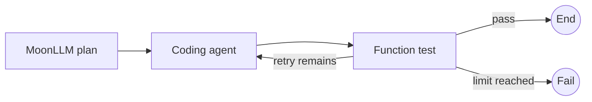

# Moon Agent Graph Runtime テストカバレッジ

## 目的と状態

このドキュメントは、レビュー済みMVPテスト計画と `mbt/package/moon-agent-graph` に実装された決定論的ネイティブテストスイートの整合性を確認します。

このスイートはネイティブのみで動作し、プロバイダの認証情報は使用せず、公開グラフ、ランタイム、ノード、コーディングエージェント、MoonLLM、Codex、OpenCodeの境界を決定論的フェイクまたはローカルプロセスでテストします。

この調整時点において、モジュールには102のMoonBitテストブロックが含まれています：56のコアテスト、7つのMoonLLMテスト、7つのコーディングエージェントノードテスト、10の共有テスト、8つのワークフローE2Eテスト、7つのCodexアダプタテスト、7つのOpenCodeアダプタテストです。

以下の識別子は、元の計画からの有用な受け入れトレーサビリティとして残っています。「Automated」は、記述された公開動作を決定論的ネイティブテストが現在カバーしていることを意味します。「Deferred」は、その動作がまだ手動または認証情報を必要とするリモートプロバイダによる実行を必要とし、通常のCIではカバーされないことを意味します。

## MoonBitテスト規約

- 公開コントラクトと決定論的インテグレーション面には `*_test.mbt` を使用します。
- 公開APIを通じて適切に観測できないパッケージローカルの配線やデコーダの詳細にのみ `*_wbtest.mbt` を使用します。
- 非同期動作には `async test` を使用し、キャンセルエラーを通常の失敗に変換せずに保持します。
- asyncテストは並列実行される可能性があるため、ネイティブプロセスを所有する各テストは一意の一時ディレクトリとエフェメラルなlocalhostポートを使用します。
- ポーリングは `@testing.eventually` または `@async.with_timeout` で制限し、実行順序に依存しないようにします。
- 内部実装の詳細ではなく、型付けされたエラーと観測可能なイベント順序を検査します。
- 実際のリモートモデルおよび認証情報を必要とするプロバイダのチェックは通常のCIの対象外とします。

## テストレイヤー

| レイヤー                       | 現在の決定論的カバレッジ範囲                                                                            |       通常のCI |
| ------------------------------ | ------------------------------------------------------------------------------------------------------- | -------------: |
| コアユニットとランタイム       | ID、グラフコンパイル、ノード、イベント、リソース、ライフサイクル、逐次ランタイム                        |           はい |
| MoonLLMノード                  | 型付けされたコールバックフェイクとローカルOpenAI互換HTTPサーバ                                          |           はい |
| コーディングエージェントノード | フェイクセッションのライフサイクル、スコープ、リトライ、キャンセル、レスポンスデコード                  |           はい |
| Codexアダプタ                  | ネイティブフェイク実行可能ファイルを使用したリポジトリSDK                                               |           はい |
| OpenCodeアダプタ               | ネイティブフェイク `opencode run` 実行可能ファイルを使用したリポジトリCLI SDK                           |           はい |
| ワークフローE2E                | 関数、フェイクコーディングエージェント、フェイクMoonLLM、ルーティング、リトライ、失敗、キャンセルグラフ |           はい |
| 実際のリモートエージェントE2E  | 実際のプロバイダ認証情報、モデル動作、ユーザーワークスペースへの影響                                    | 手動および延期 |

## 共有決定論的フィクスチャ

`testing` パッケージは現在、以下のフィクスチャとヘルパーを提供しています：

- `scripted_node` — ノードの公開コンテキストと状態入力を記録します。
- `scripted_router` — ルーターの状態と完了入力を記録します。
- `recording_reducer` — 状態とパッチ入力を記録します。
- `recording_event_sink` — 発行された正確な `GraphEvent` シーケンスを記録します。
- `fake_coding_agent` — オープン、リクエスト、セッションID、クローズ順序を記録し、オプションで注入されたオープンまたは実行エラーを発生させます。
- `fake_moonllm_invoke` — 型付けされた `@llm.ChatRequest` 値を記録し、オプションで注入されたエラーを発生させます。
- `temporary_workspace` — 一意の一時ルートを作成し、`close` を通じて冪等に削除します。
- `eventually` — 必須の制限付きタイムアウトで非同期述語をポーリングします。
- `process_is_running` および `localhost_port_is_open` — プロダクトテストでのシェル解析なしに、ネイティブプロセスとlocalhostポートのクリーンアップを観測します。

フィクスチャの状態は1つのテストに属します。子タスクを調整するテストは、1つのオーナータスク内で変更を保持するか、プロダクション境界によって公開される非同期ミューテックスを使用します。

## 計画IDトレーサビリティ

| IDファミリー                               | 現在の状態                            | 決定論的エビデンス                                                                                                                                                                                       |
| ------------------------------------------ | ------------------------------------- | -------------------------------------------------------------------------------------------------------------------------------------------------------------------------------------------------------- |
| `ID-*`                                     | Automated                             | `src/core/identifiers_test.mbt` でのパース、等価性、ハッシュマップ使用、テキスト変換、空IDエラー                                                                                                         |
| `GRAPH-*`                                  | Automated                             | `src/core/graph_test.mbt` での重複、欠落、不明、循環、到達不能、コンパイル済みスナップショットの分離、未宣言ルート動作                                                                                   |
| `to_mermaid`                               | Automated                             | `src/visualization/mermaid_test.mbt` での決定論的なエスケープ、ノードとルーターの説明、ルートラベル、分岐順序                                                                                            |
| `FN-*`, `ROUTER-*`, `REDUCER-*`, `EVENT-*` | Automated                             | `src/core/*_test.mbt` での関数ノードコンテキストとキャンセル、リデューサ/ルーターの順序、ライフサイクルイベント、シンク失敗の分離                                                                        |
| `RESOURCE-*`                               | Automated                             | `src/core/resources*_test.mbt` での実行/ノード所有権、キャッシュ動作、逆順クローズ、クローズワンス、集約クリーンアップエラー、タイムアウト、キャンセル保護                                               |
| `RUNTIME-*`                                | Automated                             | `src/core/runtime*_test.mbt` での逐次実行、状態削減、ルートコントラクト、明示的失敗、ステップ制限、タイムアウト、キャンセル、クリーンアップ合成、呼び出し分離                                            |
| `LLM-*`                                    | リモートプロバイダ動作以外はAutomated | `src/moonllm/*_test.mbt` でのコールバック境界、型付けされたリクエストキャプチャ、レスポンスデコード、使用量アーティファクト、ビルド/デコード/呼び出しエラー、キャンセル、ローカルモックHTTP統合          |
| `AGENT-*`, `AGENTNODE-*`                   | Automated                             | `src/coding_agent/*_test.mbt` および `src/testing/fakes*_test.mbt` での共通コントラクト、実行/ノードスコープ、継続、リトライ、失敗フェーズ、キャンセル、クローズセマンティクス                           |
| `CODEX-*`                                  | ローカルアダプタ境界はAutomated       | `src/integrations/codex/*_test.mbt` でのフェイクネイティブ実行可能ファイルによるマッピングされた入力、継続再利用、SDK失敗伝搬、キャンセル、クリーンアップ                                                |
| `OPENCODE-*`                               | ローカルアダプタ境界はAutomated       | `src/integrations/opencode/*_test.mbt` でのフェイクCLI実行可能ファイルによるオプション、プロンプト、ファイル、環境、開始/再開継続、プロセス失敗、キャンセル、PIDクリーンアップ、クローズドセッション動作 |
| `E2E-*`                                    | 決定論的グラフワークフローはAutomated | `src/e2e/*_test.mbt` でのMoonLLM計画→関数検証、関数、エージェントリトライ、ブランチ選択、制限付きループ、計画失敗、キャンセルワークフロー                                                                |
| 実際のプロバイダ固有動作                   | Deferred                              | 明示的な認証情報と使い捨てワークスペースで手動実行。通常のCIの対象外                                                                                                                                     |

## コアおよびランタイムカバレッジ

コアスイートは、識別子の検証、グラフコンパイル、コンパイル済みグラフのスナップショット分離、ノードコンテキスト構築、同期的シンク順序、リソース所有権、逐次ランタイム動作を証明します。

ランタイムテストは、成功する1ノードおよびマルチノードグラフ、リデューサ前ルーター後の順序、パッチなし動作、未宣言ターゲットの拒否、明示的な `Route::Fail`、無効なオプション、正確なステップ制限試行、タイムアウト、キャンセル、クリーンアップエラー合成、分離された反復呼び出しをカバーします。

期待される成功ライフサイクルは以下の通りです：

```text
RunStarted
NodeStarted
NodeCompleted
StateUpdated, when a patch exists
RouteSelected
RunCompleted
```

失敗およびキャンセルテストでは、`RunStarted` 後に正確に1つの終端イベントが発生することを追加で検証します。

## MoonLLMノードカバレッジ

`src/moonllm/llm_node_test.mbt` は、状態から構築された型付けされた `ChatRequest`、1回の非同期フェイク呼び出し、デコードされたパッチ/値/アーティファクト出力、使用量メタデータ、ランタイム状態適用、ビルダー失敗、保持された `LLMError`、リデューサ実行なしのデコーダ失敗、一時停止されたコールバックのキャンセルを含む、狭い `LlmNodeSpec` 境界をカバーします。

`src/moonllm/llm_node_integration_test.mbt` は、ローカルのOpenAI互換モックサーバと実際のMoonLLMクライアントを使用して、リクエストマッピング、レスポンスデコード、状態更新、使用量アーティファクトの保持を検証します。

現在のチャット完了境界を超えた構造化出力動作は、将来のアダプタ固有テストとして残り、実装された主張ではありません。

## コーディングエージェントおよびアダプタカバレッジ

コーディングエージェントノードテストは、決定論的セッションを使用して、実行スコープの再利用、ノードスコープのクローズ動作、ビルダーおよび実行エラーの境界、状態更新なしのデコーダ失敗、継続伝搬、オープン失敗後のリトライ、呼び出し元キャンセルのクリーンアップを検証します。

Codexアダプタ統合は、フェイクネイティブ実行可能ファイルとリポジトリSDKを使用します。オプションとワークスペースのマッピング、開始対再開の継続動作、ストリーミングされたサマリと変更ファイルのマッピング、`turn.failed` の伝搬、キャンセル、サブプロセスの終了、クリーンアップを検証します。

OpenCodeアダプタ統合は、フェイク `opencode run --format json` 実行可能ファイルを使用します。CLIオプションとプロンプトのマッピング、コンテキストファイルの添付、継承/アダプタ/呼び出し元環境の優先順位、新規および再開されたセッションID、1つの論理セッションを通じた繰り返しターン、正確なプロセス終了の失敗伝搬、冪等な公開クローズ後の `SessionClosed` を検証します。

OpenCodeのキャンセルは、共有CLI所有権コントラクトに従います：実行中の `execute` をキャンセルすると、子プロセスをハードストップして待機してからキャンセルを返します。統合テストは、フェイク実行可能ファイルがブロックされている間に子PIDを観測し、タスクをキャンセルし、PIDがもう生きていないことを証明し、その後論理セッションをクローズします。

OpenCode CLI SDKの専用テストは、型付けされたJSONLデコード、不正なレコード、エラーイベント、コールバックストリーミング、プロセス終了、直接キャンセルをカバーします。グラフアダプタテストは、そのスコープをアダプタマッピングと公開セッション動作に限定します。

## ワークフローE2Eカバレッジ

`src/e2e/happy_workflow_test.mbt` は、決定論的な関数のみの順序、型付けされたMoonLLM計画→関数検証パス、CodexラベルおよびOpenCodeラベルのフェイクエージェントワークフローをカバーします。MoonLLM計画→関数パスは、型付けされたリクエストを記録し、計画パッチを適用し、最終状態とライフサイクルを検証し、プロバイダ認証情報を必要としません。リトライワークフローは、実際のアダプタプロセスを必要とせずに、実行スコープのセッション再利用と正確なリクエスト数を証明します。

`src/e2e/routing_failure_test.mbt` は、両方のブランチ入力をカバーし、選択されなかったフェイクエージェントのオープン数とリクエスト数がゼロであることを証明し、正確な制限付きループ試行回数と `StepLimitExceeded` を検証し、注入されたLLM計画失敗がエージェントを未オープンのままにし、初期ワークフロー状態を変更しないことを証明します。

`src/e2e/cancellation_workflow_test.mbt` は、ブロックされたコーディングエージェントワークフローをキャンセルし、後のLLMノードが実行されず、セッションが1回クローズされ、ランタイムが1つの `RunCancelled` イベントを発行することを証明します。

元の実際のアダプターワークフロー図は、手動受け入れシナリオとして有用ですが、現在の通常のCIでは、実際のプロバイダ認証情報やユーザーワークスペースの代わりに決定論的ローカル境界を使用します。



## ネイティブコマンド

リポジトリルートからコマンドを実行します。

```bash
vp run mbt:fix
vp run mbt:check
vp run mbt:build
vp run mbt:test
```

フォーカスしたテストの開発中は選択ファイルコマンドを使用し、モジュール全体のゲートに頼る前にそのパッケージを実行します。

```bash
moon test mbt/package/moon-agent-graph/src/e2e/routing_failure_test.mbt --target native --deny-warn
moon check mbt/package/moon-agent-graph/src/e2e/routing_failure_test.mbt --target native --deny-warn
moon test mbt/package/moon-agent-graph/src/e2e --target native --deny-warn
moon test mbt/package/moon-agent-graph/src/integrations/opencode --target native --deny-warn
```

最終的な実装ゲートは、ルートのMoonBitチェック、ビルド、テストタスクを実行します。フォーカスしたテストの結果は、そのゲートに代わりません。

## 延期された手動チェック

- 使い捨てアカウントに対して実際のMoonLLMプロバイダを実行し、プロバイダ固有のモデル動作を確認します。
- 使い捨ての実際のワークスペースに対してCodexとOpenCodeを実行し、インストールされたバージョンでの外部プロセス動作を検証します。
- 将来のノードが `ChatRequest` と `ChatResponse` 以外のリクエスト/レスポンスペアを使用する場合、構造化出力APIを検証します。
- 実際のプロバイダエラーペイロードに対して認証情報の編集漏れをレビューし、テストアーティファクトに認証情報を記録しないことを確認します。

## 受け入れ基準

- すべての決定論的ネイティブテストがルートMoonBitゲートを通過すること。
- プロセスを所有するすべての失敗またはクローズパスが、対応するローカル面でのPID、ポート、一時ルートのクリーンアップを証明すること。
- キャンセルテストは実際のタスクキャンセルを使用し、キャンセルセマンティクスを保持すること。
- SDKが公開していないSDKフィールドをテストが作り出さないこと。
- 通常のCIはプロバイダ認証情報を必要としないこと。
- 延期されたリモートチェックは、認証情報を必要とするテスト環境が意図的に追加されるまで、明示的に手動のままとすること。

## 参考文献

- [MoonBit非同期プログラミングと非同期テスト](https://docs.moonbitlang.com/en/latest/language/async-experimental.html)
- [MoonBitビルドシステムのテストファイル規約](https://docs.moonbitlang.com/en/latest/toolchain/moon/tutorial.html)
- [MoonBitパッケージテストのインポート](https://docs.moonbitlang.com/en/latest/toolchain/moon/package.html)
- [moonbitlang/asyncパッケージドキュメント](https://mooncakes.io/docs/moonbitlang/async)
