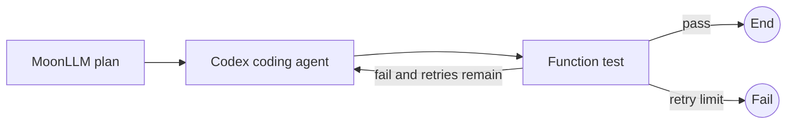

# Moon Agent Graph ランタイムテスト計画

## 目的

このドキュメントは、レビュー済みのネイティブ非同期MVPに対する最小限のユニットテスト、統合テスト、およびエンドツーエンドのテスト範囲を定義します。

この計画はまずパブリックな振る舞いをテストし、SDKに依存するテストは決定論的であることを保証します。

実際のリモートモデル呼び出しは手動で行われ、通常のCIの対象外です。

## MoonBitテスト規約

- パブリックな契約には`*_test.mbt`ブラックボックステストを使用します。
- パブリックAPIを通じて観測できないプライベートなステートマシンおよびクリーンアップの詳細には、`*_wbtest.mbt`のみを使用します。
- 非同期動作には`async test`を使用します。
- 非同期テストは並列に実行される可能性があることを前提とします。
- すべてのプロセステストに対して、一意の一時ディレクトリとポートを割り当てます。
- テストの実行順序に依存してはなりません。
- ハングする可能性のある待機には`@async.with_timeout`を使用します。
- キャンセル動作のテストには、呼び出し元タスクのキャンセルを使用します。
- 元の発生エラーを保持し、その具体的な`suberror`の形状を検査します。
- 2つ目のキャンセルトークンフェイクを追加してはいけません。

## テストレイヤー

| レイヤー | 目的 | 通常CI |
|---|---|---|
| ユニット | コールバックまたはフェイクを使用した1つのパブリックコンポーネント | はい |
| ランタイム統合 | コンパイル済みグラフ、リデューサー、ランタイム、イベント、リソースストア | はい |
| MoonLLMアダプター統合 | ローカルモックHTTPサーバーに対する実際のMoonLLMクライアント | はい |
| Codexアダプター統合 | フェイクCodex実行可能ファイルに対する実際のリポジトリSDK | はい |
| OpenCodeアダプター統合 | フェイクOpenCode実行可能ファイルとローカルエンドポイントに対する実際のリポジトリSDK | はい |
| ワークフローE2E | 決定論的なローカル境界を持つ完全なグラフ | はい |
| 実際のリモートエージェントE2E | 実際のプロバイダー認証情報とモデル | 手動 |

## 共有テストフィクスチャ

`testing`パッケージは以下を提供します：

- `scripted_node`
- `scripted_router`
- `recording_reducer`
- `recording_event_sink`
- `fake_coding_agent`
- `fake_coding_agent_session`
- `fake_moonllm_invoke`
- `temporary_workspace`
- 必須タイムアウト付きの`eventually`
- プロセスおよびポート漏洩アサーション

フィクスチャの状態は1つのテストに属します。

フィクスチャが複数の子タスクによってアクセスされる場合は、その可変状態を非同期ミューテックスで保護するか、すべての変更を1つのオーナータスクに限定します。

## 識別子テスト

| ID | シナリオ | 期待結果 |
|---|---|---|
| ID-001 | 空でないノードIDをパースする | 値が作成される |
| ID-002 | 空のノードIDをパースする | `EmptyId`が発生する |
| ID-003 | 等しい文字列から作成されたIDを比較する | 等しい |
| ID-004 | 異なる文字列から作成されたIDを比較する | 等しくない |
| ID-005 | IDを`Map`のキーとして使用する | 値が取得される |
| ID-006 | IDをテキストに変換する | 元のテキストが返される |

## グラフ定義とコンパイルテスト

| ID | シナリオ | 期待結果 |
|---|---|---|
| GRAPH-001 | 1つのノード、ルーター、エントリを追加する | コンパイルが成功する |
| GRAPH-002 | 同じノードIDを2回追加する | `DuplicateNode` |
| GRAPH-003 | 1つのノードに2つのルーターを追加する | `DuplicateRouter` |
| GRAPH-004 | エントリなしでコンパイルする | `MissingEntry` |
| GRAPH-005 | エントリが未知のノードを参照している | `UnknownEntry` |
| GRAPH-006 | ノードにルーターがない | `MissingRouter` |
| GRAPH-007 | ルーターが未知の宛先を宣言している | `UnknownDestination` |
| GRAPH-008 | グラフにエントリから到達不可能なノードが含まれている | `UnreachableNode` |
| GRAPH-009 | AがBにルーティングし、BがAにルーティングする | コンパイルが成功する |
| GRAPH-010 | 単一ノードが`End`にルーティングする | コンパイルが成功する |
| GRAPH-011 | コンパイル後に定義を変更する | コンパイル済みスナップショットは変更されない |
| GRAPH-012 | 返されたクエリコレクションを変更する | コンパイル済み内部状態は変更されない |
| GRAPH-013 | ルーターが既存だが未宣言のターゲットを返す | ランタイム契約エラー |

## 関数ノードテスト

| ID | シナリオ | 期待結果 |
|---|---|---|
| FN-001 | コールバックが成功する | 出力が返される |
| FN-002 | コールバックが状態を読み取る | 正しい状態が観測される |
| FN-003 | コールバックが実行ID、ノードID、ステップを読み取る | 正しいコンテキストが観測される |
| FN-004 | コールバックがドメインエラーを発生させる | 同じエラーがランタイムの原因として保持される |
| FN-005 | 1回実行する | コールバックカウントが1である |
| FN-006 | 非同期I/O中に実行中のタスクがキャンセルされる | キャンセルが伝播する |

## ルーターテスト

| ID | シナリオ | 期待結果 |
|---|---|---|
| ROUTER-001 | 条件がAを選択する | `To(A)` |
| ROUTER-002 | 条件がBを選択する | `To(B)` |
| ROUTER-003 | 完了条件が成立する | `End` |
| ROUTER-004 | ドメイン失敗条件が成立する | `Fail(message)` |
| ROUTER-005 | ルーターがエラーを発生させる | ランタイムがノードとステップでエラーをラップする |
| ROUTER-006 | ルーターがノード完了値を読み取る | 期待されるルート |
| ROUTER-007 | ルーターが未宣言のターゲットを返す | `RouteContractViolated` |
| ROUTER-008 | ルーターコールバックに非同期効果がない | 型チェックとリントチェックがクリーンのまま |

## リデューサーテスト

| ID | シナリオ | 期待結果 |
|---|---|---|
| REDUCER-001 | 値設定パッチを適用する | 新しい状態に値が含まれる |
| REDUCER-002 | インクリメントパッチを適用する | カウンターが1回インクリメントされる |
| REDUCER-003 | 無効なパッチを適用する | ドメインエラーが発生する |
| REDUCER-004 | 同じ状態とパッチを2回適用する | 同じ結果 |
| REDUCER-005 | ノード完了後にパッチを適用する | ルーターがリデュース後の状態を観測する |

## イベントシンクテスト

| ID | シナリオ | 期待結果 |
|---|---|---|
| EVENT-001 | 3つのイベントを発行する | レコーダーが順序を保持する |
| EVENT-002 | シンクコールバックがエラーを発生させる | 実行は継続する |
| EVENT-003 | 成功した1ノード実行 | 正確なライフサイクルシーケンス |
| EVENT-004 | ノード失敗 | `RunFailed`が終端である |
| EVENT-005 | 呼び出し元のキャンセル | `RunCancelled`が終端である |
| EVENT-006 | クリーンアップ失敗 | 1つの終端失敗イベント |

期待される成功シーケンスは以下の通りです：

```text
RunStarted
NodeStarted
NodeCompleted
StateUpdated, when a patch exists
RouteSelected
RunCompleted
```

## リソースストアテスト

| ID | シナリオ | 期待結果 |
|---|---|---|
| RESOURCE-001 | 実行スコープのセッションを2回取得する | 1回開かれ、同じセッションが返される |
| RESOURCE-002 | ノードスコープのセッションを別々の試行で2回取得する | 2回開かれる |
| RESOURCE-003 | セッションオープンがエラーを発生させる | 何もキャッシュされない |
| RESOURCE-004 | すべての実行リソースを閉じる | すべてのセッションが閉じられる |
| RESOURCE-005 | すべてを2回閉じる | セッションクローズが1回呼び出される |
| RESOURCE-006 | 最初のクローズがエラーを発生させる | 残りのセッションは依然として閉じられる |
| RESOURCE-007 | 複数のリソースを閉じる | 取得順序の逆順 |
| RESOURCE-008 | 1つのノードを解放する | そのノードのスコープ付きセッションのみが閉じられる |
| RESOURCE-009 | クローズ中に実行タスクがキャンセルされる | 保護されたクリーンアップが完了するか、ハードタイムアウトに達する |
| RESOURCE-010 | クリーンアップタイムアウトが期限切れになる | タイムアウトがクリーンアップ失敗として保持される |

OpenCodeのライフサイクルテストは、サーバークローズがそれを所有するタスクグループの本体が戻る前に発生することを証明しなければなりません。

## ランタイムユニットテスト

| ID | シナリオ | 期待結果 |
|---|---|---|
| RUNTIME-001 | エントリがendにルーティングする | 1ノードで成功結果 |
| RUNTIME-002 | AがBにルーティングし、Bがendにルーティングする | AとBが順番に実行される |
| RUNTIME-003 | ノードがパッチを返す | リデューサーが1回実行される |
| RUNTIME-004 | パッチがルート条件を変更する | ルーターがリデュース後の状態を参照する |
| RUNTIME-005 | ノードがエラーを発生させる | 後続のルーターとノードは実行されない |
| RUNTIME-006 | リデューサーがエラーを発生させる | ルーターは実行されない |
| RUNTIME-007 | ルーターがエラーを発生させる | 次のノードは実行されない |
| RUNTIME-008 | 自己ループが終了しない | 正確に`max_steps`回の試行後、失敗 |
| RUNTIME-009 | 無効なゼロステップ制限 | エントリ前に実行設定エラー |
| RUNTIME-010 | 明示的な`Route::Fail` | 明示的なランタイム失敗 |
| RUNTIME-011 | ノードタイムアウト | ノードタスクがキャンセルされ、タイムアウトが発生する |
| RUNTIME-012 | ノード実行中に呼び出し元がキャンセルする | クリーンアップ後、キャンセルが再発生する |
| RUNTIME-013 | 成功かつクリーンアップ失敗 | クリーンアップ失敗が実行失敗になる |
| RUNTIME-014 | プライマリとクリーンアップの両方が失敗する | プライマリエラーが優先される |
| RUNTIME-015 | ノードがパッチを返さない | リデューサーは呼び出されない |
| RUNTIME-016 | 2つの実行が同じコンパイル済みグラフを使用する | 状態とリソースは分離される |

## MoonLLMノードテスト

ユニット境界は`LlmNodeSpec`の`invoke`コールバックです。

| ID | シナリオ | 期待結果 |
|---|---|---|
| LLM-001 | リクエスト構築と呼び出しが成功する | デコードされた出力 |
| LLM-002 | リクエストビルダーがエラーを発生させる | Invokeコールバックは呼び出されない |
| LLM-003 | Invokeが`LLMError`を発生させる | ランタイムがそれを原因として保持する |
| LLM-004 | デコーダーがエラーを発生させる | 状態は更新されない |
| LLM-005 | 状態がプロンプトを決定する | フェイクが期待されるリクエストを記録する |
| LLM-006 | レスポンスに使用量が含まれている | アーティファクトまたはイベントが使用量を保持する |
| LLM-007 | リクエスト中にタスクがキャンセルされる | MoonLLMリクエストがキャンセルされる |
| LLM-008 | ノードタイムアウトが期限切れになる | リクエストタスクが終了する |

## コーディングエージェント契約テスト

| ID | シナリオ | 期待結果 |
|---|---|---|
| AGENT-001 | Openが成功する | セッショントレイトオブジェクトが返される |
| AGENT-002 | Openがエラーを発生させる | セッションがキャッシュされない |
| AGENT-003 | Executeが成功する | 共通レスポンスが返される |
| AGENT-004 | Executeがエラーを発生させる | エラーが保持される |
| AGENT-005 | 2回クローズを要求する | アダプターのクリーンアップが1回発生する |
| AGENT-006 | クローズ後に実行する | セッションクローズエラー |
| AGENT-007 | 2つのセッション | 継続状態は分離される |
| AGENT-008 | 実行中のタスクをキャンセルする | アダプターがインフライトのプロセス作業を終了する |

## コーディングエージェントノードテスト

| ID | シナリオ | 期待結果 |
|---|---|---|
| AGENTNODE-001 | 初回の実行スコープ実行 | 1回開かれ、1回実行される |
| AGENTNODE-002 | 1回の実行内で2回の実行 | 1回開かれ、2回実行される |
| AGENTNODE-003 | ノードスコープ実行を2回 | 2回開かれ、2回閉じられる |
| AGENTNODE-004 | Openコンテキストビルダーがエラーを発生させる | セッションは開かれない |
| AGENTNODE-005 | リクエストビルダーがエラーを発生させる | セッションのexecuteは呼び出されない |
| AGENTNODE-006 | Executeがエラーを発生させる | コーディングエージェントの原因が保持される |
| AGENTNODE-007 | レスポンスデコーダーがエラーを発生させる | 状態は更新されない |
| AGENTNODE-008 | レスポンスに継続IDが含まれている | パッチが期待されるIDを受け取る |
| AGENTNODE-009 | Execute中のタスクキャンセル | キャンセルが伝播し、セッションが閉じられる |

## Codexアダプターテスト

`mbt/package/codex-sdk`ですでに使用されているのと同じネイティブフェイクCodex実行可能ファイルパターンを使用します。

| ID | シナリオ | 期待結果 |
|---|---|---|
| CODEX-001 | 新しいセッションを開く | 新しい`Thread` |
| CODEX-002 | 継続IDを再開する | `resume_thread`がIDを受け取る |
| CODEX-003 | ワークスペースと追加ルートをマッピングする | 正しい`ThreadOptions` |
| CODEX-004 | 承認とサンドボックスポリシーをマッピングする | 正しいSDK列挙型 |
| CODEX-005 | 成功したターン | `Succeeded`レスポンスとサマリー |
| CODEX-006 | `turn.failed`イベント | アダプターが元のメッセージとともにエラーを発生させる |
| CODEX-007 | スレッド開始 | 継続IDが`Thread::id`から来る |
| CODEX-008 | ターン中にキャンセルする | ネイティブCodexサブプロセスが終了する |
| CODEX-009 | SDKが信頼できる変更リストを公開しない | 空の`changed_files`、捏造データではない |
| CODEX-010 | セッションを閉じる | インフライトのターン終了後、冪等 |

## OpenCodeアダプターテスト

一意のローカルURLを通知し、必要なセッションエンドポイントを実装するフェイク実行可能ファイルを使用します。

| ID | シナリオ | 期待結果 |
|---|---|---|
| OPENCODE-001 | Openが成功する | サーバーが起動し、セッションが作成される |
| OPENCODE-002 | プロセス起動に失敗する | クライアントとセッションは作成されない |
| OPENCODE-003 | 準備完了タイムアウト | プロセスが終了され、ログが削除される |
| OPENCODE-004 | クライアント構築に失敗する | サーバーが閉じられる |
| OPENCODE-005 | セッション作成に失敗する | サーバーが閉じられる |
| OPENCODE-006 | Executeが成功する | セッションメッセージエンドポイントが1回呼び出される |
| OPENCODE-007 | 1回の実行内で2回の実行 | サーバー起動回数は1のまま |
| OPENCODE-008 | 閉じる | サーバーが停止し、一時ログが削除される |
| OPENCODE-009 | 2回クローズを要求する | 停止が1回発生する |
| OPENCODE-010 | メッセージリクエスト中にキャンセルする | リクエストが終了し、実行終了時にサーバーが閉じられる |
| OPENCODE-011 | メッセージ間にサーバーが終了する | サーバー利用不可エラー |
| OPENCODE-012 | ワークスペースとポリシーのマッピング | 期待されるサーバー/セッションリクエストデータ |
| OPENCODE-013 | OpenCodeレスポンスにエラーが含まれている | アダプターがレスポンス原因を失わずにエラーを発生させる |
| OPENCODE-014 | タスクグループ本体が終了する | サーバープロセスが残っていない |

## ランタイム統合シナリオ

### INT-RUNTIME-001: 順次ワークフロー

```text
prepare -> execute -> end
```

ノード順序、蓄積されたパッチ、最終状態、イベント順序、ステップ数を検証します。

### INT-RUNTIME-002: 条件分岐

```text
check -> success
      -> failure
```

両方の初期状態バリアントを実行し、選択されたノードのみが実行されることを検証します。

### INT-RUNTIME-003: 制限付きループ

```text
increment -> route -> increment
                 \-> end
```

設定された制限前に、正確に3回のインクリメントと正常完了を検証します。

### INT-RUNTIME-004: ステップ制限

終了しない自己ループを実行し、正確な実行回数、終端イベント、クリーンアップを検証します。

### INT-RUNTIME-005: 失敗クリーンアップ

実行スコープのフェイクセッションを開き、後続のノードで失敗させ、クローズカウントが1であることを検証します。

### INT-RUNTIME-006: 呼び出し元キャンセル

関数ノードが非同期I/Oを待機している間にタスクをキャンセルし、キャンセルの伝播、終端イベント、クリーンアップを検証します。

## アダプター統合シナリオ

### INT-LLM-001: チャット補完

実際のMoonLLMクライアントをローカルのOpenAI互換モックサーバーに接続し、リクエストマッピング、レスポンスデコード、パッチ適用、ルート選択を検証します。

### INT-LLM-002: 構造化出力

有効および無効な構造化ペイロードを返し、無効な出力が状態を更新しないことを検証します。

### INT-CODEX-001: ネイティブフェイクターン

アダプターをリポジトリのフェイクCodex実行可能ファイルに接続し、完全なターン、継続ID、サブプロセスクリーンアップを検証します。

### INT-CODEX-002: キャンセル

長時間実行中のフェイクターンをキャンセルし、そのサブプロセスが終了することを検証します。

### INT-OPENCODE-001: サーバーライフサイクル

フェイクOpenCodeサーバーを起動し、セッションを作成し、2つのメッセージを実行し、実行を閉じ、1回の起動、1回の停止、残存プロセスやバインドされたポートがないことを検証します。

### INT-OPENCODE-002: 部分的な起動失敗

起動失敗、不正な準備完了出力、準備完了タイムアウト、クライアント作成失敗、セッション作成失敗をテストします。

## エンドツーエンドワークフロー

### E2E-001: 計画、Codex、テスト



状態の引き継ぎ、Codex継続の再利用、制限付きリトライ、クリーンアップを検証します。

### E2E-002: 計画、OpenCode、テスト

OpenCodeアダプターを使用して同じグラフ形状を使用します。

実行に対して1回のサーバー起動、リトライループを通じたセッション再利用、明示的なサーバーシャットダウンを検証します。

### E2E-003: エージェント選択

初期状態からCodexまたはOpenCodeの正確に1つにルーティングします。

選択されなかったアダプターが決して開かれないことを検証します。

### E2E-004: 計画失敗

コーディングエージェントノードの前にLLMノードを失敗させます。

ワークスペースセッションが開かれず、ワークスペースファイルの変更がないことを検証します。

### E2E-005: 実行キャンセル

いずれかのコーディングエージェントの実行中にキャンセルします。

後続のノードが実行されず、実行後に子プロセスが残存しないことを検証します。

## 非機能チェック

| ID | シナリオ | 期待結果 |
|---|---|---|
| NF-001 | OpenCodeワークフローを繰り返す | プロセス、ポート、一時ログの漏洩がない |
| NF-002 | 2つのグラフを同時に実行する | 状態、セッション、ワークスペース、イベントIDが分離される |
| NF-003 | 関数のみのグラフを繰り返す | 同じ最終状態とルートシーケンス |
| NF-004 | 詳細なアダプターエラーを発生させる | 原因がランタイムのラッピングを生き残る |
| NF-005 | エラーに認証情報が含まれている | 表示テキストが編集される |
| NF-006 | クリーンアップ中にキャンセルする | クリーンアップが完了するか、境界のあるタイムアウトに達する |

## リポジトリコマンド

リポジトリルートからコマンドを実行します。

```bash
vp run mbt:fix
vp run mbt:check
vp run mbt:build
vp run mbt:test
```

実装中は、ファイルまたはパッケージ固有のチェックが必要な場合にのみ、フォーカスされたコマンドを使用します。

```bash
moon test --target native mbt/package/moon-agent-graph/src/core
```

最終実装ゲートには、ルートMoonBitチェックと少なくとも1つの実行可能なネイティブサンプルが含まれます。

## 合格基準

- すべてのユニットテストおよび決定論的統合テストがネイティブターゲットで合格する。
- 非同期テストは、内包するタイムアウトなしにハングしてはならない。
- キャンセルは実際のタスクキャンセルでテストされる。
- プロセスを所有するすべての失敗パスがクリーンアップを証明する。
- OpenCodeサーバーは、そのタスクグループ本体が戻る前に閉じられる。
- SDKが公開していないSDKフィールドをテストが捏造してはいけない。
- 通常のCIに実際のプロバイダー認証情報は必要ない。

## 参考文献

- [MoonBit非同期プログラミングと非同期テスト](https://docs.moonbitlang.com/en/latest/language/async-experimental.html)
- [MoonBitビルドシステムのテストファイル規約](https://docs.moonbitlang.com/en/latest/toolchain/moon/tutorial.html)
- [MoonBitパッケージテストインポート](https://docs.moonbitlang.com/en/latest/toolchain/moon/package.html)
- [moonbitlang/asyncパッケージドキュメント](https://mooncakes.io/docs/moonbitlang/async)
