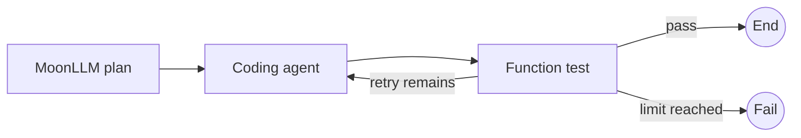

# Moon Agent Graph Runtime テストカバレッジ

## 目的とステータス

このドキュメントは、レビュー済みMVPテスト計画と、`mbt/package/moon-agent-graph`に実装された決定論的ネイティブテストスイートを調整します。

このスイートはネイティブのみで動作し、プロバイダの認証情報を使用せず、決定論的フェイクまたはローカルプロセスを使用して、パブリックグラフ、ランタイム、ノード、コーディングエージェント、MoonLLM、Codex、OpenCodeの境界をテストします。

この調整時点で、モジュールには106個のMoonBitテストブロックが含まれています：56個のコアテスト、7個のMoonLLMテスト、7個のコーディングエージェントノードテスト、10個の共有テスト、8個のワークフローE2Eテスト、7個のCodexアダプタテスト、11個のOpenCodeアダプタテスト。

以下の識別子は、元の計画からの有用な受け入れトレーサビリティとして残っています。「自動化済み」とは、記述されたパブリック動作を決定論的ネイティブテストが現在カバーしていることを意味します。「延期」とは、その動作がまだ手動または認証情報を必要とするリモートプロバイダでの実行を必要とし、通常のCIでは要求されないことを意味します。

## MoonBitテスト規約

- `*_test.mbt`はパブリックコントラクトと決定論的統合サーフェスに使用します。
- `*_wbtest.mbt`は、パブリックAPIでは適切に観測できないパッケージローカルの配線やデコーダの詳細にのみ使用します。
- 非同期動作には`async test`を使用し、キャンセルエラーを通常の失敗に変換せずに保持します。
- asyncテストは並列に実行される可能性があるため、ネイティブプロセスを所有する各テストは一意の一時ディレクトリとエフェメラルなlocalhostポートを確保します。
- `@testing.eventually`または`@async.with_timeout`でポーリングを制限し、実行順序に依存しません。
- 内部実装の詳細ではなく、型付けされたエラーと観測可能なイベント順序を検査します。
- 実際のリモートモデルと認証情報を必要とするプロバイダのチェックは通常のCIの対象外とします。

## テストレイヤー

| レイヤー | 現在の決定論的テスト範囲 | 通常のCI |
|---|---|---:|
| コアユニットとランタイム | ID、グラフコンパイル、ノード、イベント、リソース、ライフサイクル、逐次ランタイム | はい |
| MoonLLMノード | 型付けされたコールバックフェイクとローカルOpenAI互換HTTPサーバ | はい |
| コーディングエージェントノード | フェイクセッションのライフサイクル、スコープ、リトライ、キャンセル、レスポンスデコード | はい |
| Codexアダプタ | ネイティブフェイク実行可能ファイルに対するリポジトリSDK | はい |
| OpenCodeアダプタ | ネイティブフェイクOpenCode HTTPサーバに対するリポジトリSDK | はい |
| ワークフローE2E | 関数、フェイクコーディングエージェント、フェイクMoonLLM、ルーティング、リトライ、失敗、キャンセルグラフ | はい |
| 実際のリモートエージェントE2E | 実際のプロバイダ認証情報、モデル動作、ユーザーワークスペースへの影響 | 手動、延期 |

## 共有決定論的フィクスチャ

`testing`パッケージは現在、以下のフィクスチャとヘルパーを提供しています：

- `scripted_node` — ノードのパブリックコンテキストと状態入力を記録します。
- `scripted_router` — ルーターの状態と完了入力を記録します。
- `recording_reducer` — 状態とパッチ入力を記録します。
- `recording_event_sink` — 出力された正確な`GraphEvent`シーケンスを記録します。
- `fake_coding_agent` — オープン、リクエスト、セッションID、クローズ順序を記録し、注入されたオープンまたは実行エラーを任意に発生させます。
- `fake_moonllm_invoke` — 型付けされた`@llm.ChatRequest`値を記録し、注入されたエラーを任意に発生させます。
- `temporary_workspace` — 一意の一時ルートを作成し、`close`によって冪等に削除します。
- `eventually` — 必須の制限タイムアウト付きで非同期述語をポーリングします。
- `process_is_running`および`localhost_port_is_open` — プロダクトテストでのシェル解析なしに、ネイティブプロセスとlocalhostポートのクリーンアップを観測します。

フィクスチャの状態は1つのテストに属します。子タスクを調整するテストは、1つのオーナータスク内でミューテーションを保持するか、プロダクション境界が公開する非同期ミューテックスを使用します。

## 計画IDトレーサビリティ

| IDファミリー | 現在のステータス | 決定論的エビデンス |
|---|---|---|
| `ID-*` | 自動化済み | `src/core/identifiers_test.mbt`のパース、等価性、ハッシュマップ使用、テキスト変換、空IDエラー |
| `GRAPH-*` | 自動化済み | `src/core/graph_test.mbt`の重複、欠落、不明、循環、到達不能、スナップショットコピー、未宣言ルートの動作 |
| `FN-*`, `ROUTER-*`, `REDUCER-*`, `EVENT-*` | 自動化済み | `src/core/*_test.mbt`の関数ノードコンテキストとキャンセル、リデューサ/ルーターの順序、ライフサイクルイベント、シンク障害分離 |
| `RESOURCE-*` | 自動化済み | `src/core/resources*_test.mbt`の実行/ノード所有権、キャッシュ動作、逆順クローズ、クローズワンス、集約クリーンアップエラー、タイムアウト、キャンセル保護 |
| `RUNTIME-*` | 自動化済み | `src/core/runtime*_test.mbt`の逐次実行、状態還元、ルート契約、明示的失敗、ステップ制限、タイムアウト、キャンセル、クリーンアップ構成、呼び出し分離 |
| `LLM-*` | リモートプロバイダ動作以外は自動化済み | `src/moonllm/*_test.mbt`のコールバック境界、型付けされたリクエストキャプチャ、レスポンスデコード、使用量アーティファクト、ビルド/デコード/呼び出しエラー、キャンセル、ローカルモックHTTP統合 |
| `AGENT-*`, `AGENTNODE-*` | 自動化済み | `src/coding_agent/*_test.mbt`および`src/testing/fakes*_test.mbt`の共通コントラクト、実行/ノードスコープ、継続、リトライ、失敗フェーズ、キャンセル、クローズセマンティクス |
| `CODEX-*` | ローカルアダプタ境界は自動化済み | `src/integrations/codex/*_test.mbt`のフェイクネイティブ実行可能ファイルがマッピングされた入力、継続再利用、SDK失敗伝播、キャンセル、クリーンアップをカバー |
| `OPENCODE-*` | ローカルアダプタ境界は自動化済み | `src/integrations/opencode/*_test.mbt`のフェイク実行可能ファイル/サーバがセッションとメッセージの成功、HTTP失敗、キャンセル復元、個別のオープン、PID/ポートクリーンアップ、クローズ済みセッション動作をカバー |
| `E2E-*` | 決定論的グラフワークフローは自動化済み | `src/e2e/*_test.mbt`のMoonLLM計画-関数検証、関数、エージェントリトライ、ブランチ選択、制限付きループ、計画失敗、キャンセルワークフロー |
| 実際のプロバイダ固有の動作 | 延期 | 明示的な認証情報と使い捨てワークスペースで手動実行。通常のCIの対象外 |

## コアとランタイムのカバレッジ

コアスイートは、識別子の検証、グラフコンパイル、コンパイル済みグラフのスナップショット分離、ノードコンテキスト構築、同期シンク順序、リソース所有権、逐次ランタイム動作を証明します。

ランタイムテストは、成功する1ノードおよび複数ノードのグラフ、リデューサ-前-ルーターの順序、パッチなし動作、未宣言ターゲットの拒否、明示的な`Route::Fail`、無効なオプション、正確なステップ制限試行回数、タイムアウト、キャンセル、クリーンアップエラーの構成、分離された繰り返し呼び出しをカバーします。

期待される成功ライフサイクルは以下の通りです：

```text
RunStarted
NodeStarted
NodeCompleted
StateUpdated（パッチが存在する場合）
RouteSelected
RunCompleted
```

失敗テストとキャンセルテストは、`RunStarted`の後に正確に1つの終端イベントがあることを追加で検証します。

## MoonLLMノードのカバレッジ

`src/moonllm/llm_node_test.mbt`は、状態から構築された型付けされた`ChatRequest`、1つの非同期フェイク呼び出し、デコードされたパッチ/値/アーティファクト出力、使用量メタデータ、ランタイム状態適用、ビルダー失敗、保持された`LLMError`、リデューサ実行なしのデコーダ失敗、一時停止されたコールバックのキャンセルを含む、狭い`LlmNodeSpec`境界をカバーします。

`src/moonllm/llm_node_integration_test.mbt`は、ローカルのOpenAI互換モックサーバと実際のMoonLLMクライアントを使用して、リクエストマッピング、レスポンスデコード、状態更新、使用量アーティファクトの保持を検証します。

現在のチャット補完境界を超えた構造化出力の動作は、将来のアダプタ固有のテストであり、実装済みの主張ではありません。

## コーディングエージェントとアダプタのカバレッジ

コーディングエージェントノードテストは、決定論的セッションを使用して、実行スコープの再利用、ノードスコープのクローズ動作、ビルダーおよび実行失敗の境界、デコーダ失敗時の状態更新なし、継続伝播、失敗したオープン後のリトライ、呼び出し元キャンセルのクリーンアップを検証します。

Codexアダプタ統合は、フェイクネイティブ実行可能ファイルとリポジトリSDKを使用します。オプションとワークスペースのマッピング、開始と再開の継続動作、ストリームされたサマリーと変更ファイルのマッピング、`turn.failed`の伝播、キャンセル、サブプロセスの終了、クリーンアップを検証します。

OpenCodeアダプタ統合は、公式の準備完了シェイプを出力し、ローカルセッションエンドポイントをホストするフェイク実行可能ファイルを使用します。セッション作成、1つのセッションを通じた繰り返しメッセージ、環境/設定/リクエストのマッピング、正確な`@moonllm.ApiError`値としてのローカルHTTP 503および500の伝播、失敗したセッション作成後のメッセージリクエストなし、パブリッククローズ後の`SessionClosed`を検証します。

OpenCodeのキャンセルは、意図的に明示的な復元契約を持っています：進行中のメッセージリクエストをキャンセルすることで、メッセージレスポンスが所有サーバが明示的なクリーンアップに利用可能なまま終了しないことを証明します。テストはその後、パブリック`session.close()`を呼び出し、サーバPIDが停止していること、バインドされたlocalhostポートが閉じていること、一時フィクスチャルートが削除されていることを証明します。独立したオープンは、1つのクローズが別のセッションのサーバを停止しないことを証明します。

OpenCode SDKの専用起動テストは、不正な準備完了出力、起動タイムアウト、早期プロセス終了をカバーします。これらの起動条件はグラフアダプタテストとして重複されません。

## ワークフローE2Eのカバレッジ

`src/e2e/happy_workflow_test.mbt`は、決定論的な関数のみの順序、型付けされたMoonLLM計画-関数検証パス、Codexラベル付きおよびOpenCodeラベル付きフェイクエージェントワークフローをカバーします。MoonLLM計画-関数パスは、型付けされたリクエストを記録し、計画パッチを適用し、最終状態とライフサイクルを検証し、プロバイダ認証情報を必要としません。リトライワークフローは、実際のアダプタプロセスを必要とせずに、実行スコープのセッション再利用と正確なリクエスト数を証明します。

`src/e2e/routing_failure_test.mbt`は、両方のブランチ入力をカバーし、選択されなかったフェイクエージェントがゼロのオープンとゼロのリクエストを持つことを証明し、正確な制限付きループ試行回数と`StepLimitExceeded`を検証し、注入されたLLM計画失敗がエージェントを開かず、初期ワークフロー状態を変更しないことを証明します。

`src/e2e/cancellation_workflow_test.mbt`は、ブロックされたコーディングエージェントワークフローをキャンセルし、以降のLLMノードが実行されないこと、セッションが1回だけ閉じられること、ランタイムが1つの`RunCancelled`イベントを発行することを証明します。

元の実際のアダプタワークフロー図は、手動受け入れシナリオとして引き続き有用ですが、通常のCIは現在、実際のプロバイダ認証情報やユーザーワークスペースの代わりに決定論的ローカル境界を使用しています。



## ネイティブコマンド

リポジトリルートからコマンドを実行します。

```bash
vp run mbt:fix
vp run mbt:check
vp run mbt:build
vp run mbt:test
```

フォーカスしたテストを開発中は選択ファイルコマンドを使用し、モジュール全体のゲートに依存する前にそのパッケージを実行します。

```bash
moon test mbt/package/moon-agent-graph/src/e2e/routing_failure_test.mbt --target native --deny-warn
moon check mbt/package/moon-agent-graph/src/e2e/routing_failure_test.mbt --target native --deny-warn
moon test mbt/package/moon-agent-graph/src/e2e --target native --deny-warn
moon test mbt/package/moon-agent-graph/src/integrations/opencode --target native --deny-warn
```

最終的な実装ゲートは、ルートのMoonBitチェック、ビルド、テストタスクを実行します。フォーカスしたテスト結果はそのゲートを代替しません。

## 延期された手動チェック

- 使い捨てアカウントに対して実際のMoonLLMプロバイダを実行し、プロバイダ固有のモデル動作を確認する。
- 使い捨ての実際のワークスペースに対してCodexとOpenCodeを実行し、インストールされたバージョンでの外部プロセス動作を検証する。
- 将来のノードが`ChatRequest`と`ChatResponse`以外のリクエスト/レスポンスペアを使用する場合、構造化出力APIを検証する。
- 認証情報をテストアーティファクトに記録せずに、実際のプロバイダエラーペイロードに対する認証情報の編集レビューを実行する。

## 受け入れ基準

- すべての決定論的ネイティブテストがルートMoonBitゲートを通過する。
- プロセスを所有するすべての失敗またはクローズパスが、対応するローカルサーフェスでのPID、ポート、一時ルートのクリーンアップを証明する。
- キャンセルテストは実際のタスクキャンセルを使用し、キャンセルセマンティクスを保持する。
- SDKが公開していないSDKフィールドをテストがでっち上げない。
- 通常のCIはプロバイダ認証情報を必要としない。
- 延期されたリモートチェックは、認証情報を必要とするテスト環境が意図的に追加されるまで、明示的に手動のままとする。

## 参考文献

- [MoonBit非同期プログラミングと非同期テスト](https://docs.moonbitlang.com/en/latest/language/async-experimental.html)
- [MoonBitビルドシステムのテストファイル規約](https://docs.moonbitlang.com/en/latest/toolchain/moon/tutorial.html)
- [MoonBitパッケージテストのインポート](https://docs.moonbitlang.com/en/latest/toolchain/moon/package.html)
- [moonbitlang/asyncパッケージドキュメント](https://mooncakes.io/docs/moonbitlang/async)