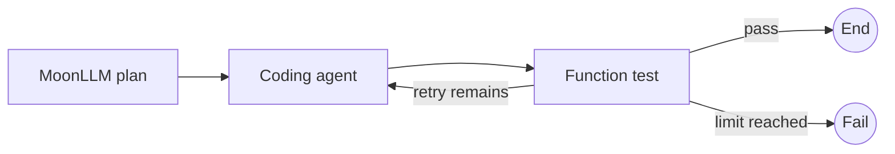

# Moon Agent Graph Runtime Test Coverage

## Purpose and Status

This document reconciles the reviewed MVP test plan with the deterministic native test suite implemented in `mbt/package/moon-agent-graph`.

The suite is native-only, uses no provider credentials, and exercises public graph, runtime, node, coding-agent, MoonLLM, Codex, and OpenCode boundaries with deterministic fakes or local processes.

At this reconciliation point, the module contains 106 MoonBit test blocks: 56 core tests, 7 MoonLLM tests, 7 coding-agent-node tests, 10 shared-testing tests, 8 workflow E2E tests, 7 Codex-adapter tests, and 11 OpenCode-adapter tests.

The identifiers below remain useful acceptance traceability from the original plan. “Automated” means a deterministic native test currently covers the described public behavior. “Deferred” means the behavior still needs a manual or credentialed remote-provider exercise and is not claimed by normal CI.

## MoonBit Test Conventions

- Use `*_test.mbt` for public contracts and deterministic integration surfaces.
- Use `*_wbtest.mbt` only for package-local wire or decoder details that cannot be observed adequately through the public API.
- Use `async test` for async behavior and preserve cancellation errors instead of converting them into ordinary failures.
- Assume async tests may run in parallel, so every native-process test owns a unique temporary directory and ephemeral localhost port.
- Bound polling with `@testing.eventually` or `@async.with_timeout` and do not depend on execution order.
- Inspect typed errors and observable event order rather than internal implementation details.
- Keep real remote-model and credentialed-provider checks outside normal CI.

## Test Layers

| Layer | Current deterministic surface | Normal CI |
|---|---|---:|
| Core unit and runtime | IDs, graph compilation, nodes, events, resources, lifecycle, sequential runtime | Yes |
| MoonLLM node | Typed callback fake plus local OpenAI-compatible HTTP server | Yes |
| Coding-agent node | Fake session lifecycle, scope, retry, cancellation, and response decoding | Yes |
| Codex adapter | Repository SDK against a native fake executable | Yes |
| OpenCode adapter | Repository SDK against native fake OpenCode HTTP servers | Yes |
| Workflow E2E | Function, fake coding-agent, fake MoonLLM, routing, retry, failure, and cancellation graphs | Yes |
| Real remote-agent E2E | Actual provider credentials, model behavior, and user workspace effects | Manual and deferred |

## Shared Deterministic Fixtures

The `testing` package currently provides the following fixtures and helpers:

- `scripted_node` records a node’s public context and state inputs.
- `scripted_router` records router state and completion inputs.
- `recording_reducer` records state and patch inputs.
- `recording_event_sink` records the exact emitted `GraphEvent` sequence.
- `fake_coding_agent` records opens, requests, session IDs, and close order while optionally raising injected open or execute errors.
- `fake_moonllm_invoke` records typed `@llm.ChatRequest` values while optionally raising an injected error.
- `temporary_workspace` creates a unique temporary root and removes it idempotently through `close`.
- `eventually` polls an async predicate with a mandatory bounded timeout.
- `process_is_running` and `localhost_port_is_open` observe native process and localhost-port cleanup without shell parsing in product tests.

Fixture state belongs to one test. Tests that coordinate child tasks keep mutation in one owner task or use the async mutex exposed by the production boundary.

## Plan ID Traceability

| ID family | Current status | Deterministic evidence |
|---|---|---|
| `ID-*` | Automated | Parsing, equality, hash-map use, text conversion, and empty-ID errors in `src/core/identifiers_test.mbt` |
| `GRAPH-*` | Automated | Duplicate, missing, unknown, cyclic, unreachable, snapshot-copy, and undeclared-route behavior in `src/core/graph_test.mbt` |
| `FN-*`, `ROUTER-*`, `REDUCER-*`, `EVENT-*` | Automated | Function-node context and cancellation, reducer/router ordering, lifecycle events, and sink failure isolation in `src/core/*_test.mbt` |
| `RESOURCE-*` | Automated | Run/node ownership, cache behavior, reverse close order, close-once, aggregated cleanup errors, timeout, and cancellation protection in `src/core/resources*_test.mbt` |
| `RUNTIME-*` | Automated | Sequential execution, state reduction, route contract, explicit failure, step limit, timeout, cancellation, cleanup composition, and invocation isolation in `src/core/runtime*_test.mbt` |
| `LLM-*` | Automated except remote-provider behavior | Callback boundary, typed request capture, response decoding, usage artifact, build/decode/invoke errors, cancellation, and local mock HTTP integration in `src/moonllm/*_test.mbt` |
| `AGENT-*`, `AGENTNODE-*` | Automated | Common contract, run/node scope, continuation, retry, failure phase, cancellation, and close semantics in `src/coding_agent/*_test.mbt` and `src/testing/fakes*_test.mbt` |
| `CODEX-*` | Automated for local adapter boundary | Fake native executable covers mapped input, continuation reuse, SDK failure propagation, cancellation, and cleanup in `src/integrations/codex/*_test.mbt` |
| `OPENCODE-*` | Automated for local adapter boundary | Fake executable/server covers session and message success, HTTP failures, cancellation restoration, distinct opens, PID/port cleanup, and closed-session behavior in `src/integrations/opencode/*_test.mbt` |
| `E2E-*` | Automated for deterministic graph workflows | MoonLLM-plan-to-function verification, function, agent retry, branch selection, bounded loop, planning failure, and cancellation workflows in `src/e2e/*_test.mbt` |
| Real provider-specific behavior | Deferred | Run manually with explicit credentials and a disposable workspace; it is not part of normal CI |

## Core and Runtime Coverage

The core suite proves identifier validation, graph compilation, compiled-graph snapshot isolation, node context construction, synchronous sink ordering, resource ownership, and sequential runtime behavior.

The runtime tests cover successful one-node and multi-node graphs, reducer-before-router ordering, no-patch behavior, undeclared target rejection, explicit `Route::Fail`, invalid options, exact step-limit attempts, timeout, cancellation, cleanup error composition, and isolated repeated invocation.

The expected successful lifecycle remains:

```text
RunStarted
NodeStarted
NodeCompleted
StateUpdated, when a patch exists
RouteSelected
RunCompleted
```

Failure and cancellation tests additionally verify exactly one terminal event after `RunStarted`.

## MoonLLM Node Coverage

`src/moonllm/llm_node_test.mbt` covers the narrow `LlmNodeSpec` boundary with a typed `ChatRequest` built from state, one async fake invocation, decoded patch/value/artifact output, usage metadata, runtime state application, builder failure, preserved `LLMError`, decoder failure without reducer execution, and cancellation of a paused callback.

`src/moonllm/llm_node_integration_test.mbt` uses a local OpenAI-compatible mock server and the real MoonLLM client to verify request mapping, response decoding, state update, and usage-artifact preservation.

Structured-output behavior beyond the current chat-completion boundary remains a future adapter-specific test, not an implemented claim.

## Coding-Agent and Adapter Coverage

The coding-agent-node tests use deterministic sessions to verify run-scoped reuse, node-scoped close behavior, builder and execute failure boundaries, decoder failure without state update, continuation propagation, retry after failed open, and caller cancellation cleanup.

The Codex adapter integration uses a fake native executable and the repository SDK. It verifies option and workspace mapping, start-versus-resume continuation behavior, streamed summary and changed-file mapping, `turn.failed` propagation, cancellation, subprocess termination, and cleanup.

The OpenCode adapter integration uses a fake executable that prints the official readiness shape and hosts local session endpoints. It verifies session creation, repeated messages through one session, environment/config/request mapping, local HTTP 503 and 500 propagation as exact `@moonllm.ApiError` values, no message request after failed session creation, and `SessionClosed` after a public close.

OpenCode cancellation has a deliberately explicit restoration contract: cancelling an in-flight message request proves the message response does not finish while the owned server remains available for explicit cleanup; the test then calls public `session.close()` and proves the server PID is dead, the bound localhost port is closed, and the temporary fixture root is removed. Independent opens prove that one close does not stop another session’s server.

The OpenCode SDK’s dedicated startup tests cover malformed readiness output, startup timeout, and early process exit. Those startup conditions are not duplicated as graph-adapter tests.

## Workflow E2E Coverage

`src/e2e/happy_workflow_test.mbt` covers deterministic function-only order, a typed MoonLLM-plan-to-function-verify path, and Codex-labelled and OpenCode-labelled fake-agent workflows. The MoonLLM-plan-to-function path records the typed request, applies the plan patch, verifies the final state and lifecycle, and requires no provider credentials. The retry workflow proves run-scoped session reuse and exact request count without requiring a real adapter process.

`src/e2e/routing_failure_test.mbt` covers both branch inputs, proves the unselected fake agent has zero opens and zero requests, verifies exact bounded-loop attempts and `StepLimitExceeded`, and proves an injected LLM planning failure leaves the agent unopened and the initial workflow state unchanged.

`src/e2e/cancellation_workflow_test.mbt` cancels a blocked coding-agent workflow and proves no later LLM node runs, the session closes once, and the runtime emits one `RunCancelled` event.

The original real-adapter workflow diagrams remain useful as manual acceptance scenarios, but normal CI currently uses deterministic local boundaries instead of real provider credentials or a user workspace.



## Native Commands

Run commands from the repository root.

```bash
vp run mbt:fix
vp run mbt:check
vp run mbt:build
vp run mbt:test
```

Use a selected-file command while developing a focused test, then run its package before relying on a module-wide gate.

```bash
moon test mbt/package/moon-agent-graph/src/e2e/routing_failure_test.mbt --target native --deny-warn
moon check mbt/package/moon-agent-graph/src/e2e/routing_failure_test.mbt --target native --deny-warn
moon test mbt/package/moon-agent-graph/src/e2e --target native --deny-warn
moon test mbt/package/moon-agent-graph/src/integrations/opencode --target native --deny-warn
```

The final implementation gate runs the root MoonBit check, build, and test tasks. A focused test result does not replace that gate.

## Deferred Manual Checks

- Run a real MoonLLM provider against a disposable account and confirm provider-specific model behavior.
- Run Codex and OpenCode against disposable real workspaces and verify their external process behavior under the installed versions.
- Validate structured-output APIs if a future node uses a request/response pair other than `ChatRequest` and `ChatResponse`.
- Perform credential-redaction review against real provider error payloads without recording credentials in test artifacts.

## Acceptance Criteria

- All deterministic native tests pass through the root MoonBit gate.
- Every process-owning failure or close path proves PID, port, and temporary-root cleanup on its matching local surface.
- Cancellation tests use real task cancellation and preserve cancellation semantics.
- No test fabricates SDK fields that the SDK does not expose.
- Normal CI requires no provider credentials.
- Deferred remote checks remain explicitly manual until a credentialed test environment is intentionally added.

## References

- [MoonBit async programming and async tests](https://docs.moonbitlang.com/en/latest/language/async-experimental.html)
- [MoonBit build-system test file conventions](https://docs.moonbitlang.com/en/latest/toolchain/moon/tutorial.html)
- [MoonBit package test imports](https://docs.moonbitlang.com/en/latest/toolchain/moon/package.html)
- [moonbitlang/async package documentation](https://mooncakes.io/docs/moonbitlang/async)
