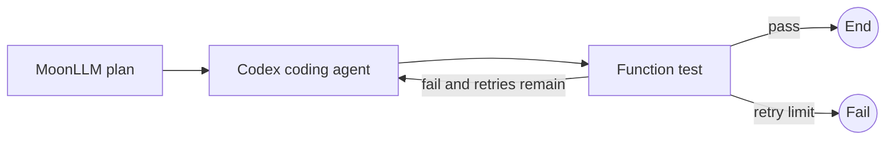

# Moon Agent Graph Runtime Test Plan

## Purpose

This document defines the minimum unit, integration, and end-to-end coverage for the reviewed native async MVP.

The plan tests public behavior first and keeps SDK-dependent tests deterministic.

Real remote-model calls are manual and are not part of normal CI.

## MoonBit Test Conventions

- Use `*_test.mbt` black-box tests for public contracts.
- Use `*_wbtest.mbt` only for private state-machine and cleanup details that cannot be observed through public APIs.
- Use `async test` for async behavior.
- Assume async tests may run in parallel.
- Allocate a unique temporary directory and port for every process test.
- Never depend on test execution order.
- Use `@async.with_timeout` around waits that could otherwise hang.
- Use caller task cancellation to test cancellation behavior.
- Preserve the original raised error and inspect its concrete `suberror` shape.
- Do not add a second cancellation-token fake.

## Test Layers

| Layer | Purpose | Normal CI |
|---|---|---:|
| Unit | One public component with callbacks or fakes | Yes |
| Runtime integration | Compiled graph, reducer, runtime, events, and resource store | Yes |
| MoonLLM adapter integration | Real MoonLLM client against a local mock HTTP server | Yes |
| Codex adapter integration | Real repository SDK against a fake Codex executable | Yes |
| OpenCode adapter integration | Real repository SDK against a fake OpenCode executable and local endpoint | Yes |
| Workflow E2E | Full graph with deterministic local boundaries | Yes |
| Real remote-agent E2E | Actual provider credentials and model | Manual |

## Shared Test Fixtures

The `testing` package provides:

- `scripted_node`
- `scripted_router`
- `recording_reducer`
- `recording_event_sink`
- `fake_coding_agent`
- `fake_coding_agent_session`
- `fake_moonllm_invoke`
- `temporary_workspace`
- `eventually` with a mandatory timeout
- process and port leak assertions

Fixture state belongs to one test.

If a fixture is accessed by multiple child tasks, protect its mutable state with the async mutex or confine all mutation to one owner task.

## Identifier Tests

| ID | Scenario | Expected result |
|---|---|---|
| ID-001 | Parse a non-empty node ID | Value is created |
| ID-002 | Parse an empty node ID | `EmptyId` is raised |
| ID-003 | Compare IDs created from equal strings | Equal |
| ID-004 | Compare IDs created from different strings | Not equal |
| ID-005 | Use an ID as a `Map` key | Value is retrieved |
| ID-006 | Convert an ID to text | Original text is returned |

## Graph Definition and Compilation Tests

| ID | Scenario | Expected result |
|---|---|---|
| GRAPH-001 | Add one node, router, and entry | Compilation succeeds |
| GRAPH-002 | Add the same node ID twice | `DuplicateNode` |
| GRAPH-003 | Add two routers for one node | `DuplicateRouter` |
| GRAPH-004 | Compile without an entry | `MissingEntry` |
| GRAPH-005 | Entry references an unknown node | `UnknownEntry` |
| GRAPH-006 | Node has no router | `MissingRouter` |
| GRAPH-007 | Router declares an unknown destination | `UnknownDestination` |
| GRAPH-008 | Graph contains a node unreachable from entry | `UnreachableNode` |
| GRAPH-009 | A routes to B and B routes to A | Compilation succeeds |
| GRAPH-010 | Single node routes to `End` | Compilation succeeds |
| GRAPH-011 | Mutate definition after compilation | Compiled snapshot is unchanged |
| GRAPH-012 | Mutate a returned query collection | Compiled internals are unchanged |
| GRAPH-013 | Router returns an existing but undeclared target | Runtime contract error |

## Function Node Tests

| ID | Scenario | Expected result |
|---|---|---|
| FN-001 | Callback succeeds | Output is returned |
| FN-002 | Callback reads state | Correct state is observed |
| FN-003 | Callback reads run ID, node ID, and step | Correct context is observed |
| FN-004 | Callback raises a domain error | Same error is preserved as runtime cause |
| FN-005 | Execute once | Callback count is one |
| FN-006 | Executing task is cancelled during async I/O | Cancellation propagates |

## Router Tests

| ID | Scenario | Expected result |
|---|---|---|
| ROUTER-001 | Condition selects A | `To(A)` |
| ROUTER-002 | Condition selects B | `To(B)` |
| ROUTER-003 | Completion condition holds | `End` |
| ROUTER-004 | Domain failure condition holds | `Fail(message)` |
| ROUTER-005 | Router raises | Runtime wraps the error with node and step |
| ROUTER-006 | Router reads node completion value | Expected route |
| ROUTER-007 | Router returns undeclared target | `RouteContractViolated` |
| ROUTER-008 | Router callback has no async effect | Type and lint checks stay clean |

## Reducer Tests

| ID | Scenario | Expected result |
|---|---|---|
| REDUCER-001 | Apply a set-value patch | New state contains the value |
| REDUCER-002 | Apply an increment patch | Counter increments once |
| REDUCER-003 | Apply an invalid patch | Domain error is raised |
| REDUCER-004 | Apply equal state and patch twice | Equal results |
| REDUCER-005 | Apply patch after node completion | Router observes reduced state |

## Event Sink Tests

| ID | Scenario | Expected result |
|---|---|---|
| EVENT-001 | Emit three events | Recorder preserves order |
| EVENT-002 | Sink callback raises | Run continues |
| EVENT-003 | Successful one-node run | Exact lifecycle sequence |
| EVENT-004 | Node failure | `RunFailed` is terminal |
| EVENT-005 | Caller cancellation | `RunCancelled` is terminal |
| EVENT-006 | Cleanup failure | One terminal failure event |

The expected successful sequence is:

```text
RunStarted
NodeStarted
NodeCompleted
StateUpdated, when a patch exists
RouteSelected
RunCompleted
```

## Resource Store Tests

| ID | Scenario | Expected result |
|---|---|---|
| RESOURCE-001 | Acquire one run-scoped session twice | Open once and return same session |
| RESOURCE-002 | Acquire one node-scoped session twice in separate attempts | Open twice |
| RESOURCE-003 | Session open raises | Nothing is cached |
| RESOURCE-004 | Close all run resources | Every session closes |
| RESOURCE-005 | Close all twice | Session close is invoked once |
| RESOURCE-006 | First close raises | Remaining sessions still close |
| RESOURCE-007 | Multiple resources close | Reverse acquisition order |
| RESOURCE-008 | Release one node | Only that node's scoped sessions close |
| RESOURCE-009 | Run task is cancelled during close | Protected cleanup completes or hits its hard timeout |
| RESOURCE-010 | Cleanup timeout expires | Timeout is retained as cleanup failure |

The OpenCode lifecycle test must prove that server close occurs before the owning task-group body returns.

## Runtime Unit Tests

| ID | Scenario | Expected result |
|---|---|---|
| RUNTIME-001 | Entry routes to end | One node and successful result |
| RUNTIME-002 | A routes to B, then end | A and B execute in order |
| RUNTIME-003 | Node returns a patch | Reducer runs once |
| RUNTIME-004 | Patch changes route condition | Router sees reduced state |
| RUNTIME-005 | Node raises | Later router and nodes do not run |
| RUNTIME-006 | Reducer raises | Router does not run |
| RUNTIME-007 | Router raises | Next node does not run |
| RUNTIME-008 | Self-loop never ends | Exactly `max_steps` attempts, then failure |
| RUNTIME-009 | Invalid zero step limit | Run configuration error before entry |
| RUNTIME-010 | Explicit `Route::Fail` | Explicit runtime failure |
| RUNTIME-011 | Node timeout | Node task is cancelled and timeout is raised |
| RUNTIME-012 | Caller cancels during node execution | Cancellation is re-raised after cleanup |
| RUNTIME-013 | Success plus cleanup failure | Cleanup failure becomes run failure |
| RUNTIME-014 | Primary and cleanup both fail | Primary error remains primary |
| RUNTIME-015 | Node returns no patch | Reducer is not called |
| RUNTIME-016 | Two runs use the same compiled graph | State and resources are isolated |

## MoonLLM Node Tests

The unit boundary is the `invoke` callback in `LlmNodeSpec`.

| ID | Scenario | Expected result |
|---|---|---|
| LLM-001 | Request build and invoke succeed | Decoded output |
| LLM-002 | Request builder raises | Invoke callback is not called |
| LLM-003 | Invoke raises `LLMError` | Runtime preserves it as cause |
| LLM-004 | Decoder raises | State is not updated |
| LLM-005 | State determines prompt | Fake records expected request |
| LLM-006 | Response includes usage | Artifact or event preserves usage |
| LLM-007 | Task is cancelled during request | MoonLLM request is cancelled |
| LLM-008 | Node timeout expires | Request task terminates |

## Coding-Agent Contract Tests

| ID | Scenario | Expected result |
|---|---|---|
| AGENT-001 | Open succeeds | Session trait object returned |
| AGENT-002 | Open raises | No session cached |
| AGENT-003 | Execute succeeds | Common response returned |
| AGENT-004 | Execute raises | Error preserved |
| AGENT-005 | Close requested twice | Adapter cleanup happens once |
| AGENT-006 | Execute after close | Session-closed error |
| AGENT-007 | Two sessions | Continuation state is isolated |
| AGENT-008 | Cancel executing task | Adapter terminates in-flight process work |

## Coding-Agent Node Tests

| ID | Scenario | Expected result |
|---|---|---|
| AGENTNODE-001 | First run-scoped execution | Open once, execute once |
| AGENTNODE-002 | Two executions in one run | Open once, execute twice |
| AGENTNODE-003 | Node-scoped execution twice | Open twice, close twice |
| AGENTNODE-004 | Open-context builder raises | Session is not opened |
| AGENTNODE-005 | Request builder raises | Session execute is not called |
| AGENTNODE-006 | Execute raises | Coding-agent cause preserved |
| AGENTNODE-007 | Response decoder raises | State is not updated |
| AGENTNODE-008 | Response contains continuation ID | Patch receives expected ID |
| AGENTNODE-009 | Task cancellation during execute | Cancellation propagates and session closes |

## Codex Adapter Tests

Use the same native fake Codex executable pattern already used by `mbt/package/codex-sdk`.

| ID | Scenario | Expected result |
|---|---|---|
| CODEX-001 | Open a new session | New `Thread` |
| CODEX-002 | Resume continuation ID | `resume_thread` receives ID |
| CODEX-003 | Map workspace and additional roots | Correct `ThreadOptions` |
| CODEX-004 | Map approval and sandbox policy | Correct SDK enums |
| CODEX-005 | Successful turn | `Succeeded` response and summary |
| CODEX-006 | `turn.failed` event | Adapter raises with original message |
| CODEX-007 | Thread starts | Continuation ID comes from `Thread::id` |
| CODEX-008 | Cancel during turn | Native Codex subprocess exits |
| CODEX-009 | SDK exposes no reliable change list | Empty `changed_files`, not fabricated data |
| CODEX-010 | Close session | Idempotent after in-flight turn ends |

## OpenCode Adapter Tests

Use a fake executable that announces a unique local URL and implements the required session endpoints.

| ID | Scenario | Expected result |
|---|---|---|
| OPENCODE-001 | Open succeeds | Server starts and session is created |
| OPENCODE-002 | Process spawn fails | Client and session are not created |
| OPENCODE-003 | Readiness times out | Process is terminated and logs removed |
| OPENCODE-004 | Client build fails | Server closes |
| OPENCODE-005 | Session creation fails | Server closes |
| OPENCODE-006 | Execute succeeds | Session message endpoint called once |
| OPENCODE-007 | Two executions in one run | Server start count remains one |
| OPENCODE-008 | Close | Server stops and temporary logs are removed |
| OPENCODE-009 | Close requested twice | Stop occurs once |
| OPENCODE-010 | Cancel during message request | Request terminates and server closes at run end |
| OPENCODE-011 | Server exits between messages | Server-unavailable error |
| OPENCODE-012 | Workspace and policy mapping | Expected server/session request data |
| OPENCODE-013 | OpenCode response contains error | Adapter raises without losing response cause |
| OPENCODE-014 | Task-group body exits | No server process remains |

## Runtime Integration Scenarios

### INT-RUNTIME-001: Sequential Workflow

```text
prepare -> execute -> end
```

Verify node order, accumulated patches, final state, event order, and step count.

### INT-RUNTIME-002: Conditional Branch

```text
check -> success
      -> failure
```

Run both initial-state variants and verify that only the selected node executes.

### INT-RUNTIME-003: Bounded Loop

```text
increment -> route -> increment
                 \-> end
```

Verify exactly three increments and successful completion before the configured limit.

### INT-RUNTIME-004: Step Limit

Run a non-terminating self-loop and verify the exact execution count, terminal event, and cleanup.

### INT-RUNTIME-005: Failure Cleanup

Open a run-scoped fake session, fail a later node, and verify close count one.

### INT-RUNTIME-006: Caller Cancellation

Cancel a task while a function node waits on async I/O and verify cancellation propagation, terminal event, and cleanup.

## Adapter Integration Scenarios

### INT-LLM-001: Chat Completion

Connect a real MoonLLM client to a local OpenAI-compatible mock server and verify request mapping, response decoding, patch application, and route selection.

### INT-LLM-002: Structured Output

Return valid and invalid structured payloads and verify that invalid output does not update state.

### INT-CODEX-001: Native Fake Turn

Connect the adapter to the repository's fake Codex executable and verify a complete turn, continuation ID, and subprocess cleanup.

### INT-CODEX-002: Cancellation

Cancel a long-running fake turn and verify that its subprocess exits.

### INT-OPENCODE-001: Server Lifecycle

Start a fake OpenCode server, create a session, execute two messages, close the run, and verify one start, one stop, and no remaining process or bound port.

### INT-OPENCODE-002: Partial Startup Failures

Exercise spawn failure, malformed readiness output, readiness timeout, client creation failure, and session creation failure.

## End-to-End Workflows

### E2E-001: Plan, Codex, Test



Verify state handoff, Codex continuation reuse, bounded retries, and cleanup.

### E2E-002: Plan, OpenCode, Test

Use the same graph shape with the OpenCode adapter.

Verify one server start for the run, session reuse through the retry loop, and explicit server shutdown.

### E2E-003: Agent Selection

Route to exactly one of Codex or OpenCode from initial state.

Verify that the unselected adapter is never opened.

### E2E-004: Planning Failure

Fail the LLM node before the coding-agent node.

Verify that no workspace session is opened and no workspace file changes.

### E2E-005: Run Cancellation

Cancel while either coding agent is executing.

Verify no later node executes and no child process survives the run.

## Non-Functional Checks

| ID | Scenario | Expected result |
|---|---|---|
| NF-001 | Repeat OpenCode workflow | No process, port, or temporary-log leak |
| NF-002 | Run two graphs concurrently | State, session, workspace, and event IDs are isolated |
| NF-003 | Repeat a function-only graph | Equal final state and route sequence |
| NF-004 | Raise detailed adapter error | Cause survives runtime wrapping |
| NF-005 | Error contains credentials | Display text is redacted |
| NF-006 | Cancel during cleanup | Cleanup finishes or reaches bounded timeout |

## Repository Commands

Run commands from the repository root.

```bash
vp run mbt:fix
vp run mbt:check
vp run mbt:build
vp run mbt:test
```

During implementation, use a focused command only when a file- or package-specific check is necessary.

```bash
moon test --target native mbt/package/moon-agent-graph/src/core
```

The final implementation gate includes the root MoonBit checks and at least one runnable native example.

## Acceptance Criteria

- All unit and deterministic integration tests pass on the native target.
- No async test can hang without an enclosing timeout.
- Cancellation is tested with real task cancellation.
- Every process-owning failure path proves cleanup.
- The OpenCode server is closed before its task-group body returns.
- No test fabricates SDK fields that the SDK does not expose.
- Real provider credentials are not required for normal CI.

## References

- [MoonBit async programming and async tests](https://docs.moonbitlang.com/en/latest/language/async-experimental.html)
- [MoonBit build-system test file conventions](https://docs.moonbitlang.com/en/latest/toolchain/moon/tutorial.html)
- [MoonBit package test imports](https://docs.moonbitlang.com/en/latest/toolchain/moon/package.html)
- [moonbitlang/async package documentation](https://mooncakes.io/docs/moonbitlang/async)
