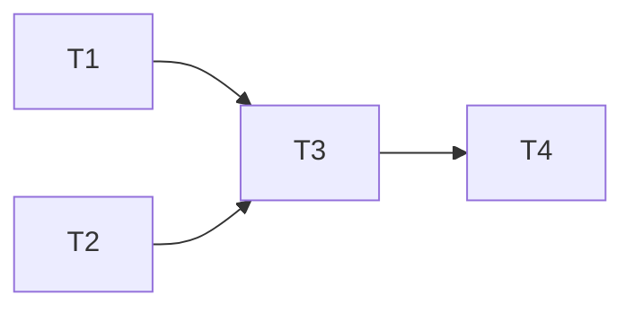

# Reference: `task-plan.md` の書き方

## 目的

`design.md` を**実装可能な粒度のタスク**に分解し、依存関係・並列性・見積りを明示する。Construction 開始後は**不変な計画書**として扱い、実行中の状態追跡は `TODO.md` で行う。

## 作成者 / 作成タイミング

- **作成者:** `planner` Specialist（単一インスタンス）
- **作成ステップ:** Inception Step 4 (Task Decomposition)
- **承認:** ユーザー承認必須（実装開始の合意ゲート）
- **変更:** 原則変更しない。Construction 中に発見された追加タスクは `TODO.md` 側に追記（`task-plan.md` 冒頭に差分理由を記録）

## ファイル位置

`docs/ai-dlc/<identifier>/task-plan.md`

## 各セクションの書き方

### 前提

Intent Spec と Design Document の前提を簡潔に再掲する（読み手が他ドキュメントを開かなくても大筋を把握できるように）。

### タスク一覧

各タスクに以下を明示:

- **概要:** 1–2 文で何をするか
- **成果物:** どのファイルが追加・変更されるか（具体的にパス）
- **依存タスク:** 先行して完了すべきタスク ID（なければ「なし」と書く）
- **並列可否:** yes / no。他タスクと同時実行できるか
- **見積り規模:** プロジェクト規約に従う（S/M/L 等）
- **テスト追加方針:** ユニット / 統合 / E2E のどれを追加するか、カバレッジの方針
- **設計ドキュメント参照箇所:** `design.md` の該当章節

### 依存グラフ

Mermaid 図で依存関係を可視化:

### 並列実行可能グループ (Wave)

Construction Step 5 で Main が並列起動単位として参照:

- Wave 1（起点）: T1, T2
- Wave 2: T3（T1, T2 完了後）
- Wave 3: T4, T5（T3 完了後、並列実行可）

### リスク / 想定される Blocker

想定外の事象が起きそうな箇所を予測し、対応方針のヒントを残す。

## タスク粒度のガイド

| ✅ よい | ❌ 悪い |
|-------|-------|
| 1 implementer で数時間〜1 日で完遂可 | 複数日規模の巨大タスク |
| 成果物ファイルが特定可能 | 「〜周りを整える」のような曖昧タスク |
| テスト追加方針が決められる | テストが考えられないほど漠然としている |
| 依存関係が非循環 | タスク間の依存がループしている |

## 品質基準

| ✅ よい | ❌ 悪い |
|-------|-------|
| タスクが完全に互いに排他的（責任範囲が重ならない） | タスク間で同じファイルを編集する |
| 並列起動可能な Wave が識別されている | すべて直列で並列機会が活用されていない |
| 設計ドキュメント参照が章節レベルで具体的 | 「`design.md` を見よ」のような粗い参照 |
| リスクを事前に列挙している | リスク欄が空白 |

## 関連成果物

- **入力:** `design.md` / `intent-spec.md`
- **出力先:** `TODO.md`（Main が開始時に生成）、`implementer` 起動時の入力
- **不変性:** 確定後は書き換えない。Construction 中の追加タスクは `TODO.md` 側で管理
