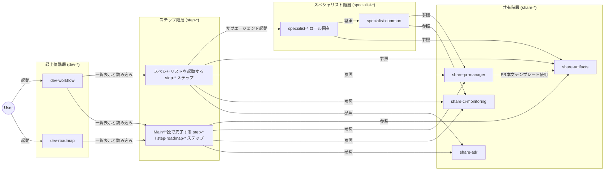
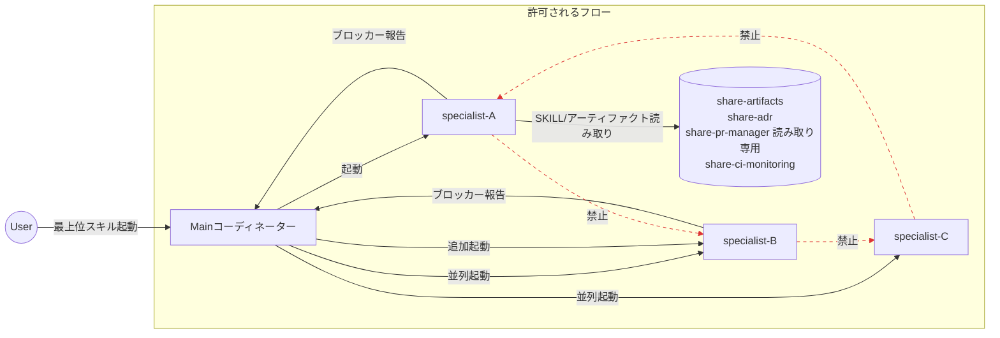

# dev-workflow

Claude Code向けマルチエージェント開発ワークフロープラグイン。

Mainコーディネーターがゲート制御されたアーティファクト駆動型ライフサイクルを駆動します。一部のステップでは専門サブエージェントを起動します（並列処理、コンテキスト分離、または独立した視点が必要な場合）。他のステップはMain単独で完了します。2つの最上位スキルがエントリーポイントを提供します：

- **`dev-workflow`** — 戦術レイヤー。インテントから検証済みコードまでの1サイクル（1つのIntent Spec、通常1 PRサイズの増分）を、フラットな9ステップライフサイクル（`Intent Clarification` → `Research` → `Design` → `QA Design` → `Task Decomposition` → `Implementation` → `External Review` → `Validation` → `Retrospective`）として実行します。
- **`dev-roadmap`** — 戦略レイヤー。複数の`dev-workflow`サイクルを、4ステップ（`Roadmap Intent` → `Milestone Decomposition` → `Execution` → `Roadmap Retrospective`）で1つの大規模な取り組みに束ねます。`dev-roadmap`は`dev-workflow`サイクルを自動起動しません — マイルストーンの実行はユーザーが手動で開始し、実行中の各サイクルは`roadmap-progress.yaml`を自律的に更新します。

External Reviewは、6つの側面（`security`、`performance`、`readability`、`test-quality`、`api-design`、`holistic`）にわたって並行して`reviewer`スペシャリストを実行します。各ステップには独自の承認ゲート、終了条件、および明示的なロールバックルールがあります。ステップの上位に「フェーズ」という抽象化はありません。

---

## スキル階層モデル

スキルは必須の命名プレフィックスを持つ4つの階層に編成されています。各階層には単一の明確な責任があり、コンテンツは正確に1つの階層に属します。

### 階層定義

| 階層 | プレフィックス | 対象読者 | 配置するもの | 配置しないもの |
| -------------- | -------------- | ----------------------- | ----------------------------------------------------------------------------------------------------------------------------------------------------------------------------------------------------- | ------------------------------------------------------------------------------------------------------------- |
| **最上位** | `dev-*` | ユーザー（起動エントリ） | トリガーキーワード、ロール定義、ワークフロー図、ステップ順序、ワークフロー全体に適用される基本原則、セッション再開プリアンブル | ステップ終了条件、ロールバック詳細、スペシャリスト入力契約、PR/CIコマンド詳細、アーティファクトテンプレート |
| **ステップ** | `step-*` | Mainコーディネーター | ステップの目的、Mainの手順、期待されるアーティファクト、**終了条件（CI PASS行を含む）**、ゲートタイプ、失敗モード/ロールバックターゲット、このステップのコミット規約、並列性に関する注意事項 | スペシャリストロール内部、PR/CIコマンド構文、アーティファクトフォーマット仕様、ステップ間ロールバック概要 |
| **スペシャリスト** | `specialist-*` | サブエージェント/チームメイト | ロール固有の入力契約、作業手順、失敗モード、スコープ境界。`specialist-common`は横断的ルール（ライフサイクル、ブロッカープロトコル、gitガードレール、プロジェクトルール優先順位）を保持 | ステップオーケストレーション、スコープ外のアーティファクト書き込み決定 |
| **共有** | `share-*` | 全階層 | 複数のステップとスペシャリストが参照する横断的資産：アーティファクトテンプレートとリファレンス、PRコマンド規約、CI監視プロトコル、ADR規約 | ステップ固有の手順、スペシャリストロール詳細 |

### 最上位階層のコンテンツ規律

`dev-workflow/SKILL.md`と`dev-roadmap/SKILL.md`は軽量に保たれなければなりません。以下のみを記述します：

- 説明/トリガーテスト
- ロール定義（`dev-roadmap` Step 3のMain / Specialist / Observer）
- ワークフロー図とステップ一覧表（各行は`step-*` SKILLにリンク）
- ワークフロー全体の原則（Main中心オーケストレーション、単一進捗情報源、アーティファクト駆動型ハンドオフ、ゲートベース進行、コミットベース再開可能性、ステップ間のクリーンな遷移、アーティファクト＝ゲートレビュー、進行中の質問に対するレポートベース確認、プロジェクトルール優先順位）
- セッション再開プリアンブル（詳細なステップ別再開アクションは対応する`step-*` SKILLに配置）
- 並列性ガイドラインテーブル（ステップごとに1行）
- 「このスキルがカバーしないもの」ポインターリスト

ステップごとの終了条件、ロールバック詳細、コミット例、および単一ステップ内でのみ適用される手順は、**対応する`step-*` SKILLに移動する必要があります**。

### ステップ階層のコンテンツ規律

各`step-*/SKILL.md`は自己完結型です：そのステップに入ったMainが1ファイルを読んで完了に到達できる必要があります。以下を含みます：

- ステップの目的と**起動形式**：スペシャリスト（数と並列性を含む）または「Mainのみ」
- Mainの手順を番号付きリストとして
- `share-artifacts`へのパス付きの期待されるアーティファクト
- **CI PASS行を含む終了条件**（`このステップの完了コミットにリンクされたCI実行が合格している（最大2回の再試行まで、それ以外はshare-ci-monitoringに従いブロッカーにエスカレーション）`）
- ゲートタイプ（ユーザー承認 / Main判断）
- 失敗モードとロールバックターゲット（このステップに根ざしたロールバックのみ；ステップ間の概要は最上位階層に簡易テーブルとして配置）
- このステップのコミットメッセージ例
- 並列性に関する警告（特にStep 6 / Step 7）

ステップは、3つのスペシャリスト正当化理由（並列処理、コンテキスト分離（大規模な入力がMainのウィンドウを占有する）、独立した視点（実装者とは異なる評価者））のいずれも該当しない場合に**Mainのみ**となります。このようなステップでは、`step-*/SKILL.md`が完全な手順を保持します（`specialist-*`は作成されず、`agents/<role>.md`ラッパーも存在しません）。

6つのMainのみのステップは次のとおりです：ワークフローStep 1（Intent Clarification、ユーザーとの対話はMainが直接行うのが最適）、Step 5（Task Decomposition、小規模入力＋単一インスタンス）、Step 9（Retrospective、集約作業）；ロードマップStep 1（Roadmap Intent）、Step 2（Milestone Decomposition）、Step 4（Roadmap Retrospective）。残りのステップは、上記の正当化理由のいずれかのためにスペシャリストを起動します。

`dev-roadmap` Step 3（Execution）は`step-*` SKILLでは**ありません** — `dev-roadmap/SKILL.md`にインラインで記述されるオブザーバーマーカーです。ユーザーが手動で`dev-workflow`サイクルを起動し、抽出すべきスペシャリストや独立した手順がないためです。

### スペシャリスト階層のコンテンツ規律

`specialist-*` SKILLはロールに焦点を当てたままにします。`specialist-common`は以下を定義します：

- ライフサイクル（1スペシャリスト＝1ステップ、ステップ間/セッション間の再利用不可、ステップ内での永続性）
- 入力契約（Mainが渡さなければならないパス）
- 出力契約（アーティファクトの場所＋テンプレート/リファレンス）
- ブロッカープロトコル（作業停止、報告、Mainの指示待ち）
- gitガードレール（`.` / `-A`の禁止、承認なしのforce-push禁止）
- PR/CI権限境界（Main＝書き込み、Specialist＝読み取り専用 — `share-pr-manager` §5に準拠）
- プロジェクトルール優先順位（CLAUDE.mdとプロジェクト固有のスキルが、実装、テスト、コミット、命名に関するワークフローのデフォルトより優先）

各ロール固有の`specialist-*` SKILLは上記を継承し、そのロールに固有のもののみを追加します。`agents/<role>.md`はSKILLを指す薄いラッパーです — コンテンツを重複させないでください。

### 共有階層のコンテンツ規律

`share-*`スキルは、ステップ間やスペシャリスト間で重複する資産を保持します。

| スキル | 責任 | 注目コンテンツ |
| --------------------- | ---------------------------------------------------------------------------------------------------------------------------------------------------------------------------------------------------------------------------------------------------------------------------------------------------------------------- | --------------------------------------------------------------------------------------------------------------------------------------------------------------------------------------------------------------------------------- |
| `share-artifacts` | 18のアーティファクト仕様：`references/<name>.md`（書き方）と`templates/<name>.md`（スケルトン）。1:1のペアリング、3つの文書化された例外（`progress-yaml.md` ↔ `progress.yaml`、`todo.md` ↔ `TODO.md`、`roadmap-progress-yaml.md` ↔ `roadmap-progress.yaml`）。`pr-body.md`（PR説明仕様）を含む。 | `<identifier>` / `<roadmap-id>` / `<aspect>` / `<task-id>` / `<milestone-id>`の命名規則。`docs/workflow/<identifier>/`および`docs/roadmap/<roadmap-id>/`下のストレージレイアウト。 |
| `share-pr-manager` | `gh pr`書き込み/読み取りコマンド、冪等性ガード、権限境界（Main vs Specialist）、`--body-file`必須要件。 | `gh pr create` / `gh pr edit` / `gh pr ready`のパターンと`--head` / `isDraft`事前チェック。`validator`が使用する読み取り側クエリカタログ。PR説明の内容は`share-artifacts/{templates,references}/pr-body.md`に委譲。 |
| `share-ci-monitoring` | `gh run watch`ダブルチェックプロトコル、再試行規律（2回→ブロッカー）、PR説明用のCI状態出力。 | ステップ終了条件はCI PASS行のためにこれを参照。 |
| `share-adr` | Architecture Decision Recordのフォーマットとデュアルモード配置：Generalモード（`docs/adr/`）はロードマップ間またはプロジェクト全体の決定用、Roadmapモード（`docs/roadmap/<roadmap-id>/adr/`）は1つのロードマップ内のサイクル間で共有される決定用。 | モード決定フロー、不変性の原則（書き換え不可；プレフィックスリンケージによる置き換え）。該当する場合に`step-design`と`dev-roadmap`ステップから呼び出される。 |

### 階層間参照ルール

- **最上位 → ステップ**：`dev-workflow` / `dev-roadmap`の各ステップ行は`step-*` SKILLにリンクします。最上位階層はステップごとの終了条件を決して重複させません。
- **ステップ → スペシャリスト**：ステップがスペシャリストを起動する場合、`step-*` SKILLはスペシャリストが必要とする入力をリストする必要があります（これら自体は`specialist-*`で定義されます）。Mainのみのステップはこの参照を完全にスキップします。
- **ステップ → 共有**：アーティファクトパスは`share-artifacts`を経由して流れます；PR/CI手順は`share-pr-manager` / `share-ci-monitoring`を経由して流れます；ADRエスカレーションは`share-adr`を経由して流れます。これはスペシャリスト起動ステップとMainのみのステップの両方に適用されます。
- **スペシャリスト → 共有**：スペシャリストはテンプレートのために`share-artifacts`を参照し、`specialist-common`は`share-pr-manager`で管理されるPR/CI権限境界を参照します。
- **スペシャリスト → スペシャリスト**：ロール固有のスペシャリストから参照されるのは`specialist-common`のみです。ロール固有のスキルは互いにインポートしません。
- **共有 → 共有**：`share-pr-manager`は`share-artifacts/{templates,references}/pr-body.md`を参照します；それ以外の共有スキルは独立しています。
- **`agents/<role>.md`**：`specialist-common`と該当するロール固有の`specialist-*` SKILLを指す薄いラッパー。独自の手続き的コンテンツはありません。並列性、コンテキスト分離、または独立した視点の正当化理由を持つロールスペシャリストのみが`agents/`ラッパーを持ちます — Mainのみのステップは持ちません。

### サブエージェント起動ルール

Claude Codeのサブエージェントランタイムは、ネストされたサブエージェント呼び出しを許可しません：サブエージェントは別のサブエージェントを起動できません。プラグインのオーケストレーションは、この制約の上に以下のルールで構築されています。

- **Mainのみが`specialist-*`サブエージェントを起動します。** すべてのスペシャリスト起動はMainを経由します。並列起動（`researcher` × N、`implementer` × N、`reviewer` × 6）やアクティブなステップ内での追加も含みます。
- **`specialist-*`は別の`specialist-*`を起動してはなりません。** スペシャリストが別のスペシャリストの出力を必要とする場合（追加のリサーチ角度、設計の明確化、繰り返しのレビューラウンド）、ブロッカーをMainに報告します。Mainが追加のスペシャリストを起動し、`share-artifacts`を介してアーティファクトをフィードバックします。
- **ステップ間の遷移はMainの責任です。** External Review（Step 7）のブロッカー発見事項は、Mainを介してのみImplementation（Step 6）を再活性化します。以前の`reviewer`は新しい`implementer`を起動せず、新しい`implementer`はフォローアップの`reviewer`を起動しません。
- **SKILL参照とツール呼び出しはサブエージェント起動ではありません。** スペシャリストが`share-adr/SKILL.md`を読み取ったり、読み取り側の`gh pr view --json`クエリ（`share-pr-manager` §4）を実行したり、`share-ci-monitoring`の観測手順に従ったりすることは、同じサブエージェントコンテキスト内に留まります。これらは許可されます。
- **Mainのみのステップはルールを回避しません。** MainがMainのみのステップ（Intent Clarification、Task Decomposition、Retrospective、すべてのロードマップステップ）を実行する場合、Mainはサブエージェントではなく、後のステップで必要であれば自由に他のスペシャリストをオーケストレーションできます。これはスペシャリスト起動ステップと同じMain駆動のオーケストレーションです。
- **`agents/<role>.md`ラッパーはMainのエントリポイントのみです。** ラッパーファイルが技術的に発見可能であっても、別のスペシャリストから呼び出されることは決してありません。

このルールに特に関連するステップ（および違反した場合の失敗モード）：

| ステップ | スペシャリスト間の作業 | Mainの調整ポイント |
| ------------------------------------------------------------- | ------------------------------------------------------------------------ | ---------------------------------------------------------------------------------------------------------- |
| Step 6 ↔ Step 7 ラウンドトリップ | reviewerがブロッカーをフラグ → implementerが修正 | MainがStep 6を再活性化し、新しい`implementer`を起動；reviewerは直接implementerを起動しない |
| Step 7 全アスペクト間 | 6人のreviewerが並行して実行され、互いのレポートを相互参照する可能性あり | ラウンド2以降のreviewerは`review/<aspect>.md`ファイルを読み取る（アーティファクト読み取り）、他のreviewerインスタンスは読み取らない |
| Step 8 検証（実装ログとレビューを参照） | validatorが以前のアーティファクトを読み取る | validatorは決してimplementer/reviewerを起動して再実行させない；不足している証拠はブロッカーとしてMainに報告 |
| Step 2 / Step 6 / Step 7 スコープ追加 | ステップ途中で追加のresearcher / implementer / reviewerが必要 | スペシャリストがブロッカーを報告；Mainが追加インスタンスを起動 |

### 図

内部ドキュメントには図にMermaidを使用します。ASCIIアート図は避けます。

---

## ディレクトリレイアウト

`plugins/dev-workflow/`下の最上位レイアウト：

| パス | 目的 |
| ---------------------------- | ------------------------------------------------------------------------------------------------------- |
| `.claude-plugin/plugin.json` | プラグインマニフェスト |
| `README.md` | このファイル（スキル階層モデル、規約） |
| `agents/` | 薄いサブエージェントラッパー（ロールスペシャリストごとに1ファイル、それぞれ対応する`specialist-*` SKILLを指す） |
| `skills/` | 階層プレフィックスでグループ化された全スキルディレクトリ |

### スキルインベントリ

最上位階層（`dev-*`）：

| スキル | 目的 |
| -------------- | ------------------------------------------------------------------------------------------------------------- |
| `dev-workflow` | 戦術的エントリポイント。9つのワークフローステップをリストし、順番に起動します。 |
| `dev-roadmap` | 戦略的エントリポイント。4つのロードマップステップをリストし、Executionはスペシャリストを持たないためインラインで記述されます。 |

ステップ階層 — ワークフロー（`step-*`、9スキル）。`Invocation`列は、Mainが単独でステップを実行するか、スペシャリストを起動するかを示し、正当化理由も示します（`P` = 並列処理、`C` = コンテキスト分離、`V` = 独立した視点）：

| スキル | 起動 | 正当化理由 |
| --------------------------- | ----------------- | --------------------------------------------------- |
| `step-intent-clarification` | Mainのみ | —（ユーザーとの対話；スペシャリスト正当化理由なし） |
| `step-research` | `researcher` × N | P, C |
| `step-design` | `architect` × 1 | C |
| `step-qa-design` | `qa-analyst` × 1 | C |
| `step-task-decomposition` | Mainのみ | —（小規模入力、単一インスタンス） |
| `step-implementation` | `implementer` × N | P, C |
| `step-external-review` | `reviewer` × 6 | P, V |
| `step-validation` | `validator` × 1 | C, V |
| `step-retrospective` | Mainのみ | —（集約作業） |

ステップ階層 — ロードマップ（`step-roadmap-*`、3スキル）。3つすべてMainのみ：

| スキル | 起動 |
| ---------------------------- | ---------- |
| `step-roadmap-intent` | Mainのみ |
| `step-roadmap-decomposition` | Mainのみ |
| `step-roadmap-retrospective` | Mainのみ |

ロードマップExecutionには`step-*`スキルがありません：ユーザーが手動で`dev-workflow`サイクルを起動し、オブザーバーの振る舞いは`dev-roadmap/SKILL.md`にインラインで記述されます。

スペシャリスト階層（`specialist-*`、7スキル）：

| スキル | ロール | ステップ |
| -------------------- | -------------------------------------------------------- | --------------- |
| `specialist-common` | 全スペシャリストの共有ベース；エージェントとして公開されない | （横断的） |
| `specialist-researcher` | 複数の角度からの並行リサーチ | ワークフロー Step 2 |
| `specialist-architect` | 設計ドキュメント作成 | ワークフロー Step 3 |
| `specialist-qa-analyst` | QA設計とフロー作成 | ワークフロー Step 4 |
| `specialist-implementer` | タスクごとの並行実装 | ワークフロー Step 6 |
| `specialist-reviewer` | 6つの側面にわたる外部レビュー | ワークフロー Step 7 |
| `specialist-validator` | インテントに対する独立した検証 | ワークフロー Step 8 |

共有階層（`share-*`、4スキル）：

| スキル | 目的 |
| --------------------- | --------------------------------------------------------------------------------------------------------------- |
| `share-artifacts` | 18のアーティファクト仕様；1:1ペアリングのリファレンスとテンプレート（3つの文書化された例外あり） |
| `share-pr-manager` | `gh pr`書き込み/読み取りコマンド、冪等性ガード、Main/Specialist権限境界 |
| `share-ci-monitoring` | `gh run watch`ダブルチェックプロトコル、再試行規律、PR説明用のCI状態出力 |
| `share-adr` | デュアルモード配置のADRフォーマット（Generalモード：`docs/adr/`；Roadmapモード：`docs/roadmap/<roadmap-id>/adr/`） |

`agents/`（6つのラッパー、ロールスペシャリストごとに1つ；`specialist-common`はエージェントとして公開されず、Mainのみのステップにはラッパーがありません）：

| ファイル | ラップ対象 |
| ----------------------- | ------------------------ |
| `agents/researcher.md` | `specialist-researcher` |
| `agents/architect.md` | `specialist-architect` |
| `agents/qa-analyst.md` | `specialist-qa-analyst` |
| `agents/implementer.md` | `specialist-implementer` |
| `agents/reviewer.md` | `specialist-reviewer` |
| `agents/validator.md` | `specialist-validator` |

### 命名ルール

- 階層プレフィックスは必須：`dev-*`、`step-*`、`specialist-*`、`share-*`。これらのプレフィックス以外のスキルはありません。
- `step-roadmap-*`は`dev-roadmap`ステップ用に予約されています；ワークフローステップは bare `step-*`を使用します。
- `agents/<role>.md`は`specialist-<role>`の末尾セグメントと一致します（例：`specialist-architect` ↔ `agents/architect.md`）。
- アーティファクト内の識別子（`<identifier>`、`<roadmap-id>`、`<milestone-id>`、`<task-id>`、`<aspect>`）は`share-artifacts`でのみ定義されます。

上記のテーブルはファイルをリストしています。実行順序を意味するものではありません。ステップの順序は`dev-workflow/SKILL.md`および`dev-roadmap/SKILL.md`で定義されます。

---

## 使い方

Claude Codeに開発サイクルの開始（例：「I want to start a new feature with dev-workflow」）またはロードマップの開始（例：「let's plan a multi-cycle roadmap」）を依頼してワークフローを起動します。Mainコーディネーターがステップの進行、スペシャリストの起動、ユーザー承認ゲートを処理します。

- ワークフロー実行ルール：`skills/dev-workflow/SKILL.md`（軽量）＋ `skills/step-*/SKILL.md`（ステップごとの詳細）。
- ロードマップ実行ルール：`skills/dev-roadmap/SKILL.md`＋ `skills/step-roadmap-*/SKILL.md`。
- スペシャリストの振る舞い：`skills/specialist-*/SKILL.md`（`specialist-common`に横断的ルールあり）。
- アーティファクトフォーマットとテンプレート：`skills/share-artifacts/`。
- PR / CI / ADR規約：`skills/share-pr-manager/`、`skills/share-ci-monitoring/`、`skills/share-adr/`。

## 起源

このプラグインは、特にAWS Raja SPの _AI-Driven Development Lifecycle (AI-DLC)_ など、いくつかのマルチエージェント開発手法から着想を得ています。これはAI-DLCの**実装、派生物、またはバリアントではありません**。このプラグインは、AI-DLCの中核要素 — Mob Elaboration / Mob Constructionの儀式、Boltイテレーションの概念、Domain Design / Logical Designの分割、DDD / BDD / TDDフレーバーの選択、原則8に基づくロール統合、Operationsフェーズ — を省略しています。また、AI-DLCに対応するものがないステップ（Research、QA Design、External Review、Retrospective）を追加しています。

このプラグインを独立した手法として位置づける（AI-DLCの派生としてではなく）根拠は、`docs/adr/2026-04-26-dev-workflow-rename-and-flatten.md`に記録されています。

## 非目標

- AI-DLCとの互換性または同等性の実装。
- デプロイ、可観測性、SLA予測、またはRunbook実行のカバレッジ（ワークフローのスコープはコード完了＋レビュー＋インテントに対する検証で終了します）。
- フレームワークレベルでのデザインフレーバーの選択（プロジェクト固有の設計規約は`coding`、`test`などのスキルに存在します）。
- ロードマップ・オブ・ロードマップ（2レベル以上のネスト）。
- CIワークフロー定義の変更（`.github/workflows/*.yaml`は対象外；`share-ci-monitoring`は`gh` CLIの使用のみをオーケストレーションします）。