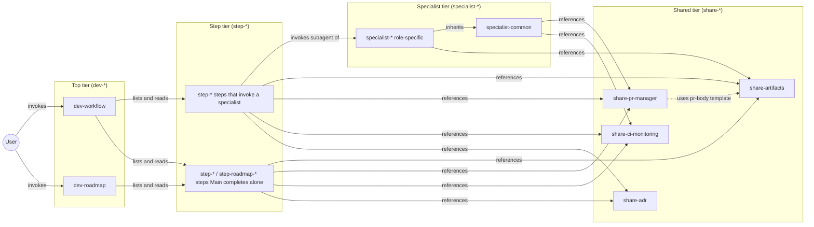
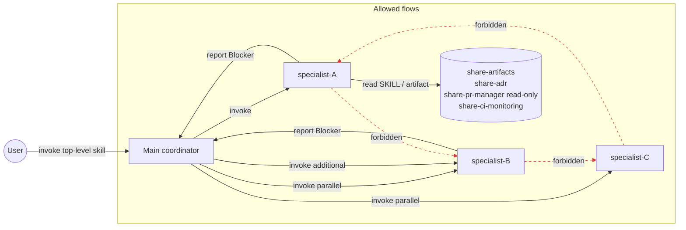

# dev-workflow

Multi-agent development workflow plugin for Claude Code.

A Main coordinator drives a gated, artifact-driven lifecycle. Some steps invoke specialist subagents (when parallelism, context isolation, or independent viewpoint is required); other steps Main completes alone. Two top-level skills provide entry points:

- **`dev-workflow`** — tactical layer; one cycle (one Intent Spec, typically one PR-sized increment) from intent to validated code, executed as a flat 9-step lifecycle (`Intent Clarification` → `Research` → `Design` → `QA Design` → `Task Decomposition` → `Implementation` → `External Review` → `Validation` → `Retrospective`).
- **`dev-roadmap`** — strategic layer; bundles multiple `dev-workflow` cycles into a single large-scale effort via four steps (`Roadmap Intent` → `Milestone Decomposition` → `Execution` → `Roadmap Retrospective`). `dev-roadmap` never auto-launches `dev-workflow` cycles — milestone execution is initiated manually by the user, and each running cycle autonomously updates `roadmap-progress.yaml`.

External Review runs the `reviewer` specialist in parallel across six aspects (`security`, `performance`, `readability`, `test-quality`, `api-design`, `holistic`). Each step has its own approval gate, exit criteria, and explicit rollback rules. There is no "phase" abstraction above steps.

---

## Skill Tier Model

Skills are organized into four tiers with mandatory naming prefixes. Each tier has a single, clear responsibility, and content belongs in exactly one tier.

### Tier definitions

| Tier | Prefix | Audience | What lives here | What does NOT live here |
| ---- | ------ | -------- | --------------- | ----------------------- |
| **Top** | `dev-*` | User (invocation entry) | Trigger keywords, role definitions, workflow diagram, step ordering, the basic principles that apply across the whole workflow, session resume preamble | Step exit criteria, rollback details, specialist input contracts, PR/CI command details, artifact templates |
| **Step** | `step-*` | Main coordinator | Step purpose, Main's procedure, expected artifacts, **exit criteria (including CI PASS lines)**, gate type, failure modes / rollback targets, commit conventions for this step, parallelism notes | Specialist role internals, PR/CI command syntax, artifact format specifications, cross-step rollback overview |
| **Specialist** | `specialist-*` | Subagent / teammate | Role-specific input contract, work procedure, failure modes, scope boundaries. `specialist-common` carries cross-cutting rules (lifecycle, blocker protocol, git guardrails, project-rule precedence) | Step orchestration, artifact write decisions outside scope |
| **Shared** | `share-*` | All tiers | Cross-cutting assets that multiple steps and specialists reference: artifact templates and references, PR command conventions, CI monitoring protocol, ADR conventions | Step-specific procedure, specialist role detail |

### Top tier content discipline

`dev-workflow/SKILL.md` and `dev-roadmap/SKILL.md` must stay lightweight. They capture only:

- the description / triggering test
- role definitions (Main / Specialist / Observer for `dev-roadmap` Step 3)
- the workflow diagram and the step list table (each row links to a `step-*` SKILL)
- whole-workflow principles (Main-Centric Orchestration, Single-Source-of-Progress, Artifact-Driven Handoff, Gate-Based Progression, Commit-Based Resumability, Clean-Transition Between Steps, Artifact-as-Gate-Review, Report-Based Confirmation for In-Progress Questions, Project-Rule Precedence)
- session resume preamble (detailed per-step resume actions live in the corresponding `step-*` SKILL)
- the parallelism guideline table (one line per step)
- a "this skill does not cover" pointer list

Per-step exit criteria, rollback specifics, commit examples, and any procedure that only applies inside one step **must be moved to the corresponding `step-*` SKILL**.

### Step tier content discipline

Each `step-*/SKILL.md` is self-sufficient: a Main entering that step should be able to read one file and reach completion. It contains:

- step purpose and the **invocation form**: either a specialist (with count and parallelism) or "Main only"
- Main's procedure as a numbered list
- expected artifacts with paths into `share-artifacts`
- **exit criteria including the CI PASS line** (`該当ステップ完了コミットに紐付く CI が PASS している`)
- gate type (User approval / Main judgment)
- failure modes and rollback targets (only the rollbacks rooted at this step; the cross-step overview lives in the top tier as a brief pointer table)
- commit message examples for this step
- parallelism warnings (Step 6 / Step 7 in particular)

A step is **Main-only** when none of the three specialist justifications apply: parallelism, context isolation (large input dominating Main's window), and independent viewpoint (an evaluator distinct from the implementer). For such steps the `step-*/SKILL.md` carries the full procedure (no `specialist-*` is created and no `agents/<role>.md` wrapper exists).

The 6 Main-only steps are: workflow Step 1 (Intent Clarification, dialogue with user is best done by Main directly), Step 5 (Task Decomposition, small input + single instance), Step 9 (Retrospective, aggregation work); roadmap Step 1 (Roadmap Intent), Step 2 (Milestone Decomposition), Step 4 (Roadmap Retrospective). The remaining steps invoke a specialist for one of the three justifications above.

`dev-roadmap` Step 3 (Execution) is **not** a `step-*` SKILL — it is an observer marker described inline in `dev-roadmap/SKILL.md`, since the user manually launches `dev-workflow` cycles and there is no specialist or independent procedure to extract.

### Specialist tier content discipline

`specialist-*` SKILLs stay role-focused. `specialist-common` defines:

- lifecycle (1 specialist = 1 step, no cross-step / cross-session reuse, persistence within a step)
- input contract (which paths Main must pass)
- output contract (artifact location + template/reference)
- blocker protocol (stop work, report, wait for Main)
- git guardrails (no `.` / `-A`, no force-push without approval)
- PR/CI permission boundary (Main = write, Specialist = read only — aligned with `share-pr-manager` §5)
- project-rule precedence (CLAUDE.md and project-specific skills dominate over workflow defaults for implementation, testing, commit, naming concerns)

Each role-specific `specialist-*` SKILL inherits the above and adds only what is unique to that role. `agents/<role>.md` is a thin wrapper that points at the SKILL — never duplicate content.

### Shared tier content discipline

`share-*` skills carry assets that would otherwise be duplicated across steps or specialists.

| Skill | Responsibility | Notable content |
| ----- | -------------- | --------------- |
| `share-artifacts` | The 17 artifact specifications: `references/<name>.md` (how to write) and `templates/<name>.md` (skeleton). 1:1 pairing, three documented exceptions (`progress-yaml.md` ↔ `progress.yaml`, `todo.md` ↔ `TODO.md`, `roadmap-progress-yaml.md` ↔ `roadmap-progress.yaml`). Includes `pr-body.md` (PR description spec). | Naming conventions for `<identifier>` / `<roadmap-id>` / `<aspect>` / `<task-id>` / `<milestone-id>`. Storage layout under `docs/workflow/<identifier>/` and `docs/roadmap/<roadmap-id>/`. |
| `share-pr-manager` | `gh pr` write/read commands, idempotency guards, permission boundary (Main vs Specialist), `--body-file` mandate. | `gh pr create` / `gh pr edit` / `gh pr ready` patterns with `--head` / `isDraft` pre-checks. Read-side query catalogue used by `validator`. Defers PR description content to `share-artifacts/{templates,references}/pr-body.md`. |
| `share-ci-monitoring` | `gh run watch` double-check protocol, retry discipline (2 attempts → blocker), CI status emission for the PR description. | Step exit criteria reference this for the CI PASS line. |
| `share-adr` | Architecture Decision Record format and dual-mode placement: General mode (`docs/adr/`) for cross-roadmap or project-wide decisions, Roadmap mode (`docs/roadmap/<roadmap-id>/adr/`) for decisions shared across cycles inside one roadmap. | Mode decision flow, immutability principle (no rewrites; supersession via prefix linkage). Invoked by `step-design` and the `dev-roadmap` steps when applicable. |

### Cross-tier reference rules

- **Top → Step**: each step row in `dev-workflow` / `dev-roadmap` links to a `step-*` SKILL. The top tier never duplicates per-step exit criteria.
- **Step → Specialist**: when a step invokes a specialist, the `step-*` SKILL must list the inputs the specialist requires (which are themselves defined in `specialist-*`). Main-only steps skip this reference entirely.
- **Step → Shared**: artifact paths flow through `share-artifacts`; PR/CI procedure flows through `share-pr-manager` / `share-ci-monitoring`; ADR escalation flows through `share-adr`. This applies to both specialist-invoking and Main-only steps.
- **Specialist → Shared**: specialists reference `share-artifacts` for templates and `specialist-common` references the PR/CI permission boundary maintained in `share-pr-manager`.
- **Specialist → Specialist**: only `specialist-common` is referenced from role-specific specialists. Role-specific skills do not import each other.
- **Shared → Shared**: `share-pr-manager` references `share-artifacts/{templates,references}/pr-body.md`; otherwise shared skills stay independent.
- **`agents/<role>.md`**: thin wrapper pointing at `specialist-common` plus the matching role-specific `specialist-*` SKILL. No procedural content of its own. Only role specialists with parallelism, context-isolation, or independent-viewpoint justification have an `agents/` wrapper — Main-only steps do not.

### Sub-agent invocation rules

Claude Code's sub-agent runtime does not permit nested sub-agent calls: a sub-agent cannot invoke another sub-agent. The plugin's orchestration is built on top of this constraint with the following rules.

- **Only Main invokes a `specialist-*` subagent.** All specialist launches go through Main, including parallel launches (`researcher` × N, `implementer` × N, `reviewer` × 6) and additions inside an active step.
- **A `specialist-*` must never invoke another `specialist-*`.** When a specialist needs another specialist's output (additional research angle, design clarification, repeated review round), it reports a Blocker to Main; Main then invokes the additional specialist and feeds the artifact back through `share-artifacts`.
- **Step ↔ Step transitions are Main's responsibility.** External Review (Step 7) Blocker findings re-activate Implementation (Step 6) only via Main; the prior `reviewer` does not launch a new `implementer`, and the new `implementer` does not launch a follow-up `reviewer`.
- **SKILL references and tool calls are not sub-agent invocations.** A specialist reading `share-adr/SKILL.md`, executing read-side `gh pr view --json` queries (`share-pr-manager` §4), or following `share-ci-monitoring` observation procedure stays within the same sub-agent context. These are permitted.
- **Main-only steps do not bypass the rule.** When Main runs a Main-only step (Intent Clarification, Task Decomposition, Retrospective, all roadmap steps), Main is not a sub-agent and may freely orchestrate other specialists if a later step needs one. This is the same Main-driven orchestration as for specialist-invoking steps.
- **`agents/<role>.md` wrappers are Main's entry points only.** They are never invoked by another specialist, even if the wrapper file is technically discoverable.

Steps that specifically rely on this rule (and the failure mode if violated):

| Step | Cross-specialist work | Main's mediation point |
| ---- | --------------------- | ---------------------- |
| Step 6 ↔ Step 7 round-trip | reviewer flags Blocker → implementer fixes | Main re-activates Step 6, launches new `implementer`; reviewer never launches implementer directly |
| Step 7 across aspects | 6 reviewers run in parallel and may cross-reference each other's reports | Round 2+ reviewers read `review/<aspect>.md` files (artifact reads), not other reviewer instances |
| Step 8 validation referencing implementation logs and reviews | validator reads prior artifacts | validator never launches implementer / reviewer to re-run; missing evidence is reported as Blocker to Main |
| Step 2 / Step 6 / Step 7 added scope | additional researcher / implementer / reviewer needed mid-step | Specialist reports a Blocker; Main launches the additional instance |

### Diagrams

Internal documentation uses Mermaid for diagrams. ASCII art diagrams are avoided.

---

## Directory Layout

Top-level layout under `plugins/dev-workflow/`:

| Path | Purpose |
| ---- | ------- |
| `.claude-plugin/plugin.json` | Plugin manifest |
| `README.md` | This file (skill tier model, conventions) |
| `agents/` | Thin subagent wrappers (one file per role specialist; each points at the matching `specialist-*` SKILL) |
| `skills/` | All skill directories grouped by tier prefix |

### Skill inventory

Top tier (`dev-*`):

| Skill | Purpose |
| ----- | ------- |
| `dev-workflow` | Tactical entry point. Lists the 9 workflow steps and invokes them in order. |
| `dev-roadmap` | Strategic entry point. Lists the 4 roadmap steps; Execution is described inline because it has no specialist. |

Step tier — workflow (`step-*`, 9 skills). The `Invocation` column shows whether Main runs the step alone or invokes a specialist, plus the justification (`P` = parallelism, `C` = context isolation, `V` = independent viewpoint):

| Skill | Invocation | Justification |
| ----- | ---------- | ------------- |
| `step-intent-clarification` | Main only | — (dialogue with user; no specialist justification) |
| `step-research` | `researcher` × N | P, C |
| `step-design` | `architect` × 1 | C |
| `step-qa-design` | `qa-analyst` × 1 | C |
| `step-task-decomposition` | Main only | — (small input, single instance) |
| `step-implementation` | `implementer` × N | P, C |
| `step-external-review` | `reviewer` × 6 | P, V |
| `step-validation` | `validator` × 1 | C, V |
| `step-retrospective` | Main only | — (aggregation work) |

Step tier — roadmap (`step-roadmap-*`, 3 skills). All three are Main-only:

| Skill | Invocation |
| ----- | ---------- |
| `step-roadmap-intent` | Main only |
| `step-roadmap-decomposition` | Main only |
| `step-roadmap-retrospective` | Main only |

Roadmap Execution has no `step-*` skill: the user manually launches `dev-workflow` cycles, and the observer behavior is captured inline in `dev-roadmap/SKILL.md`.

Specialist tier (`specialist-*`, 7 skills):

| Skill | Role | Step |
| ----- | ---- | ---- |
| `specialist-common` | Shared base for all specialists; not exposed as an agent | (cross-cutting) |
| `specialist-researcher` | Parallel research across multiple angles | Workflow Step 2 |
| `specialist-architect` | Design document authoring | Workflow Step 3 |
| `specialist-qa-analyst` | QA design and flow authoring | Workflow Step 4 |
| `specialist-implementer` | Per-task implementation in parallel | Workflow Step 6 |
| `specialist-reviewer` | External review across six aspects | Workflow Step 7 |
| `specialist-validator` | Independent validation against intent | Workflow Step 8 |

Shared tier (`share-*`, 4 skills):

| Skill | Purpose |
| ----- | ------- |
| `share-artifacts` | 17 artifact specifications; references and templates with 1:1 pairing (three documented exceptions) |
| `share-pr-manager` | `gh pr` write/read commands, idempotency guards, Main/Specialist permission boundary |
| `share-ci-monitoring` | `gh run watch` double-check protocol, retry discipline, CI status emission for the PR description |
| `share-adr` | ADR format with dual-mode placement (General mode: `docs/adr/`; Roadmap mode: `docs/roadmap/<roadmap-id>/adr/`) |

`agents/` (6 wrappers, one per role specialist; `specialist-common` is not exposed as an agent, and Main-only steps have no wrapper):

| File | Wraps |
| ---- | ----- |
| `agents/researcher.md` | `specialist-researcher` |
| `agents/architect.md` | `specialist-architect` |
| `agents/qa-analyst.md` | `specialist-qa-analyst` |
| `agents/implementer.md` | `specialist-implementer` |
| `agents/reviewer.md` | `specialist-reviewer` |
| `agents/validator.md` | `specialist-validator` |

### Naming rules

- Tier prefix is mandatory: `dev-*`, `step-*`, `specialist-*`, `share-*`. No skill outside these prefixes.
- `step-roadmap-*` is reserved for `dev-roadmap` steps; workflow steps use bare `step-*`.
- `agents/<role>.md` matches the trailing segment of `specialist-<role>` (e.g. `specialist-architect` ↔ `agents/architect.md`).
- Identifiers in artifacts (`<identifier>`, `<roadmap-id>`, `<milestone-id>`, `<task-id>`, `<aspect>`) are defined exclusively in `share-artifacts`.

The above tables list files; they do not imply execution order. Step ordering is defined in `dev-workflow/SKILL.md` and `dev-roadmap/SKILL.md`.

---

## How to use

Trigger the workflow by asking Claude Code to start a development cycle (e.g. "I want to start a new feature with dev-workflow") or a roadmap (e.g. "let's plan a multi-cycle roadmap"). The Main coordinator handles step progression, specialist invocation, and user approval gates.

- Workflow execution rules: `skills/dev-workflow/SKILL.md` (lightweight) plus `skills/step-*/SKILL.md` (per-step detail).
- Roadmap execution rules: `skills/dev-roadmap/SKILL.md` plus `skills/step-roadmap-*/SKILL.md`.
- Specialist behavior: `skills/specialist-*/SKILL.md` (with `specialist-common` for cross-cutting rules).
- Artifact formats and templates: `skills/share-artifacts/`.
- PR / CI / ADR conventions: `skills/share-pr-manager/`, `skills/share-ci-monitoring/`, `skills/share-adr/`.

## Origin

This plugin draws inspiration from several multi-agent development methodologies, most notably AWS Raja SP's _AI-Driven Development Lifecycle (AI-DLC)_. It is **not** an implementation, derivative, or variant of AI-DLC. The plugin omits AI-DLC's central elements — Mob Elaboration / Mob Construction rituals, the Bolt iteration concept, the Domain Design / Logical Design split, the DDD / BDD / TDD flavor selection, role consolidation under principle 8, and the Operations phase. It also adds steps with no AI-DLC counterpart: Research, QA Design, External Review, and Retrospective.

The rationale for positioning the plugin as an independent method (rather than an AI-DLC derivative) is recorded in `docs/adr/2026-04-26-dev-workflow-rename-and-flatten.md`.

## Non-goals

- Implementing AI-DLC compatibility or parity.
- Covering deployment, observability, SLA prediction, or runbook execution (workflow scope ends at code completion + reviewed + validated against the intent).
- Selecting design flavors at the framework level (project-specific design conventions live in skills like `effect-layer`, `effect-runtime`, `effect-hono`, `totto2727-fp`).
- Roadmap-of-roadmaps (more than one nesting level).
- CI workflow definition changes (`.github/workflows/*.yaml` is out of scope; `share-ci-monitoring` only orchestrates `gh` CLI usage).
