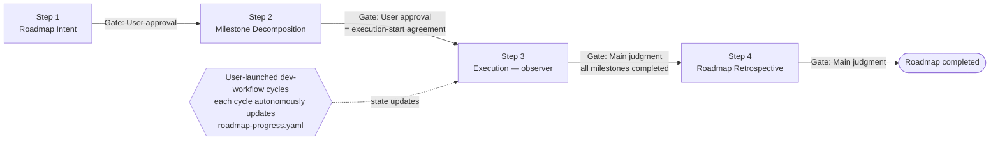

# dev-roadmap — Multi-Cycle Strategic Roadmap Layer

Use case category: **Workflow Automation**
Design pattern: **Sequential Workflow** + **Multi-Service Coordination** (strategic layer
loosely binding tactical-layer `dev-workflow` cycles).

This skill is the **strategic layer** of the `dev-workflow` plugin. Where a single
`dev-workflow` cycle handles "what to build and how" inside roughly one PR-sized increment,
`dev-roadmap` plans and tracks **multi-cycle efforts**: it (i) verbalises the worldview and
scope of the whole roadmap, (ii) decomposes it into observable milestones, and (iii) closes
out the roadmap by aggregating per-cycle retrospectives. `dev-roadmap` and `dev-workflow`
are **siblings**, connected by the bidirectional ID reference between
`<roadmap-id>` (held in `roadmap-progress.yaml`) and `<identifier>` (held in
`progress.yaml`).

## Roadmap-specific principles

`dev-roadmap` inherits all `dev-workflow` whole-workflow principles
(Main-Centric Orchestration, Single-Source-of-Progress, Artifact-Driven Handoff,
Gate-Based Progression, Commit-Based Resumability, Clean-Transition Between Steps,
Artifact-as-Gate-Review, Report-Based Confirmation for In-Progress Questions,
Project-Rule Precedence). See `dev-workflow/SKILL.md` "Basic policies" for the
canonical statements.

In addition, the roadmap layer adds three principles of its own:

- **Strategy / Execution Separation**: `dev-roadmap` only handles planning (Step 1, 2)
  and acceptance (Step 4). All implementation and validation are fully delegated to
  downstream `dev-workflow` cycles. The roadmap layer has no implementation step.
- **Asymmetric Coupling**: `dev-roadmap` **never auto-launches** `dev-workflow`. Each
  cycle is launched manually by the user; the cycle then detects roadmap context via
  its own `progress.yaml.roadmap` nested block and **autonomously updates**
  `roadmap-progress.yaml`. The writer is the workflow side; the roadmap side is a
  passive observer.
- **Minimal Scope of `roadmap-progress.yaml`**: this YAML carries only the
  milestone↔workflow-identifier binding and a coarse-grained status. Fine progress is
  fetched on demand from `docs/workflow/<identifier>/progress.yaml`. No double
  bookkeeping.

---

## Role definitions

### Main (= roadmap orchestrator)

**Responsibilities:**

- Direct dialogue with the user (Roadmap Intent eliciting, milestone-decomposition
  alignment, retrospective presentation).
- Roadmap-wide progress management (current step, gate, Blockers, awareness of running
  downstream `dev-workflow` cycles).
- Performing each step directly (all four roadmap steps are Main-only).
- Exit-Criteria evaluation per step.
- Constructing user-approval gate materials (the artifact itself, per
  Artifact-as-Gate-Review).
- **Awareness of running cycles in Step 3**: while the downstream cycles run autonomously,
  Main observes their progress through `roadmap-progress.yaml`.

**Principles:**

- Main does not perform implementation work directly (it focuses on dialogue,
  judgment, and assignment).
- **Main never auto-launches `dev-workflow` cycles**. The user manually starts each
  cycle; Main only invites the user to do so for the next milestone.

### No Specialist tier

`dev-roadmap` has **no specialist subagents**. All four roadmap steps are Main-only:

- **Step 1, 2, 4** are dialogue / aggregation work where context-isolation, parallelism,
  and independent-viewpoint justifications do not apply. The full procedure lives in
  `step-roadmap-intent`, `step-roadmap-decomposition`, and `step-roadmap-retrospective`.
- **Step 3 (Execution)** has no specialist by construction: the user manually launches
  `dev-workflow` cycles, each cycle autonomously updates `roadmap-progress.yaml`, and
  Main observes. Step 3 is captured **inline** in this SKILL because there is no
  procedure substantial enough to extract into a `step-*`.

---

## Roadmap diagram

## Step list

| Step | Title                   | Invocation | Gate              | Detail SKILL                  |
| ---- | ----------------------- | ---------- | ----------------- | ----------------------------- |
| 1    | Roadmap Intent          | Main only  | User approval     | `step-roadmap-intent`         |
| 2    | Milestone Decomposition | Main only  | User approval     | `step-roadmap-decomposition`  |
| 3    | Execution               | Main only (observer) | Main judgment | inline (this SKILL, below) |
| 4    | Roadmap Retrospective   | Main only  | Main judgment     | `step-roadmap-retrospective`  |

Per-step exit criteria, rollback specifics, and commit examples live in the corresponding
`step-roadmap-*/SKILL.md` (or, for Step 3, in the inline section below).

---

## Step 3: Execution (inline)

Step 3 is a **marker step** with no specialist and no separate procedure document. It
spans the period during which the user manually launches `dev-workflow` cycles for each
milestone, and each cycle autonomously updates `roadmap-progress.yaml`.

### What Main watches

Main reads `docs/roadmap/<roadmap-id>/roadmap-progress.yaml` periodically and on user
request, looking at:

- `milestones[].status` transitions:
  - `planned → active` when the corresponding `dev-workflow` cycle starts.
  - `active → completed` when the cycle's Step 9 (Retrospective) completes.
  - `blocked` if the downstream cycle reports a long-running Blocker.
- `milestones[].workflow_identifiers[]`: the list of cycle `<identifier>` values bound
  to each milestone (1:N is allowed; multiple cycles may attach to the same milestone).
- The roadmap-wide `status` (stays `active` throughout Step 3).

### Main's actions during Step 3

1. After Step 2 completes, present the next milestone to the user and obtain agreement
   to launch the corresponding `dev-workflow` cycle. Remind the user to pass
   `<roadmap-id>` and `<milestone-id>` when starting the cycle.
2. **Do not launch `dev-workflow` from `dev-roadmap`** (asymmetric coupling rule). The
   user runs `dev-workflow`; Main observes.
3. When the user asks for a progress check, summarise the current
   `roadmap-progress.yaml` view (per-milestone status, attached identifiers, any
   `blocked` milestones).
4. If a milestone stays `blocked` for an extended period, raise an
   In-Progress user inquiry to choose between cancel / re-decompose (back to Step 2) /
   Intent revision (back to Step 1).

### When to advance to Step 4

When all entries in `milestones[]` are `completed` or `cancelled`, present to the user
the readiness to start Step 4 and proceed to `step-roadmap-retrospective`. The roadmap
`status` remains `active` until the Step 4 commit transitions it to `completed`.

### Exit criteria (Step 3)

- All `milestones[]` are `completed` or `cancelled`.
- For parallel milestones (1:N), the user has agreed to the final-state rule (e.g. "all
  N cycles complete → `completed`" vs. "first cycle complete → `completed`"); typically
  finalised in Step 4.
- The roadmap-wide `status` is still `active` (transitions to `completed` only at Step
  4 completion).

### Step 3 has no commit of its own

Downstream cycles commit per their own conventions; Step 3 in `dev-roadmap` does not
produce its own commit (apart from any Roadmap mode ADR Main may file mid-execution if
a long-lived shared norm surfaces — those follow `share-adr/SKILL.md`).

---

## Connection protocol with `dev-workflow`

`dev-roadmap` and `dev-workflow` are connected via a bidirectional ID reference. The
full update protocol (write order, retry, conflict resolution) lives in
`dev-workflow/SKILL.md` ("`roadmap-progress.yaml` update protocol"). This section
summarises the surface that the roadmap side sees.

### Bidirectional reference

```mermaid
graph LR
    subgraph RP[docs/roadmap/&lt;roadmap-id&gt;/roadmap-progress.yaml]
        M1[milestones&#91;&#93;.id]
        M2["milestones&#91;&#93;.workflow_identifiers&#91;&#93;<br/>= &#91;identifier-A, identifier-B, ...&#93;"]
    end
    subgraph PG[docs/workflow/&lt;identifier&gt;/progress.yaml]
        R1[roadmap.id = &lt;roadmap-id&gt;]
        R2[roadmap.milestone.id = &lt;milestone-id&gt;]
    end

    M2 -->|forward reference| PG
    R1 -.->|back reference| RP
```

- **roadmap → workflow**: `roadmap-progress.yaml.milestones[].workflow_identifiers[]`
  holds attached `<identifier>` values (1:N). Detailed progress is fetched from the
  workflow side on demand (minimal-scope principle).
- **workflow → roadmap**: `progress.yaml.roadmap = {id: <roadmap-id>, milestone: {id:
  <milestone-id>}}` or `null`. Non-null means the cycle must update the corresponding
  `milestones[]` entry on cycle start and on cycle end.

### Who writes what, when (summary)

| Trigger                                                                 | Owner                          | Effect on `roadmap-progress.yaml`                                                       |
| ----------------------------------------------------------------------- | ------------------------------ | --------------------------------------------------------------------------------------- |
| `dev-roadmap` Step 1 completes                                          | `step-roadmap-intent` (Main)   | Initialise `roadmap_id` / `title` / `status: planned` / empty `milestones: []`.         |
| `dev-roadmap` Step 2 completes                                          | `step-roadmap-decomposition` (Main) | Finalise `milestones[]` (`planned`); transition roadmap `status` to `active`.            |
| `dev-workflow` cycle starts (during Roadmap Step 3)                     | `dev-workflow` Main            | `milestones[].status: planned → active`; append to `workflow_identifiers[]`.            |
| `dev-workflow` cycle completes (= cycle's Step 9 Retrospective commit)  | `dev-workflow` Main            | `milestones[].status: active → completed`.                                              |
| `dev-roadmap` Step 4 completes                                          | `step-roadmap-retrospective` (Main) | Roadmap `status: active → completed`.                                                    |

### Concurrency notes

- The two write triggers from the workflow side ("cycle start" and "cycle end") are
  rare events, so contention is unlikely.
- Residual rare conflicts are caught by the YAML-syntax `pre-commit` hook.
- On conflict, neither the workflow Main nor a specialist resolves it unilaterally;
  it is reported as a Blocker (`specialist-common §4` Case B), and the roadmap Main
  drives recovery.
- Detailed recovery flow: see
  `share-artifacts/references/roadmap-progress-yaml.md` "`dev-workflow` update
  protocol".

---

## Session resume preamble

Detailed per-step resume actions live in the corresponding `step-roadmap-*` SKILL
(Step 3 actions are inline above). This preamble defines the cross-step shared
preparation.

The `dev-workflow` resume principles (specialist non-reuse across sessions,
artifact-based context restoration) are inherited. Roadmap-specific additions:

1. **Read the source of truth**: `docs/roadmap/<roadmap-id>/roadmap-progress.yaml`.
2. **Read all existing artifacts**: `roadmap.md` and every
   `milestones/<milestone-id>.md`.
3. **Two-tier state check**: roadmap-wide `status` + each `milestones[].status` + the
   attached `<identifier>` values in `workflow_identifiers[]`.
4. **Workflow-side resume takes priority**: if any milestone is `active`, scan the
   bound `<identifier>`s, locate corresponding `docs/workflow/<identifier>/progress.yaml`
   files, and run `dev-workflow/SKILL.md` "Session resumption" first. The roadmap
   resume waits until workflow-side consistency is restored.
5. **Refresh `updated_at` and commit a resume marker**:
   `docs(dev-roadmap/<roadmap-id>): resume session`.

### Resume scenarios

| Scenario | State | Path forward |
| -------- | ----- | ------------ |
| **A: Step 1–2 done, Step 3 not started** | Roadmap `status: active` / all `milestones[].status: planned` / `workflow_identifiers[]` empty | Present the next milestone to the user; invite the user to launch the corresponding `dev-workflow` cycle. (See "Step 3: Execution" above.) |
| **B: Step 3 in progress** | Roadmap `status: active` / one or more `milestones[].status: active` with running `<identifier>`s | Run workflow-side session resume first (preamble item 4). Present a milestone-progress summary and confirm next-launch agreement with the user. |
| **C: Step 4 in progress** | Roadmap `status: active` / all `milestones[]` are `completed` or `cancelled` / Step 4 already started | Continue per `step-roadmap-retrospective`. |

### Detecting resumable roadmaps

When the user activates `dev-roadmap`, before starting a new roadmap Main scans
`docs/roadmap/` for resumable roadmaps:

1. Detect `docs/roadmap/<roadmap-id>/roadmap-progress.yaml` files where `status !=
   completed`.
2. If any are found, ask the user whether to resume one or to start fresh.
3. On resume, follow the preamble above and the relevant scenario.
4. On a fresh start, agree on a new `<roadmap-id>` and proceed to
   `step-roadmap-intent`.

---

## Project-rule precedence

`dev-roadmap` inherits the `dev-workflow` policy: **the overall process structure
(steps, artifact formats, gate decisions) follows this skill, while implementation
patterns / test rules / commit conventions / naming conventions / platform-specific
commands defer to project-specific skills** (`effect-layer`, `git-workflow`,
`macos-cli-rules`, etc.). See `dev-workflow/SKILL.md` "Relationship with project-specific
rules" for the canonical statement.

Roadmap-specific notes:

- Milestone-granularity decisions interact with project implementation and test
  conventions. Step 2 (`step-roadmap-decomposition`) requires Main to load the
  relevant project-specific skills.
- Roadmap-wide constraints (parallel-execution allowance, release-freeze windows,
  etc.) follow project operational rules. Main confirms them with the user during
  Step 1 (`step-roadmap-intent`) and records them in `roadmap.md`'s Intent section.

---

## What this skill does NOT cover

- **Per-step exit criteria, rollback details, and commit examples** → see the
  corresponding `step-roadmap-*/SKILL.md` (or, for Step 3, the inline section above).
- **Per-cycle implementation, design, and validation** → fully delegated to downstream
  `dev-workflow` cycles. The roadmap layer is purely strategic.
- **Auto-launching of `dev-workflow` cycles** → forbidden (asymmetric coupling).
- **Roadmap-of-roadmaps** (more than one nesting level) → out of scope for this version.
- **CI / external system integration with `roadmap-progress.yaml`** → out of scope; the
  YAML is machine-readable but no GitHub Actions / webhook integration is provided here.
- **Step-level progress reporting** (per-step granularity) → out of scope (future
  extension). Use `workflow_identifiers[]` to hop into
  `docs/workflow/<identifier>/progress.yaml` when finer detail is needed.
- **`events[]` / `status_view` derived views / millisecond-precision timestamps** → out
  of scope (future extension).
- **Artifact format / template specifications** → see `share-artifacts`
  (`references/roadmap*.md`, `templates/roadmap*.md`, `templates/milestone.md`).
- **ADR conventions and the General mode / Roadmap mode split** → see `share-adr`.
- **Single-cycle development** → use `dev-workflow` directly. This skill is for
  multi-cycle scope only.
- **PR / CI command details** → see `share-pr-manager` and `share-ci-monitoring`.
  `dev-roadmap` itself does not orchestrate PR / CI; downstream cycles do.
