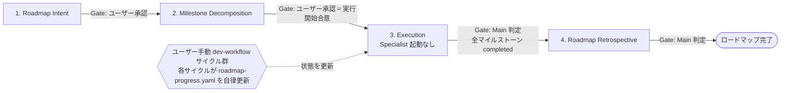
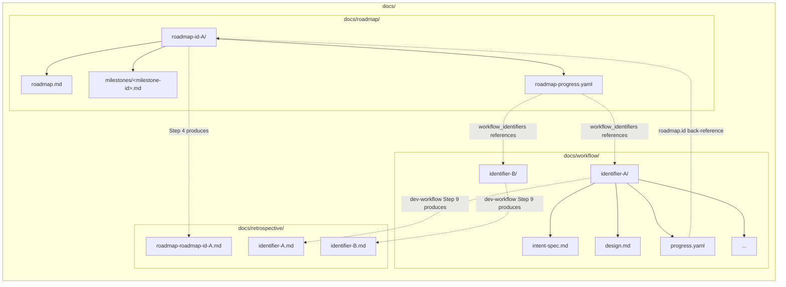

# dev-roadmap — Multi-Cycle Strategic Roadmap Layer

ユースケースカテゴリ: **Workflow Automation**
設計パターン: **Sequential Workflow** + **Multi-Service Coordination** (戦略層・戦術層の 2 層調整、ロードマップ層が dev-workflow サイクル群を疎結合に束ねる)

このスキルは `dev-workflow` プラグインの**戦略層**を担う。1 サイクルの `dev-workflow` では収まらない**複数サイクル規模の開発**を、(i) ロードマップ全体の世界観・スコープ境界の言語化、(ii) 観測可能なマイルストーンへの分解、(iii) 各マイルストーンを `dev-workflow` サイクルに委譲する形で運営する。`dev-workflow` (戦術層: 1 サイクルで「何を・どう作るか」を決めて実装する) と並列配置の関係にあり、両者は **`<roadmap-id>` ↔ `<identifier>` の双方向 ID 参照**と **`roadmap-progress.yaml` の最小スキーマ**で疎結合に接続する。

## 基本方針

`dev-roadmap` は `dev-workflow` の以下 9 基本方針を**全て継承**する。詳細は `dev-workflow/SKILL.md` を参照:

- **Main-Centric Orchestration**: Main がユーザー対話・進捗管理・Specialist 起動・ゲート判定を担う
- **Single-Source-of-Progress**: ロードマップ進捗は Main が唯一の真実として保持する (`roadmap-progress.yaml` を真のソースとする)
- **One-Shot Specialist & Within-Step Persistence**: 各 Specialist は 1 ステップ限定。同一ステップ内では存続維持
- **Gate-Based Progression**: 各ステップに明確な Exit Criteria を設け、満たさない限り次に進まない
- **Artifact-Driven Handoff**: ステップ間の受け渡しは Markdown / YAML 成果物で行う
- **Project-Rule Precedence for Details**: 実装パターン・テストルール・コミット規約等はプロジェクト固有スキルを優先
- **Commit-Based Resumability**: 成果物と進捗記録は `docs/roadmap/<roadmap-id>/` に集約し、各ステップ完了時に必ずコミット
- **Clean-Transition Between Steps**: 次ステップ着手時には一時ファイル以外は差分がない状態とする
- **Artifact-as-Gate-Review**: ユーザー承認ゲートでは成果物 (roadmap.md / milestones/\*.md / roadmap-retrospective.md) そのものをレビュー対象とする
- **Report-Based Confirmation for In-Progress Questions**: 作業途中の判断要請時は一時レポートを `$TMPDIR/dev-roadmap/step<N>-<purpose>.md` に書き出してから確認

加えて、本スキル固有の方針として以下を持つ:

- **計画層への純化 (Strategy / Execution Separation)**: `dev-roadmap` は計画 (Step 1-2) と検収 (Step 4) のみを担い、実装・検証は配下の `dev-workflow` サイクルに完全委譲する。戦略層自身は実装ステップを持たない
- **非対称な接続 (Asymmetric Coupling)**: `dev-roadmap` は `dev-workflow` を**能動起動しない**。各 `dev-workflow` サイクルはユーザー手動で起動され、自身の `progress.yaml.roadmap` ネストブロックを通じて roadmap 文脈を検知し、`roadmap-progress.yaml` を**自律的に更新**する (書き手は workflow 側、roadmap 側は受動的観察者)
- **最小限の責務 (Minimal Scope)**: `roadmap-progress.yaml` の責務は「マイルストーン ↔ workflow identifier の紐付け」と粗粒度ステータスのみ。細かい進捗は `dev-workflow` 側 `progress.yaml` を辿って取得する (二重管理を避ける)

---

## 役割定義

### Main (メインエージェント = ロードマップオーケストレーター)

**責務:**

- ユーザーとの直接対話 (ロードマップ意図の聞き出し、マイルストーン分解の合意形成、retrospective 提示)
- ロードマップ全体の進捗管理 (現在ステップ・ゲート・Blocker・進行中 dev-workflow サイクルの把握)
- 各ステップの Roadmap Specialist 起動 (Step 1 / 2 / 4)
- 各ステップのゲート判定 (Exit Criteria 充足確認)
- ユーザー承認ゲートでのレポート作成と確認取得
- **進行中 `dev-workflow` サイクルの存在認識** (Step 3 中、配下のサイクルが自律的に進行する間、Main は `roadmap-progress.yaml` を介して状態を観察する)

**原則:**

- Main は実装作業を自分で行わない (対話・判断・割り当てに専念)
- **`dev-workflow` を能動起動しない** (Step 3 はユーザー手動起動、Main は観察役)
- Specialist 起動時は役割・入力・期待成果物・スコープ境界を明示する
- 進捗状態 (`roadmap-progress.yaml`) を各ターンで更新し、必要に応じてユーザーに可視化する

### Roadmap Specialist (ロードマップ専門エージェント、3 種)

| Specialist                     | 担当ステップ                    | 主な成果物                                                                                                | 起動形態 |
| ------------------------------ | ------------------------------- | --------------------------------------------------------------------------------------------------------- | -------- |
| `roadmap-analyst`              | Step 1: Roadmap Intent          | `roadmap.md` (Intent セクション) + `roadmap-progress.yaml` 初期化                                         | × 1      |
| `roadmap-planner`              | Step 2: Milestone Decomposition | `milestones/<milestone-id>.md` 群 + `roadmap.md` の依存グラフ + `roadmap-progress.yaml.milestones[]` 確定 | × 1      |
| `roadmap-retrospective-writer` | Step 4: Roadmap Retrospective   | `docs/retrospective/roadmap-<roadmap-id>.md` (集約形式)                                                   | × 1      |

3 種の Specialist は `specialist-common` を継承し、各々の作業詳細は `specialist-roadmap-analyst` / `specialist-roadmap-planner` / `specialist-roadmap-retrospective-writer` に委譲する。Specialist は自分のスコープ外を触らず、次ステップを勝手に開始せず、Blocker は独断で回避せず Main に報告する (`specialist-common` §4)。

**Step 3 (Execution) は Specialist を持たない**: ユーザー手動による `dev-workflow` サイクル起動を観察するマーカー的ステップで、Main は `roadmap-progress.yaml` の更新を受動的に確認する役割のみを担う。

---

## ワークフロー全体図



---

## ステップ一覧

| Step | 名称                    | Specialist (起動形態)              | Gate | 主要成果物                                                                                         | 詳細スキル                                |
| ---- | ----------------------- | ---------------------------------- | ---- | -------------------------------------------------------------------------------------------------- | ----------------------------------------- |
| 1    | Roadmap Intent          | `roadmap-analyst` × 1              | User | `roadmap.md` (Intent セクション) + `roadmap-progress.yaml` 初期化                                  | `specialist-roadmap-analyst`              |
| 2    | Milestone Decomposition | `roadmap-planner` × 1              | User | `milestones/<milestone-id>.md` 群 + `roadmap.md` 依存グラフ + `roadmap-progress.yaml.milestones[]` | `specialist-roadmap-planner`              |
| 3    | Execution               | (起動なし)                         | Main | (進捗観察のみ、実成果物は配下 `dev-workflow` サイクルが生成)                                       | (該当なし)                                |
| 4    | Roadmap Retrospective   | `roadmap-retrospective-writer` × 1 | Main | `docs/retrospective/roadmap-<roadmap-id>.md` (集約形式)                                            | `specialist-roadmap-retrospective-writer` |

各 Specialist 起動時には**reference (書き方ガイド) とテンプレートの両方のパス**を入力に含めること。各 Specialist は `specialist-common` (横断ルール) と上記の個別スキルを参照する。

---

## ステップ詳細

各ステップの目的・Main の作業・Specialist 起動仕様 (該当する場合)・Exit Criteria・Gate・失敗時挙動・ロールバック先を定義する。Specialist の内部作業は対応する `specialist-roadmap-*` スキルに委譲する。

### Step 1: Roadmap Intent (ロードマップ意図明確化)

**目的:** ロードマップ全体の世界観・解きたい問題のスコープ・成功イメージ・除外事項を言語化し、`roadmap.md` の Intent セクションとして確定する。

**起動 Specialist:** `roadmap-analyst` × 1

**Main の作業:**

1. `roadmap-analyst` を起動し、ユーザーの初期要求と現在のリポジトリ状態の要約を渡す
2. `roadmap-analyst` の質問を受け取り、ユーザーに提示
3. ユーザー回答を `roadmap-analyst` に戻し、`roadmap.md` Intent セクションを確定させる
4. `roadmap-analyst` は同時に `roadmap-progress.yaml` を初期化する (`roadmap_id` / `title` / `status: planned` / `created_at` / `updated_at` / 空 `milestones: []`)
5. **確定した `roadmap.md` Intent セクションそのものをユーザーに提示**して承認を得る (一時レポートは作成しない)

**成果物:**

- `docs/roadmap/<roadmap-id>/roadmap.md` (Intent セクション: 背景 / 目的 / スコープ / 非スコープ / 成功イメージ / 制約)
- `docs/roadmap/<roadmap-id>/roadmap-progress.yaml` (初期化: `status: planned` / 空 `milestones: []`)

**Exit Criteria:**

- ロードマップ全体のスコープと非スコープが明文化されている
- 成功イメージが「何が達成されたら roadmap 完了とみなすか」観測可能な形で記述されている
- ユーザーが Intent セクションに同意済み
- `roadmap.md` + `roadmap-progress.yaml` がコミット済み

**Gate:** ユーザー承認必須

**失敗時 / ロールバック:**

- ユーザー回答が曖昧で確定しない → **同じ `roadmap-analyst` インスタンスに追加質問を指示**して対話継続
- 成功イメージが観測不能 → ユーザーに具体化観点を相談して再定義 (Specialist は維持)
- 範囲が単一サイクルで足りる規模と判明 → ロードマップを取り下げ、`dev-workflow` 単独サイクルに切り替え (本スキルからの離脱、Main がユーザーに提案)

### Step 2: Milestone Decomposition (マイルストーン分解)

**目的:** ロードマップ全体を観測可能なマイルストーンに分割し、依存関係を明示する。各マイルストーンは概ね 1 つの `dev-workflow` サイクルに対応する粒度で設計する (1:N 許容、複数サイクルが同一マイルストーンに紐付く場合あり)。

**起動 Specialist:** `roadmap-planner` × 1

**Main の作業:**

1. `roadmap-planner` に `roadmap.md` Intent セクション、関連プロジェクト固有スキルのパス、テンプレート / reference のパスを渡して起動
2. 生成されたマイルストーン分解 (粒度・順序・依存関係) を Main が検証
3. 不十分なら**同じ `roadmap-planner` インスタンス**に不足点を差し戻して再分解
4. `roadmap-planner` は `roadmap.md` にマイルストーン一覧と依存グラフ (Mermaid `graph LR`) を追記、`milestones/<milestone-id>.md` 群を生成、`roadmap-progress.yaml.milestones[]` を確定 (`id` / `title` / `status: planned` / `depends_on` / 空 `workflow_identifiers: []` / `notes: null`)、ロードマップ全体 `status: active` に遷移
5. **確定版 `roadmap.md` + `milestones/<milestone-id>.md` 群そのものをユーザーに提示**して実行開始の承認を得る

**成果物:**

- `docs/roadmap/<roadmap-id>/roadmap.md` (マイルストーン一覧 + 依存グラフを Step 1 成果物に追記)
- `docs/roadmap/<roadmap-id>/milestones/<milestone-id>.md` 群 (1 ファイル / マイルストーン)
- `docs/roadmap/<roadmap-id>/roadmap-progress.yaml` (`milestones[]` 確定 + ロードマップ `status: active`)

**Exit Criteria:**

- 各マイルストーンが概ね 1 つの `dev-workflow` サイクルで完遂可能な粒度
- マイルストーン間の依存関係が DAG (Mermaid `graph LR`) として明示されている
- 並列実行可能なマイルストーン群が識別されている
- 各マイルストーンの完了基準 (どの状態になれば `completed` 遷移するか) が `milestones/<milestone-id>.md` に記述されている
- ユーザーがマイルストーン分解に同意済み (実行開始合意)
- `roadmap.md` + `milestones/*.md` + `roadmap-progress.yaml` がコミット済み

**Gate:** ユーザー承認必須 (実行開始の合意)

**失敗時 / ロールバック:**

- 粒度が不適切 → **同じ `roadmap-planner` インスタンス**に粒度基準を明示して再分解
- 依存関係が解決不能 → Step 1 に戻り Intent セクションのスコープ見直し
- マイルストーン数が極端に少ない (1〜2 個) → Step 1 に戻ってロードマップ採用要否をユーザーと再評価 (`dev-workflow` 単独サイクルで十分な可能性)

### Step 3: Execution (実行・観察)

**目的:** マイルストーンに対応する `dev-workflow` サイクルをユーザーが順次起動し、各サイクルが自律的に `roadmap-progress.yaml` を更新していく期間を表すマーカーステップ。Main は進捗を受動的に観察する。

**起動 Specialist:** **なし** (本ステップは Specialist を持たない)

**Main の作業:**

1. Step 2 完了後、ユーザーに「次に着手するマイルストーン」を提示し、対応する `dev-workflow` サイクル起動の合意を取る
2. **ユーザーが手動で `dev-workflow` サイクルを起動**する (Main は能動起動しない)。起動時、Main はユーザーに `<roadmap-id>` および `<milestone-id>` を伝達するよう案内する
3. 各 `dev-workflow` サイクルが自律的に以下を実行する (詳細は `dev-workflow/SKILL.md` の「`roadmap-progress.yaml` 更新プロトコル」参照):
   - **(a) サイクル開始時**: `progress.yaml.roadmap` ネストブロック初期化 + `roadmap-progress.yaml` の該当 `milestones[].status` を `planned → active` に遷移 + `workflow_identifiers[]` に自身の `<identifier>` を append
   - **(c) サイクル完了時** (= `dev-workflow` Step 9 Retrospective 完了時): 該当 `milestones[].status` を `active → completed` に遷移
4. Main は適宜 `roadmap-progress.yaml` を確認し、進行中 / 完了済マイルストーンを把握する。ユーザーから「進捗確認したい」と求められたら現状の集計を提示する
5. 全マイルストーンが `completed` (または明示的に `cancelled`) になった時点で Step 4 へ進む合意をユーザーに提示

**成果物:** 本ステップは新規成果物を生成しない。配下の `dev-workflow` サイクル群が各々の作業ディレクトリ (`docs/workflow/<identifier>/`) に成果物を生成する。

**Exit Criteria:**

- `roadmap-progress.yaml.milestones[]` の全マイルストーンが `completed` または `cancelled` 状態
- 並行マイルストーンの最終状態判定 (例: 「全 N サイクル完了で `completed`」「最初の 1 サイクル完了で `completed`」) がユーザーと合意済み
- ロードマップ全体 `status` は `active` のまま (Step 4 完了時に `completed` に遷移)

**Gate:** Main 判定 (ユーザー確認は任意。重大な Blocker や進行不能マイルストーン発生時のみ In-Progress ユーザー問い合わせ)

**失敗時 / ロールバック:**

- 特定マイルストーンが `blocked` から長期間動かない → ユーザーに In-Progress 問い合わせ形式で対応方針 (cancel / 再分解 / Step 1 ロールバック) を相談
- マイルストーン分解の前提が崩壊 (例: 当初想定外の制約発見) → Step 2 にロールバックしてマイルストーン再分解
- ロードマップ自体の意図が崩壊 (例: 上位戦略変更) → Step 1 にロールバックして Intent セクション再定義

**注意:**

- **Main は `dev-workflow` サイクルを能動起動しない**。ユーザー判断に委ねる (非対称接続)
- 進行中マイルストーンが複数 (1:N) 存在しうる。並行サイクルの競合は `dev-workflow/SKILL.md` の「`roadmap-progress.yaml` 更新プロトコル」内「並行サイクル時の競合回避」に従う
- 配下サイクルが Step 9 Retrospective 完了時にコミットしない場合、`roadmap-progress.yaml` の該当マイルストーンが `completed` に遷移しないため、Main は当該サイクルの完了状況を確認するためユーザーに問い合わせる

### Step 4: Roadmap Retrospective (ロードマップ振り返り)

**目的:** ロードマップ全体の総括を行い、配下の各 `dev-workflow` サイクルの retrospective を集約しつつ、roadmap 固有の改善案 (マイルストーン分解妥当性 / 依存グラフ妥当性 / 並行進行の運用知見等) を残す。

**起動 Specialist:** `roadmap-retrospective-writer` × 1

**Main の作業:**

1. `roadmap-retrospective-writer` に以下を渡して起動:
   - `roadmap.md` (Intent セクション + マイルストーン分解)
   - `roadmap-progress.yaml` (全マイルストーンの最終状態 + `workflow_identifiers[]`)
   - 配下 `dev-workflow` サイクルの成果物 (`docs/workflow/<identifier>/` 一式) および `docs/retrospective/<identifier>.md`
   - テンプレート (`shared-artifacts/templates/roadmap-retrospective.md`) と reference (`shared-artifacts/references/roadmap-retrospective.md`)
2. `roadmap-retrospective-writer` が `docs/retrospective/roadmap-<roadmap-id>.md` (集約形式 + `roadmap-` prefix) を生成し、ロードマップ全体 `status: completed` に遷移
3. 生成された Retrospective Note をユーザーに提示 (情報共有のみ、Gate は Main 判定)

**成果物:**

- `docs/retrospective/roadmap-<roadmap-id>.md` (集約形式、`roadmap-` prefix で `dev-workflow` retrospective との命名衝突を回避)
- `docs/roadmap/<roadmap-id>/roadmap-progress.yaml` (`status: completed` 更新 + `updated_at` 更新)

**Exit Criteria:**

- マイルストーン達成度の総括が記述されている
- 依存グラフ妥当性の振り返りが記述されている
- 配下 `dev-workflow` サイクルの retrospective 群が 1 段落以上ずつ集約されている (各 `<identifier>.md` に対する要約)
- roadmap 固有の改善案 (`roadmap-progress.yaml` のスキーマ拡張提案、ステップ単位反映の必要性検討等) が記述されている
- `docs/retrospective/roadmap-<roadmap-id>.md` + `roadmap-progress.yaml` (`status: completed`) がコミット済み (ロードマップ最終コミット)

**Gate:** Main 判定 (ユーザーには情報共有のみ)

**失敗時 / ロールバック:**

- 振り返り内容が抽象的すぎる → **既存の `roadmap-retrospective-writer` インスタンス**に具体的エピソード (進行中の Blocker、並行マイルストーンの運用、Specialist 起動回数等) を指示して再生成
- 配下 retrospective が未完成のサイクルがある → Step 3 に戻り、当該 `dev-workflow` サイクルの完了を待つ

---

## `dev-workflow` サイクルとの接続プロトコル

`dev-roadmap` と `dev-workflow` は **`<roadmap-id>` ↔ `<identifier>` の双方向 ID 参照**で疎結合に接続する。本セクションは Main が Step 3 中およびマイルストーン状態確認時に参照する規約を定義する。

### 双方向参照の構造

```mermaid
graph LR
    subgraph RP[docs/roadmap/&lt;roadmap-id&gt;/roadmap-progress.yaml]
        M1[milestones&#91;&#93;.id]
        M2["milestones&#91;&#93;.workflow_identifiers&#91;&#93;<br/>&#91;identifier-A, identifier-B, ...&#93;"]
    end
    subgraph PG[docs/workflow/&lt;identifier&gt;/progress.yaml]
        R1[roadmap.id = &lt;roadmap-id&gt;]
        R2[roadmap.milestone.id = &lt;milestone-id&gt;]
    end

    M2 -->|forward reference| PG
    R1 -.->|back reference| RP
```



- **roadmap → workflow**: `roadmap-progress.yaml.milestones[].workflow_identifiers[]` に紐付き済み `<identifier>` を保持。1:N 許容のため配列。詳細進捗は `docs/workflow/<identifier>/progress.yaml` を辿って取得する (本バージョンでは `roadmap-progress.yaml` に詳細を持たない、最小責務原則)
- **workflow → roadmap**: `progress.yaml.roadmap = {id: <roadmap-id>, milestone: {id: <milestone-id>}}` または `null`。non-null ならサイクル開始時 / 完了時に `roadmap-progress.yaml` の該当マイルストーンを更新する責務が発生する

### 書き手の非対称性 (核心ルール)

- **`dev-roadmap` は `dev-workflow` を能動起動しない**: ユーザー手動起動が前提。Main はユーザーに「次に着手するマイルストーン」を案内するのみで、起動コマンドを発行しない
- **書き込み方向は `dev-workflow → dev-roadmap` が常態**: `roadmap-progress.yaml` の更新責務は `dev-workflow` 側 Main が持つ (詳細プロトコルは `dev-workflow/SKILL.md` の「`roadmap-progress.yaml` 更新プロトコル」セクション参照)
- **`dev-roadmap → dev-workflow` への書き込みは Specialist の自身の成果物作成のみ**: `roadmap.md` / `milestones/*.md` / `roadmap-retrospective.md` の生成・更新であり、`docs/workflow/<identifier>/` 配下のファイルは触らない

### マイルストーン状態の遷移ルール

| タイミング                                                                   | 担当                           | `roadmap-progress.yaml` への変化                                                     |
| ---------------------------------------------------------------------------- | ------------------------------ | ------------------------------------------------------------------------------------ |
| `dev-roadmap` Step 1 完了時                                                  | `roadmap-analyst`              | `roadmap_id` / `title` / `status: planned` / 空 `milestones: []` を初期化            |
| `dev-roadmap` Step 2 完了時                                                  | `roadmap-planner`              | `milestones[]` を確定 (`planned`)、ロードマップ全体 `status: active` に遷移          |
| `dev-workflow` サイクル開始時 (= roadmap Step 3 中)                          | `dev-workflow` Main            | 該当 `milestones[].status` を `planned → active`、`workflow_identifiers[]` に append |
| `dev-workflow` サイクル完了時 (= `dev-workflow` Step 9 Retrospective 完了時) | `dev-workflow` Main            | 該当 `milestones[].status` を `active → completed`                                   |
| `dev-roadmap` Step 4 完了時                                                  | `roadmap-retrospective-writer` | ロードマップ全体 `status: completed` に遷移                                          |

並行サイクル (1 マイルストーンに複数 `<identifier>` が紐付く場合) の最終状態判定はユーザー判断に委ねる (例: 「全 N サイクル完了で `completed`」「最初の 1 サイクル完了で `completed`」のいずれを採るかは Step 4 で確定)。

---

## 進捗管理 (`roadmap-progress.yaml`)

ロードマップ全体の進捗は `docs/roadmap/<roadmap-id>/roadmap-progress.yaml` が真のソース。本セクションはスキーマの簡易説明と運用方針を提示する。**詳細スキーマ・フィールド定義・並行更新の競合回避手順は `shared-artifacts/references/roadmap-progress-yaml.md` を参照する**。

### 簡易スキーマ

```yaml
roadmap_id: <roadmap-id>
title: <短い説明>
status: planned | active | completed # ロードマップ全体
created_at: <ISO8601 秒精度>
updated_at: <ISO8601 秒精度>

milestones:
  - id: <milestone-id>
    title: <短い説明>
    status: planned | active | completed | blocked | cancelled
    depends_on: [] # マイルストーン依存 (id 配列、DAG)
    workflow_identifiers: [] # 紐付き dev-workflow サイクル (1:N 許容)
    notes: null # 任意の補足 (default null)
```

### 設計方針: 最小限の責務

- `roadmap-progress.yaml` の責務は「マイルストーン ↔ workflow identifier の紐付け」と粗粒度ステータスのみ
- **細かい進捗 (現在ステップ名、ゲート状況、詳細イベント履歴) は持たない**: 必要時は `milestones[].workflow_identifiers[]` 経由で対応する `docs/workflow/<identifier>/progress.yaml` を辿って取得する
- 不足は将来拡張余地として残す (events 配列 / ステップ単位反映 / status_view 派生ビュー等は本バージョン非導入)

### 並行更新時の運用

- 更新タイミングは「サイクル開始時」「サイクル完了時」の 2 点に絞られているため衝突可能性は低い
- 残存する稀な衝突は `pre-commit` hook の YAML syntax 検査で阻止
- 衝突時は Specialist / `dev-workflow` Main は独断で解消せず、Main に Blocker として報告 (`specialist-common` §4 ケース B)
- 詳細リカバリ手順は `shared-artifacts/references/roadmap-progress-yaml.md` の「`dev-workflow` 側からの更新プロトコル」セクション参照

---

## 保存構造

`dev-roadmap` の作業ディレクトリは `docs/roadmap/<roadmap-id>/`、retrospective は `docs/retrospective/roadmap-<roadmap-id>.md` に集約される。`docs/workflow/<identifier>/` (= `dev-workflow` 作業ディレクトリ) と**並列配置**で疎結合の関係にある。

### ディレクトリレイアウト



### 命名規則と prefix による衝突回避

`docs/retrospective/` 配下は `dev-workflow` retrospective と `dev-roadmap` retrospective が**フラット集約**で共存する (`docs/adr/` と同パターン)。両者の名前空間衝突は **roadmap 側に `roadmap-` prefix を付与**することで回避する:

| 種別                                  | 保存先パス                                   | 例                                            |
| ------------------------------------- | -------------------------------------------- | --------------------------------------------- |
| `dev-workflow` サイクル retrospective | `docs/retrospective/<identifier>.md`         | `docs/retrospective/auth-foundation.md`       |
| `dev-roadmap` retrospective           | `docs/retrospective/roadmap-<roadmap-id>.md` | `docs/retrospective/roadmap-oauth-rollout.md` |

この prefix 命名規則は `shared-artifacts/references/roadmap-retrospective.md` にも明記する。`gls docs/retrospective/roadmap-*.md` で roadmap retrospective を一括抽出可能。

### `<roadmap-id>` の命名ルール

- `<roadmap-id>` は人間可読でドメインを表す短い英数ハイフン名 (例: `oauth-rollout`, `notification-platform`, `payment-modernization`)
- 日付プレフィックスは**任意** (`dev-workflow` の `<identifier>` は日付プレフィックス推奨、`dev-roadmap` の `<roadmap-id>` は長寿命のため日付なしを許容)
- `docs/roadmap/<roadmap-id>/` ディレクトリを Step 1 開始時に作成
- 既存の `<roadmap-id>` と衝突しないことを Step 1 着手前に Main が確認する

---

## ゲート判定とコミット規約

### ゲート判定 (ステップ別)

| Step                       | Gate 種別 | 判定者                  | 承認材料                                                                 |
| -------------------------- | --------- | ----------------------- | ------------------------------------------------------------------------ |
| 1. Roadmap Intent          | User      | ユーザー                | `roadmap.md` (Intent セクション) + `roadmap-progress.yaml`               |
| 2. Milestone Decomposition | User      | ユーザー (実行開始合意) | `roadmap.md` + `milestones/*.md` 群 + `roadmap-progress.yaml`            |
| 3. Execution               | Main 判定 | Main                    | `roadmap-progress.yaml.milestones[]` 全件 `completed` または `cancelled` |
| 4. Roadmap Retrospective   | Main 判定 | Main                    | `docs/retrospective/roadmap-<roadmap-id>.md`                             |

ユーザー承認ゲート (Step 1 / 2) では一時レポートを作成せず、**成果物そのものをユーザーに提示**する (Artifact-as-Gate-Review 原則)。Main は Exit Criteria 充足状況を口頭で要約して補足する。

### コミット規約 (1 ステップ = 1 コミット)

各ステップが完了した時点で、生成・更新された成果物を**必ずリポジトリにコミット**する。次ステップ開始時には一時ファイル (`$TMPDIR/dev-roadmap/*.md`) 以外は差分がない状態が期待される。

| Step                       | コミット内容                                                                                                           |
| -------------------------- | ---------------------------------------------------------------------------------------------------------------------- |
| サイクル開始時             | `docs/roadmap/<roadmap-id>/` ディレクトリ作成 + `roadmap-progress.yaml` 初期化 (Step 1 と同コミットでも可)             |
| 1. Roadmap Intent          | `roadmap.md` (Intent セクション) + `roadmap-progress.yaml`                                                             |
| 2. Milestone Decomposition | `roadmap.md` (マイルストーン追記版) + `milestones/*.md` (全マイルストーンまとめて) + `roadmap-progress.yaml`           |
| 3. Execution               | (本ステップ自身のコミットなし。配下 `dev-workflow` サイクルが各々の規約でコミット)                                     |
| 4. Roadmap Retrospective   | `docs/retrospective/roadmap-<roadmap-id>.md` + `roadmap-progress.yaml` (`status: completed`、ロードマップ最終コミット) |

#### コミットメッセージ規約

プロジェクト固有の規約 (`git-workflow` スキル等) があればそれを優先。該当がない場合の推奨形式:

```
docs(dev-roadmap/<roadmap-id>): initialize roadmap
docs(dev-roadmap/<roadmap-id>): complete Step 1 (Roadmap Intent)
docs(dev-roadmap/<roadmap-id>): complete Step 2 (Milestone Decomposition)
docs(dev-roadmap/<roadmap-id>): close roadmap with retrospective
```

#### コミット前チェック

各ステップ完了時、Main は以下を順に実行する:

1. 該当ステップの Exit Criteria が満たされているか確認
2. 成果物ファイルが `docs/roadmap/<roadmap-id>/` 配下 (Step 4 のみ `docs/retrospective/`) に全て配置されているか
3. `roadmap-progress.yaml` の `updated_at` を更新
4. `git status` で想定したファイルのみが変更されているか確認
5. `git add` は**明示的にファイルを指定** (`.` や `-A` は一時ファイルを巻き込むリスクあり、`specialist-common` Git ガードレール参照)
6. `git commit` で規約に従ったメッセージで記録

---

## セッション再開時プロトコル

別セッション / 別ユーザーが中断済みロードマップを再開する手順。冒頭の前提として、`dev-workflow` の基本方針 (Specialist セッション跨ぎ禁止 / 成果物ベース文脈復元) は本スキルにも全継承される。

### 流用 5 項目 (`dev-workflow/SKILL.md §5. セッション再開時` から流用)

1. **真のソース読み込み**: `docs/roadmap/<roadmap-id>/roadmap-progress.yaml` を読み込む
2. **既存成果物の全読み込み**: `roadmap.md` / `milestones/<milestone-id>.md` 群を全て読み込み、文脈を再構築
3. **前セッション Specialist は全て役割終了扱い**: `active_specialists` に `running` があってもセッション跨ぎでの再利用は禁止
4. **`blockers` 再提示**: ユーザーに In-Progress ユーザー問い合わせ形式で対応方針を確認
5. **`updated_at` 更新 + 再開マーカーコミット**: `roadmap-progress.yaml.updated_at` を更新してコミット (`docs(dev-roadmap/<roadmap-id>): resume session`)

### 修正 3 項目 (roadmap 文脈での修正)

6. **読み込み対象差し替え**: `progress.yaml` ではなく `roadmap-progress.yaml` を真のソースとする
7. **状態確認の二段構造化**: 「ロードマップ全体状態 (`status`) + 各マイルストーン状態 (`milestones[].status`) + 対応 `dev-workflow` `<identifier>` 群 (`workflow_identifiers[]`)」の二段構造で確認
8. **ステップ別 Specialist 起動分岐**: roadmap Step 1 / 2 / 4 再開なら新規 Specialist 起動。**roadmap Step 3 再開時は Specialist 起動せず**、進行中 `dev-workflow` サイクルの存在確認とユーザー再提示に分岐する

### 新規追加 4 項目 (本スキル固有)

9. **N1: 進行中 `dev-workflow` サイクルの存在確認**: `milestones[].status == active` のマイルストーンに紐付く `milestones[].workflow_identifiers[]` を走査し、対応する `docs/workflow/<identifier>/progress.yaml` の `status: active` を確認
10. **N2: workflow 再開を roadmap 再開より優先するガード**: 進行中 workflow が見つかった場合、`dev-workflow/SKILL.md §5. セッション再開時` を呼び出してから roadmap 側継続を判断する (workflow 側の整合性復元が先)
11. **N3: ユーザー再提示と次マイルストーン起動可否の確認分岐**: 進行中 workflow がない場合、Main は `roadmap-progress.yaml.milestones[]` の進捗集計をユーザーに提示し、「次に着手するマイルストーン」「対応する `dev-workflow` サイクルの新規起動可否」の合意を取る
12. **N4: `progress.yaml.roadmap` ネストブロックからの逆引き起動シナリオ**: `dev-workflow` サイクル単独で起動された場合 (= ユーザーが `<identifier>` を直接指定して再開した場合)、対象サイクルの `progress.yaml.roadmap` が non-null なら上位 roadmap 文脈をユーザーに通知し、roadmap 側の整合性確認に誘導する

### シナリオ別動線

| シナリオ                                    | 状態                                                                                                                           | 動線                                                                                                                                                                   |
| ------------------------------------------- | ------------------------------------------------------------------------------------------------------------------------------ | ---------------------------------------------------------------------------------------------------------------------------------------------------------------------- |
| **A: roadmap Step 1-2 完了、Step 3 着手前** | ロードマップ全体 `status: active` / 全 `milestones[].status: planned` / `workflow_identifiers[]` 全て空                        | ユーザーに次マイルストーンを提示 → ユーザー手動で `dev-workflow` 起動を案内 (項目 11: N3)                                                                              |
| **B: roadmap Step 3 進行中**                | ロードマップ全体 `status: active` / 一部 `milestones[].status: active` / `workflow_identifiers[]` に進行中 `<identifier>` あり | 項目 9-10 (N1-N2) に従い進行中 `dev-workflow` 側のセッション再開を優先実行。完了済みマイルストーンの集計をユーザーに提示。次マイルストーン起動可否を確認 (項目 11: N3) |
| **C: roadmap Step 4 進行中**                | ロードマップ全体 `status: active` / 全 `milestones[].status: completed` または `cancelled` / Step 4 着手済み                   | `roadmap-retrospective-writer` を新規起動して Step 4 完了まで継続                                                                                                      |

### `docs/roadmap/` 配下の再開可能 roadmap 検出

ロードマップ起動指示を受けた際、Main はまず `docs/roadmap/` 配下に**再開可能なロードマップが存在しないか**確認する (`docs/workflow/` 検出と並列、独立スキャン):

1. `docs/roadmap/<roadmap-id>/roadmap-progress.yaml` で `status != completed` のものを検出
2. 該当があれば、ユーザーに再開するか新規ロードマップ作成かを確認
3. 再開時は本セクションの手順 1〜12 に従う
4. 新規時は新たな `<roadmap-id>` でディレクトリを作成し Step 1 から開始

---

## ロールバック先早見表

ステップ間で整合性が崩れた場合のロールバック先を早見表として整理する。詳細は各ステップの「失敗時 / ロールバック」セクション参照。

| 発見ステップ | 問題                                         | ロールバック先                                                                       |
| ------------ | -------------------------------------------- | ------------------------------------------------------------------------------------ |
| Step 2       | マイルストーン分解が単一サイクルで足りる規模 | Step 1 (roadmap 採否を再評価、`dev-workflow` 単独サイクルへの切替を検討)             |
| Step 2       | 依存関係が解決不能                           | Step 1 (Intent セクションのスコープ見直し)                                           |
| Step 3       | 特定マイルストーンが長期 `blocked`           | (Step 内対応: cancel / 再分解) または Step 2 (再分解) または Step 1 (上位戦略再定義) |
| Step 3       | マイルストーン分解の前提崩壊                 | Step 2 (再分解)                                                                      |
| Step 3       | ロードマップ自体の意図崩壊 (上位戦略変更)    | Step 1 (Intent セクション再定義)                                                     |
| Step 4       | 配下 `dev-workflow` retrospective 未完成     | Step 3 (該当サイクルの完了を待つ)                                                    |
| Step 4       | 振り返り内容が抽象的                         | (同一インスタンスに具体化指示、ステップ内対応)                                       |

ロールバック範囲と再実行計画はユーザーに **In-Progress ユーザー問い合わせ**形式 (一時レポート) で提示して判断を仰ぐ。

---

## 成果物テンプレート・進捗記録フォーマット

本スキルが扱う成果物の仕様は **`shared-artifacts` スキルに集約**されている。Main / Specialist / ユーザーの全ステークホルダーが同じ真のソースを参照できるよう、テンプレートと書き方ガイドが 1:1 対応で配置される。

Main は以下を参照する:

- **成果物一覧とテンプレートパス**: `shared-artifacts/SKILL.md` の「成果物一覧 (目次)」(roadmap 系 4 行を含む)
- **`<roadmap-id>` の命名ルール**: 上記「保存構造 → `<roadmap-id>` の命名ルール」セクション
- **各成果物の書き方**:
  - `shared-artifacts/references/roadmap.md` ↔ `shared-artifacts/templates/roadmap.md`
  - `shared-artifacts/references/milestone.md` ↔ `shared-artifacts/templates/milestone.md`
  - `shared-artifacts/references/roadmap-progress-yaml.md` ↔ `shared-artifacts/templates/roadmap-progress.yaml` (1:1 対応の例外、3 件目)
  - `shared-artifacts/references/roadmap-retrospective.md` ↔ `shared-artifacts/templates/roadmap-retrospective.md`

Specialist 起動時、Main はテンプレートパスと reference パスの**両方を入力に含める**こと。Specialist はテンプレートを埋める際、必ず対応する reference を参照する。

---

## プロジェクト固有ルールとの関係

本スキルは `dev-workflow` の方針継承により、プロジェクト固有ルール優先の原則を引き継ぐ。詳細は `dev-workflow/SKILL.md` の「プロジェクト固有ルールとの関係」セクションを参照。

`dev-roadmap` 固有の補足:

- マイルストーン粒度の判断 (どこまで 1 サイクルで包めるか) はプロジェクトの実装規約・テスト規約と密接に関わる。`roadmap-planner` 起動時に Main は関連プロジェクト固有スキル (例: `effect-layer` / `git-workflow` / `vite-plus` 等) のパスを入力に含める
- ロードマップ全体の制約 (例: マルチサイクルの並行実行可否、リリース凍結期間等) はプロジェクト固有の運用ルールに従う。Main は `roadmap.md` の Intent セクションでユーザーと事前合意する

---

## このスキルが扱わないこと

本スキルが扱わない領域を明示する。該当する関心事は別スキル / 別サイクルで対応する。

- **個別マイルストーン内の設計・実装・検証**: 配下の `dev-workflow` サイクルに完全委譲する。本スキルは戦略層に純化し、戦術層を持たない
- **`dev-workflow` サイクルの能動起動・実行制御**: 非対称接続の核心ルール。本スキルは観察役で、サイクル起動はユーザー手動に委ねる
- **roadmap-of-roadmaps (1 階層を超える入れ子)**: 本バージョン非スコープ (Intent Spec の非スコープ「`roadmap` を入れ子にすること」)。将来必要になれば `progress.yaml.roadmap` ネストブロックに `parent_roadmap_id` 等を足す形で拡張可能
- **CI / 外部システム連携**: 本バージョン非スコープ。最小スキーマは機械可読な YAML だが、GitHub Actions / webhook 等から `roadmap-progress.yaml` を更新する機構は本サイクルでは導入しない
- **ステップ単位の進捗反映 (細粒度進捗)**: 本バージョン非スコープ (将来拡張)。配下 `dev-workflow` サイクルの各ステップ完了時に `roadmap-progress.yaml` を更新する責務は持たない (二重管理回避、最小責務原則)。必要時は `workflow_identifiers[]` 経由で `docs/workflow/<identifier>/progress.yaml` を辿る
- **events 配列 / status_view 派生ビュー / ms 精度タイムスタンプ**: 本バージョン非スコープ (将来拡張)。`milestones[].status` の粗粒度遷移で代替する
- **個別 Specialist の作業詳細**: `specialist-roadmap-analyst` / `specialist-roadmap-planner` / `specialist-roadmap-retrospective-writer` および `specialist-common` (横断ルール) に委譲
- **Specialist をサブエージェントとして起動するエントリポイント定義**: `agents/roadmap-analyst.md` / `agents/roadmap-planner.md` / `agents/roadmap-retrospective-writer.md` に委譲
- **成果物の書き方とテンプレート仕様**: `shared-artifacts` スキルに委譲 (`references/roadmap*.md` および `templates/roadmap*.md` / `templates/milestone.md`)
- **プロジェクト全体に及ぶ横断的な意思決定の記録**: `adr` スキルに委譲 (本スキル内のサイクル固有判断は `roadmap.md` で完結する)
- **単一サイクルで完結する開発**: `dev-workflow` を直接使う (本スキルは複数サイクル規模の戦略層が必要な場面のみ起動)
