# dev-workflow — Multi-Agent Development Workflow (Tactical Layer)

`dev-workflow` is the tactical entry point of the plugin. It orchestrates one development cycle as a flat 9-step lifecycle with explicit gates, artifact-driven handoff between steps, and Main-coordinated specialist launches when parallelism, context isolation, or independent viewpoint is required. Per-step procedural detail lives in the corresponding `step-*` skill; this top-tier skill captures only the cross-step structure.

## Role definitions

### Main (coordinator)

Responsible for:

- Direct dialogue with the user.
- Workflow progress tracking (current step, gates, blockers).
- Specialist launches (with explicit input, scope, and expected artifacts).
- Gate adjudication (Exit Criteria checks).
- Authoring temporary reports for In-Progress user inquiries (see "Whole-workflow principles").

Main does **not** perform implementation work itself; it focuses on dialogue, judgment, and assignment. Exceptions are limited to pre-cycle bootstrap, light Q&A while no specialist is active, and progress-record updates.

### Specialist

A subagent that completes one step (or one task within a step) and returns its artifact. Specialist behavior — lifecycle, blocker protocol, project-rule precedence, PR/CI permission boundary — is defined in `specialist-common`. Each role-specific specialist (`specialist-researcher`, `specialist-architect`, …) inherits the common rules.

Parallel-launch rules and within-step persistence (no termination, additions allowed, retirement at step exit) follow `specialist-common` §6.

## Workflow diagram

```mermaid
flowchart LR
    S1[Step 1: Intent Clarification] -->|User gate| S2[Step 2: Research]
    S2 -->|Main gate| S3[Step 3: Design]
    S3 -->|User gate| S4[Step 4: QA Design]
    S4 -->|User gate| S5[Step 5: Task Decomposition]
    S5 -->|Main gate| S6[Step 6: Implementation]
    S6 -->|Main gate| S7[Step 7: External Review]
    S7 -->|Blocker / Major| S6
    S7 -->|User gate| S8[Step 8: Validation]
    S8 -->|User gate| S9[Step 9: Retrospective]
    S9 -->|Main gate| Done((Cycle complete))
```

## Step list

Each row links to the step's detail skill. Per-step procedure, exit criteria, rollback specifics, and commit examples live there.

| Step | Title                | Invocation                            | Gate | Detail skill                                                         |
| ---- | -------------------- | ------------------------------------- | ---- | -------------------------------------------------------------------- |
| 1    | Intent Clarification | Main only                             | User | [`step-intent-clarification`](../step-intent-clarification/SKILL.md) |
| 2    | Research             | `researcher` × N (parallel per angle) | Main | [`step-research`](../step-research/SKILL.md)                         |
| 3    | Design               | `architect` × 1                       | User | [`step-design`](../step-design/SKILL.md)                             |
| 4    | QA Design            | `qa-analyst` × 1                      | User | [`step-qa-design`](../step-qa-design/SKILL.md)                       |
| 5    | Task Decomposition   | Main only                             | Main | [`step-task-decomposition`](../step-task-decomposition/SKILL.md)     |
| 6    | Implementation       | `implementer` × N (parallel per task) | Main | [`step-implementation`](../step-implementation/SKILL.md)             |
| 7    | External Review      | `reviewer` × 6 (parallel per aspect)  | User | [`step-external-review`](../step-external-review/SKILL.md)           |
| 8    | Validation           | `validator` × 1                       | User | [`step-validation`](../step-validation/SKILL.md)                     |
| 9    | Retrospective        | Main only                             | Main | [`step-retrospective`](../step-retrospective/SKILL.md)               |

`step-intent-clarification`, `step-task-decomposition`, and `step-retrospective` are Main-only steps (no specialist is launched). The remaining steps invoke a specialist for parallelism, context isolation, or independent viewpoint per `specialist-common` §6.

## Whole-workflow principles

- **Main-Centric Orchestration** — Main owns dialogue, progress tracking, specialist launches, and gate decisions. Specialists focus exclusively on step execution.
- **Single-Source-of-Progress** — `progress.yaml` is the single source of truth for workflow state; specialists do not decide what comes next.
- **One-Shot Specialist & Within-Step Persistence** — each specialist is bound to one step. Within that step, the same instance is **never terminated**: feedback is sent to it; additional instances may be added; retirement happens only at step exit.
- **Gate-Based Progression** — every step has explicit Exit Criteria. The next step does not begin until they are satisfied.
- **Artifact-Driven Handoff** — step-to-step handoff is via human-readable artifacts (Intent Spec, Design Document, Task Plan, diffs, reports). No oral or implicit transfer.
- **Project-Rule Precedence** — this workflow defines process structure (steps, artifact formats, gates). Implementation patterns, testing rules, commit / branch conventions, design conventions, code-review baselines, and naming conventions are **owned by project-specific skills** (e.g. `effect-layer`, `git-workflow`, project CLAUDE.md). Conflicts are resolved by user inquiry, not by Main's unilateral choice.
- **Commit-Based Resumability** — per-cycle artifacts and progress live under `docs/workflow/<identifier>/`. Every step completion is committed so any session / user can resume by checking out the commit.
- **Clean-Transition Between Steps** — when the next step starts, the working tree must be clean except for `$TMPDIR/dev-workflow/*.md` temporary reports. Prior step artifacts must already be committed.
- **Artifact-as-Gate-Review** — at end-of-step user-approval gates, the artifact itself is the review material. Main presents the path and adds verbal context; no temporary summary report is produced.
- **Report-Based Confirmation for In-Progress Questions** — when user judgment is needed mid-step (Blocker triage, scope change, conflicting findings, multi-alternative decisions), Main writes a temporary report under `$TMPDIR/dev-workflow/step<N>-<purpose>.md` (sections: `# Purpose / # Context so far / # Options and rationale / # Recommendation / # Confirmation requested`; 3-5 alternatives recommended) and asks the user to read it. The report is never committed — it is a decision aid only.

## Parallelism guideline

| Step                    | Parallelism | Axis                                                                                                                  |
| ----------------------- | ----------- | --------------------------------------------------------------------------------------------------------------------- |
| 1. Intent Clarification | Low         | Single-Main dialogue.                                                                                                 |
| 2. Research             | High        | One `researcher` per angle (existing implementation, dependencies, prior art, ADRs, external specs).                  |
| 3. Design               | Low         | Coherence demands a single `architect`.                                                                               |
| 4. QA Design            | Low         | Coverage consistency demands a single `qa-analyst`.                                                                   |
| 5. Task Decomposition   | Low         | Whole-system perspective; Main-only single pass.                                                                      |
| 6. Implementation       | High        | One `implementer` per independent task in `task-plan.md`.                                                             |
| 7. External Review      | High        | One `reviewer` per aspect (security / performance / readability / test-quality / api-design / holistic — 6 parallel). |
| 8. Validation           | Low         | Single `validator` for unified judgment.                                                                              |
| 9. Retrospective        | Low         | Whole-cycle aggregation; Main-only.                                                                                   |

## `roadmap-progress.yaml` update protocol

A cycle whose `progress.yaml.roadmap` is non-null (= launched from a roadmap milestone) updates `docs/roadmap/<roadmap-id>/roadmap-progress.yaml` autonomously at exactly two points. This is workflow-side autonomous behavior and is intentionally kept here rather than scattered across `step-*` skills.

### Scope

- Independent cycles (`progress.yaml.roadmap == null`) skip this protocol entirely; they never write to `roadmap-progress.yaml`.
- The protocol activates only when `progress.yaml.roadmap` is non-null **and** `progress.yaml.roadmap.milestone.id` is present. A non-null `roadmap` block missing `milestone.id` is an invalid state and must be reported as a Blocker (per `specialist-common` §0).
- The responsibilities of `roadmap-progress.yaml` are deliberately minimal: linking milestones to workflow identifiers and tracking coarse status (`planned` / `active` / `completed` / `blocked` / `cancelled`). Detailed progress (current step, gate state, event history) is **not** stored here — read it from the linked `progress.yaml` files when needed.

### Update points

| Trigger                                                                                       | Update                                                                                                                                                                                                                        | Commit                                                                   |
| --------------------------------------------------------------------------------------------- | ----------------------------------------------------------------------------------------------------------------------------------------------------------------------------------------------------------------------------- | ------------------------------------------------------------------------ |
| **(a) Cycle start** — same moment as `progress.yaml` initialization for roadmap-linked cycles | `milestones[].status: planned → active`; append `<identifier>` to `milestones[].workflow_identifiers[]`; refresh `roadmap-progress.yaml.updated_at`.                                                                          | Bundled into the cycle's `initialize cycle` commit (no separate commit). |
| **(c) Cycle completion** — same moment as Step 9 Retrospective completion                     | `milestones[].status: active → completed`; refresh `roadmap-progress.yaml.updated_at`. If concurrent cycles still hold the milestone `active`, the final-state policy is decided by user judgment via the `dev-roadmap` side. | Bundled into the Step 9 Retrospective final commit.                      |

Per-step intermediate updates (point "b") are intentionally out of scope in this version: detailed progress is reachable via the linked `progress.yaml`, and reducing the update points to two minimizes parallel-cycle merge conflicts.

### Concurrency safeguards

- Writes are limited to scalar `milestones[].status` flips and append-only `milestones[].workflow_identifiers[]`. Git's text merge handles these without operator intervention in nearly all cases.
- `milestones[].id` / `title` / `depends_on` (fixed in roadmap Step 2) must not be touched by a `dev-workflow` cycle.
- On merge conflict: remove markers, validate `status` is logically consistent, take the set union of `workflow_identifiers[]`, regenerate `updated_at`, commit. Recovery procedure detail lives in `share-artifacts/references/roadmap-progress-yaml.md`.
- Unresolvable conflicts are reported as Blockers (per the workflow Blocker protocol).

### Commit-message form

- Cycle start (linked): `docs(dev-workflow/<identifier>): initialize cycle (linked to roadmap <roadmap-id> milestone <milestone-id>)`.
- Cycle completion: `docs(dev-workflow/<identifier>): close cycle with retrospective (completed milestone <milestone-id> in roadmap <roadmap-id>)`.
- `git add` is always explicit; `-A` and `.` are forbidden (consistent with `specialist-common` git guardrails).

## PR / CI integration trigger table

This table is the **trigger contract only** — when each PR/CI action fires. The exact commands, idempotency guards, and content templates are owned by the linked shared / step skills.

| Trigger                                                         | Action                                                                      | Delegated to                                                                                        |
| --------------------------------------------------------------- | --------------------------------------------------------------------------- | --------------------------------------------------------------------------------------------------- |
| `docs(dev-workflow/<id>): initialize cycle` commit              | Open one Draft PR (reuse if one already exists; idempotent).                | `share-pr-manager` §1                                                                               |
| Each step-completion commit + content change                    | Regenerate the PR description from the template and push.                   | `share-pr-manager` §2; template at `share-artifacts/{templates,references}/pr-body.md`              |
| Each step-completion commit pushed (per-task commits in Step 6) | Wait for the matching CI run to PASS before treating the step as complete.  | `share-ci-monitoring` §2-3; surfaced as the "CI PASS" line in every `step-*/SKILL.md` Exit Criteria |
| CI failure                                                      | Push a fix-commit retry, up to 2 attempts; otherwise escalate to a Blocker. | `share-ci-monitoring` §4                                                                            |
| Step 9 completion + matching CI PASS                            | Flip Draft → Ready (`isDraft` pre-check; idempotent).                       | `share-pr-manager` §3                                                                               |

Workflow-side judgment baselines (kept here because they cross step boundaries):

- **CI PASS is double-checked**: `gh run watch`'s tail `EXIT=` line and `gh run view --json conclusion` must both be `success`. Bash exit code alone is insufficient (`share-ci-monitoring` §3).
- **PR / CI write commands are Main-only**; specialists may use read commands only (`specialist-common` §7, `share-pr-manager` §5, `share-ci-monitoring` basic policy).
- **PR description is persisted only on GitHub**, never as a repository file. The volatile `$TMPDIR/dev-workflow/<identifier>-pr-body.md` is sent via `gh pr edit --body-file` (Single-Source-of-Progress).
- **User-approval gates evaluate the artifact itself**, not the PR description (Artifact-as-Gate-Review).
- **CI workflow definition changes are out of scope**; `.github/workflows/*.yaml` is owned by CI/CD design, not this workflow.
- **Scope of applicability**: this protocol applies to **new** cycles started after this protocol is in place. Cycles already in progress / completed are not retroactively expected to satisfy the CI PASS line.

## Session resume preamble

When a cycle is resumed in a new session:

1. Read `docs/workflow/<identifier>/progress.yaml` to recover `current_step`, `completed_steps`, `pending_gates`, `active_specialists`, `blockers`.
2. Re-read every existing artifact under `docs/workflow/<identifier>/` to rebuild context.
3. **All previous-session specialists are considered retired**; cross-session specialist reuse is prohibited regardless of `active_specialists` entries. New specialists are launched if the current step needs to be reactivated.
4. If `blockers` are pending, raise them to the user via In-Progress inquiry before continuing.
5. Update `progress.yaml.updated_at` to mark the resume.
6. Detailed per-step resume actions live in the corresponding `step-*` SKILL — in particular, `step-implementation` documents the `TODO.md` ↔ `TaskCreate` re-sync rule.

## What this skill does NOT cover

- **Per-step procedure, exit criteria, rollback details, commit examples** — owned by the matching `step-*` skill (`step-intent-clarification`, `step-research`, `step-design`, `step-qa-design`, `step-task-decomposition`, `step-implementation`, `step-external-review`, `step-validation`, `step-retrospective`).
- **Specialist internals** — `specialist-common` for cross-cutting rules; `specialist-researcher` / `specialist-architect` / `specialist-qa-analyst` / `specialist-implementer` / `specialist-reviewer` / `specialist-validator` for role specifics.
- **Sub-agent entry points** — `agents/<role>.md` thin wrappers (one per role specialist; Main-only steps have no wrapper).
- **Cross-cycle decisions** (project-wide / multi-roadmap / shared norms across cycles inside one roadmap) — recorded as ADRs via `share-adr` (General mode `docs/adr/` or Roadmap mode `docs/roadmap/<roadmap-id>/adr/`). Not a substitute for `design.md`.
- **Artifact templates and write-up references** — `share-artifacts/{templates,references}/<name>.md`. The 18 artifacts and their 1:1 template ↔ reference pairing live there.
- **PR and CI command details** — `share-pr-manager` (write/read `gh pr` commands, idempotency guards, permission boundary) and `share-ci-monitoring` (`gh run watch` double-check protocol, retry discipline, PR `## CI status` section).
- **PR description body** — `share-artifacts/{templates,references}/pr-body.md`.
- **Tool-specific commands** — project-specific skills (e.g. `effect-layer`, `git-workflow`, `macos-cli-rules`).
- **One-shot edits not part of a cycle** — handle as ordinary conversation, no workflow.
- **Deployment, observability, SLA monitoring** — outside the workflow scope (CI/CD pipelines, etc.).
- **Roadmap-level coordination** — `dev-roadmap` and `step-roadmap-*`.
