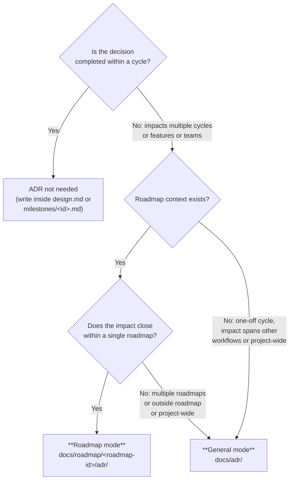

# ADR (Architecture Decision Record) — Common Skill for dev-workflow / dev-roadmap

Use case category: **Document & Asset Creation**
Design pattern: **Domain Intelligence** (embeds the writing style and operating rules of the ADR domain)

This skill provides the format and operating rules for permanently recording **decisions whose impact extends beyond an individual dev-workflow cycle**. It divides responsibility with `design.md` (cycle-specific design decisions) and Retrospective (volatile reflections), serving as **long-lived decision records that continue to be referenced after a cycle / roadmap is completed**.

## Application Modes and Storage Locations (Core Rules)

ADRs use one of two modes depending on **the context in which they are filed**. The determination is made at filing time by Main evaluating the scope, and is explicitly stated in the ADR body.

| Mode             | Storage location                                      | Filing decision essence                                                                                             | Main filing origins                                                                                  |
| ---------------- | ----------------------------------------------------- | ------------------------------------------------------------------------------------------------------------------- | ---------------------------------------------------------------------------------------------------- |
| **General mode** | `docs/adr/<YYYY-MM-DD-title>.md`                      | A decision that "**spans multiple roadmaps / multiple independent workflows**" or becomes a "**project-wide norm**" | dev-workflow Step 3 (when a cross-cutting decision occurs) / dev-roadmap Step 1 to 4 / one-off use   |
| **Roadmap mode** | `docs/roadmap/<roadmap-id>/adr/<YYYY-MM-DD-title>.md` | Context, premises, or norms "**shared by multiple dev-workflow cycles under a single roadmap**"                     | dev-roadmap Step 1 to 4 / dev-workflow cycles under it Step 3 (when invoked under a roadmap context) |

### Mode decision flow

A quick reference for the filing decision:



### Filing target examples per mode

#### General mode (`docs/adr/`)

- "Adopt Effect across the entire project"
- "Make gRPC the default communication convention for all services"
- "Unify the authorization layer on OpenFGA"
- "Convention for an event bus shared across the `oauth-rollout` roadmap and `notification-platform` roadmap" (spanning multiple roadmaps)
- "Cache layer separation policy that both dev-workflow cycle A (search platform overhaul) and the independently-running dev-workflow cycle B (CDN configuration overhaul) rely on" (spanning independent cycles)
- "Operating policy of pnpm workspace catalog", "Unification of monorepo lint / format rules"

#### Roadmap mode (`docs/roadmap/<roadmap-id>/adr/`)

- "`AuthSession` type definition shared across all dev-workflow cycles under `oauth-rollout`" (spanning cycles within a roadmap)
- "Policy of requiring 3D Secure 2 across the entire `payment-modernization` roadmap" (roadmap-shared constraint)
- "Within the `notification-platform` roadmap, on delivery error enqueue to the retry queue" (shared between cycles within a roadmap)
- "In `feed-platform`, fix the canonical schema for feeds at v2, with ingest / delivery / search cycles under it referring to it commonly"

#### ADR not needed (write inside `design.md` / inside `milestones/<id>.md`)

- "Use LRU as the cache strategy for this feature"
- "Pagination for this API is cursor-based"
- "Write validation for this screen with zod"
- "Retry interval inside this milestone is exponential backoff" (closes within a milestone -> write inside `milestones/<id>.md`)

### Promotion / demotion between Roadmap mode and General mode

- **Promotion (Roadmap -> General)**: If an ADR written in Roadmap mode is found to also impact other roadmaps or independent workflows, file a new General mode ADR and append "`Superseded by docs/adr/<new-ADR>.md`" to the body of the old Roadmap mode ADR while keeping `confirmed: true` (per the immutability principle, do not rewrite the file content; only prepend an addendum)
- **Demotion is, in principle, prohibited**: Do not demote a General mode ADR to Roadmap mode (narrowing the scope of application would break past references)

---

## File Specification

### File name

Common across all modes:

!`echo "$(date +%Y-%m-%d)-title.md"`

- Date prefix is mandatory (`YYYY-MM-DD`)
- title is a short alphanumeric hyphenated string representing the domain (kebab-case recommended)
- Examples: `2026-04-26-dev-workflow-rename-and-flatten.md` / `2026-04-29-feed-platform-canonical-schema-v2.md`

### Frontmatter

All ADRs have the following YAML frontmatter:

```yaml
---
confirmed: false
scope: general | roadmap:<roadmap-id>
---
```

| Field       | Type    | Description                                                                                          |
| ----------- | ------- | ---------------------------------------------------------------------------------------------------- |
| `confirmed` | boolean | `true`: confirmed (in principle immutable) / `false`: proposal (awaiting review)                     |
| `scope`     | string  | `general` (= under `docs/adr/`) or `roadmap:<roadmap-id>` (= under `docs/roadmap/<roadmap-id>/adr/`) |

The `scope` field must match the storage location and serves as an index for distinguishing the two modes via grep / programmatic filtering. ADRs with `scope: roadmap:<roadmap-id>` are referenceable from any dev-workflow cycle under that roadmap, and ADRs with `scope: general` are referenceable from the entire repository.

### Body structure

```markdown
---
confirmed: false
scope: general
---

# ADR: Title

## Context

Background of why this decision is necessary. Explicitly state the **scope range** (which roadmap / which workflow / which project-wide norm it applies to).

## Decision

The specific design decision. Describe table design / API design / route design / library adoption / policy declarations, etc. Briefly list 2-3 alternatives that serve as comparative material backing the decision.

## Consequences

The scope of impact arising from this decision.

- Newly added: new tables / modules / routes / conventions, etc.
- Existing impact: existing code / existing operations that need to change
- Constraints: constraints that must be observed when this decision is taken as a premise going forward

## Related

Bullet list of links to related existing ADRs / `roadmap.md` / `milestones/<id>.md` / `design.md`, etc. (may be omitted if not applicable).
```

---

## Operating Rules

### 1. Filing process

1. Make the ADR filing decision (the "Mode decision flow" above). If the decision is ambiguous, confirm via the In-Progress user query format (temporary report: `$TMPDIR/dev-workflow/adr-scope-decision.md` or `$TMPDIR/dev-roadmap/adr-scope-decision.md`)
2. Confirm the storage directory's existence (create if missing):
   - General mode: `docs/adr/`
   - Roadmap mode: `docs/roadmap/<roadmap-id>/adr/`
3. Determine the file name `<YYYY-MM-DD>-<title>.md` (see the "File name" rule above)
4. Author according to the Frontmatter + Body structure above. File with `confirmed: false`
5. Submit for user review (place it on the gate determination of the originating dev-workflow / dev-roadmap step)
6. After approval, update to `confirmed: true` and save in the same commit

### 2. Immutability Principle

- The body of `confirmed: true` ADRs is, in principle, not modified
- When circumstances change and a previous decision needs to be revised, **file a new ADR and reference the old one as Superseded** (modifying the old ADR's body is prohibited)
- Only a single-line addendum `> Superseded by [new ADR](path)` to the end of the old ADR's body is permitted (keeping `confirmed: true`, scope changes are not allowed)

### 3. ADR reference rules

- Before starting implementation, check **existing ADRs in the relevant scope**:
  - One-off dev-workflow cycle: all of `docs/adr/`
  - dev-workflow cycle (under a roadmap): both `docs/adr/` + `docs/roadmap/<roadmap-id>/adr/`
  - dev-roadmap cycle: both `docs/adr/` + `docs/roadmap/<roadmap-id>/adr/`
- Do not perform implementation / design that contradicts a `confirmed: true` ADR
- If a decision that contradicts an ADR becomes necessary unless that ADR is taken into account, **file a new ADR (or supersede ADR) first** before proceeding to implementation

### 4. Coordination with filing origins

- **dev-workflow Step 3 (Design)**: When the `architect` Specialist discovers a "decision spanning cycles", report to Main. Main makes the mode determination, and `architect` (or, separately, by Main's judgment) files the ADR. Link from `design.md` to that ADR
- **dev-workflow `progress.yaml`**: Record the path of the filed ADR in `progress.yaml.artifacts.external_adrs` (for both General / Roadmap mode)
- **dev-roadmap Step 1 to 2 (Roadmap Intent / Milestone Decomposition)**: When `roadmap-analyst` / `roadmap-planner` discovers a roadmap-shared norm, file a Roadmap mode ADR per Main's judgment. Link from `roadmap.md` / `milestones/<id>.md` to that ADR
- **dev-roadmap Step 4 (Roadmap Retrospective)**: If a roadmap-shared insight derived in the retrospective is a long-lived premise, `roadmap-retrospective-writer` proposes a Roadmap mode ADR (Main makes the filing decision)

### 5. Division of role with retrospective

|             | ADR                                                      | retrospective.md / roadmap-retrospective.md           |
| ----------- | -------------------------------------------------------- | ----------------------------------------------------- |
| Persistence | Persistent (immutable when `confirmed: true`)            | Volatile (deleted once the next cycle digests it)     |
| Content     | Decisions and consequences (Decision + Consequences)     | Reflection (good points / issues / next improvements) |
| Scope       | Norms affecting multiple cycles / roadmap / project-wide | Self-evaluation of 1 cycle / 1 roadmap                |
| Storage     | `docs/adr/` or `docs/roadmap/<roadmap-id>/adr/`          | `docs/retrospective/` (aggregated)                    |

Among the improvement proposals derived in retrospective, **decisions that should be permanently recorded** are extracted into ADRs when the retrospective is digested.

---

## Directory Layout

```
docs/
|-- adr/                                       # General mode (cross-roadmap / cross-workflow / project-wide)
|   |-- <YYYY-MM-DD>-<title>.md
|   |-- ...
|-- roadmap/
|   |-- <roadmap-id>/
|       |-- roadmap.md
|       |-- milestones/<milestone-id>.md
|       |-- roadmap-progress.yaml
|       |-- adr/                               # Roadmap mode (within single roadmap, across cycles)
|           |-- <YYYY-MM-DD>-<title>.md
|           |-- ...
|-- workflow/
|   |-- <identifier>/
|       |-- ...                                # dev-workflow cycle artifacts (does NOT host ADRs directly)
|-- retrospective/
    |-- <identifier>.md                        # dev-workflow retrospective (volatile)
    |-- roadmap-<roadmap-id>.md                # dev-roadmap retrospective (volatile, prefix avoids collision)
```

- Do not place ADRs under `docs/workflow/<identifier>/` (cycle-specific decisions are written inside `design.md`)
- Placing an `adr/` subdirectory under `docs/roadmap/<roadmap-id>/` is for Roadmap mode. Create as needed when starting Step 1 / 2 (may be created on demand at filing time; do not commit empty directories)

---

## What This Skill Does NOT Cover

- Design decisions completed within a single cycle -> write inside `design.md` (`share-artifacts/references/design.md`)
- Direction completed within a milestone -> write inside `milestones/<id>.md`
- Meeting notes / memos -> no corresponding skill (follow this repository's conventions)
- Retrospective (volatile report) -> `docs/retrospective/<identifier>.md` or `docs/retrospective/roadmap-<roadmap-id>.md` (`share-artifacts/references/retrospective.md` / `roadmap-retrospective.md`)
- Roadmap Intent itself -> `roadmap.md` (`share-artifacts/references/roadmap.md`)
- CHANGELOG / release notes -> no corresponding skill
- Overusing ADR as a "substitute for design documents" (if it looks like 5 or more ADRs would be written within a single cycle, the granularity is likely wrong; consider integrating into `design.md`)
