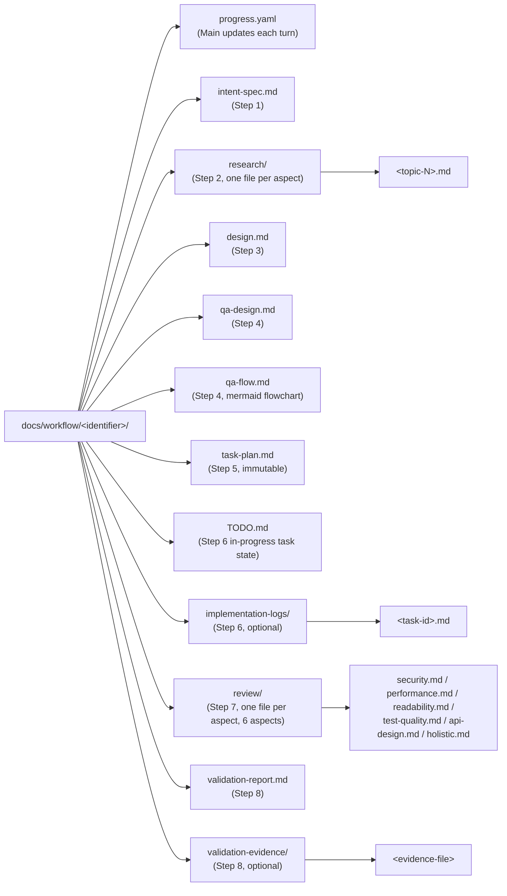
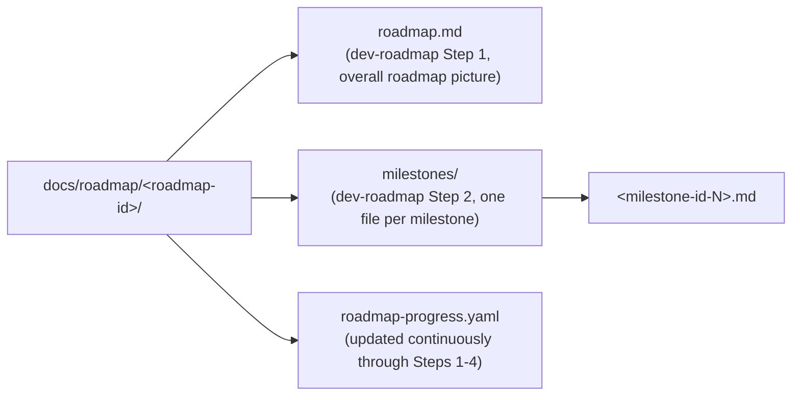

# Shared Artifacts — dev-workflow Artifact Reference

Use case category: **Document & Asset Creation** (a table-of-contents skill that aggregates artifact specifications and templates).
Design pattern: **Domain Intelligence** (embeds the writing style and quality criteria of the artifact domain).

For all artifacts created in the dev-workflow workflow, this skill aggregates **authoring guides (`share-artifacts/references/`) and templates (`share-artifacts/templates/`)**.

**Path notation rule:** when referencing artifact files within this skill, use the relative path `share-artifacts/references/<name>.md` / `share-artifacts/templates/<name>.md` from the plugin root in a unified manner (the same form used when referenced from other skills).

**1:1 file-name correspondence and exceptions:** references and templates **correspond as files of the same name in principle** (e.g. `references/intent-spec.md` ↔ `templates/intent-spec.md`). The following 3 cases are intentional exceptions, linked through column correspondence in the table of contents:

- `references/progress-yaml.md` ↔ `templates/progress.yaml` (the authoring guide is Markdown while the template is loaded as YAML, so the extensions differ)
- `references/todo.md` ↔ `templates/TODO.md` (`TODO.md` follows the conventional uppercase notation as an artifact, while the reference side prioritizes the kebab-case file naming rule)
- `references/roadmap-progress-yaml.md` ↔ `templates/roadmap-progress.yaml` (the progress YAML for dev-roadmap. The authoring guide is Markdown while the template is loaded as YAML, so the extensions differ. Same reason as `progress.yaml`.)

No artifact other than these 3 may be added that breaks the same-name correspondence.

## Prerequisites

- Main manages the artifacts and Specialists create them
- Each artifact is stored under `docs/workflow/<identifier>/` (details: "Artifact storage structure" in `dev-workflow`)
- references and templates are in **1:1 correspondence**, linked by file name
- When filling in a template, a Specialist must always refer to the corresponding reference
- When reviewing an artifact, Main uses the corresponding reference as the quality criterion

## Artifact list (table of contents)

| #   | Artifact                                                                | Phase / Step                                              | Author                                                                           | Reference                                             | Template                                             |
| --- | ----------------------------------------------------------------------- | --------------------------------------------------------- | -------------------------------------------------------------------------------- | ----------------------------------------------------- | ---------------------------------------------------- |
| 1   | `progress.yaml`                                                         | All cycles                                                | Main (maintained each turn)                                                      | `share-artifacts/references/progress-yaml.md`         | `share-artifacts/templates/progress.yaml`            |
| 2   | `intent-spec.md`                                                        | Step 1                                                    | Main (Step 1 is Main-only)                                                       | `share-artifacts/references/intent-spec.md`           | `share-artifacts/templates/intent-spec.md`           |
| 3   | `research/<topic>.md`                                                   | Step 2                                                    | `researcher` specialist (parallel per aspect)                                    | `share-artifacts/references/research-note.md`         | `share-artifacts/templates/research-note.md`         |
| 4   | `design.md`                                                             | Step 3                                                    | `architect` specialist                                                           | `share-artifacts/references/design.md`                | `share-artifacts/templates/design.md`                |
| 5   | `qa-design.md`                                                          | Step 4                                                    | `qa-analyst` specialist                                                          | `share-artifacts/references/qa-design.md`             | `share-artifacts/templates/qa-design.md`             |
| 6   | `qa-flow.md`                                                            | Step 4                                                    | `qa-analyst` specialist                                                          | `share-artifacts/references/qa-flow.md`               | `share-artifacts/templates/qa-flow.md`               |
| 7   | `task-plan.md`                                                          | Step 5                                                    | Main (Step 5 is Main-only)                                                       | `share-artifacts/references/task-plan.md`             | `share-artifacts/templates/task-plan.md`             |
| 8   | `TODO.md`                                                               | Throughout Steps 6-7                                      | Main (generated from `task-plan.md`)                                             | `share-artifacts/references/todo.md`                  | `share-artifacts/templates/TODO.md`                  |
| 9   | `implementation-logs/<id>.md`                                           | Step 6                                                    | `implementer` specialist (parallel per task)                                     | `share-artifacts/references/implementation-log.md`    | `share-artifacts/templates/implementation-log.md`    |
| 10  | `review/<aspect>.md`                                                    | Step 7                                                    | `reviewer` specialist (6 aspects in parallel)                                    | `share-artifacts/references/review-report.md`         | `share-artifacts/templates/review-report.md`         |
| 11  | `validation-report.md`                                                  | Step 8                                                    | `validator` specialist                                                           | `share-artifacts/references/validation-report.md`     | `share-artifacts/templates/validation-report.md`     |
| 12  | `docs/retrospective/<id>.md`                                            | Step 9 (aggregated)                                       | Main (Step 9 is Main-only)                                                       | `share-artifacts/references/retrospective.md`         | `share-artifacts/templates/retrospective.md`         |
| 13  | `roadmap.md`                                                            | dev-roadmap Step 1                                        | Main (roadmap Step 1 is Main-only)                                               | `share-artifacts/references/roadmap.md`               | `share-artifacts/templates/roadmap.md`               |
| 14  | `milestones/<milestone-id>.md`                                          | dev-roadmap Step 2                                        | Main (roadmap Step 2 is Main-only)                                               | `share-artifacts/references/milestone.md`             | `share-artifacts/templates/milestone.md`             |
| 15  | `roadmap-progress.yaml`                                                 | dev-roadmap Steps 1-4                                     | Main (autonomously updated through both layers)                                  | `share-artifacts/references/roadmap-progress-yaml.md` | `share-artifacts/templates/roadmap-progress.yaml`    |
| 16  | `docs/retrospective/roadmap-<roadmap-id>.md`                            | dev-roadmap Step 4                                        | Main (roadmap Step 4 is Main-only)                                               | `share-artifacts/references/roadmap-retrospective.md` | `share-artifacts/templates/roadmap-retrospective.md` |
| 17  | PR description (persisted only on GitHub)                               | All cycles (each Step)                                    | Main (via `gh pr edit`)                                                          | `share-artifacts/references/pr-body.md`               | `share-artifacts/templates/pr-body.md`               |
| 18  | `docs/adr/<file>.md` or `docs/roadmap/<roadmap-id>/adr/<file>.md` (ADR) | Cross-cycle / cross-roadmap (Step 3, Step 9, roadmap 1-4) | Main (specialists may surface candidates; Main decides mode and authors / files) | `share-artifacts/references/adr.md`                   | `share-artifacts/templates/adr.md`                   |

## When to use Reference vs. Template

### Reference (`share-artifacts/references/<name>.md`)

**The authoring guide for the artifact.** Includes:

- Purpose: why this artifact exists
- Author and timing: at which step and by whom it is created
- How to write each section: concrete guidance for filling in the placeholders
- Quality criteria: what makes a good or bad artifact (good examples / bad examples)
- Relationship to related artifacts: input/output linkages

**Who reads it:**

- **Specialist**: as guidance during creation
- **Main**: as quality criteria during review
- **User**: as background context for understanding the artifact

### Template (`share-artifacts/templates/<name>.md`)

**The skeleton to be filled in.** Placeholders are in `{{name}}` form (open to migration to e.g. EJS in the future).

- A Specialist copies the template into `docs/workflow/<identifier>/` and fills in the placeholders
- All placeholders must be filled in, or explicitly marked "N/A" or similar if not applicable

## How to use it

### When a Specialist creates an artifact

1. Read the corresponding `share-artifacts/references/<name>.md` to understand how to write it
2. Copy `share-artifacts/templates/<name>.md` into `docs/workflow/<identifier>/<artifact>.md`
3. Fill in the placeholders (following the guidance in the reference)
4. Once complete, return the artifact to Main

### When Main reviews an artifact

1. Refer to the quality criteria in the corresponding `share-artifacts/references/<name>.md`
2. Check that the artifact meets those criteria
3. If insufficient, send it back to the responsible Specialist for revision (give feedback to the same instance, do not create a new one)

## Rules for changing References / Templates

- When a Reference is updated, also verify consistency of the Template from the same perspective (maintain 1:1 correspondence)
- When adding a new artifact, add both the Reference and Template at the same time and register it in the SKILL.md table of contents
- When project-specific customization is needed, the principle is to update this plugin's main body rather than create a derivative version in the project

---

## Artifact storage structure (cycle working directory)

The artifacts and progress records of dev-workflow are **aggregated under a directory dedicated to each cycle** and committed to the repository. This makes **interruption and resumption** of work possible (a different session can read the same directory and grasp the current location).

### Directory structure

The Step 9 (Retrospective) artifact `<identifier>.md` is aggregated outside the cycle working directory under `docs/retrospective/` (see "Artifacts outside the cycle" below for details).

For details on how to write each file, refer to `share-artifacts/references/<name>.md`.

### roadmap working directory

The roadmap artifacts under the `dev-roadmap` skill are aggregated in an independent directory `docs/roadmap/<roadmap-id>/` placed **in parallel with** the cycle working directory (`docs/workflow/<identifier>/`). By being physically separated from the underlying `dev-workflow` cycles, the strategic layer (roadmap) and the tactical layer (workflow cycles) can run in parallel without polluting each other's working directory.

The Step 4 (Roadmap Retrospective) artifact `roadmap-<roadmap-id>.md` is aggregated outside the roadmap working directory under `docs/retrospective/` (see "Artifacts outside the cycle" below for details). The artifacts of the underlying `dev-workflow` cycles (`docs/workflow/<identifier>/`) are not included in this directory; instead they are linked bidirectionally through `roadmap-progress.yaml.milestones[].workflow_identifiers[]`.

#### Naming rules for `<roadmap-id>`

Decide it per project, like `<identifier>`. Candidates:

- Strategic objective name (e.g. `oauth-platform`, `multi-tenant-foundation`)
- Date + slug (e.g. `2026-04-29-payment-overhaul`)
- Roadmap ticket ID (e.g. `EPIC-1234`)

Decided by agreement between Main and the user when the roadmap is started. Take care that it does not clash with the `<identifier>` of the underlying `dev-workflow` cycles (the aggregated `docs/retrospective/` avoids collisions via the `roadmap-` prefix; see "Artifacts outside the cycle" below).

### Naming rules for `<identifier>`

Decide it per project. Candidates:

- Ticket ID (e.g. `JIRA-1234`, `issue-567`)
- Feature name (e.g. `user-auth-refactor`, `oauth-support`)
- Date + slug (e.g. `2026-04-24-cache-layer`)

Decided by agreement between Main and the user when the cycle starts. If a naming rule already exists in the project, follow it.

### Artifacts outside the cycle

The following are stored **outside** the cycle working directory (`docs/workflow/<identifier>/`):

#### ADRs that cross cycle boundaries (General / Roadmap mode)

- **Storage location:**
  - **General mode** (decisions affecting multiple roadmaps / multiple independent dev-workflow cycles / the entire project): `docs/adr/<YYYY-MM-DD-title>.md`
  - **Roadmap mode** (decisions shared by multiple cycles under a single roadmap): `docs/roadmap/<roadmap-id>/adr/<YYYY-MM-DD-title>.md`
- **Filing conditions:** only when a decision made within a cycle **has an impact beyond the current cycle**. For mode determination (which storage location to use), see "Mode determination flow" in `share-adr/SKILL.md`. For whether to write it inside `design.md` or file an ADR, see "ADR filing decision criteria" in `share-artifacts/references/design.md`
- **Reference from the cycle:** record the path in `progress.yaml.artifacts.external_adrs` (General / Roadmap mode are listed at the same level; scope is identified by the `scope: general` / `scope: roadmap:<roadmap-id>` frontmatter in the ADR itself), and link from `design.md`
- **Lifecycle:** persistent. Immutable once `confirmed: true` (detailed format and operational rules are aggregated in `share-adr/SKILL.md`)

#### Retrospective (Step 9 artifact)

- **Storage location:** `docs/retrospective/<identifier>.md` (an aggregated directory, same pattern as `docs/adr/`)
- **Creation timing:** generated by `retrospective-writer` upon Step 9 completion
- **Lifecycle:** **volatile**. A temporary report box that is deleted once the next cycle has consumed its improvement items. Decisions that should be persistently recorded are extracted into ADRs
- **Contrast with ADR:** ADRs are persistent records (immutable with `confirmed: true`); retrospectives are volatile reports

The roadmap retrospective from `dev-roadmap` Step 4 is also stored in the same aggregated directory as `docs/retrospective/roadmap-<roadmap-id>.md` (the `roadmap-` prefix avoids name clashes with the `<identifier>.md` files of the underlying `dev-workflow` cycles). For details, see `share-artifacts/references/roadmap-retrospective.md`.

#### Temporary report for in-progress user inquiries

- **Storage location:** `$TMPDIR/dev-workflow/<phase>-<step>-<purpose>.md`
- **Role:** used only for user-decision requests in the middle of work (handling Blockers, presenting options, etc.). Not used for the approval gate at step completion
- **Commit:** **not committed.** Only the count and topic summary are reflected in `retrospective.md` during the Retrospective
- **Detailed usage:** see "Basic policies" section in `dev-workflow` (Artifact-as-Gate-Review / Report-Based Confirmation for In-Progress Questions)

#### PR description (`#17`, volatile artifact + persisted on GitHub)

- **Template:** `share-artifacts/templates/pr-body.md`. Authoring guide: `share-artifacts/references/pr-body.md`
- **Volatile output destination:** `$TMPDIR/dev-workflow/<identifier>-pr-body.md` (regenerated by Main immediately before sending it via `gh pr edit --body-file`)
- **Persistent destination:** GitHub PR body (not persisted in the repository, per the Single-Source-of-Progress principle)
- **Update timing:** at cycle initialization + immediately after each step completion commit (mandatory, 9 times) + as needed
- **Responsibility:** exclusive to Main (see `specialist-common §7`; Specialists do not run `gh pr edit`)
- **PR operations procedure (write/read in general):** see the `share-pr-manager` skill
- **How to fill the CI status section:** see the `share-ci-monitoring` skill

---

## Artifact lifecycle

### From creation to approval

1. Main launches the appropriate Specialist (passing the template, reference, and input artifact paths)
2. The Specialist copies `share-artifacts/templates/<name>.md` into `docs/workflow/<identifier>/<artifact>.md`
3. Following the guidance in `share-artifacts/references/<name>.md`, fills in all placeholders
4. The Specialist returns the artifact path + a summary to Main
5. Main reviews the artifact against the quality criteria in `share-artifacts/references/<name>.md`
6. If insufficient, sends feedback back to the **same Specialist instance** (does not terminate it)
7. If a user approval gate exists, Main presents the artifact itself for approval (no temporary report is created)

### Commit conventions

Artifacts must be reflected in the repository at step completion. For details, see "Step completion commit conventions" in `dev-workflow`.

### Behavior on resumption

When a different session / user resumes an interrupted cycle, the design ensures that the context can be fully restored solely from the files under `docs/workflow/<identifier>/`. For the detailed resumption protocol, see "Session resumption" in `dev-workflow`.

---

## What this skill does not cover

- Workflow procedures (how to advance steps / commit conventions / resumption protocol) → `dev-workflow`
- Specialist role definitions and failure modes → `specialist-*` skills
- Specialist common rules → `specialist-common`
- Agent invocation entry points → `agents/*.md`
- Documents other than artifacts (project documents such as CLAUDE.md)

---

## Triggering examples (Triggering Test)

**Should trigger:**

- "Tell me how to write `intent-spec.md`", "I want to copy the `design.md` template"
- A scene where Main decides "I want to review the Step 5 artifact"
- A scene where a Specialist confirms the writing style and quality criteria before creating an artifact

**Should NOT trigger:**

- "Start Steps 1-5 (Intent Clarification through Task Decomposition)" → `dev-workflow`
- "Review as architect" → `specialist-architect`
- "Update CLAUDE.md" → outside the scope of this skill
