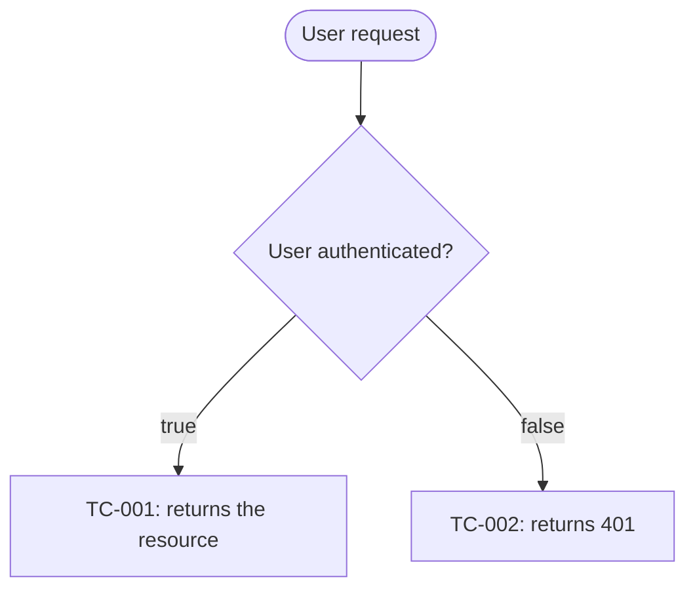
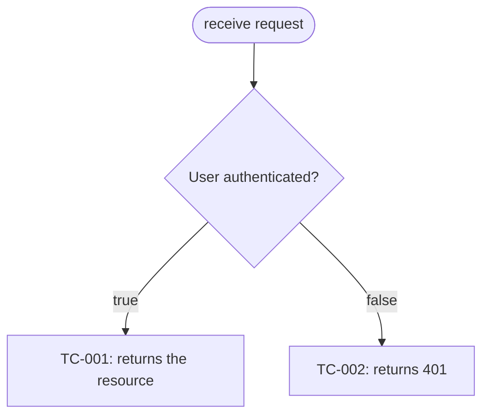
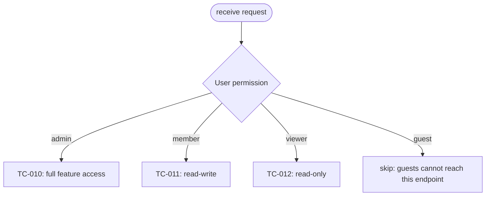
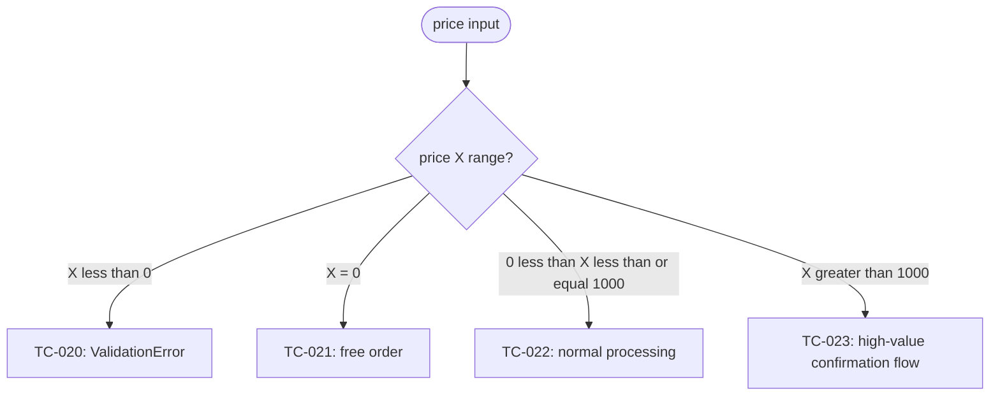
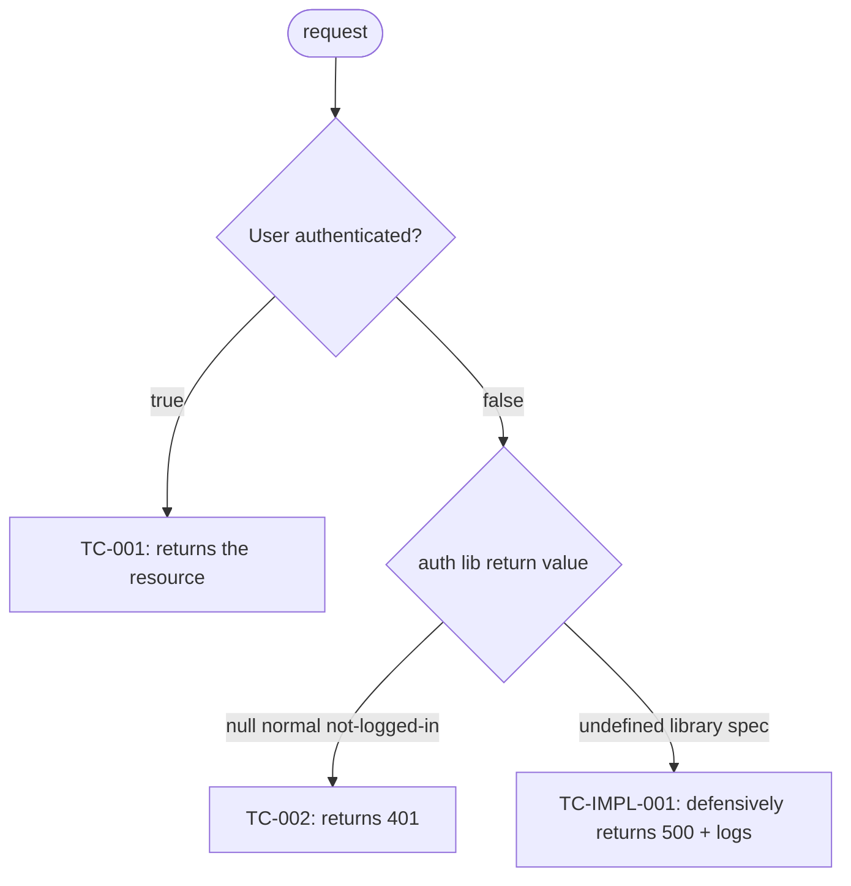

# Reference: How to write `qa-flow.md`

## Purpose

**Visualize** the test case table of `qa-design.md` **as Mermaid flowcharts**. By depicting the branching structure of tests in a form reviewers can survey at a glance, this lowers the cognitive load of confirming test coverage (this is the fundamental reason this file exists). The leaves of each branch hold the TC-ID from `qa-design.md` or `skip` (with reason).

## Author / creation timing

- **Author:** `qa-analyst` Specialist (initial creation in Step 4)
- **Updater:** `implementer` Specialist (appends branches discovered in Step 6)
- **Approval:** user approval required at Step 4 completion (same review gate as qa-design.md)

## File location

`docs/workflow/<identifier>/qa-flow.md`

## File format

A **Markdown file** containing **one or more Mermaid code blocks**. For complex cases, **multiple code blocks may be split** by concern. GitHub's native Markdown renderer auto-renders Mermaid.

## Section structure

```text
1. # qa-flow (title)
2. ## Overview (guide on the structure of qa-flow.md and how to read it)
3. ## (concern 1)
   - SCs covered (1 line)
   - mermaid code block (flowchart TD)
4. ## (concern 2)
   - same as above
5. ## Cross-cutting processes (optional, error handling etc.)
   - same as above
6. ## Implementation-detail branches (optional, displaying independent TC-IMPLs together)
   - same as above
```

### How to write each section

#### Overview

A 2-5 line guide on the structure of qa-flow.md (the splitting policy by concern / whether cross-cutting processes exist / whether the implementation-detail branches section exists). Functions as a table of contents telling the reviewer which section to read first.

#### Per-concern sections

Each section consists of:

1. `##` (h2) heading with the concern name (e.g. `## Authentication and authorization`, `## Order processing`)
2. One line stating "SCs covered: SC-X, SC-Y"
3. A Mermaid code block (flowchart TD)

Example:

````markdown
## Authentication and authorization

SCs covered by this section: SC-1, SC-2, SC-5


````

#### Cross-cutting processes (optional)

Bundle **cross-cutting concerns** such as error handling, logging, retries into a single flow diagram. Use this when distributing them across concerns 1-N would obscure the picture.

#### Implementation-detail branches (optional)

Aggregate `TC-IMPL-NNN` that cannot be incorporated into existing flowcharts. Used when the implementer in Step 6 judges that "library-driven branches are too independent to fit naturally into existing flows".

## Main syntax of Mermaid `flowchart TD`

### Node shapes

| Syntax        | Meaning      | Use                          |
| ------------- | ------------ | ---------------------------- |
| `A[Label]`    | Rectangle    | Normal node / test case      |
| `A([Label])`  | Stadium      | start / end                  |
| `A{Label}`    | Diamond      | Decision (if condition / switch) |
| `A((Label))`  | Circle       | Sub-step                     |
| `A[[Label]]`  | Subroutine   | Reference to another flowchart |

### Arrows (edges)

| Syntax     | Meaning                |
| ---------- | ---------------------- | --- | ----------------------------------- |
| `A --> B`  | Normal transition      |
| `A -->     | label                  | B`  | Labeled transition (writes the value of a conditional branch) |
| `A -.-> B` | Dotted (optional)      |
| `A ==> B`  | Thick (emphasizing the main path) |

## Distinguishing branches (if vs switch)

### if branch (true/false)

For simple binary choices, use a `{Cond?}` diamond + `-->|true|` `-->|false|` labels.



### switch branch (multi-way)

For multi-way choices like enum values / roles / statuses, use a `{State}` diamond + multiple labeled arrows.



### Boundary-value branches (numeric ranges)

For numeric threshold judgments, label each range in switch form.



Note: `<` `>` may fail to parse inside Mermaid labels. Substitute with English notation (`less than`, `greater than`) or `lt` / `gt`.

## Conventions for leaf nodes

### TC-ID leaf (test case)

Each leaf points to a test case ID in `qa-design.md`:

- `TC-NNN` (essential test) and `TC-IMPL-NNN` (implementation-detail test) **may coexist in the same flowchart** (the ID prefix is enough to distinguish them)
- The node label is in the form `[TC-001: brief behavior description]` (recommend within 30 characters considering Mermaid display width; details in qa-design.md)

### skip leaf

When you **intentionally do not place a test** because it is unreachable / handled in another flowchart / Validation is unnecessary (already guaranteed by the spec), etc.:

- Shape: a rectangle node `[skip: reason]`
- **Reason required**: write in the leaf label why it is being skipped
- Skips without a reason are forbidden (anti-pattern that hides test omissions)

Example:

```mermaid
flowchart TD
  Start([access]) --> Q{User state}
  Q -->|logged in| TC1[TC-001: dashboard display]
  Q -->|not logged in| TC2[TC-002: redirect to login screen]
  Q -->|account suspended| Skip[skip: unreachable due to guard condition (login.ts:L42)]
```

## Splitting guidelines

### Why split

When a single flowchart exceeds **15-20 nodes**, it becomes hard to follow visually. This deviates from the goal of lowering the reviewer's cognitive load, so split appropriately.

### Priority of splitting units

1. **Concerns (concern)** ← primary axis (functional domains: authentication / orders / notifications, etc.)
2. **Subsystems** (frontend / backend / DB) — do not forcibly split branches that span UI to DB
3. **Success criteria groups** (one section for SC-1 to SC-3, another for SC-4 to SC-6) — when prioritizing traceability with the Intent Spec

The primary axis is **concerns**, but qa-analyst can choose depending on the structure of design.md.

### Concrete rules for splitting

- 1 section = 1 Mermaid code block
- Section headings aligned at `##` (so the table of contents can jump)
- Immediately before each section, declare "SCs covered: SC-X, SC-Y" on a single line
- Cross-cutting processes (error handling, etc.) are described as a separate diagram in a dedicated section

## Policy for incorporating implementation-detail tests

`TC-IMPL-NNN` (implementation-detail tests) **must always be illustrated in qa-flow.md** (to lower the cognitive load of confirming test coverage, this file's fundamental purpose).

### Incorporation patterns

- **Can be incorporated into the existing flowchart**: add TC-IMPL-NNN as a branch off the relevant essential test branch. Example: in the authentication flowchart, add a "case where library specification returns `null`" as a branch
- **Difficult to incorporate**: create a new "Implementation-detail branches" section to aggregate them

### Incorporation example (mixed)



## Quality criteria

| Good                                                                  | Bad                                                  |
| --------------------------------------------------------------------- | ---------------------------------------------------- |
| Each flowchart has 15-20 nodes or fewer                               | Hard to read with 30+ nodes                          |
| Every leaf is a TC-ID or `skip [reason]`                              | Empty nodes or "TODO" leaves                         |
| `skip` leaves always have a reason                                    | skip without a reason                                |
| Each section explicitly states "SCs covered" on a single line         | Coverage SC unclear                                  |
| All TC-NNN / TC-IMPL-NNN are consistent with qa-design.md             | TC-IDs in qa-flow.md missing from qa-design.md       |
| Split by concerns                                                     | All features crammed into a single huge flowchart    |

## Related artifacts

- **Input:** `qa-design.md` (the true source of test case IDs)
- **Output destination:** `validation-report.md` (the validator in Step 8 measures leaf coverage)
- **Linkage:** mutual reference with `qa-design.md` (you must not write a TC-ID in qa-flow that does not exist in qa-design, and vice versa)
