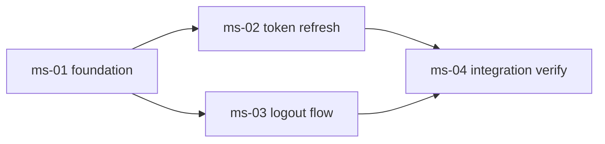

# Reference: `roadmap.md` の書き方

## 目的

複数の `dev-workflow` サイクルにまたがる**戦略層の合意文書**を作成する。1 サイクルの `dev-workflow` では収まらない大規模開発に対し、(i) ロードマップ全体の世界観・スコープ境界、(ii) 観測可能なマイルストーンへの分解、(iii) マイルストーン間の依存関係、を一元的に記録する。配下の各 `dev-workflow` サイクルはこの文書を入力として、自身の Intent Spec を起草する。

`roadmap.md` の品質がロードマップ全体の認知負荷を決めるため、戦略 (何を / どの順で / なぜ) と戦術 (どう作る / どう検証する) の責務分離を明示することが本ドキュメントの最大の役割である。

## 作成者 / 作成タイミング

- **作成者:**
  - Step 1 (Roadmap Intent): `roadmap-analyst` Specialist が背景・目的・スコープ境界・大局的制約・関連リンク・未解決事項のセクションを起草
  - Step 2 (Milestone Decomposition): `roadmap-planner` Specialist が「マイルストーン一覧」テーブルと「依存グラフ」Mermaid を追記
- **承認:** Step 1 / Step 2 それぞれの完了時にユーザー承認必須 (Artifact-as-Gate-Review)

## ファイル位置

`docs/roadmap/<roadmap-id>/roadmap.md`

`docs/workflow/<identifier>/` (= `dev-workflow` 作業ディレクトリ) と**並列配置**。両者は ID 文字列 (`<roadmap-id>` と `<identifier>`) のみで疎結合に接続する。

## 各セクションの書き方

### 背景

なぜ今このロードマップが必要か。**「単一の `dev-workflow` サイクルでは収まらない理由」を必ず示す**こと。例: 「対象モジュールが 5 つあり、各々独立して設計・実装・検証が必要」「3 ヶ月にわたる段階的リプレースのため」「複数の能力獲得を順序立てて積み上げる必要があるため」。単一サイクルで完結する規模であれば `dev-workflow` を直接使うべきであり、そもそも roadmap は不要。

### 目的

1〜3 文で**定性的な到達点**を記述する。**観測可能な成功基準は roadmap 自身が持たない** (`dev-roadmap` スキル全体の非スコープ): 計測手段の特定は配下の各 `dev-workflow` サイクルの `intent-spec.md` の責務である。

| ✅ よい (定性的到達点)                               | ❌ 悪い (観測手段が必要な記述)                     |
| ---------------------------------------------------- | -------------------------------------------------- |
| OAuth 認証が本番運用可能な状態になっている           | OAuth 認証で 95% のユーザーが 200ms 以内にログイン |
| 決済基盤の段階的リプレースが完了している             | 決済 API の p99 が 100ms 未満になっている          |
| 新規データ基盤上で全分析クエリが実行可能になっている | クエリの平均実行時間が現行比 50% 短縮              |

右列に書きたい内容がある場合は、それを実現する個別マイルストーンの `dev-workflow` サイクルが起動された段階でその Intent Spec に記述する。

### スコープ境界 / 非スコープ

- スコープ境界: ロードマップ全体で扱う領域 (モジュール群、機能群、対象ユーザー、対象環境)
- 非スコープ: 意図的に扱わない領域

**非スコープを書かないと、配下サイクル群を追加する過程でスコープが暗黙に広がる。必ず書く。** ただし、`dev-roadmap` スキル全体の非スコープ事項 (roadmap-of-roadmaps、観測可能な成功基準を roadmap に持たせること等) は dev-roadmap/SKILL.md 側に書かれているため、本文書では再掲不要。

### 大局的制約

**複数サイクルを横断して効く制約のみ**を書く。個別サイクル内で完結する制約は配下サイクルの Intent Spec の責務。3 カテゴリ (技術 / 組織 / 規範) を意識する。

- 技術的制約: 共有インフラ、横断的に使う言語・フレームワーク、互換性要件
- 組織的制約: ロードマップ完了期限、サイクル並行起動数の上限、人員配分の前提
- 規範的制約: セキュリティ・コンプライアンス・既存 ADR (`docs/adr/` の General mode、また本 roadmap 配下に既に Roadmap mode ADR がある場合は `docs/roadmap/<roadmap-id>/adr/`)・上位プロダクト方針

### マイルストーン一覧

**Step 2 で `roadmap-planner` が確定するセクション**。Step 1 では空テーブルまたは `{{プレースホルダ}}` のままでよい。

各行は 1 マイルストーンを表し、列は最低でも以下を含む:

- `ID`: `<milestone-id>` (kebab-case 推奨、例: `ms-01-foundation`)
- `タイトル`: 短い説明 (1 行)
- `想定 dev-workflow サイクル数`: 1:1 が推奨だが 1:N も許容する (1:N の根拠は当該マイルストーンの `milestones/<milestone-id>.md` に書く)
- `依存マイルストーン`: 依存先 ID のカンマ区切り、起点なら空
- `詳細`: 対応する `milestones/<milestone-id>.md` への相対リンク

詳細は 1 マイルストーン = 1 ファイルの形で `milestones/<milestone-id>.md` に切り出すこと。詳細を `roadmap.md` に直接書かないことで、依存追加・分割・削除時の差分を局所化できる。

### 依存グラフ

Mermaid **`graph LR`** を採用する。

- `task-plan.md` 等の既存パターンと表記を揃える (`flowchart LR` ではなく `graph LR`)
- 追加レンダラに依存しない (GitHub 標準レンダラで完結)
- ノード数は **15〜20 を推奨上限**とする。それを超える場合はフェーズや責務領域でグラフを分割する

例:

DAG (有向非巡回グラフ) を保つこと。サイクル検知の Lint ツールは導入しないが、起票時に `roadmap-planner` および承認時にユーザーが目視で確認する。

### 関連リンク / 未解決事項

- 関連リンク: 関連 ADR、Issue、上位プロダクト計画書、関係する既存サイクル (`docs/workflow/<identifier>/`)
- 未解決事項: 戦略レベルで残った論点。**配下の `dev-workflow` サイクルが Step 1〜2 で扱う論点はここに書かない** (それは戦術層の責務)。

## 説明性の確保

本ドキュメントを読んだ Main / ユーザーが、任意のゴールを入力としてマイルストーン分解と各マイルストーンの定性的到達点・依存関係を抽出する手順を、追加情報なしに再現できる必要がある。`roadmap.md` を書くときは以下を満たすことで説明性を確保する:

1. **目的セクションが定性的到達点として書かれている**: そこから逆算してマイルストーンを切り出せる
2. **スコープ境界 / 非スコープが排他的かつ網羅的**: マイルストーン候補集合の境界が一意に決まる
3. **依存グラフが DAG**: 起点候補と最終マイルストーン候補が一目で分かる
4. **マイルストーン一覧の粒度**: 単一サイクルでは扱えない規模を意図して roadmap を起こしている前提なので、複数のマイルストーンに分解できることを示す

これらを満たさない `roadmap.md` は Step 2 ユーザー承認ゲートで差し戻される可能性がある。

## 品質基準

| ✅ よい                                          | ❌ 悪い                                              |
| ------------------------------------------------ | ---------------------------------------------------- |
| 目的が定性的到達点として書かれている             | 目的に観測可能基準が混入している (workflow の責務)   |
| 単一サイクルで収まらない理由が背景に書かれている | 単一サイクルで収まる規模なのに roadmap を作っている  |
| マイルストーン一覧と依存グラフが一致している     | 一覧にあるのに依存グラフに無い、またはその逆         |
| Mermaid が `graph LR` で書かれ、ノード数 ≤ 20    | `flowchart LR` 表記、または巨大グラフを 1 枚に詰込み |
| 大局的制約が「複数サイクル横断のもの」だけ       | 個別サイクルの制約まで書き込んで戦術層に侵食している |
| 非スコープが明示されている                       | スコープのみで境界が曖昧                             |

## 関連成果物

- **入力なし** (Step 1 はユーザー対話から起票)
- **後続成果物の前提:**
  - `milestones/<milestone-id>.md` (Step 2 で `roadmap-planner` が分解)
  - `roadmap-progress.yaml` (Step 1 で初期化、Step 2 で `milestones[]` 確定、Step 3 で配下 `dev-workflow` サイクルが自律更新)
  - 配下の各 `dev-workflow` サイクルの `intent-spec.md` (本文書を入力として起草される)
- **変更時の影響:** 一旦確定したマイルストーン依存は配下サイクル進行中に変更しないことを推奨。変更が必要な場合は roadmap Step 2 への回帰と等価。
- **関連:** `references/milestone.md` (1 マイルストーン定義の書き方)、`references/roadmap-progress-yaml.md` (進捗管理 yaml の書き方)、`references/roadmap-retrospective.md` (ロードマップ全体の振り返りの書き方)
