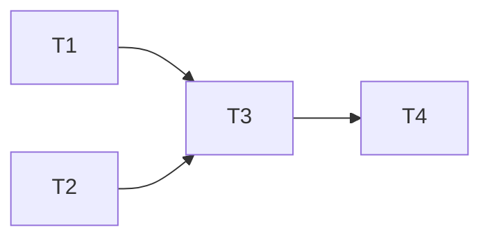

# Reference: How to write `task-plan.md`

## Purpose

Decompose `design.md` into **tasks at an implementable granularity**, and make explicit the dependency relationships, parallelism, and estimates. After the start of Step 6, treat it as **an immutable plan**, and track in-flight state in `TODO.md`.

## Author / creation timing

- **Author:** `planner` Specialist (single instance)
- **Step:** Step 5 (Task Decomposition)
- **Approval:** user approval required (the agreement gate to begin implementation)
- **Changes:** **always immutable** through Steps 6-7. Additional tasks are appended only to the "Subsequently added tasks" section of `TODO.md`, with the diff rationale also recorded at the top of TODO.md (the body of `task-plan.md` is not rewritten). If many additional tasks occur, consider rolling back to Step 5

## File location

`docs/workflow/<identifier>/task-plan.md`

## How to write each section

### Premise

Briefly restate the premise of the Intent Spec and Design Document (so the reader can grasp the gist without opening other documents).

### Task list

Make explicit for each task:

- **Overview:** in 1-2 sentences, what to do
- **Artifacts:** which files are added or changed (specifically by path)
- **Dependent tasks:** task IDs that must be completed first (write "none" if none)
- **Parallel-able:** yes / no. Whether it can run concurrently with other tasks
- **Estimated size:** following project conventions (S/M/L, etc.)
- **Covered test case IDs (optional):** list of TC-NNN from `qa-design.md` (e.g. `TC-001, TC-005`). May be empty. Since the implementer in Step 6 references `qa-design.md` directly, linking at the planner level is not required. Describe only when, for a large task, you want to make explicit "what tests this task covers"
- **Design document reference points:** the relevant chapters and sections of `design.md`

**Test addition policy is not written in task-plan** (the true source is Step 4's `qa-design.md` / `qa-flow.md`). The planner does not invent test strategy; it only cites qa-design.md.

### Dependency graph

Visualize dependencies with a Mermaid diagram:

### Parallel-executable groups (Wave)

Referenced by Main as a parallel launch unit in Step 6:

- Wave 1 (start): T1, T2
- Wave 2: T3 (after T1, T2 complete)
- Wave 3: T4, T5 (after T3 completes, parallel-executable)

### Risks / anticipated Blockers

Predict places where unforeseen events might occur, and leave hints on response policy.

## Task granularity guide

| Good                                                  | Bad                                                  |
| ----------------------------------------------------- | ---------------------------------------------------- |
| One implementer can complete in several hours to 1 day | Huge tasks of multi-day scale                        |
| The artifact files can be identified                  | Vague tasks like "tidy up around X"                  |
| Dependencies are acyclic                              | Inter-task dependencies form a loop                  |

## Quality criteria

| Good                                                              | Bad                                                |
| ----------------------------------------------------------------- | -------------------------------------------------- |
| Tasks are perfectly mutually exclusive (responsibility ranges do not overlap) | Multiple tasks edit the same file                  |
| Parallel-launchable Waves are identified                          | All serial; parallel opportunities are not exploited |
| Design document references are concrete down to the section level | Coarse references like "see `design.md`"           |
| Risks are listed in advance                                       | The risks field is blank                           |

## Related artifacts

- **Inputs:** `design.md` / `intent-spec.md`
- **Output destinations:** `TODO.md` (Main generates at start), input when launching `implementer`
- **Immutability:** not rewritten after confirmation. Additional tasks during Steps 6-7 are managed in `TODO.md`
