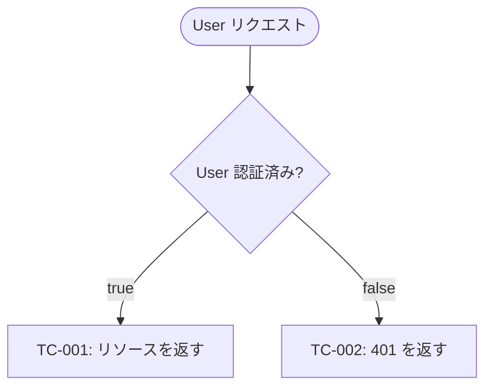
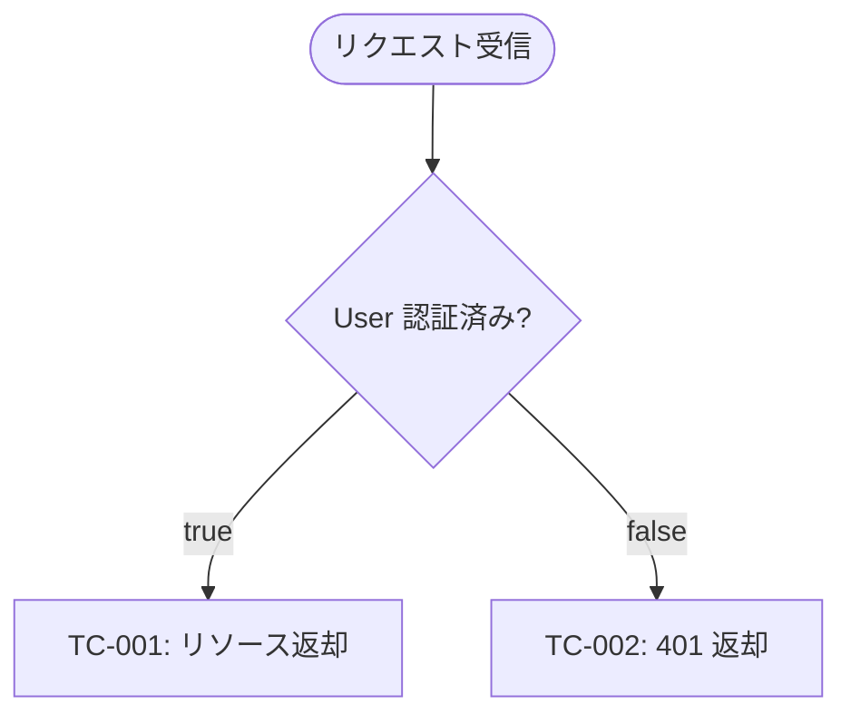
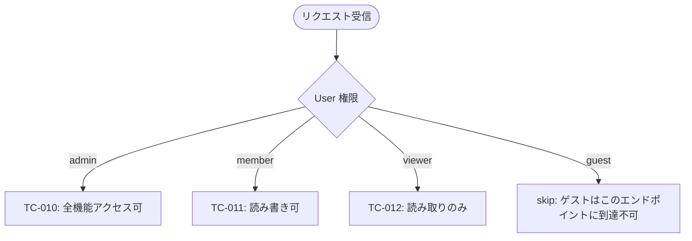
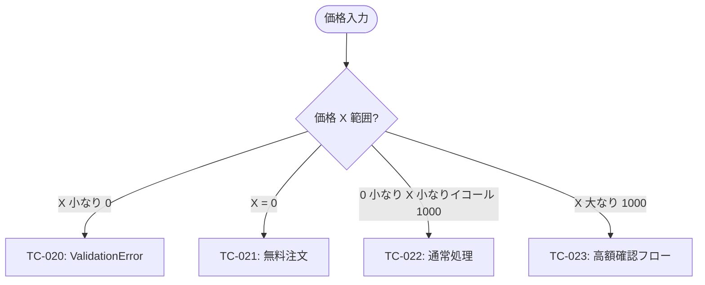
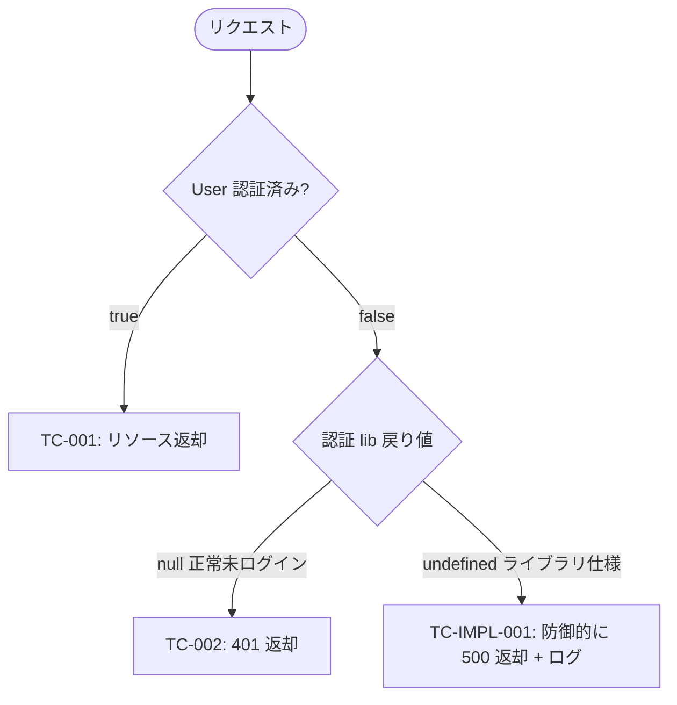

# Reference: `qa-flow.md` の書き方

## 目的

`qa-design.md` のテストケース表を**Mermaid flowchart で可視化**する。テストの分岐構造をレビュアーが俯瞰できる形で図示することで、テスト網羅性確認の認知負荷を下げる (これが本ファイル存在の根本理由)。各分岐の葉には `qa-design.md` の TC-ID または `skip` (理由付き) を配置する。

## 作成者 / 作成タイミング

- **作成者:** `qa-analyst` Specialist (Step 4 で初期作成)
- **更新者:** `implementer` Specialist (Step 6 で発見した分岐を追記)
- **承認:** Step 4 完了時にユーザー承認必須 (qa-design.md と同じレビューゲート)

## ファイル位置

`docs/dev-workflow/<identifier>/qa-flow.md`

## ファイル形式

**Markdown ファイル**に **1 つ以上の Mermaid コードブロック**を含む形式。複雑な場合は関心領域 (concern) ごとに**複数のコードブロックに分割可**。GitHub のネイティブ Markdown レンダラが Mermaid を自動描画する。

## セクション構成

```text
1. # qa-flow (タイトル)
2. ## 概要 (qa-flow.md 全体の構成と読み方の案内)
3. ## (関心領域 1)
   - カバーする成功基準 (1 行)
   - mermaid コードブロック (flowchart TD)
4. ## (関心領域 2)
   - 同上
5. ## 横断的処理 (任意、エラーハンドリング等)
   - 同上
6. ## 実装都合分岐 (任意、独立した TC-IMPL を一括表示)
   - 同上
```

### 各セクションの書き方

#### 概要

qa-flow.md の構成 (関心領域の分割方針 / 横断的処理の有無 / 実装都合分岐セクションの有無) を 2〜5 行で案内。レビュアーがどのセクションから読めばよいかの目次的役割。

#### 関心領域別セクション

各セクションは:

1. `##` (h2) 見出しで関心領域名 (例: `## 認証・認可`, `## 注文処理`)
2. 「カバーする成功基準: SC-X, SC-Y」を 1 行で明示
3. Mermaid コードブロック (flowchart TD)

例:

````markdown
## 認証・認可

このセクションがカバーする成功基準: SC-1, SC-2, SC-5


````

#### 横断的処理 (任意)

エラーハンドリング、ロギング、リトライ等の**横断的関心**を 1 つのフロー図にまとめる。関心領域 1〜N に分散させると見通しが悪い場合に使う。

#### 実装都合分岐 (任意)

既存 flowchart に組み込めない `TC-IMPL-NNN` をここに集約する。Step 6 implementer が「ライブラリ制約由来の分岐が独立しすぎていて既存フローに自然に入らない」と判断した場合に使う。

## Mermaid `flowchart TD` の主要構文

### ノード形状

| 構文         | 意味         | 用途                      |
| ------------ | ------------ | ------------------------- |
| `A[Label]`   | 四角         | 通常ノード / テストケース |
| `A([Label])` | スタジアム   | start / end               |
| `A{Label}`   | 菱形         | 判断 (if 条件 / switch)   |
| `A((Label))` | 円           | 副次的ステップ            |
| `A[[Label]]` | サブルーチン | 別 flowchart への参照     |

### 矢印 (エッジ)

| 構文       | 意味                |
| ---------- | ------------------- | --- | ----------------------------------- |
| `A --> B`  | 通常の遷移          |
| `A -->     | label               | B`  | ラベル付き遷移 (条件分岐の値を記述) |
| `A -.-> B` | 点線 (オプショナル) |
| `A ==> B`  | 太線 (主要パス強調) |

## 分岐の書き分け (if vs switch)

### if 分岐 (true/false)

シンプルな二択は `{Cond?}` 菱形 + `-->|true|` `-->|false|` ラベル。



### switch 分岐 (多択)

enum 値・ロール・ステータスのような多択は `{State}` 菱形 + 多ラベル矢印。



### 境界値分岐 (数値範囲)

数値の閾値判定は switch 形式で各範囲をラベルに。



注: Mermaid のラベル内では `<` `>` がパース失敗する場合あり。日本語表記 (`小なり` `大なり`) や `lt` `gt` で代替。

## 葉ノードの規約

### TC-ID 葉 (テストケース)

各葉は `qa-design.md` のテストケース ID を指す:

- `TC-NNN` (本質テスト) と `TC-IMPL-NNN` (実装都合テスト) を**同じ flowchart に混在可能** (区別は ID prefix で十分)
- ノードのラベルは `[TC-001: 簡潔な振る舞い説明]` の形式 (Mermaid の表示文字数を考慮して 30 文字以内推奨、詳細は qa-design.md を参照)

### skip 葉

到達不能 / 別 flowchart で扱う / Validation 不要 (Spec 上保証済み) などの理由で**意図的にテストを置かない**場合:

- 形状: `[skip: 理由]` の四角形ノード
- **理由必須**: なぜスキップするのかを葉のラベルに記述
- 理由がない skip は禁止 (テスト漏れを隠蔽するアンチパターン)

例:

```mermaid
flowchart TD
  Start([アクセス]) --> Q{User 状態}
  Q -->|ログイン済| TC1[TC-001: ダッシュボード表示]
  Q -->|未ログイン| TC2[TC-002: ログイン画面へリダイレクト]
  Q -->|アカウント停止| Skip[skip: ガード条件で到達不能 (login.ts:L42)]
```

## 分割の指針

### なぜ分割するか

1 つの flowchart で **15〜20 ノードを超える**と視覚的に追いにくい。レビュアーの認知負荷を下げる目的を逸脱するため、適切に分割する。

### 分割単位の優先順位

1. **関心領域 (concern)** ← 主軸 (機能ドメイン: 認証 / 注文 / 通知 等)
2. **サブシステム** (フロントエンド / バックエンド / DB) — UI〜DB 横断する分岐は無理に分けない
3. **成功基準グループ** (SC-1〜SC-3 を 1 セクション、SC-4〜SC-6 を別セクション) — Intent Spec とのトレーサビリティ重視時

主軸は**関心領域**だが、qa-analyst が design.md の構造に応じて選定可。

### 分割の具体ルール

- 1 セクション = 1 Mermaid コードブロック
- セクション見出しは `##` で揃える (目次から飛べる)
- 各セクションの直前に「カバーする成功基準: SC-X, SC-Y」を 1 行で明示
- 横断的処理 (エラーハンドリング等) は専用セクションで別図として記述

## 実装都合テストの組み込み方針

`TC-IMPL-NNN` (実装都合テスト) も **必ず qa-flow.md に図示する** (テスト網羅性確認の認知負荷軽減のため、本ファイルの根本目的)。

### 組み込みパターン

- **既存 flowchart に組み込み可**: 関連する本質テストの分岐の枝として TC-IMPL-NNN を追加。例: 認証 flowchart の中で「ライブラリ仕様で `null` が返るケース」を分岐として追加
- **組み込み困難**: 「実装都合分岐」セクションを新設して集約

### 組み込み例 (混在可)



## 品質基準

| ✅ よい                                              | ❌ 悪い                                       |
| ---------------------------------------------------- | --------------------------------------------- |
| 各 flowchart が 15〜20 ノード以下                    | 30 ノード超で読みにくい                       |
| すべての葉が TC-ID または `skip [理由]`              | 葉が空ノード or 「TODO」                      |
| `skip` 葉に必ず理由が付与                            | 理由なしの skip                               |
| 各セクションに「カバーする成功基準」が 1 行で明示    | カバー基準が不明                              |
| すべての TC-NNN / TC-IMPL-NNN が qa-design.md と整合 | qa-flow.md にあって qa-design.md にない TC-ID |
| 関心領域別に分割されている                           | 全機能を 1 つの巨大 flowchart に詰め込み      |

## 関連成果物

- **入力:** `qa-design.md` (テストケース ID の真のソース)
- **出力先:** `validation-report.md` (Step 8 validator が葉カバレッジを実測)
- **連携:** `qa-design.md` と相互参照 (qa-design に存在しない TC-ID を qa-flow に書いてはいけない、逆も同じ)
