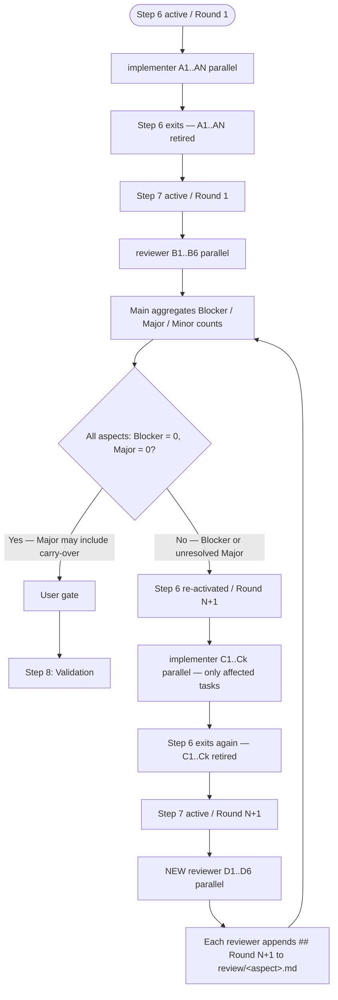

# Step 7: External Review

## Purpose

Verify implementation quality from viewpoints independent of the implementer. Cover both per-aspect deep dives and a `holistic` whole-system check (Task Plan completion judgment, `design.md` consistency, Intent Spec success-criteria reachability, obvious-bug early detection) so rollbacks are minimized.

## Invocation

**Specialist:** `reviewer` × 6 (one per aspect, launched in parallel).

**Justifications:**

- **Parallelism (P):** the 6 aspects are independent.
- **Independent viewpoint (V):** the reviewer must be a fresh instance, distinct from the Step 6 `implementer` that produced the diffs.

## Required inputs from Main (per `reviewer`)

- All Step 6 diffs (full set) and the relevant excerpts of `design.md`.
- `intent-spec.md`.
- The single aspect this `reviewer` covers (explicit scope: "security only", "holistic only", etc.).
- For Round 2+ in the same step: the existing `review/<aspect>.md` so the reviewer can append rather than start over.
- Project-specific judgment-criteria skills relevant to the aspect (e.g. security checklist, performance budget, lint conventions).

## Aspect enum (fixed 6 — Main may add project-specific aspects on top)

- **security** — authentication, authorization, input validation, secret handling.
- **performance** — algorithmic complexity, I/O, memory, concurrency.
- **readability** — naming, structure, separation of concerns, comments.
- **test-quality** — coverage, edge cases, mock overuse.
- **api-design** — backward compatibility, contract clarity, error model.
- **holistic** — whole-system consistency: Task Plan completion judgment, `design.md` consistency, Intent Spec success-criteria reachability, obvious-bug early detection.

The `holistic` aspect is dedicated to whole-system integrity. In Round 1 it runs independently and in parallel with the others. From Round 2 onward, `holistic` may optionally cross-reference other reviewers' reports (the cross-reference is an artifact read of `review/<aspect>.md`, not a sub-agent invocation).

## Severity model

- **Blocker** — must be fixed before this step exits. Triggers re-activation of Step 6.
- **Major** — must be fixed unless explicitly downgraded to "Retrospective carry-over" with user gate approval (see Failure modes).
- **Minor** — recorded only; carried into Retrospective for future improvement.

## Procedure

1. Confirm the aspect set (6 fixed aspects + any project-specific additions Main has decided to launch).
2. Launch one `reviewer` per aspect in parallel as **fresh instances** distinct from the Step 6 `implementer` cohort.
3. Pass each `reviewer` its inputs above with explicit scope (single aspect).
4. Aggregate the returned reports. Classify each finding into **Blocker / Major / Minor**.
5. **If any Blocker or unresolved Major exists, re-activate Step 6**: revert the affected `TODO.md` row from `[x]` to `[ ]`, set `status: in_progress`, increment `re_activations`, commit. Launch a new `implementer` for the fix. The current `reviewer` cohort stays alive until Step 7 exits, but the next round's reviewers are fresh instances (the current cohort retires at Step 7 exit).
6. Maintain Step 7 `reviewer` instances until Exit Criteria are met. Re-review feedback inside the same round goes to the same instance.
7. Present every Review Report to the user (Artifact-as-Gate-Review). Decisions on Major-as-carry-over are recorded in the report under the active Round section.

## Round 1+ accumulation rule

- Per-aspect reports live in **one file** at `docs/workflow/<identifier>/review/<aspect>.md`.
- Subsequent rounds **append** to that file as `## Round N (date)` sections — a new file is **never** created. This preserves the full history (what was raised, fixed, accepted, or carried over) in one place per aspect.
- The state labels (`fixed` / `partial` / `pending` / `accepted-as-is` / `obsolete`), column layout, and Round-history meta belong to `share-artifacts/references/review-report.md` and `share-artifacts/templates/review-report.md` — this skill does not duplicate the format.

## Step 6 ↔ Step 7 round-trip diagram

Note: across rounds, no specialist is reused — `reviewer` and `implementer` cohorts retire when their step exits. Within a single round, instances are kept alive until that round's step exits.

## Expected artifacts

- `docs/workflow/<identifier>/review/<aspect>.md` — one per aspect (security / performance / readability / test-quality / api-design / holistic + any added aspect). Source: `share-artifacts/templates/review-report.md` + `share-artifacts/references/review-report.md`.
- `docs/workflow/<identifier>/progress.yaml` — `completed_steps`, `artifacts.review_reports[]`, `rollbacks[]` (round counters and root causes) updated.

## Exit criteria

- Zero Blocker findings remain.
- Zero unresolved Major findings remain (every Major is either "fixed" or "user-approved Retrospective carry-over").
- Minor findings may remain as-is (kept as Retrospective material).
- The `holistic` reviewer has explicitly affirmed `design.md` consistency and Intent Spec success-criteria reachability.
- All `review/*.md` (every aspect, every round's appended history) and `progress.yaml` are committed.
- The CI run linked to this step's completion commit has passed (with up to 2 retry attempts; otherwise the failure is escalated to a Blocker per `share-ci-monitoring`).

## Gate

User approval (mandatory) — confirms Blocker = 0, all Majors resolved, and Minor handling policy.

## Failure modes / Rollback

| Cause                                     | Action / Target step                                                                                                                                                                                                                                                  |
| ----------------------------------------- | --------------------------------------------------------------------------------------------------------------------------------------------------------------------------------------------------------------------------------------------------------------------- |
| Blocker or Major found                    | Re-activate Step 6 (round trip above), then re-run Step 7 with a fresh `reviewer` cohort. Each new round appends `## Round N+1` to `review/<aspect>.md`.                                                                                                              |
| Major to be carried over to Retrospective | Obtain explicit user approval at the gate, downgrade Major to Minor in the report (note "Round N — agreed Retrospective carry-over"). No Step 6 round-trip.                                                                                                           |
| Aspect missing from the fixed 6           | Main launches an additional aspect-scoped `reviewer` in parallel (existing instances stay alive).                                                                                                                                                                     |
| Existing reviewer's report is unclear     | Send feedback to the **same** running instance (within the round) for elaboration.                                                                                                                                                                                    |
| Multiple reviewers contradict each other  | Raise an In-Progress user inquiry with both rationales for a judgment call.                                                                                                                                                                                           |
| Blocker / Major recur across rounds       | Suspect a design-level issue. Raise an In-Progress inquiry to the user proposing rollback to Step 3. As a guideline, ≥ 3 rounds with Blocker / Major aggregated across aspects warrants the rollback consideration; record each round in `progress.yaml.rollbacks[]`. |

## Commit conventions

- `docs(dev-workflow/<identifier>): complete Step 7 (External Review)` — first round.
- `docs(dev-workflow/<identifier>): complete Step 7 (External Review, Round N)` — subsequent rounds.
- For Step 6 re-activation triggered by review findings, follow the Step 6 commit conventions (`feat(dev-workflow/<identifier>/task-<id>): <task summary>` for the fix commit).

## Parallelism notes

- 6 `reviewer` instances run in parallel, one per aspect.
- Within a round, no specialist is terminated until the round (= the current Step 7 activation) exits.
- Across rounds, every `reviewer` is a fresh instance; specialists are not reused after their step exits.
- Cross-aspect cross-reference (Round 2+ holistic reviewer reading other aspects' Round 1 reports) is an artifact read, not a sub-agent invocation.

## Sub-agent invocation rule reminder

Per the README "Sub-agent invocation rules", only Main launches additional or replacement `reviewer` specialists, including the next round's cohort. A `reviewer` that needs cross-cohort coordination reads the artifact files; it does not invoke other specialists. Step 6 ↔ Step 7 transitions are mediated by Main — a `reviewer` does not launch an `implementer`, and a new round's `implementer` does not launch a follow-up `reviewer`.
