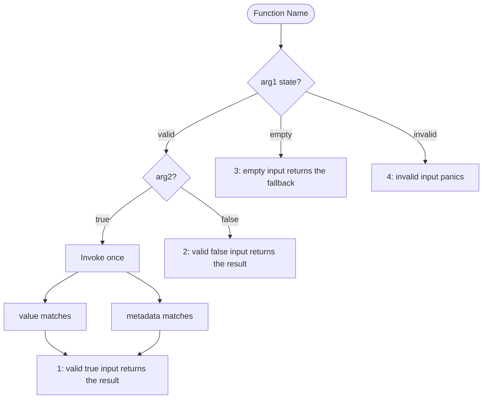
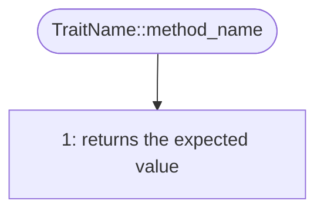

# MoonBit Markdown Tests

> Document type: concrete MoonBit test implementation guidance.

## File format

All tests when rewritten should be drafted in `.mbt.md` files (e.g., `multi_geometry.mbt.md`), except for `wbtest.mbt` which must remain as is due to constraints.

**Note on Filename**: The test file should be named `[Implementation File Name].md`. Do NOT include `_test` in the filename (e.g., `xy.mbt.md`, not `xy_test.mbt.md`).

### Code Blocks in Markdown

- `mbt`: Highlighting only (not compiled).
- `mbt check`: Highlighting and compiled. Use with explicit `test "title" { ... }` blocks.
- `mbt test(async)`: Wrapper for async tests.

**Important**: Code blocks **must not be indented**. Even when included in a list item, the code block fence (\`\`\`) and its content must start at the beginning of the line.

### File Structure Definition

For `.mbt.md` files, follow the structure below.

**Organization Rules:**

- Organize tests by function using **H3 headers**.
- For **Trait implementations**:
  - Use **H3** for the Trait name (if grouping by trait) or the Function Name directly.
  - Use nested **H4 headers** for methods if needed.
- **Top-Level "Public API" Section**:
  - Nest trait implementations under the type they belong to using a bulleted list.
  - Only list traits that are explicitly implemented in the file (ignore defaults).
- Each section should contain:
  1. **Test Design Flow**: One or more Mermaid `flowchart TD` diagrams summarizing conditions and cases. Include a flowchart even when the function has only one test case.
     - Follow the [`share-test-design-flow` embedded function-flow rules](../../share-test-design-flow/references/qa-flow.md#embedded-executable-function-flows) for case boundaries, local numbering, assertion aggregation, title mapping, and split-flow hierarchy.
     - Do not use a test case matrix or table.
     - Use the function's argument names such as `arg1`, `arg2`, or `self` in decision nodes when identifying input conditions.
     - Use the function named by the H3 header as the start node instead of adding a redundant method condition.
     - Follow [`names.md`](names.md) for the MoonBit test-title syntax and required `panic_` prefix.
     - Follow [`assertions.md`](assertions.md#direct-results-and-raised-errors) to use inspection APIs for direct results and `try!` plus a `panic_` title for expected raised errors.
  2. **Implementation**: Code blocks with test implementations.
- **Order matching**: The order of tests in the `## Test` section must strictly follow the order of the corresponding items in the `## Public API` section.

#### Template

````markdown
# [Implementation File Name] (e.g., xy.mbt)

[Feature Summary / Documentation]
(Describe the core functionality provided by this implementation. **Do NOT mention that this file contains tests.**)

## Public API

- `func1`
- `func2`
- `TraitName`
  - `method_name`

## Test

### [Function Name]



```mbt check
///|
test "Function Name 1 - valid true input returns the result" {
  // One invocation, multiple observations
  let result = func1(valid_arg1, true)
  inspect(result.value, content="expected value")
  debug_inspect(result.metadata, content="ExpectedMetadata")
}

///|
test "Function Name 2 - valid false input returns the result" {
  // A different input uses a separate test block
  debug_inspect(func1(valid_arg1, false), content="Expected")
}

///|
test "Function Name 3 - empty input returns the fallback" {
  debug_inspect(func1(empty_arg1, false), content="Fallback")
}

///|
test "panic_Function Name 4 - invalid input panics" {
  try! (func1(invalid_arg1, false) |> ignore)
}
```

### [TraitName]

#### [method_name]



```mbt check
///|
test "StructName TraitName::method_name 1 - returns the expected value" {
  debug_inspect(trait_method(...), content="Expected")
}
```
````
