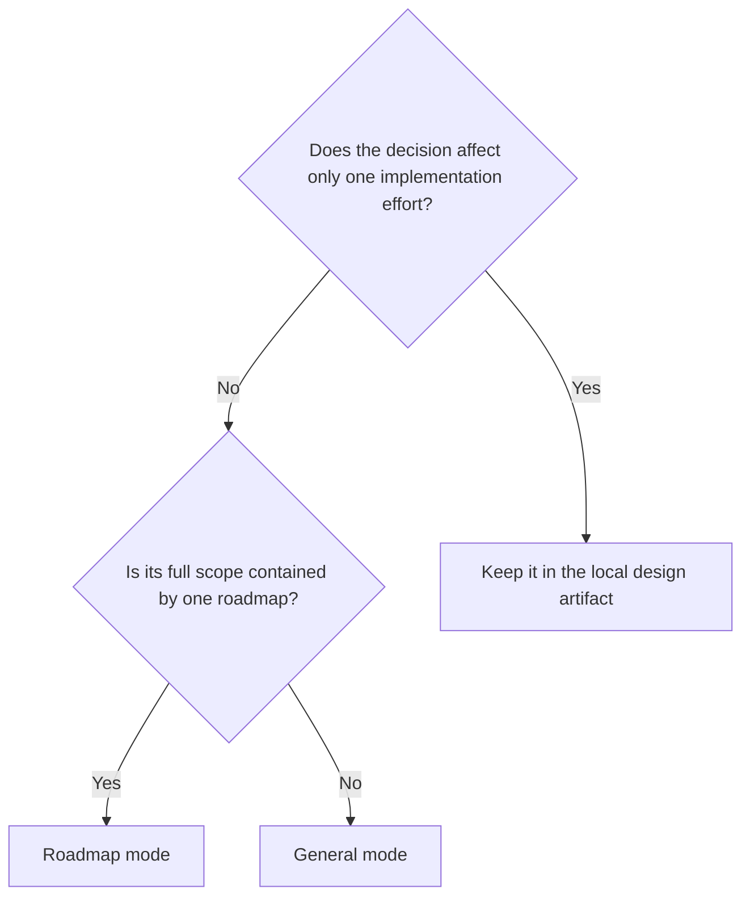

# ADR Modes

> Document type: concrete ADR mode-selection policy.

Use an ADR only for a durable decision that affects more than one implementation effort. Select the mode from the decision's actual scope, not from the activity that discovered it.

## Modes

| Mode    | Storage location                                      | Use when                                                                                               |
| ------- | ----------------------------------------------------- | ------------------------------------------------------------------------------------------------------ |
| General | `docs/adr/<YYYY-MM-DD-title>.md`                      | The decision affects multiple roadmaps, independent implementation efforts, or the project as a whole. |
| Roadmap | `docs/roadmap/<roadmap-id>/adr/<YYYY-MM-DD-title>.md` | The decision is shared by multiple milestones or implementation efforts in one roadmap.                |

## Selection flow

## Examples

General mode:

- Adopt one service-composition model across the repository.
- Define an authorization convention used by multiple roadmaps.
- Standardize a shared event schema for independent services.

Roadmap mode:

- Fix the canonical feed schema used by every milestone in one roadmap.
- Require one authentication assurance level across a migration roadmap.
- Define a retry policy shared by the ingestion and delivery milestones.

An ADR is not needed for a cache choice, pagination style, or retry interval that is confined to one implementation effort.

## Scope changes

If a Roadmap ADR later applies outside its roadmap, file a General ADR and append a supersession notice to the old ADR. Do not move or rewrite the old record. Do not narrow a General ADR into a Roadmap ADR; supersede it with a new decision when the applicable scope changes.
