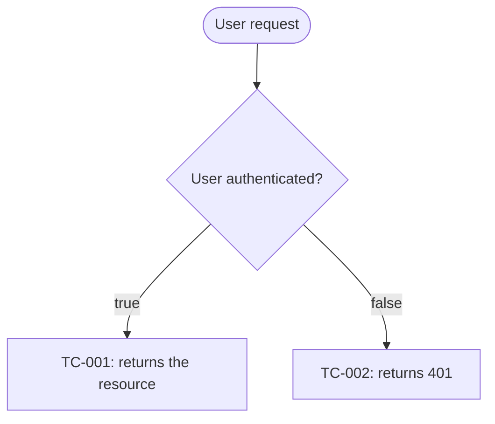
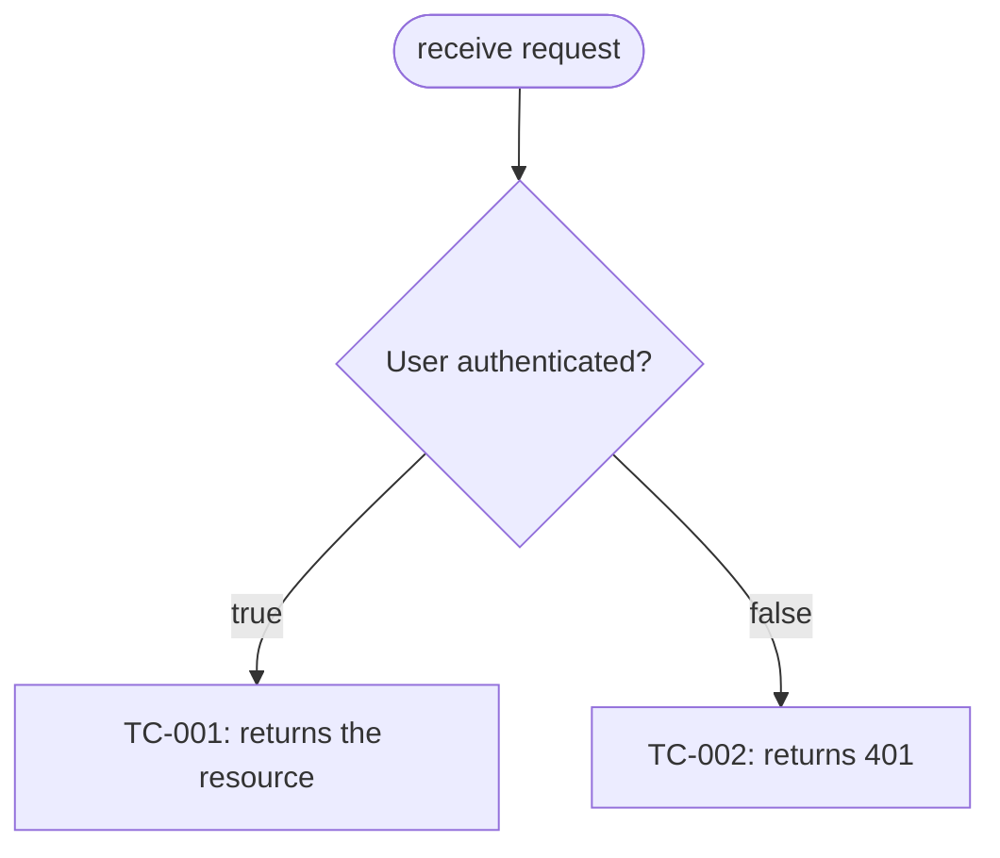
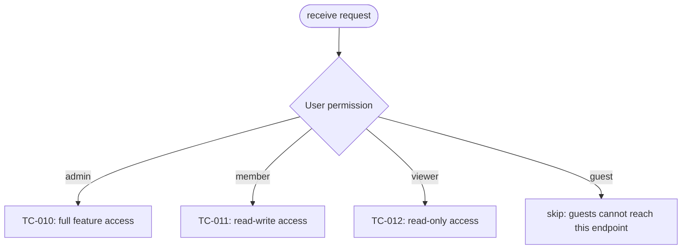
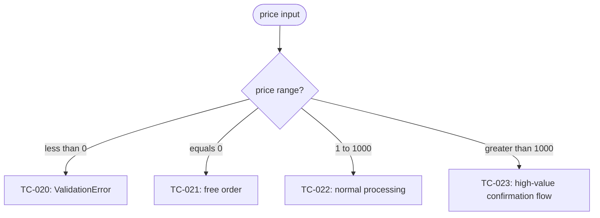
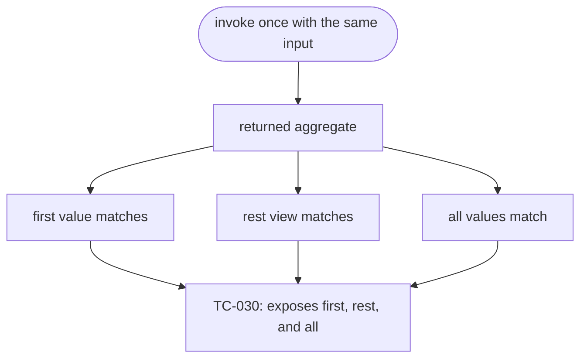

# Reference: How to write `qa-flow.md`

> Document type: concrete artifact authoring guide.

## Purpose

Visualize the test cases from `qa-design.md` as Mermaid flowcharts. The goal is reviewer comprehension: a human should be able to scan the diagrams and understand which branches are tested, skipped, or deferred.

In a standalone `qa-flow.md`, every leaf must be one of:

- `TC-NNN: <label>`
- `TC-IMPL-NNN: <label>`
- `skip: <reason>`

## File location

Use the location that matches the project. Recommended default:

```text
docs/test-design/<identifier>/qa-flow.md
```

When maintaining an existing workflow directory, place it beside `qa-design.md`.

## File format

A Markdown file containing one or more Mermaid `flowchart TD` code blocks. For complex systems, split diagrams by concern. GitHub renders Mermaid natively in Markdown.

## Embedded executable function flows

Apply these rules when a flowchart is embedded beside executable tests instead of emitted as a standalone `qa-flow.md`:

- Create a separate test section for each function or method and include a Mermaid `flowchart TD` even when the section has only one test case.
- Use the flowchart instead of a test-case matrix or table.
- Number leaves locally as `1: <label>`, `2: <label>`, and so on, restarting from `1` in each function or method section.
- Include the function and local number in the corresponding executable test title as `<function> <number>`. Separate the function and number with a space, never a hyphen.
- Aggregate multiple assertions into one case only when one system-under-test invocation with the same input produces all observed facts, and show those observation paths converging on the same numbered leaf.
- Use separate numbered leaves and executable tests when verification invokes the system under test with different arguments or input, even when those invocations share a fixture.
- A documented family-conformance exception may use one numbered leaf for multiple related functions that intentionally share the same branch contract. Name the shared contract as the section scope, show the family invocation in the flow, and exclude conversion or type-specific behavior from that case.
- Split a complex function flow into separate diagrams by concern. Hierarchical leaves such as `1-1`, `1-2`, `2-1`, and `2-2` are allowed only after the flow is split, with one diagram for each top-level number.

## Section structure

```text
1. # QA Flow: <title>
2. ## Overview
3. ## <concern 1>
   - Success criteria covered by this section: SC-X, SC-Y
   - Mermaid flowchart
4. ## <concern 2>
   - Same as above
5. ## Cross-cutting concerns (optional)
6. ## Implementation-driven branches (optional)
```

## Per-concern sections

Each section consists of:

1. An `##` heading with the concern name.
2. One line listing covered success criteria.
3. A Mermaid `flowchart TD` block.

Example:

````markdown
## Access control

Success criteria covered by this section: SC-1, SC-2, SC-5


````

## Mermaid syntax guide

### Node shapes

| Syntax       | Meaning    | Use                            |
| ------------ | ---------- | ------------------------------ |
| `A[Label]`   | Rectangle  | Normal node / test case        |
| `A([Label])` | Stadium    | Start / end                    |
| `A{Label}`   | Diamond    | Decision branch                |
| `A((Label))` | Circle     | Sub-step                       |
| `A[[Label]]` | Subroutine | Reference to another flowchart |

### Branches

For binary conditions:



For multi-way choices:



For numeric thresholds, prefer text labels over raw `<` / `>` because Mermaid labels can parse those poorly:



### Aggregated assertions

Use one test case for multiple assertions only when a single system-under-test invocation with the same input produces all observed facts. Show each asserted fact as an observation node and converge those nodes on the same test case leaf:



If verification requires another invocation with different arguments or input, draw a separate numbered leaf using the artifact's numbering scheme. Reusing the same fixture does not make the invocations one test case.

## Split guidelines

- Keep one Mermaid block to roughly 15-20 nodes or fewer.
- Split by user-visible concern first, then by technical boundary.
- Put cross-cutting behavior in its own section when repeating it in every diagram would obscure the main flow.
- Use `skip: <reason>` for impossible or intentionally untested leaves; never leave a dead leaf unlabeled.

## Review checklist

- In a standalone `qa-flow.md`, every `TC-NNN` in `qa-design.md` appears in at least one diagram unless there is a documented reason.
- In a standalone `qa-flow.md`, every diagram leaf is a TC ID or `skip` with rationale.
- In an embedded function flow, every function has its own section and local numbering restarts from `1`.
- Aggregated assertion paths visibly converge on one numbered leaf.
- Invocations with different arguments or input use separate numbered leaves.
- Executable test titles include the scoped numbers of their corresponding leaves.
- Hierarchical local numbers are used only when the flow is split into matching top-level diagrams.
- Every section lists covered success criteria.
- Diagrams are small enough for a human reviewer to scan.
