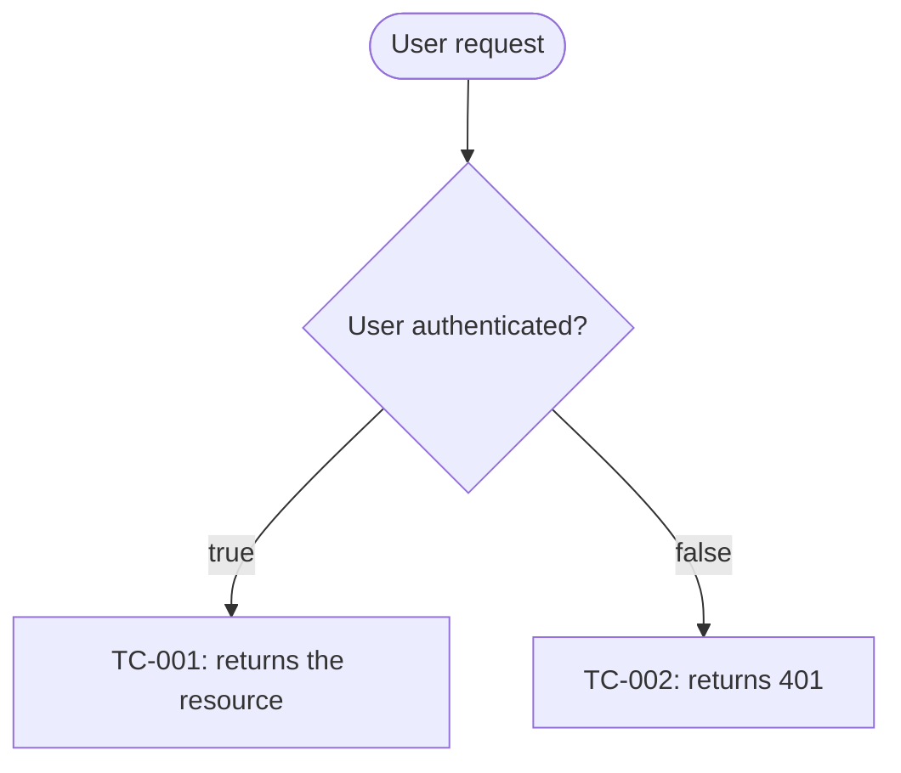
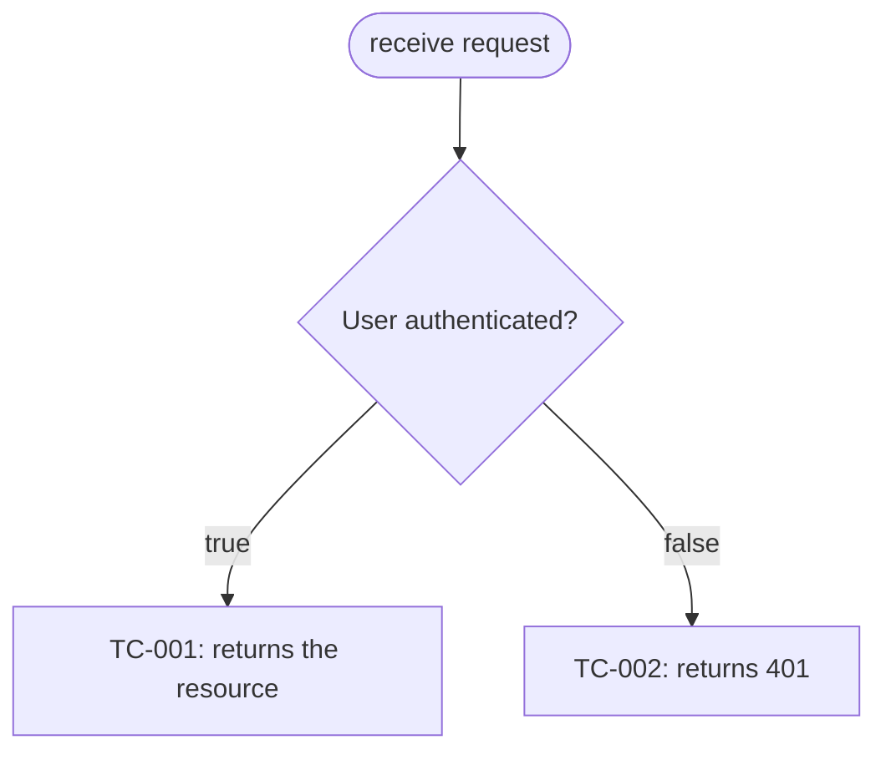
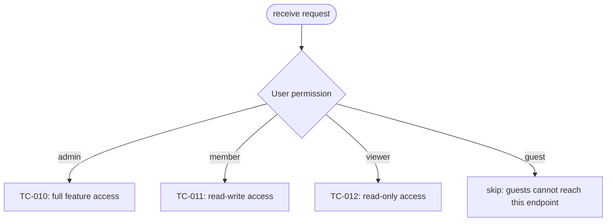
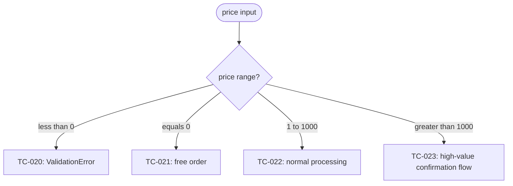

# Reference: How to write `qa-flow.md`

## Purpose

Visualize the test cases from `qa-design.md` as Mermaid flowcharts. The goal is reviewer comprehension: a human should be able to scan the diagrams and understand which branches are tested, skipped, or deferred.

Every leaf must be one of:

- `TC-NNN: <label>`
- `TC-IMPL-NNN: <label>`
- `skip: <reason>`

## File location

Use the location that matches the project. Recommended default:

```text
docs/test-design/<identifier>/qa-flow.md
```

When maintaining an existing workflow directory, place it beside `qa-design.md`.

## File format

A Markdown file containing one or more Mermaid `flowchart TD` code blocks. For complex systems, split diagrams by concern. GitHub renders Mermaid natively in Markdown.

## Section structure

```text
1. # QA Flow: <title>
2. ## Overview
3. ## <concern 1>
   - Success criteria covered by this section: SC-X, SC-Y
   - Mermaid flowchart
4. ## <concern 2>
   - Same as above
5. ## Cross-cutting concerns (optional)
6. ## Implementation-driven branches (optional)
```

## Per-concern sections

Each section consists of:

1. An `##` heading with the concern name.
2. One line listing covered success criteria.
3. A Mermaid `flowchart TD` block.

Example:

````markdown
## Authentication and authorization

Success criteria covered by this section: SC-1, SC-2, SC-5


````

## Mermaid syntax guide

### Node shapes

| Syntax       | Meaning    | Use                            |
| ------------ | ---------- | ------------------------------ |
| `A[Label]`   | Rectangle  | Normal node / test case        |
| `A([Label])` | Stadium    | Start / end                    |
| `A{Label}`   | Diamond    | Decision branch                |
| `A((Label))` | Circle     | Sub-step                       |
| `A[[Label]]` | Subroutine | Reference to another flowchart |

### Branches

For binary conditions:



For multi-way choices:



For numeric thresholds, prefer text labels over raw `<` / `>` because Mermaid labels can parse those poorly:



## Split guidelines

- Keep one Mermaid block to roughly 15-20 nodes or fewer.
- Split by user-visible concern first, then by technical boundary.
- Put cross-cutting behavior in its own section when repeating it in every diagram would obscure the main flow.
- Use `skip: <reason>` for impossible or intentionally untested leaves; never leave a dead leaf unlabeled.

## Review checklist

- Every `TC-NNN` in `qa-design.md` appears in at least one diagram unless there is a documented reason.
- Every diagram leaf is a TC ID or `skip` with rationale.
- Every section lists covered success criteria.
- Diagrams are small enough for a human reviewer to scan.
