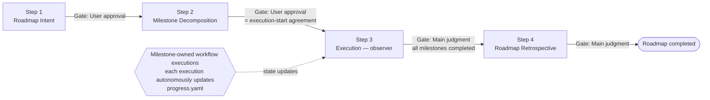

# roadmap — Multi-Cycle Strategic Roadmap Layer

Use case category: **Workflow Automation**
Design pattern: **Sequential Workflow** + **Multi-Service Coordination** (strategic layer
loosely binding tactical workflow-level executions).

This skill is the **strategic layer** of the `totto2727-dev-flow` plugin. Where a single workflow-level execution handles "what to build and how" inside roughly one PR-sized increment, `roadmap` plans and tracks **multi-cycle efforts**: it (i) verbalises the worldview and scope of the whole roadmap, (ii) decomposes it into observable milestones, and (iii) closes out the roadmap by aggregating per-execution retrospectives. `roadmap` tracks high-level milestones, while each milestone's owning agent or execution system owns the tactical workflow executions referenced from milestone notes or workflow identifier fields.

## Roadmap-specific principles

`roadmap` keeps only strategic governance rules:

- `progress.yaml` is the single source of roadmap progress and is changed through the roadmap CLI.
- `roadmap.md`, `milestones/`, and `adr/` are the durable planning surface.
- Milestones may reference tactical workflow-level executions, but `roadmap` does not launch or manage those executions.
- Tactical workflow, PR handling, CI handling, and specialist routing belong to the milestone's owning agent or execution system.
- Project-level rules and repository conventions override this plugin when they are more specific.

## Role definitions

### Main (= roadmap orchestrator)

**Responsibilities:**

- Direct dialogue with the user (Roadmap Intent eliciting, milestone-decomposition alignment, retrospective presentation).
- Roadmap-wide progress management (current step, gate, Blockers, awareness of running downstream workflow-level executions).
- Performing each step directly (all four roadmap steps are Main-only).
- Exit-Criteria evaluation per step.
- Constructing user-approval gate materials (the artifact itself, per Artifact-as-Gate-Review).
- **Awareness of running executions in Step 3**: while the downstream executions run autonomously,
  Main observes their progress through `progress.yaml`.

**Principles:**

- Main does not perform implementation work directly (it focuses on dialogue, judgment, and assignment).
- **Main never auto-launches workflow-level executions**. The user or owning agent starts each cycle; Main only invites the user to do so for the next milestone.

### No Specialist tier

`roadmap` has **no specialist subagents**. All four roadmap steps are Main-only:

- **Step 1, 2, 4** are dialogue / aggregation work where context-isolation, parallelism, and independent-viewpoint justifications do not apply. The full procedure lives in `roadmap-intent`, `roadmap-decomposition`, and `roadmap-retrospective`.
- **Step 3 (Execution)** has no specialist by construction: workflow-level execution is owned by the agents or systems responsible for each milestone, each execution autonomously updates `progress.yaml`, and Main observes. Step 3 is captured **inline** in this SKILL because there is no procedure substantial enough to extract into a `step-*`.

---

## Roadmap diagram

## Step list

| Step | Title                   | Invocation           | Gate          | Detail SKILL               |
| ---- | ----------------------- | -------------------- | ------------- | -------------------------- |
| 1    | Roadmap Intent          | Main only            | User approval | `roadmap-intent`           |
| 2    | Milestone Decomposition | Main only            | User approval | `roadmap-decomposition`    |
| 3    | Execution               | Main only (observer) | Main judgment | inline (this SKILL, below) |
| 4    | Roadmap Retrospective   | Main only            | Main judgment | `roadmap-retrospective`    |

Per-step exit criteria, rollback specifics, and commit examples live in the corresponding `roadmap-*/SKILL.md` (or, for Step 3, in the inline section below).

---

## Step 3: Execution (inline)

Step 3 is a **marker step** with no specialist and no separate procedure document. It spans the period during which each milestone's owning agent or execution system runs its workflow-level execution, and each execution updates `progress.yaml` through the roadmap CLI.

### What Main watches

Main reads `docs/roadmap/<roadmap-id>/progress.yaml` periodically and on user request, looking at:

- `milestones[].status` transitions:
  - `planned → active` when the corresponding workflow-level execution starts.
  - `active → completed` when the execution's completion criteria are met.
  - `blocked` if the downstream execution reports a long-running Blocker.
- `milestones[].workflow_identifiers[]`: the list of execution `<identifier>` values bound
  to each milestone (1:N is allowed; multiple executions may attach to the same milestone).
- The roadmap-wide `status` (stays `active` throughout Step 3).

### Main's actions during Step 3

1. After Step 2 completes, present the next milestone to the user and obtain agreement about which agent or execution system owns the workflow-level execution. Remind the owner to pass `<roadmap-id>` and `<milestone-id>` when starting the execution if that system accepts them.
2. **Do not launch workflow-level execution from `roadmap`** (asymmetric coupling rule). The owning agent or execution system runs the milestone; Main observes.
3. When the user asks for a progress check, summarise the current `progress.yaml` view (per-milestone status, attached identifiers, any `blocked` milestones).
4. If a milestone stays `blocked` for an extended period, raise an In-Progress user inquiry to choose between cancel / re-decompose (back to Step 2) / Intent revision (back to Step 1).

### When to advance to Step 4

When all entries in `milestones[]` are `completed` or `cancelled`, present to the user the readiness to start Step 4 and proceed to `roadmap-retrospective`. The roadmap `status` remains `active` until the Step 4 commit transitions it to `completed`.

### Exit criteria (Step 3)

- All `milestones[]` are `completed` or `cancelled`.
- For parallel milestones (1:N), the user has agreed to the final-state rule (e.g. "all N executions complete → `completed`" vs. "first execution complete → `completed`"); typically finalised in Step 4.
- The roadmap-wide `status` is still `active` (transitions to `completed` only at Step 4 completion).

### Step 3 has no commit of its own

Downstream executions commit or persist artifacts per their own conventions; Step 3 in `roadmap` does not produce its own commit (apart from any Roadmap mode ADR Main may file mid-execution if a long-lived shared norm surfaces — those follow `share-adr/SKILL.md`).

---

## Connection protocol with `totto2727-dev-flow`

`roadmap` and `totto2727-dev-flow` are connected via a bidirectional ID reference. The full update protocol (write order, retry, conflict resolution) lives in `totto2727-dev-flow/SKILL.md` ("`progress.yaml` update protocol"). This section summarises the surface that the roadmap side sees.

### Bidirectional reference

```mermaid
graph LR
    subgraph RP[docs/roadmap/&lt;roadmap-id&gt;/progress.yaml]
        M1[milestones&#91;&#93;.id]
        M2["milestones&#91;&#93;.workflow_identifiers&#91;&#93;<br/>= &#91;identifier-A, identifier-B, ...&#93;"]
    end
    subgraph ES[owning execution system]
        R1[roadmap-id]
        R2[milestone-id]
    end

    M2 -->|forward reference| ES
    R1 -.->|back reference| RP
```

- **roadmap → workflow-level execution**: `progress.yaml.milestones[].workflow_identifiers[]`
  holds attached `<identifier>` values (1:N). Detailed progress is fetched from the owning execution system on demand (minimal-scope principle).
- **workflow-level execution → roadmap**: the owning execution system records `<roadmap-id>`
  and `<milestone-id>` in its own state or handoff metadata. When the execution starts or completes, it updates the corresponding `milestones[]` entry through the roadmap CLI.

### Who writes what, when (summary)

| Trigger                                                 | Owner                          | Effect on `progress.yaml`                                                       |
| ------------------------------------------------------- | ------------------------------ | ------------------------------------------------------------------------------- |
| `roadmap` Step 1 completes                              | `roadmap-intent` (Main)        | Initialise `roadmap_id` / `title` / `status: planned` / empty `milestones: []`. |
| `roadmap` Step 2 completes                              | `roadmap-decomposition` (Main) | Finalise `milestones[]` (`planned`); transition roadmap `status` to `active`.   |
| Workflow-level execution starts (during Roadmap Step 3) | Owning execution system        | `milestones[].status: planned → active`; append to `workflow_identifiers[]`.    |
| Workflow-level execution completes                      | Owning execution system        | `milestones[].status: active → completed`.                                      |
| `roadmap` Step 4 completes                              | `roadmap-retrospective` (Main) | Roadmap `status: active → completed`.                                           |

### Concurrency notes

- The two write triggers from the workflow side ("execution start" and "execution end") are rare events, so contention is unlikely.
- Residual rare conflicts are caught by the YAML-syntax `pre-commit` hook.
- On conflict, neither the owning execution system nor a roadmap specialist resolves it unilaterally; it is reported as a Blocker, and the roadmap Main drives recovery.
- Detailed recovery uses the roadmap CLI as the single writer for `progress.yaml`; do not edit the YAML through share-artifacts templates.

---

## Session resume preamble

Detailed per-step resume actions live in the corresponding `roadmap-*` SKILL (Step 3 actions are inline above). This preamble defines the cross-step shared preparation.

Roadmap resume uses artifact-based context restoration. Roadmap-specific additions:

1. **Read the source of truth**: `docs/roadmap/<roadmap-id>/progress.yaml`.
2. **Read all existing artifacts**: `roadmap.md` and every
   `milestones/<milestone-id>.md`.
3. **Two-tier state check**: roadmap-wide `status` + each `milestones[].status` + the
   attached `<identifier>` values in `workflow_identifiers[]`.
4. **Execution-side resume takes priority**: if any milestone is `active`, scan the
   bound `<identifier>`s or milestone notes and let the owning agent or execution system restore tactical execution state first. The roadmap resume waits until execution-side consistency is restored.
5. **Refresh `updated_at` and commit a resume marker**:
   `docs(roadmap/<roadmap-id>): resume session`.

### Resume scenarios

| Scenario                                 | State                                                                                                 | Path forward                                                                                                                                          |
| ---------------------------------------- | ----------------------------------------------------------------------------------------------------- | ----------------------------------------------------------------------------------------------------------------------------------------------------- |
| **A: Step 1–2 done, Step 3 not started** | Roadmap `status: active` / all `milestones[].status: planned` / `workflow_identifiers[]` empty        | Present the next milestone to the user; ask which agent or execution system should own the workflow-level execution. (See "Step 3: Execution" above.) |
| **B: Step 3 in progress**                | Roadmap `status: active` / one or more `milestones[].status: active` with running `<identifier>`s     | Run execution-side session resume first (preamble item 4). Present a milestone-progress summary and confirm next-launch agreement with the user.      |
| **C: Step 4 in progress**                | Roadmap `status: active` / all `milestones[]` are `completed` or `cancelled` / Step 4 already started | Continue per `roadmap-retrospective`.                                                                                                                 |

### Detecting resumable roadmaps

When the user activates `roadmap`, before starting a new roadmap Main scans `docs/roadmap/` for resumable roadmaps:

1. Detect `docs/roadmap/<roadmap-id>/progress.yaml` files where `status !=
completed`.
2. If any are found, ask the user whether to resume one or to start fresh.
3. On resume, follow the preamble above and the relevant scenario.
4. On a fresh start, agree on a new `<roadmap-id>` and proceed to `roadmap-intent`.

---

## Project-rule precedence

`roadmap` inherits the `totto2727-dev-flow` policy: **the overall process structure (steps, artifact formats, gate decisions) follows this skill, while implementation patterns / test rules / commit conventions / naming conventions / platform-specific commands defer to project-specific skills** (`coding`, `git-workflow`, `macos-cli-rules`, etc.). See `totto2727-dev-flow/SKILL.md` "Relationship with project-specific rules" for the canonical statement.

Roadmap-specific notes:

- Milestone-granularity decisions interact with project implementation and test conventions. Step 2 (`roadmap-decomposition`) requires Main to load the relevant project-specific skills.
- Roadmap-wide constraints (parallel-execution allowance, release-freeze windows, etc.) follow project operational rules. Main confirms them with the user during Step 1 (`roadmap-intent`) and records them in `roadmap.md`'s Intent section.

---

## What this skill does NOT cover

- **Per-step exit criteria, rollback details, and commit examples** → see the corresponding `roadmap-*/SKILL.md` (or, for Step 3, the inline section above).
- **Per-execution implementation, design, and validation** → fully delegated to downstream workflow-level executions. The roadmap layer is purely strategic.
- **Auto-launching of workflow-level executions** → forbidden (asymmetric coupling).
- **Roadmap-of-roadmaps** (more than one nesting level) → out of scope for this version.
- **CI / external system integration with `progress.yaml`** → out of scope; the YAML is machine-readable but no GitHub Actions / webhook integration is provided here.
- **Step-level progress reporting** (per-step granularity) → out of scope (future extension). Use `workflow_identifiers[]` or milestone notes to hand off to the owning execution system when finer detail is needed.
- **`events[]` / `status_view` derived views / millisecond-precision timestamps** → out of scope (future extension).
- **Artifact format / template specifications** → see `share-artifacts` (`references/roadmap*.md`, `templates/roadmap*.md`, `templates/milestone.md`).
- **ADR conventions and the General mode / Roadmap mode split** → see `share-adr`.
- **Single-execution development** → use the appropriate workflow-level agent or execution system directly. This skill is for multi-execution scope only.
- **PR / CI command details** → delegated to the owning execution system. `roadmap` itself does not orchestrate PR / CI; downstream workflow-level executions do.
