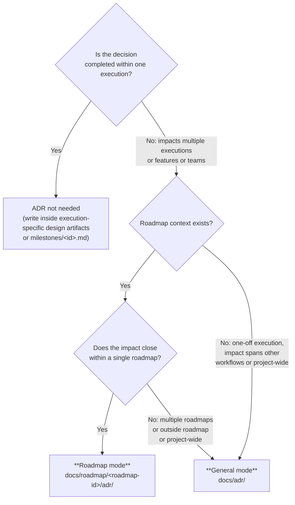

# ADR (Architecture Decision Record) — Common Skill for totto2727-dev-flow / roadmap

Use case category: **Document & Asset Creation**
Design pattern: **Domain Intelligence** (embeds the writing style and operating rules of the ADR domain)

This skill provides the format and operating rules for permanently recording **decisions whose impact extends beyond an individual workflow-level execution**. It divides responsibility with execution-specific design artifacts and Retrospective (volatile reflections), serving as **long-lived decision records that continue to be referenced after an execution / roadmap is completed**.

## Application Modes and Storage Locations (Core Rules)

ADRs use one of two modes depending on **the context in which they are filed**. The determination is made at filing time by Main evaluating the scope, and is explicitly stated in the ADR body.

| Mode             | Storage location                                      | Filing decision essence                                                                                             | Main filing origins                                                     |
| ---------------- | ----------------------------------------------------- | ------------------------------------------------------------------------------------------------------------------- | ----------------------------------------------------------------------- |
| **General mode** | `docs/adr/<YYYY-MM-DD-title>.md`                      | A decision that "**spans multiple roadmaps / multiple independent workflows**" or becomes a "**project-wide norm**" | roadmap Step 1 to 4 / one-off workflow-level use                        |
| **Roadmap mode** | `docs/roadmap/<roadmap-id>/adr/<YYYY-MM-DD-title>.md` | Context, premises, or norms "**shared by multiple workflow-level executions under a single roadmap**"               | roadmap Step 1 to 4 / workflow-level executions under a roadmap context |

### Mode decision flow

A quick reference for the filing decision:



### Filing target examples per mode

#### General mode (`docs/adr/`)

- "Adopt Effect across the entire project"
- "Make gRPC the default communication convention for all services"
- "Unify the authorization layer on OpenFGA"
- "Convention for an event bus shared across the `oauth-rollout` roadmap and `notification-platform` roadmap" (spanning multiple roadmaps)
- "Cache layer separation policy that both workflow execution A (search platform overhaul) and independently-running workflow execution B (CDN configuration overhaul) rely on" (spanning independent executions)
- "Operating policy of pnpm workspace catalog", "Unification of monorepo lint / format rules"

#### Roadmap mode (`docs/roadmap/<roadmap-id>/adr/`)

- "`AuthSession` type definition shared across all workflow-level executions under `oauth-rollout`" (spanning executions within a roadmap)
- "Policy of requiring 3D Secure 2 across the entire `payment-modernization` roadmap" (roadmap-shared constraint)
- "Within the `notification-platform` roadmap, on delivery error enqueue to the retry queue" (shared between executions within a roadmap)
- "In `feed-platform`, fix the canonical schema for feeds at v2, with ingest / delivery / search executions under it referring to it commonly"

#### ADR not needed (write inside execution-specific design artifacts / inside `milestones/<id>.md`)

- "Use LRU as the cache strategy for this feature"
- "Pagination for this API is cursor-based"
- "Write validation for this screen with zod"
- "Retry interval inside this milestone is exponential backoff" (closes within a milestone -> write inside `milestones/<id>.md`)

### Promotion / demotion between Roadmap mode and General mode

- **Promotion (Roadmap -> General)**: If an ADR written in Roadmap mode is found to also impact other roadmaps or independent workflows, file a new General mode ADR and append "`Superseded by docs/adr/<new-ADR>.md`" to the body of the old Roadmap mode ADR while keeping `confirmed: true` (per the immutability principle, do not rewrite the file content; only prepend an addendum)
- **Demotion is, in principle, prohibited**: Do not demote a General mode ADR to Roadmap mode (narrowing the scope of application would break past references)

---

## File specification

The full per-section authoring guide and the file template live under `share-artifacts`, in the same `references/` ↔ `templates/` 1:1 pattern as every other artifact:

- **Authoring guide:** `share-artifacts/references/adr.md` — file-name convention, frontmatter fields, how to write each section (Context / Decision / Consequences / Related), quality criteria, lifecycle diagram, and supersession addendum format.
- **Template:** `share-artifacts/templates/adr.md` — placeholder skeleton to copy when filing a new ADR.

This skill (`share-adr`) deliberately keeps only the **policy** layer (mode decision flow, operating rules, filing-origin coordination). The **format** layer (frontmatter spec, body structure, prose style) is owned by `share-artifacts/references/adr.md`.

---

## Operating Rules

### 1. Filing process

1. Make the ADR filing decision (the "Mode decision flow" above). If the decision is ambiguous, confirm via the In-Progress user query format (temporary report: `$TMPDIR/totto2727-dev-flow/adr-scope-decision.md` or `$TMPDIR/roadmap/adr-scope-decision.md`)
2. Confirm the storage directory's existence (create if missing):
   - General mode: `docs/adr/`
   - Roadmap mode: `docs/roadmap/<roadmap-id>/adr/`
3. Determine the file name `<YYYY-MM-DD>-<title>.md` (see the "File name" rule above)
4. Author according to the Frontmatter + Body structure above. File with `confirmed: false`
5. Submit for user review (place it on the gate determination of the originating totto2727-dev-flow / roadmap step)
6. After approval, update to `confirmed: true` and save in the same commit

### 2. Immutability Principle

- The body of `confirmed: true` ADRs is, in principle, not modified
- When circumstances change and a previous decision needs to be revised, **file a new ADR and reference the old one as Superseded** (modifying the old ADR's body is prohibited)
- Only a single-line addendum `> Superseded by [new ADR](path)` to the end of the old ADR's body is permitted (keeping `confirmed: true`, scope changes are not allowed)

### 3. ADR reference rules

- Before starting implementation, check **existing ADRs in the relevant scope**:
  - One-off workflow-level execution: all of `docs/adr/`
  - Workflow-level execution under a roadmap: both `docs/adr/` + `docs/roadmap/<roadmap-id>/adr/`
  - Roadmap-level work: both `docs/adr/` + `docs/roadmap/<roadmap-id>/adr/`
- Do not perform implementation / design that contradicts a `confirmed: true` ADR
- If a decision that contradicts an ADR becomes necessary unless that ADR is taken into account, **file a new ADR (or supersede ADR) first** before proceeding to implementation

### 4. Coordination with filing origins

- **Workflow-level design work**: When a workflow-level agent discovers a "decision spanning executions", report to Main. Main makes the mode determination and files or delegates the ADR. Link from that execution system's design artifact to the ADR when appropriate
- **Workflow-level progress state**: If the owning execution system tracks external ADRs, record the path of the filed ADR there (for both General / Roadmap mode)
- **roadmap Step 1 to 2 (Roadmap Intent / Milestone Decomposition)**: When `roadmap-analyst` / `roadmap-planner` discovers a roadmap-shared norm, file a Roadmap mode ADR per Main's judgment. Link from `roadmap.md` / `milestones/<id>.md` to that ADR
- **roadmap Step 4 (Roadmap Retrospective)**: If a roadmap-shared insight derived in the retrospective is a long-lived premise, `roadmap-retrospective-writer` proposes a Roadmap mode ADR (Main makes the filing decision)

### 5. Division of role with retrospective

|             | ADR                                                          | retrospective.md / roadmap-retrospective.md           |
| ----------- | ------------------------------------------------------------ | ----------------------------------------------------- |
| Persistence | Persistent (immutable when `confirmed: true`)                | Volatile (deleted once the next execution digests it) |
| Content     | Decisions and consequences (Decision + Consequences)         | Reflection (good points / issues / next improvements) |
| Scope       | Norms affecting multiple executions / roadmap / project-wide | Self-evaluation of 1 execution / 1 roadmap            |
| Storage     | `docs/adr/` or `docs/roadmap/<roadmap-id>/adr/`              | `docs/retrospective/` (aggregated)                    |

Among the improvement proposals derived in retrospective, **decisions that should be permanently recorded** are extracted into ADRs when the retrospective is digested.

---

## Directory Layout

```
docs/
|-- adr/                                       # General mode (cross-roadmap / cross-workflow / project-wide)
|   |-- <YYYY-MM-DD>-<title>.md
|   |-- ...
|-- roadmap/
|   |-- <roadmap-id>/
|       |-- roadmap.md
|       |-- milestones/<milestone-id>.md
|       |-- progress.yaml
|       |-- adr/                               # Roadmap mode (within single roadmap, across executions)
|           |-- <YYYY-MM-DD>-<title>.md
|           |-- ...
|-- retrospective/
    |-- <identifier>.md                        # workflow-level retrospective (volatile, when retained externally)
    |-- roadmap-<roadmap-id>.md                # roadmap retrospective (volatile, prefix avoids collision)
```

- Do not place ADRs under workflow-level execution artifact directories (execution-specific decisions stay in that execution system's own design artifact)
- Placing an `adr/` subdirectory under `docs/roadmap/<roadmap-id>/` is for Roadmap mode. Create as needed when starting Step 1 / 2 (may be created on demand at filing time; do not commit empty directories)

---

## What This Skill Does NOT Cover

- Design decisions completed within a single execution -> keep them in the tactical execution system's design artifact, outside this plugin's retained artifact formats
- Direction completed within a milestone -> write inside `milestones/<id>.md`
- Meeting notes / memos -> no corresponding skill (follow this repository's conventions)
- Retrospective (volatile report) -> per-execution retrospectives are owned by the tactical execution system; roadmap retrospectives use `docs/retrospective/roadmap-<roadmap-id>.md` (`share-artifacts/references/roadmap-retrospective.md`)
- Roadmap Intent itself -> `roadmap.md` (`share-artifacts/references/roadmap.md`)
- CHANGELOG / release notes -> no corresponding skill
- Overusing ADR as a "substitute for design documents" (if it looks like 5 or more ADRs would be written within a single execution, the granularity is likely wrong; consider integrating into that execution system's design artifact)
