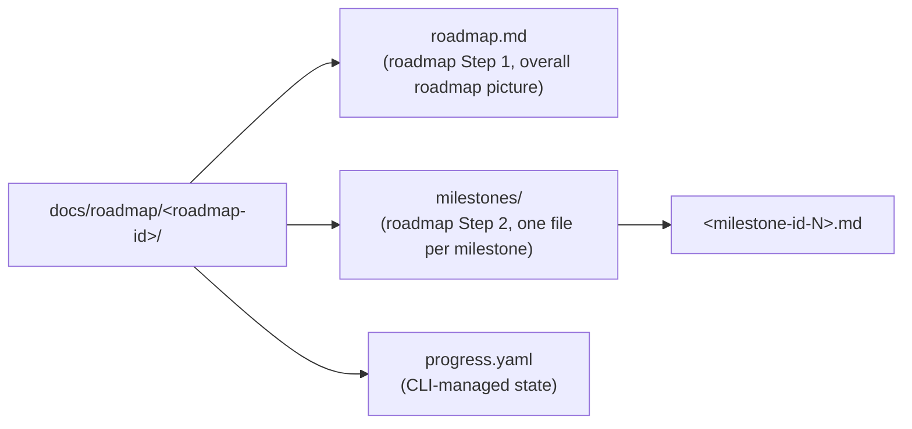

# Shared Artifacts — totto2727-dev-flow Artifact Reference

Use case category: **Document & Asset Creation** (a table-of-contents skill that aggregates artifact specifications and templates).
Design pattern: **Domain Intelligence** (embeds the writing style and quality criteria of the artifact domain).

This skill aggregates **authoring guides (`share-artifacts/references/`) and templates (`share-artifacts/templates/`)** for artifacts owned by the current `totto2727-dev-flow` plugin: roadmap plans, milestones, roadmap retrospectives, ADRs, and retained QA test design artifacts.

**Path notation rule:** when referencing artifact files within this skill, use the relative path `share-artifacts/references/<name>.md` / `share-artifacts/templates/<name>.md` from the plugin root in a unified manner (the same form used when referenced from other skills).

**1:1 file-name correspondence:** references and templates **correspond as files of the same name** (e.g. `references/roadmap.md` ↔ `templates/roadmap.md`). Roadmap progress is managed by the repository roadmap CLI, so `progress.yaml` does not have a share-artifacts reference or template.

## Prerequisites

- Main manages the artifacts.
- Roadmap artifacts are stored under `docs/roadmap/<roadmap-id>/`.
- Roadmap progress is stored under `docs/roadmap/<roadmap-id>/progress.yaml` and read or changed through the roadmap CLI, not through share-artifacts templates.
- references and templates are in **1:1 correspondence**, linked by file name
- When filling in a template, a Specialist must always refer to the corresponding reference
- When reviewing an artifact, Main uses the corresponding reference as the quality criterion

## Artifact list (table of contents)

| #   | Artifact                                                                | Phase / Step                          | Author                         | Reference                                             | Template                                             |
| --- | ----------------------------------------------------------------------- | ------------------------------------- | ------------------------------ | ----------------------------------------------------- | ---------------------------------------------------- |
| 1   | `roadmap.md`                                                            | roadmap Step 1                        | Main                           | `share-artifacts/references/roadmap.md`               | `share-artifacts/templates/roadmap.md`               |
| 2   | `milestones/<milestone-id>.md`                                          | roadmap Step 2                        | Main                           | `share-artifacts/references/milestone.md`             | `share-artifacts/templates/milestone.md`             |
| 3   | `docs/retrospective/roadmap-<roadmap-id>.md`                            | roadmap Step 4                        | Main                           | `share-artifacts/references/roadmap-retrospective.md` | `share-artifacts/templates/roadmap-retrospective.md` |
| 4   | `docs/adr/<file>.md` or `docs/roadmap/<roadmap-id>/adr/<file>.md` (ADR) | Cross-cycle / cross-roadmap decisions | Main                           | `share-artifacts/references/adr.md`                   | `share-artifacts/templates/adr.md`                   |
| 5   | `qa-design.md`                                                          | Retained QA test design format        | Owning execution system / Main | `share-artifacts/references/qa-design.md`             | `share-artifacts/templates/qa-design.md`             |
| 6   | `qa-flow.md`                                                            | Retained QA test design visualization | Owning execution system / Main | `share-artifacts/references/qa-flow.md`               | `share-artifacts/templates/qa-flow.md`               |

## When to use Reference vs. Template

### Reference (`share-artifacts/references/<name>.md`)

**The authoring guide for the artifact.** Includes:

- Purpose: why this artifact exists
- Author and timing: at which step and by whom it is created
- How to write each section: concrete guidance for filling in the placeholders
- Quality criteria: what makes a good or bad artifact (good examples / bad examples)
- Relationship to related artifacts: input/output linkages

**Who reads it:**

- **Specialist**: as guidance during creation
- **Main**: as quality criteria during review
- **User**: as background context for understanding the artifact

### Template (`share-artifacts/templates/<name>.md`)

**The skeleton to be filled in.** Placeholders are in `{{name}}` form (open to migration to e.g. EJS in the future).

- The responsible execution system copies the relevant template and fills in the placeholders
- All placeholders must be filled in, or explicitly marked "N/A" or similar if not applicable

## How to use it

### When a Specialist creates an artifact

1. Read the corresponding `share-artifacts/references/<name>.md` to understand how to write it
2. Copy `share-artifacts/templates/<name>.md` into the appropriate roadmap or delegated execution artifact path
3. Fill in the placeholders (following the guidance in the reference)
4. Once complete, return the artifact to Main

### When Main reviews an artifact

1. Refer to the quality criteria in the corresponding `share-artifacts/references/<name>.md`
2. Check that the artifact meets those criteria
3. If insufficient, send it back to the responsible Specialist for revision (give feedback to the same instance, do not create a new one)

## Rules for changing References / Templates

- When a Reference is updated, also verify consistency of the Template from the same perspective (maintain 1:1 correspondence)
- When adding a new artifact, add both the Reference and Template at the same time and register it in the SKILL.md table of contents
- When project-specific customization is needed, the principle is to update this plugin's main body rather than create a derivative version in the project

---

## Artifact storage structure

### Roadmap working directory

The roadmap artifacts under the `roadmap` skill are aggregated in an independent directory `docs/roadmap/<roadmap-id>/`. The strategic layer (roadmap) and the tactical layer (workflow-level executions) use separate artifact roots so they can run in parallel without polluting each other's working directory.

`progress.yaml` is shown only as the state file in the roadmap directory. Its schema and updates are owned by the roadmap CLI, not by share-artifacts.

The Step 4 (Roadmap Retrospective) artifact `roadmap-<roadmap-id>.md` is aggregated outside the roadmap working directory under `docs/retrospective/` (see "Artifacts outside the roadmap" below for details). The artifacts of the underlying workflow-level executions are not included in this directory; instead they are linked bidirectionally through `progress.yaml.milestones[].workflow_identifiers[]` when identifiers exist.

#### Naming rules for `<roadmap-id>`

Decide it per project, like `<identifier>`. Candidates:

- Strategic objective name (e.g. `oauth-platform`, `multi-tenant-foundation`)
- Date + slug (e.g. `2026-04-29-payment-overhaul`)
- Roadmap ticket ID (e.g. `EPIC-1234`)

Decided by agreement between Main and the user when the roadmap is started. Take care that it does not clash with the `<identifier>` of underlying workflow-level executions (the aggregated `docs/retrospective/` avoids collisions via the `roadmap-` prefix; see "Artifacts outside the roadmap" below).

### Artifacts outside the roadmap

The following are stored **outside** `docs/roadmap/<roadmap-id>/`:

#### ADRs that cross cycle boundaries (General / Roadmap mode)

- **Storage location:**
  - **General mode** (decisions affecting multiple roadmaps / multiple independent workflow-level executions / the entire project): `docs/adr/<YYYY-MM-DD-title>.md`
  - **Roadmap mode** (decisions shared by multiple workflow-level executions under a single roadmap): `docs/roadmap/<roadmap-id>/adr/<YYYY-MM-DD-title>.md`
- **Filing conditions:** only when a decision has an impact beyond a single workflow-level execution or applies across a roadmap. For mode determination (which storage location to use), see "Mode determination flow" in `share-adr/SKILL.md`
- **Reference from the roadmap:** link from `roadmap.md`, `milestones/<milestone-id>.md`, or `docs/retrospective/roadmap-<roadmap-id>.md` as appropriate
- **Lifecycle:** persistent. Immutable once `confirmed: true` (detailed format and operational rules are aggregated in `share-adr/SKILL.md`)

#### Roadmap retrospective

- **Storage location:** `docs/retrospective/roadmap-<roadmap-id>.md`
- **Creation timing:** generated during `roadmap` Step 4
- **Lifecycle:** volatile report. Decisions that should be persistently recorded are extracted into ADRs
- **Reference:** `share-artifacts/references/roadmap-retrospective.md`

### Retained QA test design formats

`qa-design.md` and `qa-flow.md` are retained as format references for delegated execution systems that still need explicit test design artifacts. Their storage path is selected by the delegated execution system; this plugin only preserves the authoring guides and templates.

---

## Artifact lifecycle

### From creation to approval

1. The responsible roadmap step or delegated execution system selects the matching template and reference.
2. It copies `share-artifacts/templates/<name>.md` into the appropriate artifact path.
3. Following the guidance in `share-artifacts/references/<name>.md`, it fills in all placeholders.
4. The artifact is reviewed against the quality criteria in `share-artifacts/references/<name>.md`.
5. If a user approval gate exists, present the artifact itself for approval (no temporary report is created).

### Commit conventions

Roadmap artifacts must be reflected in the repository at step completion. Tactical execution artifacts follow the delegated execution system's commit rules.

### Behavior on resumption

When a different session / user resumes roadmap work, the context is restored from `roadmap.md`, `milestones/`, `adr/`, `docs/retrospective/roadmap-<roadmap-id>.md` when present, and the CLI-managed `progress.yaml`.

---

## What this skill does not cover

- Workflow procedures (how to advance steps / commit conventions / resumption protocol) → `totto2727-dev-flow`
- Specialist role definitions and failure modes → `specialist-*` skills
- Specialist common rules → `specialist-common`
- Agent invocation entry points → `agents/*.md`
- Documents other than artifacts (project documents such as CLAUDE.md)

---

## Triggering examples (Triggering Test)

**Should trigger:**

- "Tell me how to write `roadmap.md`", "I want to copy the `milestone.md` template"
- "Show the QA test design template"
- A scene where Main confirms the writing style and quality criteria before creating a retained artifact

**Should NOT trigger:**

- "Start tactical implementation workflow" → delegate to the milestone's owning agent or execution system
- "Update roadmap progress.yaml by hand" → use the roadmap CLI
- "Update CLAUDE.md" → outside the scope of this skill
