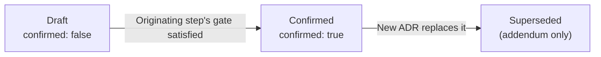

# Reference: How to write an ADR (Architecture Decision Record)

## Purpose

Permanently record decisions whose impact extends **beyond a single oh-my-codingagent execution cycle** so that future cycles, future roadmaps, and other contributors can rely on the same agreed premises. ADRs complement two volatile artifacts: `design.md` carries cycle-local design decisions; `retrospective.md` / `roadmap-retrospective.md` carry self-evaluation. ADRs are the **long-lived decision layer** that survives both.

## Author / creation timing

- **Filer:** Main (after evaluating the scope). Specialists do not file ADRs autonomously — when an `architect`, `roadmap-analyst`, `roadmap-planner`, or any other specialist surfaces a candidate decision, it is reported to Main, who decides the mode and either authors the ADR directly or delegates the authoring back to the specialist with explicit scope.
- **Step where ADRs typically originate:**
  - `totto2727-dev-flow` Step 3 (Design) — most common origin
  - `totto2727-dev-flow` Step 9 (Retrospective) — when an insight worth permanent recording surfaces
  - `roadmap` Step 1-4 — when a roadmap-shared norm or premise is identified
- **Approval:** the ADR is filed first with `confirmed: false`, then promoted to `confirmed: true` after the originating step's gate (or a dedicated user approval) is satisfied. The promotion lives in the same commit as the originating step's gate commit.

## File location

Two modes (mutually exclusive); the choice is recorded both in the storage path and in the `scope` frontmatter field.

| Mode             | Storage location                                      | When to use                                                                                 |
| ---------------- | ----------------------------------------------------- | ------------------------------------------------------------------------------------------- |
| **General mode** | `docs/adr/<YYYY-MM-DD-title>.md`                      | Decision spans multiple roadmaps, multiple independent workflows, or is a project-wide norm |
| **Roadmap mode** | `docs/roadmap/<roadmap-id>/adr/<YYYY-MM-DD-title>.md` | Decision is shared by multiple oh-my-codingagent execution cycles under a single roadmap    |

For the full mode-decision flow chart, see `share-adr/SKILL.md` "Mode decision flow".

## File name

Common to both modes:

- Date prefix is mandatory (`<YYYY-MM-DD>-`).
- Title is a short alphanumeric kebab-case slug describing the decision domain.
- Examples: `2026-04-26-totto2727-dev-flow-rename-and-flatten.md`, `2026-04-29-feed-platform-canonical-schema-v2.md`.

## Frontmatter

All ADRs carry the following YAML frontmatter:

```yaml
---
confirmed: false
scope: general | roadmap:<roadmap-id>
---
```

| Field       | Type    | Description                                                                                      |
| ----------- | ------- | ------------------------------------------------------------------------------------------------ |
| `confirmed` | boolean | `true`: confirmed (immutable in principle) / `false`: proposal awaiting review                   |
| `scope`     | string  | `general` (under `docs/adr/`) or `roadmap:<roadmap-id>` (under `docs/roadmap/<roadmap-id>/adr/`) |

The `scope` value must match the storage path. It also serves as a grep / programmatic index distinguishing the two modes — ADRs with `scope: roadmap:<roadmap-id>` are referenceable from any cycle under that roadmap; ADRs with `scope: general` are referenceable from the entire repository.

## How to write each section

### Title

`# ADR: <decision summary>` — a single sentence stating the decision in past or present tense (e.g. "Adopt Effect Layer for service composition", "Pin feed canonical schema to v2"). Avoid speculative phrasing ("Should we…", "Considering…") — by the time the ADR is filed, the decision is taken.

### Context

State **why this decision is necessary**. Cover:

- The scope range (which roadmap, which workflows, which project-wide norm).
- Pre-existing constraints (quote `intent-spec.md`, prior ADRs, external requirements).
- The forces driving the decision (e.g. duplicate effort across cycles, a one-way migration window, a regulatory requirement).

### Decision

State the specific decision in 1-3 paragraphs and back it with a 2-3 row alternatives table. **Always include 2-3 alternatives** — a single-option decision indicates shallow consideration. Each alternative gets its own one-line rationale.

```markdown
| Option | Summary            | Adopted / Rejected | Rationale            |
| ------ | ------------------ | ------------------ | -------------------- |
| A      | <option-a-summary> | Adopted            | <option-a-rationale> |
| B      | <option-b-summary> | Rejected           | <option-b-rationale> |
```

### Consequences

The scope of impact arising from the decision. Use three sub-bullets to cover what is added, what changes, and what future work is constrained:

- **Newly added** — new tables / modules / routes / conventions.
- **Existing impact** — existing code or operations that must change.
- **Constraints going forward** — invariants subsequent cycles must respect.

### Related

Bullet list of links to related artifacts (existing ADRs, `roadmap.md`, `milestones/<id>.md`, `design.md`). Omit the section entirely if there is nothing to link.

### Supersession addendum (post-`confirmed: true` only)

The only modification permitted on a confirmed ADR is appending a single line at the very bottom:

```markdown
> Superseded by [<new ADR title>](path-to-new-adr)
```

The body above it remains unchanged. The new ADR carries the active decision and links back to the old one in its Context.

## Quality criteria

| Good                                                                                         | Bad                                                                |
| -------------------------------------------------------------------------------------------- | ------------------------------------------------------------------ |
| Scope range is stated explicitly in Context (which roadmap / which workflows / project-wide) | Scope is implicit; reader must guess which cycles are affected     |
| 2-3 alternatives are compared in the Decision table                                          | Only the adopted option is described                               |
| Consequences enumerate newly added, existing impact, and constraints going forward           | Consequences read as a paragraph with no clear structure           |
| Filename uses `YYYY-MM-DD-` prefix and matches `scope` storage path                          | Date or scope mismatch between filename, frontmatter, and location |
| Linked from the originating artifact (`design.md`, `roadmap.md`, etc.)                       | ADR is filed but never cross-linked, so future readers miss it     |

## Lifecycle



Demotion (Confirmed → Draft) is not allowed. If a confirmed decision must be revised, file a new ADR and supersede the old one.

## Related artifacts

- **Cycle design artifact** — cycle-specific design decisions stay in the delegated execution system. ADRs are filed only when the decision crosses cycle or roadmap boundaries.
- **Roadmap progress state** — ADR paths are tracked through the roadmap CLI when roadmap state needs to reference them.
- **`roadmap.md` / `milestones/<id>.md`** — roadmap-shared ADRs are linked from these artifacts.
- **`roadmap-retrospective.md`** — when a roadmap retrospective insight is worth permanent recording, an ADR is extracted from it.
- **`share-adr/SKILL.md`** — operating rules: mode-decision flow, immutability principle, supersession rules, reference rules per filing origin, and the division of role with retrospectives.
