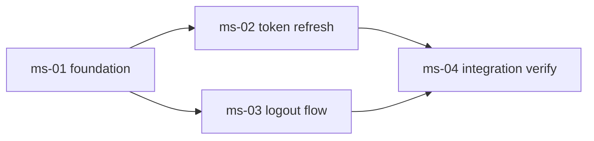

# Reference: How to write `roadmap.md`

## Purpose

Create **a strategic-layer agreement document spanning multiple workflow-level executions**. For large-scale development that does not fit in a single delegated execution, record in one place: (i) the worldview and scope boundary of the entire roadmap, (ii) decomposition into observable milestones, and (iii) the dependency relationships between milestones. Each milestone's owning agent or execution system uses this document as input.

The quality of `roadmap.md` determines the cognitive load on the entire roadmap, so making explicit the responsibility separation between strategy (what / in what order / why) and tactics (how to build / how to verify) is the largest role of this document.

## Author / creation timing

- **Author:**
  - Step 1 (Roadmap Intent): the `roadmap-analyst` Specialist drafts the background, purpose, scope boundary, macro constraints, related links, and open questions sections
  - Step 2 (Milestone Decomposition): the `roadmap-planner` Specialist appends the "Milestone list" table and the "Dependency graph" Mermaid
- **Approval:** user approval is required at the completion of each of Step 1 / Step 2 (Artifact-as-Gate-Review)

## File location

`docs/roadmap/<roadmap-id>/roadmap.md`

Placed under `docs/roadmap/<roadmap-id>/`. Any workflow-level execution artifacts remain owned by the agent or execution system that runs the milestone, and are loosely coupled only by the roadmap ID, milestone ID, or `workflow_identifiers[]` values recorded in `progress.yaml`.

## How to write each section

### Background

Why this roadmap is necessary now. **Always state the reason "why a single workflow-level execution does not suffice"**. Examples: "There are 5 target modules, each requiring independent design / implementation / verification", "Because of a phased replacement spanning 3 months", "Because multiple capabilities must be built up in order". If the scale is contained in a single execution, use the appropriate workflow-level agent or system directly, and a roadmap is unnecessary in the first place.

### Purpose

Describe **the qualitative goal** in 1-3 sentences. **The roadmap itself does not carry observable success criteria** (the non-scope of the entire `roadmap` skill): identifying measurement methods is the responsibility of each milestone's workflow-level execution.

| Good (qualitative goal)                                    | Bad (description requiring measurement)                         |
| ---------------------------------------------------------- | --------------------------------------------------------------- |
| OAuth authentication is in production-ready state          | 95% of users log in within 200ms via OAuth authentication       |
| The phased replacement of the payment platform is complete | The payment API p99 is below 100ms                              |
| All analytics queries can run on the new data platform     | The average query execution time is reduced by 50% from current |

If you have something to write in the right column, it should be described by the agent or execution system that owns the individual milestone once that execution starts.

### Scope boundary / non-scope

- Scope boundary: the area covered by the entire roadmap (set of modules, set of features, target users, target environments)
- Non-scope: areas intentionally not handled

**If you do not write the non-scope, the scope will silently expand as you add underlying executions. Always write it.** However, items that are non-scope of the entire `roadmap` skill (roadmap-of-roadmaps, having observable success criteria on the roadmap, etc.) are written in roadmap/SKILL.md, so do not restate them in this document.

### Macro constraints

Write **only constraints that apply across multiple executions**. Constraints concluded within an individual execution are the responsibility of that execution's owning system. Be aware of the 3 categories (technical / organizational / normative).

- Technical constraints: shared infrastructure, languages / frameworks used cross-cuttingly, compatibility requirements
- Organizational constraints: roadmap completion deadline, upper limit on concurrent cycle launches, premise of resource allocation
- Normative constraints: security, compliance, existing ADRs (General mode in `docs/adr/`, or `docs/roadmap/<roadmap-id>/adr/` if Roadmap mode ADRs already exist under this roadmap), upper-product policies

### Milestone list

**The section confirmed by `roadmap-planner` in Step 2.** In Step 1, an empty table or `{{placeholder}}` is fine.

Each row represents one milestone and columns include at minimum:

- `ID`: `<milestone-id>` (kebab-case recommended, e.g. `ms-01-foundation`)
- `Title`: short description (1 line)
- `Anticipated workflow execution count`: 1:1 recommended, 1:N also allowed (the rationale for 1:N is written in the corresponding `milestones/<milestone-id>.md`)
- `Dependent milestones`: comma-separated dependency IDs, empty if a starting milestone
- `Details`: a relative link to the corresponding `milestones/<milestone-id>.md`

Carve out details in the form of 1 milestone = 1 file under `milestones/<milestone-id>.md`. By not writing details directly in `roadmap.md`, diffs when adding / splitting / deleting dependencies remain localized.

### Dependency graph

Adopt the Mermaid **`graph LR`**.

- Use `graph LR` rather than `flowchart LR` for dependency diagrams
- Does not depend on additional renderers (works with the standard GitHub renderer)
- The recommended upper limit for nodes is **15-20**. If exceeded, split the graph by phase or area of responsibility

Example:

Maintain a DAG (directed acyclic graph). No cycle-detection lint tool is introduced, but `roadmap-planner` at filing time and the user at approval time confirm visually.

### Related links / open questions

- Related links: related ADRs, issues, upper-product plans, and related workflow-level execution artifacts when retained externally
- Open questions: strategic-level points left open. **Do not write here points to be handled by underlying workflow-level executions** (those are the responsibility of the tactical layer).

## Ensuring explanatory power

Anyone (Main / user) reading this document must be able to take any goal as input and reproduce, without additional information, the procedure for decomposing into milestones and extracting the qualitative goals and dependency relationships of each milestone. When writing `roadmap.md`, ensure explanatory power by satisfying:

1. **Purpose section is written as a qualitative goal**: milestones can be carved out by reasoning backward from it
2. **Scope boundary / non-scope is exclusive and exhaustive**: the boundary of the milestone candidate set is uniquely determined
3. **The dependency graph is a DAG**: starting candidates and final milestone candidates can be seen at a glance
4. **Granularity of the milestone list**: since the premise is that the roadmap is started for a scale that cannot be handled in a single execution, show that decomposition into multiple milestones is possible

A `roadmap.md` not satisfying these may be sent back at the Step 2 user approval gate.

## Quality criteria

| Good                                                               | Bad                                                                        |
| ------------------------------------------------------------------ | -------------------------------------------------------------------------- |
| Purpose is written as a qualitative goal                           | Observable criteria are mixed into the purpose (workflow's responsibility) |
| The reason it does not fit a single execution is in the background | A roadmap is created for a scale that fits a single execution              |
| The milestone list and the dependency graph match                  | An entry is in the list but not in the graph, or vice versa                |
| Mermaid is `graph LR` with ≤ 20 nodes                              | `flowchart LR` notation, or a giant graph crammed into one                 |
| Macro constraints are only "cross-cycle"                           | Includes individual cycle constraints, encroaching on the tactical layer   |
| Non-scope is explicit                                              | Only scope, with ambiguous boundary                                        |

## Related artifacts

- **No input** (Step 1 starts from user dialogue)
- **Premise for downstream artifacts:**
  - `milestones/<milestone-id>.md` (decomposed by `roadmap-planner` in Step 2)
  - `progress.yaml` (CLI-managed roadmap state)
  - The planning artifact of each underlying workflow-level execution (drafted with this document as input)
- **Impact when changed:** confirmed milestone dependencies are recommended not to be changed during underlying execution progression. If a change is necessary, this is equivalent to regressing back to roadmap Step 2.
- **Related:** `references/milestone.md` (how to write a single milestone definition), `references/roadmap-retrospective.md` (how to write the reflection on the entire roadmap)
