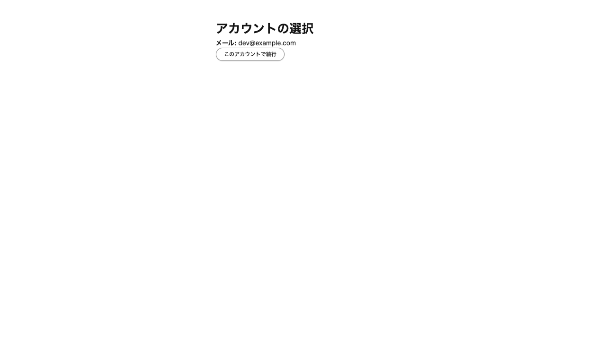

# Feed Platform & IdP 連携検証レポート

## 検証概要

| 項目                      | 値                    |
| ------------------------- | --------------------- |
| 検証日時                  | 2026-07-04            |
| 検証環境                  | ローカル開発環境      |
| IdP URL                   | http://localhost:8787 |
| Feed Platform Web URL     | http://127.0.0.1:8789 |
| Feed Platform Backend URL | http://127.0.0.1:8788 |

## 検証結果

**総合評価: ✅ OAuth連携・Backend連携・アカウント選択付きログアウト後導線が正常に動作**

IdPとfeed-platform-webのOAuth認可コードフロー、およびfeed-platform-webからBackend (BFF) へのユーザー情報取得が適切に行われていることを確認しました。

ログアウトは `POST /app/logout` のフォーム送信のみで実行され、feed-platform-web側のBetter Authセッションを終了した後、アプリ側の `/app/login` を経由してIdPのアカウント選択画面へ遷移することを確認しました。直接 `GET /app/logout` は空bodyの `405 Method Not Allowed` を返します。

## 検証手順

1. ローカルDB（Turso）を起動
2. identity-provider、feed-platform-backend、feed-platform-webを起動
3. Playwrightで実ブラウザ検証を実行
4. Magic Link認証 → OAuth認可コードフロー → IdPアカウント選択 → Dashboard表示を確認
5. `POST /app/logout` → `/app/login` → IdP `prompt=select_account` → アカウント選択画面を確認

## 画像検証フェーズ

スクリーンショット取得後、画像そのものを確認し、表示内容とレポート記述が一致しているかを検証しました。

| スクリーンショット              | 画像上の主要表示                                                           | 判定                                       |
| ------------------------------- | -------------------------------------------------------------------------- | ------------------------------------------ |
| `01-idp-login.png`              | `ログイン`, `メールアドレス`, `マジックリンクを送信`, `Passkey でログイン` | ✅ IdPログイン画面                         |
| `02-idp-login-passkey.png`      | `Passkey ログイン`                                                         | ✅ Passkeyログイン画面                     |
| `03-idp-check-email.png`        | `メール確認`                                                               | ✅ Magic Link送信後の確認画面              |
| `04-feed-app-unauthorized.png`  | `ログイン`, `メールアドレス`, `マジックリンクを送信`, `Passkey でログイン` | ✅ 未認証時のIdPログインリダイレクト       |
| `05-idp-account.png`            | `アカウント`, `メール`, `ログアウト`                                       | ✅ IdPアカウント画面                       |
| `06-idp-passkey-register.png`   | `Passkey 登録`                                                             | ✅ Passkey登録画面                         |
| `07-idp-select-account.png`     | `アカウントの選択`, `dev@example.com`, `このアカウントで続行`              | ✅ IdPアカウント選択画面                   |
| `08-feed-app-authenticated.png` | `Dashboard`, `Logged in as: ...`, `Subject: ...`, `Logout`                 | ✅ 認証済みDashboard                       |
| `09-feed-app-after-logout.png`  | `アカウントの選択`, `dev@example.com`, `このアカウントで続行`              | ✅ POSTログアウト後のIdPアカウント選択画面 |

## 修正点

- `feed-platform-web` の `BACKEND_BASE_URL` を `http://127.0.0.1:8788` に統一しました。
- `IDP_BASE_URL` はCookie共有の観点から `http://localhost:8787` のまま維持しています。
- feed-platform-webのOAuth開始設定に `prompt: 'select_account'` を追加しました。
- IdP OAuth Providerに `selectAccount.page = '/login/select-account'` を追加しました。
- IdPに `/login/select-account` 画面を追加し、ボタン押下時にクライアントサイドからBetter Authの `/api/v1/auth/oauth2/continue` を呼び出すようにしました。
- feed-platform-webの `/app/logout` はPOSTフォーム送信のみで実行されるようにし、GETは空bodyの405にしました。
- IdP側の独自 `/logout` path、およびRP-Initiated Logout用の `end-session` 導線は使用していません。
- OAuth client seedでは `redirect_uris` をBetter Authの登録済みcallback allow-listとして維持し、不要になった `enable_end_session` / `post_logout_redirect_uris` は指定していません。

## IdP ページ一覧

### 1. ログイン画面 (/login)

Magic Linkによるメールアドレス入力画面。

### 2. Passkeyログイン画面 (/login/passkey)

Passkeyを使用したログイン画面。

### 3. メール確認画面 (/login/check-email)

Magic Link送信後の確認画面。

### 4. アカウント画面 (/app/account)

ログイン後のアカウント情報表示画面。

### 5. Passkey登録画面 (/app/passkey/register)

ログイン後にPasskeyを登録する画面。

### 6. アカウント選択画面 (/login/select-account)

OAuth `prompt=select_account` により表示されるIdP側のアカウント選択画面。ボタン押下時はクライアントサイドからBetter Authの `/api/v1/auth/oauth2/continue` を呼び、返却されたURLへ遷移する。

## Feed Platform Web ページ一覧

### 7. 未認証アクセス時 (/app)

未認証で `/app` にアクセスすると、feed-platform-webの `/app/login` を経由してIdPログイン画面へ遷移する。

### 8. ダッシュボード (/app)

OAuth認証完了後のダッシュボード画面。Backend (BFF) からユーザー情報を取得して表示している。ログアウト操作はリンクではなくPOSTフォームのボタンで提供している。

### 9. ログアウト後 (POST /app/logout)

`POST /app/logout` はfeed-platform-web側のBetter Auth `signOut` を実行し、`/app/login` へ戻す。その後OAuth認可リクエストに `prompt=select_account` が付与され、IdP側でログイン済みの場合は `/login/select-account` が表示される。

実ブラウザで `POST /app/logout` → `GET /app/login` → `GET http://localhost:8787/login/select-account?...prompt=select_account` の遷移を確認した。直接 `GET /app/logout` は `405 Method Not Allowed` かつ `content-length: 0` であることも確認した。

## 連携フロー検証

1. **Magic Link認証**: IdPでMagic Linkによるメール認証が正常に動作
2. **OAuth認可コードフロー**: feed-platform-webからIdPへのOAuth認可が正常に完了
3. **アカウント選択**: IdPログイン済み状態でも `prompt=select_account` により `/login/select-account` で待機
4. **Better Auth continue**: アカウント選択ボタンからクライアントサイドで `/api/v1/auth/oauth2/continue` を呼び、アプリcallbackへ復帰
5. **セッション管理**: IdPとfeed-platform-webの両方でセッションCookieが適切に設定
6. **Backend連携**: BFF経由で `/api/v1/me` からユーザー情報を正常に取得
7. **Logout表示確認**: `POST /app/logout` 後にfeed-platform-webのBetter Authセッションを終了し、アプリ側 `/app/login` 経由でIdPアカウント選択画面へ遷移

## 備考

- oauth-consent画面は現時点で不要なため、スキップ設定が有効になっている
- ローカル環境ではメール送信がmockされ、サーバーログに出力される
- `redirect_uris` はBetter Auth OAuth clientの登録済みcallback allow-listとして必要
- `localhost` と `127.0.0.1` の混在はCookieドメインおよびfetchの接続性に影響するため注意が必要
