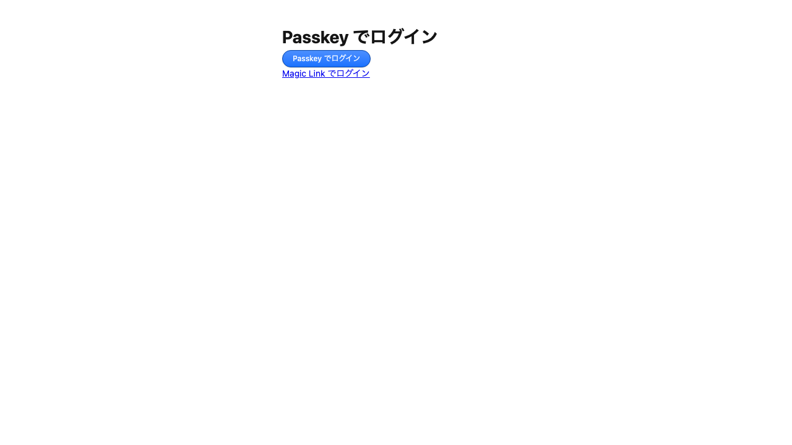
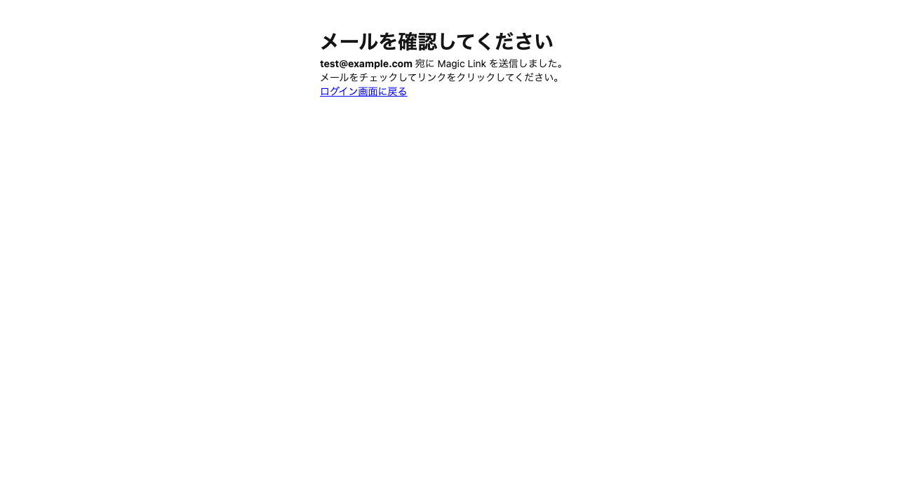
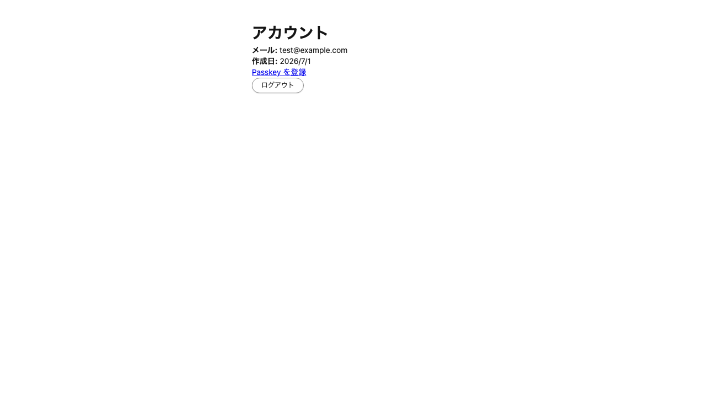
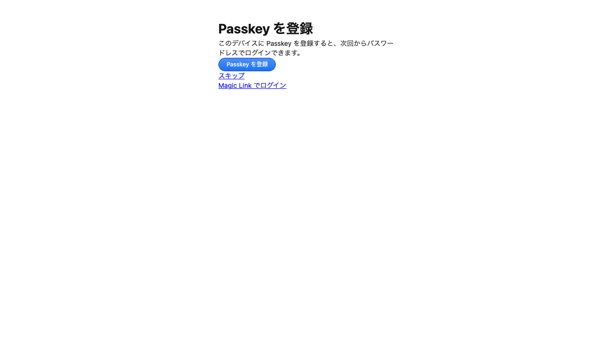
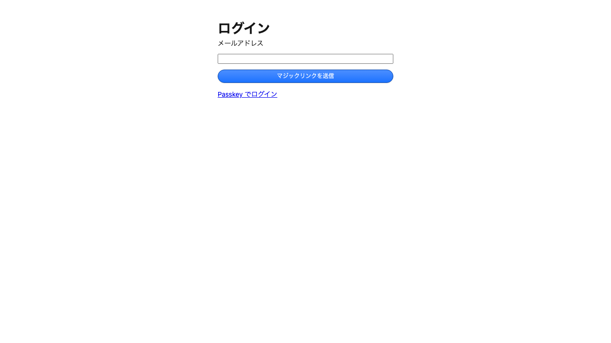
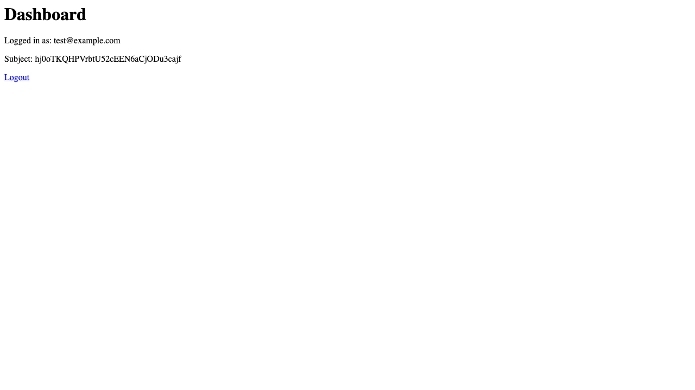
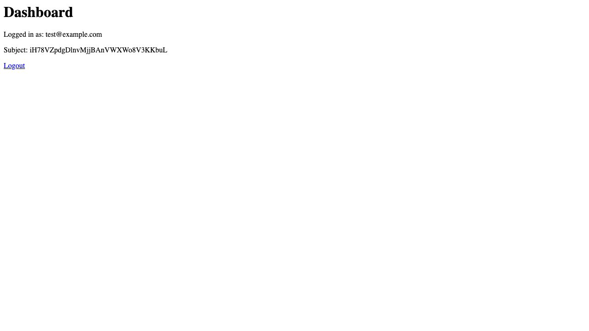

# Feed Platform & IdP 連携検証レポート

## 検証概要

| 項目                      | 値                    |
| ------------------------- | --------------------- |
| 検証日時                  | 2026-07-01            |
| 検証環境                  | ローカル開発環境      |
| IdP URL                   | http://localhost:8787 |
| Feed Platform Web URL     | http://127.0.0.1:8789 |
| Feed Platform Backend URL | http://127.0.0.1:8788 |

## 検証結果

**総合評価: ✅ 正常に動作**

IdPとfeed-platform-webのOAuth連携が適切に行われていることを確認しました。

## 検証手順

1. ローカルDB（Turso）を起動
2. identity-provider、feed-platform-backend、feed-platform-webを起動
3. Playwrightを使用して自動ブラウザ検証を実行
4. Magic Link認証 → OAuth認証コードフロー → ダッシュボード表示を自動化

## 修正点

検証中に `feed-platform-web` の `BACKEND_BASE_URL` が `localhost` と `127.0.0.1` で混在しており、Backend への接続で `Transport error` が発生していました。以下のファイルを修正して統一しました：

- `js/app/feed-platform-web/wrangler.jsonc`: `BACKEND_BASE_URL` を `http://127.0.0.1:8788` に変更
- `js/app/feed-platform-web/app/feature/env.ts`: `devLayer` の `BACKEND_BASE_URL` を `http://127.0.0.1:8788` に変更

`IDP_BASE_URL` は Cookie 共有の観点から `localhost` のままにしています。

## IdP ページ一覧

### 1. ログイン画面 (/login)

Magic Linkによるメールアドレス入力画面。

### 2. Passkeyログイン画面 (/login/passkey)

Passkeyを使用したログイン画面。

### 3. メール確認画面 (/login/check-email)

Magic Link送信後の確認画面。

### 4. アカウント画面 (/app/account)

ログイン後のアカウント情報表示画面。

### 5. Passkey登録画面 (/app/passkey/register)

Passkeyの登録画面。

## Feed Platform Web ページ一覧

### 6. 未認証時のリダイレクト (/app)

未認証状態で `/app` にアクセスすると、IdPのOAuth認可画面にリダイレクトされる。

### 7. ダッシュボード (/app)

OAuth認証完了後のダッシュボード画面。Backend (BFF) からユーザー情報を取得して表示している。

### 8. ログアウト後 (/app/logout)

ログアウト後の画面。セッション破棄後、未認証状態としてダッシュボードが再表示される（リダイレクトループで再ログインを促す）。

## 連携フロー検証

1. **Magic Link認証**: IdPでMagic Linkによるメール認証が正常に動作
2. **OAuth認可コードフロー**: feed-platform-webからIdPへのOAuth認可が正常に完了
3. **セッション管理**: IdPとfeed-platform-webの両方でセッションCookieが適切に設定
4. **Backend連携**: BFF経由で `/api/v1/me` からユーザー情報を正常に取得

## 備考

- oauth-consent画面は現時点で不要なため、スキップ設定が有効になっている
- ローカル環境ではメール送信がmockされ、サーバーログに出力される
- `localhost` と `127.0.0.1` の混在は Cookie ドメインおよび fetch の接続性に影響するため注意が必要
